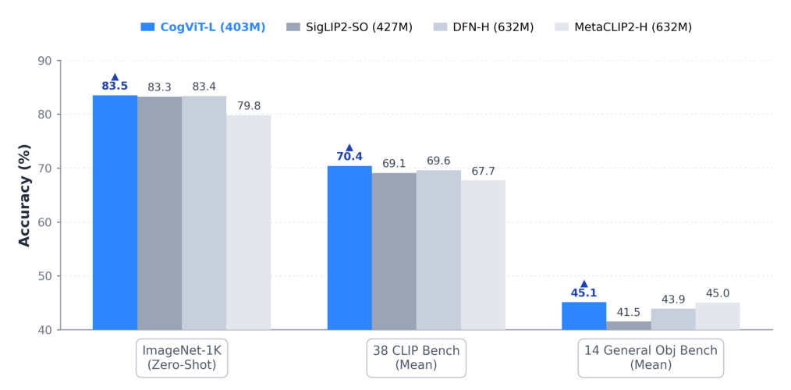
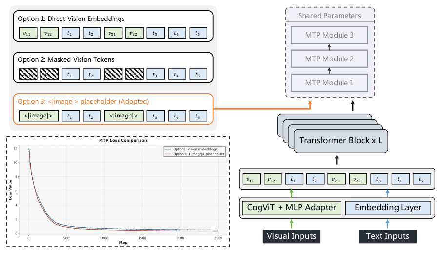
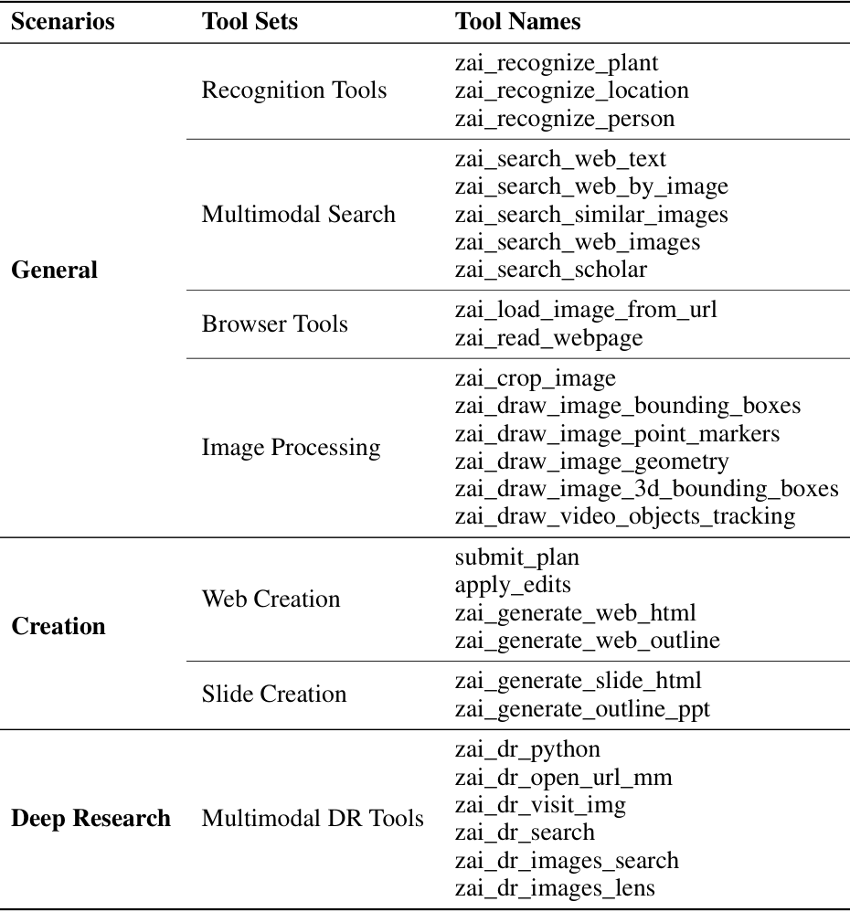
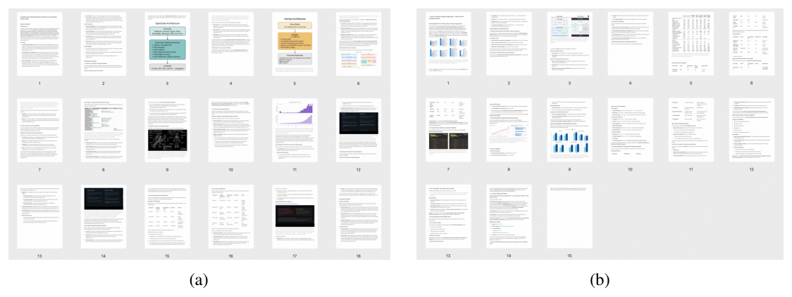
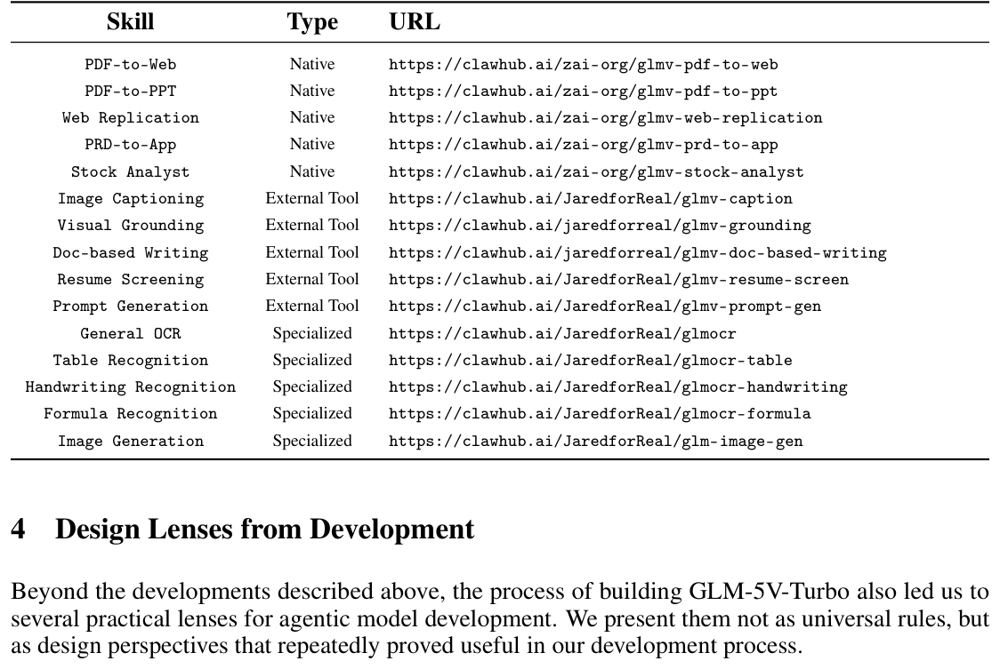
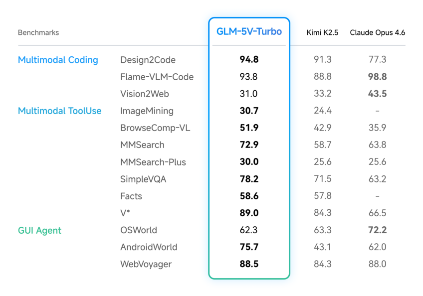
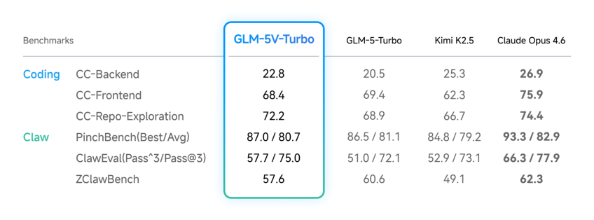

## 总结 | Summary

GLM-5V-Turbo 是 Z.ai 把「原生多模态 Agent」拆成系统工程做一遍的 release report：以 CogViT 视觉编码器 + Multimodal Multi-Token Prediction（MMTP）+ 跨 30+ 任务的联合 RL + 自建多模态工具链与 ImageMining benchmark 串起来。最硬的两个数字是 Design2Code 94.8（声称超过 Claude Opus 4.6）、MMSearch-Plus 30.0（相对 GLM-4.6V 的 3.7 约 8 倍），其余主要靠在 OSWorld / AndroidWorld / BrowseComp-VL / PinchBench / ClawEval 等成榜上铺面。

承重的设计选择是 MMTP 里的「Option 3」：MTP head 不接收任何真实视觉嵌入，只接受一个 `<|image|>` 共享可学习占位符。论文给出的理由不是建模质量，而是流水线并行 / 序列并行下的实现复杂度——视觉嵌入若需跨 PP stage 传递，通信成本与切分对齐都会爆炸。0.5B 规模的 ablation 显示 Option 3 训练 loss 更低且收敛更稳，这条选择背后真正的功臣是「MTP head 容量小、吃不下与文本分布差异大的视觉表示」这一假设。除此之外，作者反复强调 RL 中的「跨域协同」——单任务 RL 易振荡的窄分布在多任务联合下反而稳，并报告了 RefCOCO +4.8、SUNRGBD +7.7、CharXiv +7.7、OSWorld +4.9 等增量。

需要带保留地读：报告几乎没披露模型规模、训练算力、数据配比，绝大多数对比数字都是「我们 vs 上一代 GLM-4.6V」或「我们 vs Claude/Kimi 的某分数」，而没有同代多模态基础模型（Qwen3-VL / InternVL3.5 / Gemini 3 / GPT-5V）的对位评测。它对工程社区的价值大于对研究社区的价值——MMTP 的占位符设计、VLM RL Gym 的 reward 解耦、视觉端 CP/TP 切分前移、bin-packing over (seq_len, ViT tokens) 这些点是真正可借鉴的；而「8× MMSearch-Plus」「Design2Code 超 Opus 4.6」这类标题数字在没有算力对齐和盲评隔离前，结论的强度有限。

---

## 要点提醒 | Highlights

### 值得关注 | Worth Absorbing

- §2.2 MMTP 的 `<|image|>` 占位符并不是一个建模上的「妙手」，而是把多模态 MTP 与现有 SP/CP 分区策略的兼容性放在第一位的工程取舍——这是把 MTP 真正落到 VLM 训练栈的关键一步，可直接搬走。
- §2.4 训练栈的四个改造里最有意思的是「把 CP/TP 切分上移到数据加载阶段，并对齐 downsample group 边界」，避免每个 rank 先持有全 patch tensor 再重分配——配合对 (sequence_length, ViT token count) 的联合 bin-packing，是多模态 RL rollout 长尾治理的合理范式。
- §4 Lens 1 给出一条非显然的经验：把 SVG / 前端代码这类「下游结构化任务」当作感知预训练的代理任务（subject image ↔ SVG 配对预训练），反而提升了 STEM 解题与 GUI grounding；这条「下游任务回流到感知」的回路值得放进自己的预训练数据里复盘。
- §2.4 报告的 RL 增量在多任务下「跨域不互斥」（RefCOCO +4.8、SUNRGBD +7.7、CharXiv +7.7、OSWorld +4.9 同时成立），且作者明确说窄分布单任务 RL 易振荡、联合训练反而稳——和 GLM-4.1V-Thinking / GLM-4.5V 的观察一致，是一个 stylized fact 级别的提醒。

### 值得推敲 | Worth Questioning

- 全文未披露 GLM-5V-Turbo 的参数量、训练 token 数、RL 算力，与 Claude Opus 4.6 / Kimi K-2.5 的对比因此并非同算力对位——Design2Code 94.8 vs Opus 4.6 的领先在缺乏 size/cost 注脚时只能视作产品对比而非方法对比。
- ImageMining 由 zai-org 自建（217 cases，§3.3），同时出现在「我们的能力定义」和「我们的评测榜」两个角色里——30.7 这一数字缺乏第三方/盲评隔离，存在评测构建与模型训练目标耦合的风险。
- §2.2 MMTP 三选一的 ablation 仅在 0.5B 规模上做，结论是否在主力训练规模下保持「Option 3 更优」未给出验证；作者自己提的「MTP head 容量小、吃不下视觉分布」反过来说大模型 MTP head 也许不再受这一约束。
- §2.4 给出的 RL 增量是「相对 SFT 的提升」，没有给出与 SFT 同算力但延长 SFT 的对照（SFT-extended baseline），因此「RL 而非更多 SFT」这一归因尚未被严格隔离。
- 「相对 GLM-4.6V 在 MMSearch-Plus 提升 8 倍」（§3.1）是从一个非常低的基线（约 3.7）起步——8 倍听起来惊人，绝对值 30.0 与同代外部对手的差距才是真正的信号，而后者并未给出。

---

## 深度思考 | Analysis

### 真正的贡献 vs 声明的贡献

声明的贡献是「原生多模态 Agent 基础模型」。真正可被引用的贡献其实是两条窄一些但更扎实的工程结论：MMTP 在多模态扩展时把视觉嵌入挡在 MTP head 之外（Option 3）、以及 RL 训练栈把 CP/TP 切分上移到数据加载并做 (seq_len, ViT_tokens) 联合 bin-packing。把这两条剥离出来读，比把整篇当 "agent foundation model" 读要有信号得多——前者是 transferable 的实现配方，后者只是该团队的产品定位声明。

### 这篇报告在 2025 H2 - 2026 H1 这一波里的位置

它和 Qwen3-VL、InternVL3.5、Kimi-VL（Kimi K-2.5）、以及 GPT-5V/Gemini 3 共同处于「VLM → 多模态 agent 基础模型」这次定位漂移的同期轨道上——大家都在把多模态从「附加能力」改写为「与文本同级的训练目标」，并把工具调用 / GUI 操作纳入 RL 任务池。GLM-5V-Turbo 的特点是把这件事写成 release report 而不是 research paper：它放弃了和同代基础模型的逐项对位，转而把篇幅给了系统工程与「lessons learned」。从研究社区角度看，这条路径会让方法层贡献被读者低估；从产品工程角度看，反而比那些「精修过的 ablation 表格」更有参考性。

### 它实际打开和关闭的方向

打开的：把 perception 当作 agent 上限的瓶颈来对待（Lens 1）、用 SVG / 前端代码做感知预训练的代理任务、以及多任务 RL 的「跨域不互斥」实证——这些是其他团队可以马上验证的小命题。关闭的：「视觉 MTP 头能直接吃 ViT 嵌入」这条路在工程上被作者明确弃掉，下一篇真正想推进 MMTP 的工作大概率得从「让 MTP head 自身具备视觉容量」入手（更深的 MTP head、或显式的视觉子模块），而不再在「视觉嵌入直传」上打转。

### 如果由我接手

我会做的唯一一个对论文承重力最大的实验：在主力规模（不是 0.5B）下重做 MMTP 三选一 ablation，并用一个 SFT-extended baseline 和 RL 同算力对照，去拆「Option 3 优势是否依赖 head 容量小」「30+ 任务 RL 的增量是否真的不能由更多 SFT 吃掉」这两个问题。这一组实验做不出来，论文 lens 部分的可信度就只能停留在经验报告。

---

## 原文精读 | Bilingual Full Text

### Abstract

We present GLM-5V-Turbo, a step toward native foundation models for multimodal agents. As foundation models are increasingly deployed in real environments, agentic capability depends not only on language reasoning, but also on the ability to perceive, interpret, and act over heterogeneous contexts such as images, videos, webpages, documents, GUIs. GLM-5V-Turbo is built around this objective: multimodal perception is integrated as a core component of reasoning, planning, tool use, and execution, rather than as an auxiliary interface to a language model. This report summarizes the main improvements behind GLM-5V-Turbo across model design, multimodal training, reinforcement learning, toolchain expansion, and integration with agent frameworks. These developments lead to strong performance in multimodal coding, visual tool use, and framework-based agentic tasks, while preserving competitive text-only coding capability. More importantly, our development process offers practical insights for building multimodal agents, highlighting the central role of multimodal perception, hierarchical optimization, and reliable end-to-end verification.

我们提出 GLM-5V-Turbo，作为面向多模态 Agent 的原生基础模型路径上的一次推进。随着基础模型越来越多地被部署到真实环境，Agent 能力不仅依赖语言推理，还依赖在图像、视频、网页、文档、GUI 等异构上下文中感知、解释和行动的能力。GLM-5V-Turbo 围绕这一目标展开：多模态感知被作为推理、规划、工具使用与执行的核心组件，而非语言模型上的附加接口。本报告汇总了 GLM-5V-Turbo 在模型设计、多模态训练、强化学习、工具链扩展、Agent 框架集成等方向的主要改进。这些工作使其在多模态编程、视觉工具使用和基于框架的 Agent 任务上表现强劲，同时保留了具竞争力的纯文本编程能力。更重要的是，开发过程本身沉淀出一组对构建多模态 Agent 有用的实践经验，凸显了多模态感知、层级化优化与可靠端到端验证的中心地位。

### 1. Overview

Recent advances in foundation models have driven a shift from language understanding to agentic real-world interaction [4; 28; 48], opening up substantial opportunities for productivity gains in domains such as knowledge work [12; 27; 22], software engineering [20], and tasks that require interacting with graphical user interfaces [16; 43]. A general-purpose agentic model requires not only advanced intelligence, but also the ability to natively process complex multimodal context—including images, videos, text, webpages, and documents—and to integrate these heterogeneous inputs into a unified process of perception, reasoning, and decision-making [12; 5; 37].

近年来基础模型的进展把焦点从语言理解推向了 Agent 化的真实世界交互 [4; 28; 48]，在知识工作 [12; 27; 22]、软件工程 [20]、与图形界面交互的任务 [16; 43] 等领域释放出明显的生产力空间。一个通用 Agent 模型不仅需要更强的智能，还需要能原生处理图像、视频、文本、网页、文档等复杂多模态上下文，并把这些异构输入整合进一个统一的感知 — 推理 — 决策过程 [12; 5; 37]。

Toward this goal, we introduce a set of coordinated advances in model design, training, and infrastructure to enable more native multimodal modeling. In model design, we develop CogViT, a new vision encoder tailored for multimodal fine-grained understanding, and propose Multimodal Multi-Token Prediction, which supports both text-only and multimodal inputs while remaining friendly to large-scale infrastructure. In training, we deeply integrate vision and language throughout pre-training and supervised fine-tuning, and further perform joint reinforcement learning over more than 30 task categories spanning perception, reasoning, and agentic capabilities, supported by an optimized infrastructure stack for large-scale multimodal RL. Building on these advances, we further expand GLM-5V-Turbo's multimodal agentic capabilities through toolchain extension, framework integration, and ecosystem development. We present a vision-centric deep search benchmark ImageMining that evaluates models' ability to "think and deep search with image".

围绕这一目标，我们在模型设计、训练与基础设施三个层面做了一组协同的推进，以实现更「原生」的多模态建模。模型层面，我们开发了 CogViT——一个面向多模态细粒度理解的新视觉编码器；并提出 Multimodal Multi-Token Prediction（MMTP），同时支持纯文本与多模态输入，且对大规模训练基础设施友好。训练层面，我们在预训练与监督微调阶段深度融合视觉与语言，并在 30+ 个任务类别上进行联合强化学习，覆盖感知、推理、Agent 能力，背后由一套针对大规模多模态 RL 优化的基础设施栈支撑。基于这些工作，我们通过工具链扩展、框架集成、生态建设，进一步拓展 GLM-5V-Turbo 的多模态 Agent 能力。我们还提出了一个以视觉为中心的深度搜索 benchmark ImageMining，用于评测模型「以图思考、用图深搜」的能力。

These developments endow GLM-5V-Turbo with native multimodal agentic capability, while retaining strong text-based agentic and coding performance relative to its language-only base model GLM-5-Turbo. This is reflected both in benchmark results and in its effectiveness in practical agentic settings, including chatbot-style environments such as Z.ai and framework-based scenarios such as Claude Code [3] and OpenClaw [29]. GLM-5V-Turbo achieves strong results on multimodal agentic benchmarks, including multimodal tool use (30.7 on ImageMining, 51.9 on BrowseComp-VL [10], 72.9 on MMSearch [18], and 78.2 on SimpleVQA [7]), GUI agent tasks (75.7 on AndroidWorld [30] and 62.3 on OSWorld [44]), and Claw-based evaluations (87.0/80.7 on PinchBench [1], 57.7/75.0 on ClawEval [45], and 57.6 on ZClawBench [2]). GLM-5V-Turbo also demonstrates strong coding performance in both multimodal and text-only settings. For the multimodal setting, GLM-5V-Turbo achieves 94.8 on Design2Code [31], outperforming Claude Opus 4.6 [4]; for the text-only setting, GLM-5V-Turbo preserves the coding capability of its language-only base model GLM-5-Turbo and even surpasses it on CC-Backend (22.8), CC-Frontend (68.4), and CC-RepoExploration (72.2) [48].

这些工作使 GLM-5V-Turbo 同时具备原生多模态 Agent 能力，并在相对其语言基座 GLM-5-Turbo 时保持强的文本 Agent 与编程表现。这一点既反映在 benchmark 上，也反映在实际 Agent 场景中——包括 Z.ai 这类对话式环境，以及 Claude Code [3]、OpenClaw [29] 等基于框架的场景。在多模态 Agent benchmark 上：多模态工具使用 ImageMining 30.7、BrowseComp-VL [10] 51.9、MMSearch [18] 72.9、SimpleVQA [7] 78.2；GUI Agent 任务 AndroidWorld [30] 75.7、OSWorld [44] 62.3；Claw 类评测 PinchBench [1] 87.0/80.7、ClawEval [45] 57.7/75.0、ZClawBench [2] 57.6。在编程层面，多模态设定下 Design2Code [31] 94.8 超过 Claude Opus 4.6 [4]；纯文本设定下保持甚至超越其语言基座，CC-Backend 22.8、CC-Frontend 68.4、CC-RepoExploration 72.2 [48]。

Developing GLM-5V-Turbo also surfaced several broader lessons for agentic model development. Perception remains foundational to higher-level multimodal capability, while agentic competence is often acquired more effectively through hierarchical optimization than through monolithic end-to-end training. In addition, end-to-end agent tasks require clear specification, reliable verification, and carefully controlled evaluation for effective construction, assessment, and optimization. In this report, we summarize the main practices and lessons from developing GLM-5V-Turbo to inform future work on native multimodal agents.

GLM-5V-Turbo 的开发过程也沉淀出几条更普遍的经验。其一，感知仍然是多模态高级能力的地基；其二，Agent 能力通常通过层级化优化（hierarchical optimization）比一体化端到端训练获得更高效；其三，端到端 Agent 任务的构造、评估与优化需要清晰的任务定义、可靠的结果验证、可控的评测流程。本报告汇总了 GLM-5V-Turbo 开发过程中的主要实践与经验，以服务后续在原生多模态 Agent 方向上的工作。

### 2. Model, Training, and Infrastructure

#### 2.1 CogViT Vision Encoder

We develop CogViT, a novel parameter-efficient vision encoder tailored for multimodal perception and downstream agent-oriented tasks. It delivers strong capabilities in general object recognition, fine-grained understanding, as well as geometric and spatial perception. As illustrated in Figure 1, CogViT achieves competitive performance across these domains. To balance representation learning with cross-modal alignment, we employ a two-stage pretraining recipe.

我们开发 CogViT，一个面向多模态感知与下游 Agent 任务的参数高效视觉编码器，在通用物体识别、细粒度理解、几何与空间感知三类能力上都表现强劲。如图 1 所示，CogViT 在这些维度上均达到了有竞争力的性能。为兼顾表征学习与跨模态对齐，我们采用两阶段预训练方案。

**Figure 1.** Performance comparison of CogViT with other state-of-the-art vision encoders across general and fine-grained multimodal tasks.

**图 1.** CogViT 与其他 SOTA 视觉编码器在通用 / 细粒度多模态任务上的性能对比。

In the first stage, we use distillation-based masked image modeling to strengthen visual representations. Specifically, we train the student ViT to reconstruct the masked regions (35% masking ratio, 224 × 224 resolution) in the feature spaces of dual teacher models: SigLIP2 [39] for semantic representations and DINOv3 [32] for texture features. The training data follows a quality-aware mixture strategy: 80% high-quality natural images, 10% instruction-following data, and 10% scientific imagery. We optimize with Muon [21] optimizer with a cosine decay schedule. Additionally, we introduce QK-Norm [15] to normalize query and key vectors before attention computation, effectively mitigating logit explosion and ensuring stability at scale.

第一阶段使用基于蒸馏的 masked image modeling 加强视觉表征。具体地，训练学生 ViT 在 35% 掩码比、224×224 分辨率下，重建掩码区域在双教师模型特征空间的表示——SigLIP2 [39] 提供语义表示、DINOv3 [32] 提供纹理特征。训练数据采用质量加权的混合策略：80% 高质量自然图像、10% 指令跟随数据、10% 科学图像。优化器使用 Muon [21]，学习率 cosine decay。此外，我们在注意力之前对 query/key 引入 QK-Norm [15]，有效缓解 logit 爆炸，确保大规模训练的稳定性。

The second stage shifts to contrastive image-text pretraining to align visual and textual features in a shared embedding space. Compared to the first stage, we introduce three key upgrades: (1) replacing the fixed 224 × 224 resolution with the NaFlex [39] scheme to process variable-size inputs while preserving original aspect ratios; (2) scaling the global batch size to 64K using the sigmoid-based SigLIP loss, combined with a bidirectional distributed implementation for efficiency; and (3) utilizing an 8-billion bilingual (Chinese-English) image-text corpus to enhance cross-lingual understanding. We continue to optimize with Muon, assigning module-specific learning rates and decay schedules to the vision, text, and projection components.

第二阶段切换为图文对比预训练，将视觉与文本特征对齐到共享嵌入空间。相对一阶段有三项关键升级：(1) 用 NaFlex [39] 方案替代固定 224×224 分辨率，以保留原始宽高比的变长输入处理；(2) 将全局 batch size 扩大到 64K，使用 sigmoid 形式的 SigLIP loss，并配合双向分布式实现以提升效率；(3) 使用 80 亿规模的中英双语图文语料以增强跨语种理解。仍以 Muon 为优化器，对视觉 / 文本 / 投影三组模块分别配置学习率与衰减计划。

#### 2.2 Multimodal Multi-Token Prediction

We propose Multimodal Multi-Token Prediction (MMTP), a multimodal extension of multi-token prediction (MTP) [11], designed to support both text-only and multimodal inputs while remaining friendly to large-scale infrastructure. The goal is to preserve acceptable length as well as training and inference efficiency in multimodal settings. In standard text-only MTP, prefix tokens can be passed into the MTP head directly through token IDs and embedded with the word embedding layer. Once MTP is extended to multimodal inputs, however, a central question arises: how should image tokens be passed to the MTP head? To answer this, we systematically compare three alternatives: The first directly passes the visual embeddings from the LLM backbone input to the MTP head; The second masks out all visual tokens at the MTP head input, reducing the design to text-only MTP; The third preserves visual positional information, but replaces all visual tokens with a shared learnable `<|image|>` special token as the visual input representation.

我们提出 Multimodal Multi-Token Prediction（MMTP），即 multi-token prediction（MTP）[11] 的多模态扩展，目标是同时支持纯文本与多模态输入，并对大规模训练基础设施友好，在多模态场景下保持可接受的长度与训练 / 推理效率。在标准文本 MTP 中，前缀 token 可以直接通过 token ID 传入 MTP head，并由词嵌入层 embed。但一旦 MTP 扩展到多模态，核心问题是：图像 token 应如何传入 MTP head？我们系统比较三种方案：方案一，把 LLM 主干输入的视觉嵌入直接传给 MTP head；方案二，在 MTP head 输入端掩掉所有视觉 token，等效于退化为纯文本 MTP；方案三，保留视觉位置信息，但用一个共享可学习的 `<|image|>` 特殊 token 作为视觉输入表示替换所有视觉 token。

**Figure 2.** Illustration of our multimodal multi-token prediction (MMTP) design. Bottom-left: Training loss curves comparing Option 1 and Option 3, where the adopted design achieves lower loss.

**图 2.** MMTP 设计示意。左下角是 Option 1 与 Option 3 的训练 loss 曲线，被采纳的方案 loss 更低。

Considering both optimization behavior and system efficiency, GLM-5V-Turbo ultimately adopts the third design. Compared with directly passing visual embeddings to the MTP head, using the `<|image|>` token removes the need to propagate visual embeddings across pipeline-parallel stages, substantially reducing communication complexity while improving system scalability and engineering maintainability. Empirically, according to the ablation study on a 0.5B model, the `<|image|>`-based design achieves lower training loss and more stable convergence than directly using visual embeddings. We hypothesize that this is because the MTP head is typically lightweight, and may not have sufficient modeling capacity to effectively absorb visual representations whose distribution differs substantially from that of text embeddings; by contrast, the `<|image|>` token presents the input in a more uniform form and thus alleviates this optimization difficulty. At the same time, compared with fully masking out visual tokens, this design remains naturally compatible with existing partitioning strategies such as sequence parallelism and context parallelism, without requiring additional handling for visual-embedding partitioning, alignment, or offset mapping, which reduces implementation complexity. Overall, the design gives GLM-5V-Turbo a more balanced trade-off among multimodal modeling capability, training stability, and system efficiency.

综合优化行为与系统效率，GLM-5V-Turbo 最终采纳方案三。相比直接把视觉嵌入传给 MTP head，使用 `<|image|>` token 不需要在流水线并行各阶段间传播视觉嵌入，显著降低通信复杂度，同时提升系统可扩展性与工程可维护性。实验上，0.5B 模型的 ablation 显示，相比直接使用视觉嵌入，`<|image|>`-token 方案训练 loss 更低、收敛更稳。我们的假设是：MTP head 通常较轻，可能没有足够的建模容量去吸收与文本嵌入分布差异很大的视觉表示；而 `<|image|>` token 把输入拉成更统一的形式，缓解了这一优化困难。同时，相比完全掩掉视觉 token，本方案天然兼容序列并行 / 上下文并行等切分策略，无需额外处理视觉嵌入的切分、对齐与偏移映射，实现复杂度更低。整体上，该设计在多模态建模能力、训练稳定性、系统效率间给出了更平衡的折中。

#### 2.3 Broad training across perception, reasoning, and agent capability

The practical performance of multimodal agents depends on the joint development of perception, reasoning, planning, and execution, making narrow, domain-specific optimization insufficient. To improve these capabilities, we deeply integrate vision and language starting from the pretraining stage, strengthening the model's native ability to represent and process multimodal context. During the pre-training phase, we utilize a mixture of plain text and multimodal data to foster a balanced development of diverse capabilities. The multimodal datasets encompass a wide array of categories, including world knowledge, interleaved image-text, OCR, coding, GUI, video, multimodal tool-use, spatial perception, grounding, and academic problem-solving. We place particular emphasis on multimodal coding data to better align visual understanding with code generation and to improve the model's performance in multimodal agentic tasks.

多模态 Agent 的实际表现依赖感知 / 推理 / 规划 / 执行的联合发展，单一域的窄优化不足以支撑。为此我们从预训练阶段就深度融合视觉与语言，强化模型表示与处理多模态上下文的原生能力。预训练阶段使用纯文本与多模态数据的混合，促进多样能力的均衡发展。多模态数据集覆盖：世界知识、图文交错、OCR、编程、GUI、视频、多模态工具使用、空间感知、grounding、学术问题求解等。我们特别强化多模态编程数据，以更好地对齐视觉理解与代码生成，从而提升模型在多模态 Agent 任务上的表现。

GLM-5V-Turbo further undergoes joint RL optimization over more than 30 task categories. This broad training setup yields gains at multiple levels: on the perceptual side, the model improves on tasks such as 2D image grounding and pointing (compared to SFT, the RL stage achieves improvements of 4.8% and 3.2% on RefCOCO-avg [23] and PointBench [6] respectively), video understanding (+5.6% on MVBench [24]), 3D grounding (+7.7% on SUNRGBD [33]), OCR (+4.2% on OCRBench [25]), and chart understanding (+7.7% on CharXiv [40]); on reasoning-heavy tasks such as STEM (+1.8% on MMMU_Val [46], MMMU_Pro [47], MathVista [26] and LogicVista [42]), it exhibits greater stability in problem solving; and in agentic settings—including GUI agents (+4.9% on OSWorld [43]), coding agents (+0.2% on CC-Backend [48]), and general tool use (+3.5% on MMSearch [19]), it demonstrates improved planning and execution. Importantly, these gains are not confined to a single task family, but remain relatively consistent across a broad set of tasks.

GLM-5V-Turbo 进一步在 30+ 任务类别上进行联合 RL 优化。这一宽口径训练在多个层面带来收益。感知侧：2D 图像 grounding 与 pointing（相对 SFT，RL 阶段在 RefCOCO-avg [23] +4.8%、PointBench [6] +3.2%）、视频理解（MVBench [24] +5.6%）、3D grounding（SUNRGBD [33] +7.7%）、OCR（OCRBench [25] +4.2%）、图表理解（CharXiv [40] +7.7%）。推理侧：STEM（MMMU_Val [46]、MMMU_Pro [47]、MathVista [26]、LogicVista [42] 平均 +1.8%）展现更稳的解题。Agent 侧：GUI Agent（OSWorld [43] +4.9%）、coding agent（CC-Backend [48] +0.2%）、通用工具使用（MMSearch [19] +3.5%）。重要的是，这些增益并未集中在某一类任务，而是在广泛任务上相对一致。

This multi-task RL setting also exhibits several properties that we have consistently observed in earlier explorations such as GLM-4.1V-Thinking and GLM-4.5V [37]. Compared with the cross-domain trade-offs often seen in SFT, RL tends to show weaker interference across domains, allowing multiple domains to improve together with stable gains. Interestingly, in domains with narrower distributions where single-task RL is often prone to oscillation, collaborative training can make optimization more stable by exposing the model to a richer distribution of strategies and steering it toward more robust solutions. Beyond this, we observe some transfer of thinking patterns across tasks: reasoning behaviors acquired in one domain can sometimes carry over to another and produce measurable benefits there as well. This suggests that the value of multi-task RL lies not only in covering a broader range of tasks, but also in inducing deeper sharing at the level of strategy patterns.

这种多任务 RL 设置也呈现出我们在 GLM-4.1V-Thinking 与 GLM-4.5V [37] 中持续观察到的几条性质：相比 SFT 常见的跨域 trade-off，RL 的跨域干扰更弱，允许多个域同时稳定上升；尤其在分布较窄、单任务 RL 易振荡的域，协同训练把模型暴露在更丰富的策略分布上、引导其收敛到更鲁棒的解，反而稳得多。除此之外，我们观察到一些「思考模式」的跨任务迁移——在某一域学到的推理行为有时会迁移到另一域并产生可度量的增益。这暗示多任务 RL 的价值不仅在于覆盖更广的任务，也在于在策略层面诱导更深的共享。

At the same time, broad coverage in joint optimization does not mean that the problem is fully resolved. We do observe that capabilities left uncovered during RL can sometimes decline after post-training, especially those more orthogonal to the trained task distribution. One plausible explanation is that, as RL proceeds, both model capacity and learned thinking patterns become increasingly concentrated around the sampled task distribution, weakening the model's ability to retain performance in under-represented domains. This suggests that the scope of task coverage during RL is itself an important factor shaping the model's eventual generalization boundary. Even when a target capability cannot be easily formulated directly as an RL task, semantically or structurally related proxy tasks may provide useful optimization signals. For example, RL on single-turn UI-to-code generation can support more complex multi-turn coding ability. Taken together, these observations suggest that multi-task collaborative RL, including on-policy distillation, is not merely a tool for improving individual capabilities, but a central path toward shaping a more unified multimodal capability structure over a broader agentic distribution.

但联合优化的宽覆盖并不等于问题解决：我们也观察到 RL 中未覆盖的能力有时会在 post-training 后回落，尤其是与训练任务分布更正交的能力。一个合理的解释是：随着 RL 推进，模型容量与思维模式越来越向采样到的任务分布集中，对欠表征域的保留能力也随之削弱。这表明 RL 阶段的任务覆盖范围本身就是塑造模型泛化边界的重要因素。即便目标能力难以直接构造成 RL 任务，语义或结构上相关的代理任务也能提供有用的优化信号——比如单轮 UI-to-code 的 RL 可以支撑更复杂的多轮编程能力。综合来看，多任务协同 RL（包括 on-policy 蒸馏）不仅是单点能力的工具，更是塑造一个统一多模态能力结构、覆盖更广 Agent 分布的核心路径。

#### 2.4 Multimodal RL at Scale

In the agent era, training infrastructure faces much stricter demands on both efficiency and stability, especially in large-scale multi-task multimodal reinforcement learning (RL). Compared with conventional training, this setting must handle wide variation in prompt and response lengths, support both single-step and multi-step tasks, and coordinate one or more rule-based or model-based verifiers for each task. To address these challenges, we systematically redesign the training stack along four dimensions: unified task and reward abstraction, end-to-end asynchrony and stage overlap, fine-grained memory management for multimodal workloads, and topology-aware partitioning and load balancing for visual inputs.

在 Agent 时代，训练基础设施在效率与稳定性上面临更严苛的要求，尤其是在大规模多任务多模态 RL 中。相比常规训练，本场景需要处理 prompt/response 长度的剧烈波动，同时支持单步与多步任务，并为每个任务协调一个或多个 rule-based / model-based verifier。我们沿四个维度系统性地重设了训练栈：统一的任务 / 奖励抽象、端到端异步与阶段重叠、面向多模态负载的细粒度显存管理、对视觉输入的拓扑感知切分与负载均衡。

**Unified task and reward abstraction.** We build a unified VLM RL Gym that provides a consistent environment interface for both single-step and multi-step tasks, so that heterogeneous task types can be handled within the same training framework. In parallel, we introduce an independent reward system that centrally orchestrates multiple verifiers. Rule-based verifiers are executed locally and synchronously, while model-based judges are invoked asynchronously through APIs; their outputs are then combined into rewards through configurable aggregation strategies, without entangling verifier logic with the main training codepath. To improve observability in mixed-task training, each sample also carries a data-source tag, allowing source-specific metrics such as reward and pass@k to be aggregated across parallel groups and reported separately.

**统一任务 / 奖励抽象。** 构建了一个统一的 VLM RL Gym，为单步与多步任务提供一致的环境接口，使异构任务类型在同一训练框架内统一处理。并行地，引入独立的奖励系统集中编排多个 verifier：rule-based verifier 在本地同步执行，model-based judge 通过 API 异步调用；二者的输出通过可配置聚合策略合成 reward，不让 verifier 逻辑与主训练 codepath 耦合。为提升混合任务训练的可观测性，每个样本携带 data-source 标签，使按来源的 reward / pass@k 可在并行组间分组聚合并分别上报。

**Full-pipeline decoupling, asynchrony, and stage overlap.** We restructure the training pipeline to decouple rollout inference, reward evaluation, batch construction and weight transfer, to maximize overlap across these stages. Each inference request is registered with a completion callback, so reward computation can be triggered as soon as that request finishes, rather than waiting for the entire rollout batch to complete; this reduces pipeline idle time caused by long-tail requests. Batch construction is executed in parallel with CPU–GPU transfer of old-policy weights. For the reference model, parameters remain resident on CPU memory, are asynchronously prefetched to GPU immediately before reference forward, and are released right after use, allowing reference computation to overlap effectively with the main training step. The system also supports two early-abort modes, based on either completion count or time threshold. Aborted prompts can be cached and reused, which helps control long-tail latency without materially reducing data utilization.

**全流水线解耦、异步与阶段重叠。** 我们重构训练流水线，将 rollout 推理、奖励评估、batch 构造、权重传输解耦，以最大化阶段间重叠。每个推理请求注册一个 completion callback，reward 计算在请求一结束就触发，而不必等整批 rollout 完成——以缓解长尾请求带来的空闲。Batch 构造与 old-policy 权重的 CPU→GPU 传输并行执行。reference model 的参数常驻 CPU 内存，在 reference forward 前异步预取到 GPU，使用完即释放，使 reference 计算与主训练步骤有效重叠。系统还支持两种 early-abort 模式（按完成计数或时间阈值），被中止的 prompt 会缓存复用——既控制了长尾延迟，又不显著降低数据利用率。

**Fine-grained runtime memory management for multimodal workloads.** Standard recomputation schemes are largely designed around text-only training and do not adequately address the memory bottlenecks introduced by multimodal inputs. To address this, we design separate memory-management strategies for the vision-side ViT and projector modules, combining targeted recomputation with CPU offloading. This prevents activation memory from scaling linearly with the number of images in the naïve way, and substantially reduces runtime memory pressure while preserving overall computational efficiency.

**面向多模态负载的细粒度运行时显存管理。** 标准的重计算（recomputation）方案多围绕纯文本训练设计，对多模态输入的显存瓶颈处理不足。为此，我们对视觉侧 ViT 与 projector 模块设计了独立的显存管理策略，组合定向重计算与 CPU offloading——避免激活显存按图像数线性增长，显著降低运行时显存压力，同时保持整体计算效率。

**Topology-aware partitioning and dynamic load balancing for visual inputs.** For visual inputs such as long videos, where sequence lengths vary significantly, we further introduce a topology-aware partitioning and dynamic load-balancing scheme. In a conventional implementation, partitioning is performed during the forward pass, which means each rank must first hold the full patch tensor before redistribution, leading to unnecessary memory and communication overhead. To address this, we move CP and TP partitioning upstream into the data-loading stage and align partition boundaries with downsample groups, thereby eliminating the need for cross-rank patch aggregation. After load balancing across DP groups, precise dispatch is carried out through asynchronous all-to-all communication, so that each rank receives only the partition it actually needs. We further move large Python objects off the GPU communication path and onto the CPU path, which reduces GPU communication buffer overhead by about 7 GB in practice. For the variable-length sequences produced during rollout, we additionally perform joint bin-packing over both sequence length and ViT token count, leading to better-balanced micro-batches for both compute and memory pressure.

**视觉输入的拓扑感知切分与动态负载均衡。** 针对长视频等序列长度变化剧烈的视觉输入，我们进一步引入拓扑感知切分与动态负载均衡。常规实现把切分放在 forward 内进行，意味着每个 rank 都需要先持有完整 patch tensor 再做重分配，带来不必要的显存与通信开销。为此，我们把 CP / TP 切分上移到数据加载阶段，并将切分边界对齐到 downsample group，从而消除跨 rank 的 patch 聚合。在 DP 组间做完负载均衡后，通过异步 all-to-all 实现精确派发，使每个 rank 只接收它真正需要的分片。进一步，我们把大型 Python 对象从 GPU 通信路径搬到 CPU 通信路径，实测 GPU 通信缓冲减少约 7 GB。对 rollout 阶段产生的变长序列，我们还对 (sequence_length, ViT token count) 做联合 bin-packing，使 micro-batch 在计算与显存两方面都更均衡。

### 3. Multimodal Agent Capabilities and Ecosystem

#### 3.1 Multimodal Toolchain Expansion

GLM-5V-Turbo further expands its multimodal toolchain, enabling the model to support a fuller perception–planning–execution loop in more realistic environments. In addition to expanding its repertoire of visual tools, the model demonstrates a sophisticated ability to maintain long-horizon engagement, frequently switching between multimodal search, annotation, screenshotting, and multimodal webpage reading tools to achieve thorough task resolution. Consequently, coding and task execution are no longer confined to textual interfaces but are instead iteratively grounded in a comprehensive, vision-based understanding of the environment.

GLM-5V-Turbo 进一步扩展其多模态工具链，使模型在更接近真实的环境中支撑更完整的感知 — 规划 — 执行闭环。除了扩展视觉工具集合外，模型还展现出维持长时程工作流的能力，频繁在多模态搜索、标注、截图、多模态网页阅读等工具间切换以彻底完成任务。结果是：编程与任务执行不再被局限在文本界面，而是迭代地以基于视觉的全面环境理解为根基。

**Table 1.** Categorization of multimodal tools and processing functions based on application scenarios and tool sets. Tools prefixed with `zai_` are proprietary developments, while the GLM-5V-Turbo model also maintains compatibility with other user-defined custom tools.

**表 1.** 按应用场景与工具集分类的多模态工具与处理函数。`zai_` 前缀为自研工具，GLM-5V-Turbo 也兼容用户自定义工具。

This expansion is particularly important for multimodal agents. Many real-world tasks are not simply a matter of reading text and calling functions; they require the model to first interpret the visual environment, decide what to do next, and then continue adapting its behavior based on the outcome of its actions. For example, when reproducing a real website, the model can first use a multimodal GUI agent to explore the site through screenshots, interaction with page elements, and navigation across pages, building a richer understanding of layout, functionality, and interaction flow. It can then rely on its native UI-to-code capability to reproduce the site more faithfully. Likewise, when media assets such as images need to be incorporated, they can be processed directly through native tools such as cropping before being embedded into the final output.

这一扩展对多模态 Agent 尤其重要。很多真实任务不是简单的「读文本 + 调函数」，而是需要模型先解释视觉环境、决定下一步、再依据动作结果持续调整行为。比如复刻一个真实网站，模型可以先用多模态 GUI Agent 通过截图、与页面元素交互、跨页面导航来探索站点，建立对布局、功能、交互流的更丰富理解，再借助原生 UI-to-code 能力更忠实地复刻。再比如，需要插入图片素材时，可直接经由 cropping 等原生工具处理后嵌入最终输出。

These architectural advancements are validated by significant performance gains across specialized benchmarks. Compared to our recent model GLM-4.6V [37], GLM-5V-Turbo demonstrates a substantial leap in complex multimodal tasks; notably, it achieves a score of 30.0 on MMSearch-Plus [35], nearly an eightfold improvement over the previous generation. Strong growth is also evident in BrowseComp-VL [10] (51.9) and ImageMining (30.7), which specifically test the model's ability to navigate web interfaces and extract deep visual insights. By matching or exceeding the performance of industry benchmarks like Kimi K-2.5 [36] and Claude Opus 4.6 [4] in these categories, GLM-5V-Turbo proves its capability to handle the high-dimensional reasoning required for modern agentic workflows.

这些架构上的推进通过多个专项 benchmark 上的显著增益得到验证。相比近期的 GLM-4.6V [37]，GLM-5V-Turbo 在复杂多模态任务上有较大跃迁——MMSearch-Plus [35] 达到 30.0，相对上一代约提升 8 倍。BrowseComp-VL [10] 51.9、ImageMining 30.7 上同样有明显增长，二者专门测评模型的网页导航与深度视觉洞察能力。在这些类别中，GLM-5V-Turbo 能匹配或超过 Kimi K-2.5 [36] 与 Claude Opus 4.6 [4]，证明其对现代 Agent 工作流所需高维推理的处理能力。

#### 3.2 Integration with External Agent Frameworks: Claude Code and AutoClaw

A critical component of GLM-5V-Turbo's deployment strategy is its seamless integration with industry-standard external agent frameworks. By moving beyond isolated tool calls, the model serves as the cognitive core for systems like Claude Code and AutoClaw [49], bridging the gap between high-level reasoning and low-level system execution. The integration with Claude Code transforms GLM-5V-Turbo from a passive code generator into an active system-level collaborator. Within this framework, the model leverages its multimodal capabilities to navigate complex terminal environments and local file systems. While Claude Code handles the logic and environment, AutoClaw provides the "hands" for browser-based and GUI-centric automation. GLM-5V-Turbo acts as the vision-language controller for AutoClaw, enabling sophisticated agentic workflows.

部署策略中的关键一环是与主流外部 Agent 框架的无缝集成。通过超越孤立的 tool call，模型成为 Claude Code、AutoClaw [49] 等系统的认知内核，连接高层推理与底层系统执行。与 Claude Code 集成把 GLM-5V-Turbo 从被动的代码生成器变成主动的系统级协作者：在该框架下，模型借助多模态能力穿梭于复杂终端环境与本地文件系统。Claude Code 处理逻辑与环境，AutoClaw 则为浏览器与 GUI 自动化提供「手」；GLM-5V-Turbo 为 AutoClaw 担任视觉-语言控制器，支撑复杂的 Agent 工作流。

The convergence of GLM-5V-Turbo with these frameworks facilitates a complete perception–planning–execution loop. By offloading specific execution logic to Claude Code and AutoClaw, the model can focus on high-dimensional reasoning. This transition marks a fundamental shift in the model's role: it is no longer just a text-based assistant, but a multimodal actor grounded in real-world environments, capable of autonomous task resolution across diverse digital interfaces.

GLM-5V-Turbo 与这些框架的合流促成了完整的感知 — 规划 — 执行闭环。通过把具体执行逻辑下放给 Claude Code 与 AutoClaw，模型得以专注于高维推理。这一转变标志着模型角色的根本变化：不再是基于文本的助手，而是植根于真实环境的多模态行动者，能在多样的数字界面间自主完成任务。

#### 3.3 ImageMining: A Self-Collected Vision-Centric Deep Search Benchmark

The core potential of a multimodal agent lies in anchoring reasoning within visual contexts—a paradigm we term "think with image, deep search with image." To evaluate this, we introduce ImageMining, a benchmark designed to test the integration of high-density visual understanding and autonomous multimodal search.

多模态 Agent 的核心潜力在于把推理锚定在视觉上下文之中——我们称之为「以图思考、用图深搜」。为评估这一范式，我们提出 ImageMining：一个测试高密度视觉理解与自主多模态搜索整合能力的 benchmark。

Unlike traditional VQA [10; 19; 35], ImageMining requires models to actively mine visual inputs through agentic behaviors. Success relies on multi-step tool calls, such as localized cropping or magnification of minute details to refine search queries. This "Deep-Wide-Search" spectrum evaluates models on their search breadth across sources and their depth in visual reasoning, where task performance correlates strongly with the precision of on-image tool usage.

不同于传统 VQA [10; 19; 35]，ImageMining 要求模型通过 Agent 行为主动挖掘视觉输入。成功依赖多步工具调用——例如对细节进行局部 cropping 或放大以精化搜索 query。这一「Deep-Wide-Search」谱系既评测来源上的搜索广度，也评测视觉推理上的深度，任务表现与 on-image 工具使用的精度强相关。

ImageMining comprises 217 curated test cases derived from manually collected trace samples, spanning seven domains (Social, Entertainment, Products, Places, Rich Text, Nature, and Science) and five reasoning categories: Universal Recognition (fine-grained identification of flora, fauna, and artifacts), Spatio-Temporal Reasoning (geographic deduction grounded in visual cues), Event Reasoning (comprehension of news events and product launches), Text-based Reasoning (reasoning over embedded rich text such as academic papers and reports), and Visual Search (cross-referencing visual inputs to retrieve specific artworks or imagery).

ImageMining 包含 217 条 curated 测试用例，源自人工采集的 trace 样本，覆盖 7 个域（Social / Entertainment / Products / Places / Rich Text / Nature / Science）和 5 类推理：Universal Recognition（动植物与制品的细粒度识别）、Spatio-Temporal Reasoning（基于视觉线索的地理推断）、Event Reasoning（对新闻事件、产品发布的理解）、Text-based Reasoning（在内嵌的学术 / 报告类富文本上推理）、Visual Search（跨参考检索特定艺术品或图像）。

To equip GLM-5V-Turbo with these capabilities, we developed a multi-stage automated data pipeline covering knowledge discovery, QA reconstruction, and quality filtering. A pivotal constraint in this process is the "Visual Jump" (WEB_VISUAL): during discovery, intermediate reasoning hops must involve visual transitions, forcing the model to parse images rather than relying on textual shortcuts or parametric knowledge. Furthermore, we constructed specialized OCR Search data for charts, maps, and posters. This compels the model to perform entity isolation and localized cropping before initiating search chains, transforming images from static inputs into interactive environments for deep exploration.

为赋予 GLM-5V-Turbo 这些能力，我们构造了多阶段自动化数据流水线，覆盖知识发现、QA 重构、质量过滤。流程中的关键约束是「Visual Jump」（WEB_VISUAL）：在发现阶段，中间推理跳必须包含视觉转移，迫使模型解析图像而非依赖文本捷径或参数知识。我们还为图表 / 地图 / 海报构造了专门的 OCR Search 数据，迫使模型在启动搜索链前先完成实体隔离与局部 cropping——把图像从静态输入变为可深度探索的交互环境。

#### 3.4 Multimodal Deep Research and Content Creation

Leveraging its agentic capabilities, GLM-5V-Turbo facilitates a complete multimodal deep research workflow, encompassing iterative information gathering, evidence consolidation, and long-form synthesis from heterogeneous sources. Unlike traditional text-centric agents [12; 27], this workflow begins with open-ended objectives and proceeds through autonomous cycles of planning, multimodal reading, and state updating. By natively parsing visually rich webpages, charts, and structured documents, the model accesses high-value evidence—such as slides and figures—that is typically discarded in text-only pipelines.

借助 Agent 能力，GLM-5V-Turbo 支撑完整的多模态 deep research 工作流：迭代式信息搜集、证据整合，以及面向异构来源的长文综合。不同于传统纯文本 Agent [12; 27]，该工作流以开放式目标启动，经由「规划 — 多模态阅读 — 状态更新」的自主循环推进。通过原生解析视觉丰富的网页 / 图表 / 结构化文档，模型可触达 slide、figure 等纯文本管线通常会丢弃的高价值证据。

A defining characteristic of this system is its integrated multimodal reasoning. Rather than treating images as peripheral data, GLM-5V-Turbo extracts textual and visual evidence (e.g., table regions, screenshots) in tandem. This is crucial for realistic research environments where key insights are often distributed across document layouts and visual artifacts rather than isolated within text paragraphs.

该系统的标志性特征是统一的多模态推理：图像不被当作外围数据，而与文本证据（表格区域、截图等）协同抽取。这在真实研究环境中很关键——关键洞见往往分散在文档版式与视觉成果中，而不是孤立在文字段落里。

Beyond information acquisition, GLM-5V-Turbo supports diverse, presentation-oriented downstream formats: Interleaved Reports (text-image interleaved outputs where visual evidence is embedded alongside grounded explanations—ideal for comparative analysis and literature reviews); Deep Research to PPT (synthesizing gathered materials into structured slide decks, including page allocation and multimodal content organization, to mirror professional presentation workflows); Document-Style Write-ups (creating blog-like interpretations or structured notes that maintain the visual-textual integrity of the research findings).

除了信息获取，GLM-5V-Turbo 还支持多种面向呈现的下游格式：Interleaved Reports（图文交错输出，视觉证据与有依据的解释并列嵌入，适合对比分析与文献综述）；Deep Research to PPT（把搜集到的材料综合为结构化 slide deck，包含分页与多模态内容组织，对齐专业演示流程）；Document-Style Write-ups（生成博客式解读或结构化笔记，保持研究发现在视觉 — 文本上的完整性）。

**Figure 3.** Examples of multimodal deep research and content creation. (a) A multimodal deep research report. (b) A technical blog excerpted from an academic paper, where visual elements are cropped from the original paper and inserted into the output to compose a complete blog, fully automated by GLM-5V-Turbo.

**图 3.** 多模态 deep research 与内容创作示例。(a) 多模态深度研究报告；(b) 由学术论文衍生的技术博客，视觉素材从原文裁切并插入输出，全程由 GLM-5V-Turbo 自动完成。

These capabilities further extend to document-grounded generation. Users can provide complex source materials for the model to reorganize into structured slides or interleaved interpretations. By preserving the synergy between textual conclusions and supporting visual evidence, GLM-5V-Turbo marks a system-level transition from simple multimodal information retrieval to comprehensive multimodal transformation and presentation.

这些能力进一步扩展到 document-grounded generation：用户可提供复杂源材料，让模型重组为结构化 slide 或图文交错的解读。通过保持文本结论与支撑性视觉证据之间的协同，GLM-5V-Turbo 完成了一次系统级跨越——从简单的多模态信息检索，走向全面的多模态转换与呈现。

#### 3.5 Official Skills

As a foundation model adept at agentic and coding tasks, GLM-5V-Turbo can be readily integrated into general and coding agent frameworks (such as OpenClaw [34], AutoClaw [49] and Claude Code [3]), which are becoming increasingly popular in the community. To make it easier for users to utilize GLM-5V-Turbo within these agent systems, and to better leverage its strengths, we provide a set of official skills, which fall into two categories: one is built upon the native capabilities of the GLM-5V-Turbo model, and the other wraps GLM-5V-Turbo as an external tool (in the form of a MaaS API) for OpenClaw, AutoClaw and Claude Code to invoke. Additionally, we have developed 5 skills based on the previously released specialized models, GLM-OCR [8] and GLM-Image [38], to support a wider range of scenarios and tasks. To help users better understand, install, and use the official skills, we also provide a unified master skill (https://clawhub.ai/jaredforreal/glm-master-skill).

作为擅长 Agent 与编程任务的基础模型，GLM-5V-Turbo 能直接接入正在流行的通用 / 编程 Agent 框架（OpenClaw [34]、AutoClaw [49]、Claude Code [3]）。为方便用户在这些系统中利用 GLM-5V-Turbo 并更好地发挥其优势，我们提供了一组 official skill，分两类：一类基于 GLM-5V-Turbo 的原生能力构建；另一类将 GLM-5V-Turbo 包装为外部工具（MaaS API），供 OpenClaw / AutoClaw / Claude Code 调用。此外，我们基于已发布的专项模型 GLM-OCR [8]、GLM-Image [38] 开发了 5 个 skill，覆盖更广任务场景。我们还提供了统一的 master skill（https://clawhub.ai/jaredforreal/glm-master-skill），便于用户理解、安装与使用。

**Table 2.** Overview of official skills supported by GLM-5V-Turbo.

**表 2.** GLM-5V-Turbo 支持的官方 skill 一览。

The official skills are listed in Tab. 2 and more details can be found in the Github repository: https://github.com/zai-org/GLM-skills.

完整列表见 Tab. 2，详细信息在 Github 仓库 https://github.com/zai-org/GLM-skills。

### 4. Design Lenses from Development

Beyond the developments described above, the process of building GLM-5V-Turbo also led us to several practical lenses for agentic model development. We present them not as universal rules, but as design perspectives that repeatedly proved useful in our development process.

除了上述工作，GLM-5V-Turbo 的构建过程也沉淀出几条 Agent 模型开发的实用「lens」。我们不把它们视为普适规则，只是在我们的开发实践中反复证明有用的设计视角。

#### Lens 1: Perception remains foundational to higher-level multimodal capability.

Recent work has placed increasing emphasis on higher-level abilities such as planning, reasoning, and reflection. Our observation, however, is that further gains in multimodal capability still depend critically on perception. Even among the strongest current VLMs, errors in fine-grained perception and spatial understanding remain common, and these often propagate into downstream reasoning, decision-making, and execution. Many failures that appear high-level, in other words, begin with the model not seeing the environment accurately enough.

近期工作越来越强调规划 / 推理 / 反思等高层能力，但我们的观察是：多模态能力的进一步提升仍然关键性地依赖感知。即使在当前最强的 VLM 中，细粒度感知与空间理解的错误也仍很常见，并向下游的推理、决策、执行传播。换言之，许多看似「高层」的失败，根源都在于模型没有把环境看准。

In our development, multimodal coding and grounding proved to be useful proxy tasks for perceptual learning. Tasks such as frontend or SVG coding require the model to capture layout, structure, relative position, and local detail, rather than relying only on coarse semantics. We found that adding paired data between subject-specific images and their SVG representations during pretraining contributed positively to downstream STEM problem solving, while strengthening grounding-related training during RL also improved GUI-agent performance. These observations suggest that some seemingly downstream structured tasks can in fact provide a useful route to better perception.

在我们的开发中，多模态编程与 grounding 是感知学习的有用代理任务：前端 / SVG 编程要求模型捕捉布局、结构、相对位置、局部细节，而不是只依赖粗粒度语义。我们发现，在预训练阶段加入「学科图像 ↔ SVG 表示」的配对数据，对下游 STEM 求解有正向贡献；在 RL 阶段强化 grounding 相关训练也提升了 GUI Agent 表现。这些观察表明：一些看似下游的结构化任务，反而是通向更好感知的有效路径。

We also find that explicitly training the model to critique its own perception can help reduce hallucination during generation. In GUI-agent instruction tuning, we include a subset of critic data that targets errors in the reasoning process, such as misreading interface details, misidentifying target elements, and making incorrect decisions about the next action. This improves the model's observation quality on GUI details and reduces several recurring perception failure modes. More broadly, our view is that perception is not a low-level module that can simply be solved early and then left behind; it continues to shape the upper bound of higher-level multimodal capability.

我们还发现，显式训练模型对自身感知进行 critique，有助于减少生成阶段的幻觉。在 GUI Agent 指令微调中，我们加入一部分 critic 数据，专门针对推理过程中的错误——误读界面细节、误识目标元素、对下一动作的错误决策。这提升了模型对 GUI 细节的观察质量，并削弱了若干反复出现的感知失败模式。更普遍地，我们认为感知不是一个「早期解决了就可以放下」的低层模块，它持续在塑造高层多模态能力的上限。

#### Lens 2: Agent capability can be more efficiently built through hierarchical optimization.

Agent training is inherently resource-intensive: environment setup and task construction are costly, high-quality data is scarce, and reliable verification is often difficult. At the same time, agent tasks themselves are hard to optimize efficiently, since they typically involve complex compositions, long interaction trajectories, non-unique solution paths, and strong dependence on the evolving environment state. Under these conditions, a central question is how to maximize the return on data construction under limited resources.

Agent 训练天然资源密集：环境搭建与任务构造成本高，高质量数据稀缺，可靠验证困难。同时 Agent 任务本身也难以高效优化——往往涉及复杂组合、长交互轨迹、非唯一解路径、对环境状态强依赖。在这些条件下，核心问题是：在资源有限的前提下，如何最大化数据构造的回报？

This led us to adopt a hierarchical optimization strategy. In our experience, agent capability is developed more effectively when optimization is distributed across multiple levels of the capability hierarchy, rather than concentrated primarily on high-level long-horizon tasks. In GUI-agent development, for example, this motivated us to build a multi-level task hierarchy spanning element perception, GUI grounding, single-step action prediction, and trajectory-level action prediction, and to use it in both SFT and RL. The appeal of this design is twofold: lower-level tasks are usually easier to construct, annotate, and verify than long-horizon ones under the same resource constraints; and when lower-level capabilities are still underdeveloped, pushing only on high-level tasks often fails to yield reliable gains and can instead make training less stable. Overall, hierarchical optimization serves not only as a way to improve efficiency, but also as a practical path toward more stable agent training.

由此我们采用层级化优化（hierarchical optimization）策略。我们的经验是：把优化分散在能力层级的多个层面，比集中堆在高层长时程任务上更高效。以 GUI Agent 为例，这促使我们构建多层级任务层级——元素感知 → GUI grounding → 单步动作预测 → 轨迹级动作预测——并在 SFT 与 RL 中都使用。这一设计有两点吸引力：在同等资源下，低层任务通常比长时程任务更易构造、标注与验证；以及当低层能力尚未成熟时，单推高层任务往往拿不到可靠增益，反而让训练更不稳定。整体上，层级化优化既是效率工具，也是更稳的 Agent 训练路径。

#### Lens 3: The key to constructing, evaluating, and optimizing end-to-end long-horizon tasks lies in clear task specification, reliable outcome verification, and controlled evaluation procedures.

For multimodal agents, the real challenge is often not extending tasks to longer horizons, but making end-to-end tasks stable enough to serve as meaningful targets for evaluation and optimization. Many realistic agent settings are inherently open-ended, with underspecified goals, ambiguous execution boundaries, and outcomes that depend heavily on intermediate decisions. As a result, they are often difficult to compare consistently and even harder to turn into reusable optimization signals.

对多模态 Agent，真正的挑战往往不是把任务延长到更远时程，而是让端到端任务足够稳定，足以作为评测与优化的有意义目标。许多真实 Agent 场景本质上开放：目标不充分指定、执行边界模糊、结果强烈依赖中间决策——这导致它们难以一致比较，更难变成可复用的优化信号。

This led us to a broader view: the value of an end-to-end task depends not only on how realistic it is, but also on whether it can be specified clearly enough, verified reliably enough, and evaluated under sufficient procedural control to produce stable and reusable feedback. This perspective shaped how we think about data construction, evaluation, and downstream optimization. In multimodal agent settings, task definition often depends on multiple sources of constraint rather than a single prompt alone, while evaluation needs structure not only at the level of final outcomes but also at the level of the verification process itself. Under this view, task definition, verification design, and feedback structure should be considered together rather than in isolation.

这指向更普遍的判断：端到端任务的价值不仅取决于真实程度，也取决于能否被指定得足够清晰、验证得足够可靠、在足够受控的评测流程下产生稳定可复用的反馈。这一视角塑造了我们对数据构造、评测、下游优化的思考。在多模态 Agent 场景中，任务定义往往依赖多来源约束、而非单一 prompt；评测不仅要在最终结果层面有结构，还要在验证过程本身有结构。在这一视角下，任务定义、验证设计、反馈结构应被一同考虑，而不是分开处理。

Vision2Web [14], our benchmark for end-to-end visual website development, is one concrete instantiation of this view. Each task is grounded not just in a textual instruction, but in a richer specification that may include PRDs, mockups, reference pages, and resource assets, making the task definition better specified. On the evaluation side, rather than treating website development as a loosely specified open-ended problem, we use workflow-based verification so that execution is assessed through a controlled sequence of dependent steps rather than a single final state. This makes it easier to compare systems, attribute failures, and model different forms of signal separately — for example, functional correctness during interactive execution and visual consistency in a more isolated comparison setting. In this sense, Vision2Web is not only a benchmark, but also a concrete attempt to align task construction, verification, and feedback design in a way that better supports reliable evaluation and optimization.

我们的端到端视觉网站开发 benchmark Vision2Web [14] 是这一视角的一次具体落地。每个任务的输入不只是文本指令，而是 PRD / mockup / 参考页面 / 资源素材组成的更丰富规范，使任务定义更明确。评测端不再把网站开发当作宽泛的 open-ended 问题，而是用 workflow-based verification——把执行评估为一系列受控、相互依赖的步骤，而非单一最终状态。这样更容易跨系统比较、归因失败、并对不同形式的信号分别建模——例如交互执行中的功能正确性、相对隔离场景下的视觉一致性。在这个意义上，Vision2Web 不仅是 benchmark，更是任务构造、验证、反馈设计三者协同对齐的一次具体尝试。

### 5. Evaluation

We evaluate GLM-5V-Turbo across four categories: Multimodal Coding (Design2Code [31], Flame-VLM-Code [9], Vision2Web [14]); Multimodal Tool Use (ImageMining, BrowseComp-VL [10], MMSearch [18], MMSearch-Plus [35], SimpleVQA [7], Facts [17], V* [41]); GUI Agent (OSWorld [44], AndroidWorld [30], WebVoyager [13]); Text-only Coding and Claw (CC-Bench-V2 [48], PinchBench [1], ClawEval [45], ZClawBench [2]).

我们在四类任务上评测 GLM-5V-Turbo：多模态编程（Design2Code [31]、Flame-VLM-Code [9]、Vision2Web [14]）；多模态工具使用（ImageMining、BrowseComp-VL [10]、MMSearch [18]、MMSearch-Plus [35]、SimpleVQA [7]、Facts [17]、V* [41]）；GUI Agent（OSWorld [44]、AndroidWorld [30]、WebVoyager [13]）；纯文本编程与 Claw（CC-Bench-V2 [48]、PinchBench [1]、ClawEval [45]、ZClawBench [2]）。

Across these dimensions, GLM-5V-Turbo exhibits a consistent pattern: it achieves strong performance on multimodal benchmarks for coding and agent-oriented tasks, while maintaining solid capability on text-only tasks. This balance aligns with our core objective for GLM-5V-Turbo: building foundational multimodal agentic capability without sacrificing the coding and reasoning ability required in text-first workflows.

四类评测呈现一致的模式：在多模态编程与 Agent 任务上表现强劲，同时在纯文本任务上保持坚实能力。这种平衡呼应了我们的核心目标——在不牺牲文本优先工作流所需编程与推理能力的前提下，建立基础的多模态 Agent 能力。

On multimodal coding and tool-use benchmarks, GLM-5V-Turbo performs strongly on UI-to-code generation, visual website development, multimodal search, and visually grounded QA. It is also highly competitive on GUI-agent benchmarks such as AndroidWorld and WebVoyager, indicating that its visual understanding transfers effectively into grounded interaction and action. At the same time, on CC-Bench-V2 including CC-Backend, CC-Frontend, and CC-Repo-Exploration which evaluate model performance on Claude Code framework, the model remains solid in pure-text coding, suggesting that the addition of visual capability does not materially erode its underlying coding performance, which is a critical feature for the multimodal agentic foundations.

在多模态编程 / 工具使用 benchmark 上，GLM-5V-Turbo 在 UI-to-code 生成、视觉网站开发、多模态搜索、视觉 grounded QA 上表现强；在 AndroidWorld、WebVoyager 等 GUI Agent 评测上同样具备竞争力——表明其视觉理解能有效迁移到 grounded 交互与动作。同时，在 CC-Bench-V2（含 CC-Backend、CC-Frontend、CC-Repo-Exploration，评估 Claude Code 框架下的表现）上，模型保持坚实的纯文本编程能力——说明视觉能力的加入并未实质性侵蚀编程基础，这是多模态 Agent 基座的关键特征。

We also find that GLM-5V-Turbo transfers effectively to vision-enabled general agent frameworks. In particular, when integrated into Claw agent frameworks, the model can natively perceive on-screen content and act on it more effectively, leading to strong results on execution-oriented evaluations such as PinchBench, ClawEval, and ZClawBench. While Claw is only one representative framework, these results provide further evidence that the model's multimodal capability is not limited to isolated benchmark gains, but carries over to realistic end-to-end agent execution.

我们还发现，GLM-5V-Turbo 能有效迁移到具备视觉的通用 Agent 框架。在 Claw 框架下，模型能原生感知屏幕内容并据此行动，在 PinchBench、ClawEval、ZClawBench 等执行导向评测上取得强结果。虽然 Claw 只是一个有代表性的框架，但这些结果进一步表明：模型的多模态能力不仅是孤立 benchmark 上的提升，也能延展到真实端到端 Agent 执行。

**Figure 4.** Evaluation of GLM-5V-Turbo on multimodal coding, tool-use, and GUI agent benchmarks.

**图 4.** GLM-5V-Turbo 在多模态编程、工具使用、GUI Agent benchmark 上的评测。

**Figure 5.** Evaluation of GLM-5V-Turbo on text coding and claw agent benchmarks.

**图 5.** GLM-5V-Turbo 在纯文本编程与 Claw Agent benchmark 上的评测。

### 6. Remaining Challenges

Despite the progress described above, several challenges remain central to future agentic model development. In our view, the hardest open problems increasingly lie not in isolated capability improvement, but in agentic strategy emergence, long-horizon multimodal context management, and the growing entanglement between model capability and harness design.

尽管有上述进展，几个挑战仍处在未来 Agent 模型开发的中心。我们的看法是：最难的开放问题已不再是单点能力提升，而是 Agent 策略涌现、长时程多模态上下文管理，以及模型能力与 harness 设计之间日益深的纠缠。

**How to enable the emergence of better agentic strategies.** Agent training still depends heavily on hand-crafted or strongly filtered cold-start trajectories. This is effective for initialization, but it also narrows the space of reasoning and action patterns the model is likely to explore, so later improvement often remains local: the model becomes better at executing familiar paths, without discovering genuinely better ones. In our experiments, we found that increasing trajectory diversity at the cold-start stage can partially loosen this constraint, making it easier for RL to uncover nearby but improved variants. This suggests that trajectory diversity is not merely a matter of broader data coverage, but may be one of the conditions for strategy emergence itself. Still, this is only a first step. The more fundamental goal is to enable models to discover better reasoning and agentic strategies on their own, rather than remaining confined to variations of human-provided starting patterns. Beyond that lies an even harder challenge: enabling models to discover richer organizational forms, such as sub-agent decomposition, multi-agent collaboration, and more flexible hierarchical decision structures.

**如何让更好的 Agent 策略「涌现」。** Agent 训练仍严重依赖人工设计或强过滤的 cold-start 轨迹。这对初始化有效，但也收窄了模型可能探索的推理 / 动作模式，使后续提升常常停留在局部——模型越来越擅长执行熟悉路径，却发现不了真正更好的路径。我们的实验表明，提升 cold-start 阶段的轨迹多样性，能在一定程度上松动这一约束，使 RL 更易发现邻近但更优的变体。这暗示轨迹多样性不仅是数据覆盖的问题，可能本身就是策略涌现的条件之一。但这只是第一步。更根本的目标是让模型自主发现更好的推理与 Agent 策略，而非被限制在「人类给定起点的变体」中。再往前是更难的挑战：让模型发现更丰富的组织形态——子 Agent 分解、多 Agent 协作、更灵活的层级决策结构。

**Multimodal context management remains a core bottleneck for long-horizon agents.** Compared with text, images and especially videos consume context budget much more aggressively, making them expensive to retain over long trajectories. In practice, many systems respond by dropping earlier visual observations as context grows. While being an understandable engineering compromise, it also discards information that may remain important for later reasoning, planning, or verification. The challenge becomes sharper as trajectories lengthen. In text-only settings, systems such as Claude Code often respond to growing context pressure by compacting or summarizing earlier interaction history once the context window starts to fill up; in multimodal settings, however, faithful compression is much harder, because what must be preserved is not only semantic content, but also visual detail that may later become important again, such as layout, spatial relations, or temporal change in video. Most current memory mechanisms remain fundamentally text-centric: they are better at compressing what was said than what was seen, or how visual states evolved over time. For long-horizon multimodal agents, simply adapting text memory mechanisms will therefore be insufficient. What is needed instead is a more multimodal-native approach to context and memory.

**多模态上下文管理仍是长时程 Agent 的核心瓶颈。** 相比文本，图像（尤其视频）对 context 预算消耗激进得多，长轨迹下的保留成本高昂。实践中很多系统在 context 增长时丢掉早期视觉观察——这是合理的工程妥协，但也丢掉了对后续推理、规划、验证仍可能重要的信息。轨迹越长，问题越尖锐。在纯文本设置下，Claude Code 等系统通过压缩 / 摘要早期交互历史来应对——但多模态下忠实压缩难得多，因为要保留的不仅是语义内容，还有可能在之后变得重要的视觉细节，比如布局、空间关系、视频中的时序变化。大多数现有 memory 机制本质上仍以文本为中心：它们更擅长压缩「说了什么」，而非「看到了什么」「视觉状态如何随时间演化」。对长时程多模态 Agent 而言，简单地搬运文本 memory 机制不够；需要的是更原生于多模态的上下文与 memory 方法。

**Model and harness increasingly co-shape the system's capability boundary.** For agentic systems, the effective capability boundary is no longer determined by the model alone, but jointly shaped by the model and the harness around it. This greatly expands the design space: task decomposition, tool use, memory mechanisms, and verification loops can all affect what the system is able to do in practice. At the same time, it makes the development path substantially complex: the same model may behave very differently under different decomposition strategies, tool-use policies, memory designs, or verification workflows; conversely, what appears to be a model limitation may sometimes reflect a poor harness choice instead. More importantly, this dependence runs both ways: the usefulness of a harness often depends on the model's capability regime, and designs that are ineffective at one stage may become critical once the model crosses a threshold in reasoning, planning, or feedback utilization. This means the harness is not a stable external layer that can be optimized independently of the model. Its role, value, and optimal form shift as the model evolves. More broadly, this means that agentic model development can no longer be framed as model improvement alone: the effective capability boundary is increasingly co-shaped by the model and the harness, and so too are the objectives by which progress is optimized and evaluated.

**模型与 harness 越来越共同塑造系统的能力边界。** 对 Agent 系统而言，有效能力边界已不再由模型单独决定，而由模型与其周围的 harness 共同决定。这极大拓展了设计空间：任务分解、工具使用、memory 机制、验证回路都会影响系统在实际中能做什么；同时也让开发路径复杂得多——同一模型在不同分解策略 / 工具策略 / memory 设计 / 验证工作流下表现差异显著；反过来，看似是「模型限制」的现象有时其实是 harness 选型不佳。更重要的是，这种依赖是双向的：harness 的有效性常常依赖模型所处的能力区段，某一阶段无效的设计在模型跨越某个推理 / 规划 / 反馈利用阈值后可能变得关键。也就是说，harness 不是可独立于模型优化的稳定外层；它的角色、价值、最优形态会随着模型演化而漂移。更宏观地说，这意味着 Agent 模型开发不再能被框定为「模型改进」一项：有效能力边界由模型与 harness 共同塑造，进步被优化与评估的目标也是如此。

### 7. Contribution

The contributors' names are listed in reverse alphabetical order (Z to A) by first name.

按首名字母逆序（Z→A）列出贡献者。

**Tech Leads.** Wenyi Hong, Xiaotao Gu.

**技术负责人。** Wenyi Hong、Xiaotao Gu。

**Academic Advisors.** Peng Zhang, Debing Liu, Bin Xu, Juanzi Li, Minlie Huang, Yuxiao Dong, Jie Tang.

**学术指导。** Peng Zhang、Debing Liu、Bin Xu、Juanzi Li、Minlie Huang、Yuxiao Dong、Jie Tang。

**Core Contributors and Contributors.** Full list available in the original PDF.

**核心贡献者与贡献者。** 完整名单见原 PDF。

---

*References omitted — see original PDF.*
