## 总结 | Summary

Kimi K2.5 是 Moonshot 把 1T 量级 MoE 基座 (Kimi K2，1.04T 总参 / 32B 活跃 / 384 专家激活 8 个) 一次性升级为原生多模态 agent 的技术报告，发布于 2026 年 2 月——同期对手是 GPT-5.2、Claude Opus 4.5、Gemini 3 Pro。论文真正的 headline 不在单模态 benchmark（HLE-Full 30.1% 仍落后 Gemini 37.5），而在 agentic search：BrowseComp + Agent Swarm 配置下 78.4% 越过 GPT-5.2 Pro 的 77.9%，WideSearch 也从 single-agent 72.7% 拉到 79.0%，单边落地 4.5× wall-clock 提速。

方法层有两个真贡献。一是 **native multimodal pre-training**：在固定 vision-text token 总预算下，"早期融合 + 低视觉比例 (10:90)" 在六维 ablation 上稳定优于"后期高比例融合 (50:50)"，与 Qwen3-VL / Seed1.5-VL 的主流配方反向 (§2.1, Table 1)。二是 **Agent Swarm + PARL**：把并行编排做成 RL 可学习的一个独立 orchestrator，sub-agent 全部冻结只作为 environment observation——这种 decoupled 架构绕开了多 agent end-to-end 学习的 credit assignment 问题，配合 critical-steps（最长子 agent 路径）作为资源约束，让 reward 同时奖励"成功"+"并行度"+"子任务完成率"且后两者退火至零。

值得克制看待的是它的"vision RL 反过来提升 text"叙事：MMLU-Pro 84.7→86.4、GPQA-Diamond 84.3→86.4 的增量大约 +2 个百分点级别，全文未报种子方差，也未给 text-only RL 在等量 flops 下的对照组——这是后续最容易被翻盘的一条。Agent Swarm 的对比同样存在不对称：基线 (Claude / GPT) 没有被套上同等的多 agent harness，所以 78.4 vs 77.9 这种近平价比较，还需要第三方在统一编排框架下复测。

---

## 要点提醒 | Highlights

### 值得关注 | Worth Absorbing

- **§2.1 / Table 1 的 vision-ratio 与 fusion timing 联合 ablation**：在固定总 token 数下，10%:90%-Early 在 Vision Knowledge / Reasoning / OCR / Text Knowledge / Text Reasoning / Code 六个维度全面优于 50%:50%-Late，且 Figure 9 揭示 mid/late fusion 出现"dip-and-recover"的文本能力崩塌再恢复曲线。这是当前公开文献里少见、可复制的"早期低比例融合 > 后期高比例融合"硬证据。
- **§2.2 的 zero-vision SFT**：所有 image manipulation 通过 IPython 的程序化操作代理（二值化计数、定位、OCR），从而**只用文本 SFT 就激活视觉工具调用能力**，避开了人造视觉 CoT 的多样性瓶颈。配合"text-vision SFT 反而更差"的实验观察，这是一条反直觉但落地友好的配方。
- **§3 PARL 的解耦设计 + critical-steps 资源度量**：可训练 orchestrator + 冻结 sub-agent 把多 agent 学习降阶为单 agent 学习的同时保留并行；critical steps 类比关键路径，使 reward 不奖励"无意义堆 agent"，而奖励"减少最长分支"——这是把 latency 显式纳入 RL 目标的一种工程化方式。
- **§4.4.2 的 Toggle 训练启发式**：在两个 phase 间交替——Phase0 受 budget 约束（仅当模型在该题上 mean accuracy 超过 λ 才生效），Phase1 自由扩展；λ1/λ2 对应的 instantiation/finish 辅助奖励退火至零。这套交替机制把"长度过拟合"问题处理得很干净，token 减 25–30% 而几乎无掉点。

### 值得推敲 | Worth Questioning

- **"Vision RL 提升 text 性能" 的强度被夸大**（§2.3 + Table 2）：MMLU-Pro +1.7、GPQA-Diamond +2.1、LongBench v2 +2.2 的提升，在 RL 训练中处于种子方差量级。论文未报种子均值或方差，也未提供"等量 flops 的 text-only RL"对照——一旦 text-only RL 也能拿到同样增益，cross-modal transfer 这条 narrative 就站不住。
- **Agent Swarm 对比的单边性**（§5.2 / Table 6）：78.4 vs GPT-5.2 Pro 77.9 与 79.0 vs Claude Opus 4.5 76.2 的微弱领先，建立在"K2.5 套上自家 multi-agent harness vs 闭源单 agent"的不对称比较上。Claude / GPT 都有自家 sub-agent SDK，未给它们装相同手脚的对比，更像是把"自家系统集成"算到了模型分上。
- **HLE 无工具时仍落后**（§5.1.2）：HLE-Full 30.1 vs Gemini 37.5、GPT-5.2 34.5；只有打开工具 (HLE w/ tools 50.2) 才领先。配合附录 E 关于 GPT-5.2 vision 评测有 ~10% 失败率被算作错误，"领先"的稳健性需要打折扣。
- **In-house Swarm Bench (§5.2)** 是内部 benchmark，公开不可复现；在三个 swarm benchmark 里它给出最大涨幅 (+16.7%)，权重不能等同于 BrowseComp / WideSearch。
- **Native pretraining ablation 的规模未公开**（§2.1）：只说"the model"——未注明 ablation 是在 1T MoE 主体上做的还是在小规模 proxy 上做的，结论是否能 scale 到 1T 量级未有保证；同期 Qwen3-VL/Seed1.5-VL 选择"后期高比例融合"的工程理由值得对照。

---

## 深度思考 | Analysis

### 真正的贡献 vs 声明的贡献
报告把"开源 multimodal agentic SOTA + 4.5× 提速 + cross-modal RL transfer"打成三件套。但拆开看：cross-modal RL transfer 是 +2 点级噪声，未作对照实验，只能算 weak suggestion；4.5× 提速是 K2.5 自家 swarm 对自家 single agent，不是与同等编排下的闭源模型；真正稳健的贡献是两条配方——"早期低比例融合 + zero-vision SFT" 给开源社区一个反 Qwen3-VL 路线的 multimodal 训练 recipe，以及"orchestrator-only PARL + critical steps + 冻结 sub-agent" 给 multi-agent RL 工程上一个可绕开 credit assignment 的最小可行解。这两条比 benchmark 数字更有再用价值。

### 在 2026 Q1 的位置
同期闭源 (GPT-5.2 / Claude Opus 4.5 / Gemini 3 Pro) 已在 thinking + tool-use + multi-agent harness 上拉开身位；开源侧 DeepSeek-V3.2 与 Qwen3-VL 各占一席。K2.5 的差异化战场是 **agentic search 这个细分**——BrowseComp / WideSearch / DeepSearchQA / Seal-0 一票内是首次开源越过闭源 Pro 配置的报告点。从工程脉络看，与 LongCat-Flash-Omni 的 multimodal omni 路线是平行命题（论文自己点名了 DEP 思路相似），与 K2 Thinking 的链式 reasoning 路线是后继关系。Toggle 处理 length overfit 的方式呼应了 K1.5 的 length penalty 与 DeepSeek-V3.2 的 thinking budget——这一脉的"训练时显式建模 token-quality trade-off" 已是 frontier 标配。

### 如果由我接手
最具决定性的单一实验：**等 RL flops 下 text-only RL 对照 vision+text joint RL 在 MMLU-Pro / GPQA / LongBench v2 上的增量**。如果 text-only 也拿到 +1.7 / +2.1 / +2.2 内的增益，§2.3 的 cross-modal enhancement 主张就需要重写——只是 RL 本身在收敛，与视觉无关。其次是 Agent Swarm 的"等编排"对照：把 GPT-5.2 / Claude 都套上 K2.5 的 swarm harness（或反之），看 78.4 vs 77.9 是否反转。这两个实验都不需要新方法、只需要标准化对照，但能直接判断报告里两个最响的口号（cross-modal RL transfer + agentic SOTA）哪一个是真信号。

---

## 原文精读 | Bilingual Full Text

### Abstract

We introduce Kimi K2.5, an open-source multimodal agentic model designed to advance general agentic intelligence. K2.5 emphasizes the joint optimization of text and vision so that two modalities enhance each other. This includes a series of techniques such as joint text-vision pre-training, zero-vision SFT, and joint text-vision reinforcement learning. Building on this multimodal foundation, K2.5 introduces Agent Swarm, a self-directed parallel agent orchestration framework that dynamically decomposes complex tasks into heterogeneous sub-problems and executes them concurrently. Extensive evaluations show that Kimi K2.5 achieves state-of-the-art results across various domains including coding, vision, reasoning, and agentic tasks. Agent Swarm also reduces latency by up to 4.5× over single-agent baselines. We release the post-trained Kimi K2.5 model checkpoint to facilitate future research and real-world applications of agentic intelligence.

我们发布 Kimi K2.5——一款面向通用代理智能的开源多模态 agentic 模型。K2.5 的核心主张是：让文本与视觉**联合优化、相互增强**，配套一整套训练技术，包括联合文本-视觉预训练、零视觉 SFT，以及联合文本-视觉强化学习。在多模态基座之上，K2.5 引入 **Agent Swarm**——一个自主决策的并行代理编排框架，能动态地把复杂任务拆成异构子问题并并发执行。全面评测显示 Kimi K2.5 在编码、视觉、推理、代理任务上都达到了 SOTA 水平，Agent Swarm 相比单代理基线最多降低 4.5× 延迟。我们开源 post-trained checkpoint，以推动代理智能在研究与真实场景中的进一步发展。

---

### 1. Introduction

Large Language Models (LLMs) are rapidly evolving toward agentic intelligence. Recent advances, such as GPT-5.2, Claude Opus 4.5, Gemini 3 Pro, and Kimi K2-Thinking, demonstrate substantial progress in agentic capabilities, particularly in tool calling and reasoning. These models increasingly exhibit the ability to decompose complex problems into multi-step plans and to execute long sequences of interleaved reasoning and actions.

大型语言模型正快速演化向代理智能。GPT-5.2、Claude Opus 4.5、Gemini 3 Pro、Kimi K2-Thinking 等近期工作在工具调用与推理这两条主线上均有明显推进——这些模型越来越能把复杂问题拆为多步规划，并执行长序列的交错推理与动作。

In this report, we introduce the training methods and evaluation results of Kimi K2.5. Concretely, we improve the training of K2.5 over previous models in the following two key aspects.

本报告介绍 Kimi K2.5 的训练方法与评估结果。相对于上一代模型，K2.5 的关键改进集中在以下两个方向。

**Joint Optimization of Text and Vision.** A key insight from the practice of K2.5 is that joint optimization of text and vision enhances both modalities and avoids the conflict. Specifically, we devise a set of techniques for this purpose. During pre-training, in contrast to conventional approaches that add visual tokens to a text backbone at a late stage, we find early vision fusion with lower ratios tends to yield better results given the fixed total vision-text tokens. Therefore, K2.5 mixes text and vision tokens with a constant ratio throughout the entire training process.

**文本与视觉的联合优化。** K2.5 实践得到的一个关键洞察是：**联合优化文本与视觉能让两个模态彼此增强，而非冲突**。为此我们设计了一系列技术。在预训练阶段——与"先训文本骨干，再后期高比例加入视觉 token"的主流做法不同——我们发现，在视觉-文本 token 总量固定的前提下，**早期融合 + 较低视觉比例**反而结果更好。因此 K2.5 在整个预训练过程中以**恒定比例**混合文本与视觉 token。

Architecturally, Kimi K2.5 employs MoonViT-3D, a native-resolution vision encoder incorporating the NaViT packing strategy, enabling variable-resolution image inputs. For video understanding, we introduce a lightweight 3D ViT compression mechanism: consecutive frames are grouped in fours, processed through the shared MoonViT encoder, and temporally averaged at the patch level. This design allows Kimi K2.5 to process videos up to 4× longer within the same context window while maintaining complete weight sharing between image and video encoders.

架构上，K2.5 采用 **MoonViT-3D**——一个支持原生分辨率、采用 NaViT packing 策略的视觉编码器，能直接吃任意分辨率图像。对于视频，我们引入一种轻量的 3D ViT 压缩机制：每四帧连续帧分一组，共用 MoonViT 编码器后在 patch 级做时序平均池化。这种设计让 K2.5 在同等上下文窗口下能处理 **4 倍更长的视频**，同时图像与视频编码器**完全共享权重**。

During post-training, we introduce zero-vision SFT—text-only SFT alone activates visual reasoning and tool use. We find that adding human-designed visual trajectories at this stage hurts generalization. In contrast, text-only SFT performs better—likely because joint pretraining already establishes strong vision-text alignment, enabling capabilities to generalize naturally across modalities. We then apply joint RL on both text and vision tasks. Crucially, we find visual RL enhances textual performance rather than degrading it, with improvements on MMLU-Pro and GPQA-Diamond. This bidirectional enhancement—text bootstraps vision, vision refines text—represents superior cross-modal alignment in joint training.

后训练阶段，我们提出 **zero-vision SFT**——仅用纯文本 SFT 数据就足以激活视觉推理与工具使用能力。我们发现：在 SFT 阶段加入人工设计的视觉轨迹反而损害泛化；而纯文本 SFT 反而表现更好——很可能是因为联合预训练已经建立了足够强的视觉-文本对齐，能力可以跨模态自然泛化。随后我们做联合 RL（同时覆盖文本与视觉任务）。关键观察是：**视觉 RL 不但不损害文本能力，反而提升 MMLU-Pro 与 GPQA-Diamond**。这种双向增强（文本启动视觉、视觉反哺文本）是联合训练带来的更优跨模态对齐。

**Agent Swarm: Parallel Agent Orchestration.** Most existing agentic models rely on sequential execution of tool calls. Even systems capable of hundreds of reasoning steps, such as Kimi K2-Thinking, suffer from linear scaling of inference time, leading to unacceptable latency and limiting task complexity. As agentic workloads grow in scope and heterogeneity—e.g., building a complex project that involves massive-scale research, design, and development—the sequential paradigm becomes increasingly inefficient.

**Agent Swarm：并行代理编排。** 大多数现有 agent 模型依赖**串行**工具调用执行。即便像 Kimi K2-Thinking 这种能跑数百步推理的系统，也会遭遇推理时间线性增长、延迟不可接受、任务复杂度受限的问题。当 agent 工作负载扩张到多样化场景（比如要做大规模研究 + 设计 + 开发的复合工程项目），串行范式就越来越力不从心。

To overcome the latency and scalability limits of sequential agent execution, Kimi K2.5 introduces Agent Swarm, a dynamic framework for parallel agent orchestration. We propose a Parallel-Agent Reinforcement Learning (PARL) paradigm that departs from traditional agentic RL. In addition to optimizing tool execution via verifiable rewards, the model is equipped with interfaces for sub-agent creation and task delegation. During training, sub-agents are frozen and their execution trajectories are excluded from the optimization objective; only the orchestrator is updated via reinforcement learning. This decoupling circumvents two challenges of end-to-end co-optimization: credit assignment ambiguity and training instability.

为打破串行的延迟与扩展性瓶颈，K2.5 引入 **Agent Swarm**——一个动态并行编排框架，并配套一种 **Parallel-Agent Reinforcement Learning (PARL)** 范式（与传统 agentic RL 有显著区别）。除了用可验证奖励优化工具调用之外，模型还被装上"子代理创建 + 任务委派"的接口。训练时**子代理被冻结**，其执行轨迹**不参与梯度**，**只有 orchestrator (编排者)** 被 RL 更新。这种解耦绕开了端到端协同优化的两大顽疾：信用分配模糊与训练不稳定。

Agent Swarm enables complex tasks to be decomposed into heterogeneous sub-problems executed concurrently by domain-specialized agents, transforming task complexity from linear scaling to parallel processing. In wide-search scenarios, Agent Swarm reduces inference latency by up to 4.5× while improving item-level F1 from 72.8% to 79.0% compared to single-agent baselines.

Agent Swarm 让复杂任务被分解为异构子问题，由领域专家代理并行执行——任务复杂度从线性 scaling 变成并行处理。在 wide-search 场景下，相对单代理基线，Agent Swarm 把推理延迟最多降低 **4.5×**，同时把 item-F1 从 72.8% 提升到 79.0%。

Kimi K2.5 represents a unified architecture for general-purpose agentic intelligence, integrating vision and language, thinking and instant modes, chats and agents. It achieves strong performance across a broad range of agentic and frontier benchmarks, including state-of-the-art results in visual-to-code generation (image/video-to-code) and real-world software engineering in our internal evaluations, while scaling both the diversity of specialized agents and the degree of parallelism. To accelerate community progress toward General Agentic Intelligence, we open-source our post-trained checkpoints of Kimi K2.5, enabling researchers and developers to explore, refine, and deploy scalable agentic intelligence.

K2.5 是通用 agentic intelligence 的一个统一架构，融合视觉与语言、thinking/instant 两种模式、对话与 agent 任务。它在大量 agentic 与前沿基准上拿到强性能（包括内部评估里 visual-to-code 生成与真实软件工程任务上的 SOTA），同时在专家代理多样性与并行度两个维度上都可扩展。为加速社区在通用 agentic intelligence 上的进展，我们开源 K2.5 的 post-training checkpoint，方便研究者与开发者探索、改进与部署可扩展的 agent 系统。

**Figure 1.** Kimi K2.5 vs proprietary baselines (GPT-5.2, Claude Opus 4.5, Gemini 3 Pro) across agentic, coding, image, and video benchmarks.

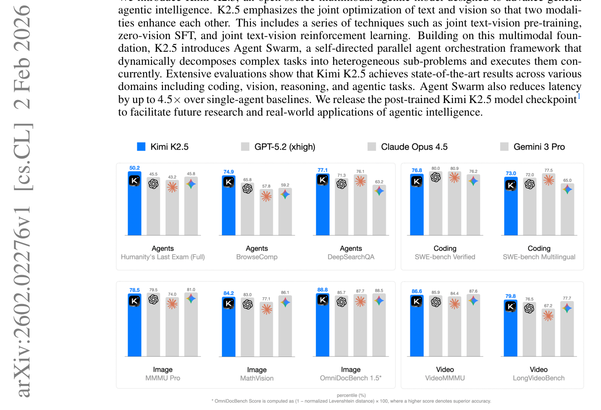

**图 1.** Kimi K2.5 与闭源 baseline (GPT-5.2、Claude Opus 4.5、Gemini 3 Pro) 在 agentic、coding、image、video 基准上的对比。

---

### 2. Joint Optimization of Text and Vision

Kimi K2.5 is a native multimodal model built upon Kimi K2 through large-scale joint pre-training on approximately 15 trillion mixed visual and text tokens. Unlike vision-adapted models that compromise either linguistic or visual capabilities, our joint pre-training paradigm enhances both modalities simultaneously. This section describes the multimodal joint optimization methodology that extends Kimi K2 to Kimi K2.5.

K2.5 是一个原生多模态模型，在 K2 之上通过大约 **15T 混合视觉-文本 token** 的大规模联合预训练得到。与那些"视觉后期适配但牺牲一边"的模型不同，我们的联合预训练范式**两个模态同时增强**。本节介绍把 K2 扩展为 K2.5 的多模态联合优化方法。

#### 2.1 Native Multimodal Pre-Training

A key design question for multimodal pre-training is: Given a fixed vision-text token budget, what is the optimal vision-text joint-training strategy. Conventional wisdom suggests introducing vision tokens predominantly in the later stages of LLM training at high ratios (e.g., 50% or higher) should accelerate multimodal capability acquisition, treating multimodal capability as a post-hoc add-on to linguistic competence.

多模态预训练有一个核心设计问题：在视觉-文本总 token 预算固定的前提下，最优的联合训练策略是什么？传统经验认为应该把视觉 token 主要在 LLM 训练**后期**以**高比例**（≥50%）注入，把多模态能力当作语言能力的"事后附加"——这样能加速多模态能力获取。

However, our experiments (as shown in Table 1, Figure 9) reveal a different story. We conducted ablation studies varying the vision ratio and vision injection timing while keeping the total vision and text token budgets fixed. To strictly meet the targets for different ratios, we pre-trained the model with text-only tokens for a specifically calculated number of tokens before introducing vision data. Surprisingly, we found that the vision ratio has minimal impact on final multimodal performance. In fact, **early fusion with a lower vision ratio yields better results given a fixed total vision-text token budget**. This motivates our native multimodal pre-training strategy: rather than aggressive vision-heavy training concentrated at the end, we adopt a moderate vision ratio integrated early in the training process, allowing the model to naturally develop balanced multimodal representations while benefiting from extended co-optimization of both modalities.

但我们的实验（Table 1、Figure 9）讲了一个不同的故事。在固定总预算下，我们对**视觉比例**与**视觉注入时机**做了正交 ablation——为严格满足各比例目标，先用纯文本 token 训练精心计算过的步数后再注入视觉数据。结果有些反直觉：**视觉比例对最终多模态性能影响极小**；事实上，在固定总预算下，**早期融合 + 较低视觉比例**结果反而更好。这驱动了我们的原生多模态预训练策略：不在末期做激进的高视觉比例训练，而是在训练**早期**就以**中等比例**融合视觉，让模型自然演化出均衡的多模态表征，并在两个模态上享受更长的协同优化。

**Table 1.** Vision ratio × injection timing ablation. Early fusion with 10:90 vision-text ratio dominates on Vision Knowledge / Reasoning / OCR while preserving Text Knowledge / Reasoning / Code.

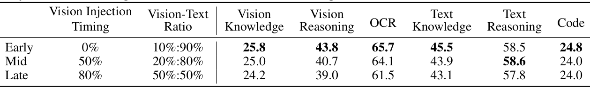

**表 1.** 视觉比例 × 注入时机 ablation。**Early-10%:90%** 在视觉知识 / 推理 / OCR 上全面占优，同时保住文本知识 / 推理 / 编码能力。

**Figure 9.** Training curves for vision ratios 10:90 / 20:80 / 50:50 across six metric categories. Mid- and late-fusion exhibit a "dip-and-recover" pattern in text capability when vision tokens are first introduced.

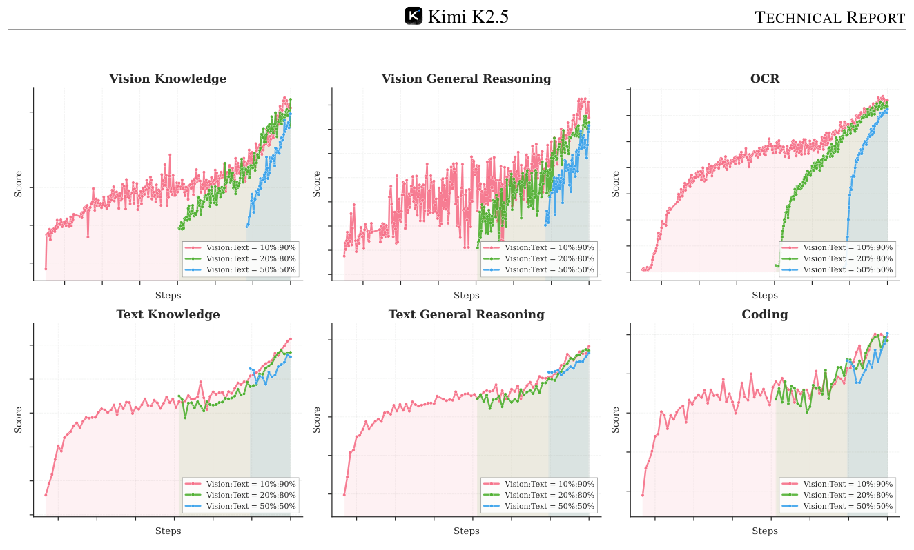

**图 9.** 三个视觉比例 (10:90 / 20:80 / 50:50) 在六个能力维度上的训练曲线。Mid / Late fusion 在引入视觉 token 时出现"先掉再回升"的文本能力崩塌-恢复曲线。

#### 2.2 Zero-Vision SFT

Pretrained VLMs do not naturally perform vision-based tool-calling, which poses a cold-start problem for multimodal RL. Conventional approaches address this issue through manually annotated or prompt-engineered chain-of-thought (CoT) data, but such methods are limited in diversity, often restricting visual reasoning to simple diagrams and primitive tool manipulations (crop, rotate, flip).

预训练 VLM 不会天然做"基于视觉的工具调用"，这给多模态 RL 带来 cold-start 问题。传统做法是手工标注或 prompt-engineered 视觉 CoT 数据；但这类数据多样性有限，通常把视觉推理限制在简单图示与初级工具操作（裁剪、旋转、翻转）。

An observation is that high-quality text SFT data are relatively abundant and diverse. We propose a novel approach, **zero-vision SFT**, that uses only text SFT data to activate the visual, agentic capabilities during post-training. In this approach, all image manipulations are proxied through programmatic operations in IPython, effectively serving as a generalization of traditional vision tool-use. This "zero-vision" activation enables diverse reasoning behaviors, including pixel-level operations such as object size estimation via binarization and counting, and generalizes to visually grounded tasks such as object localization, counting, and OCR.

我们的观察是：高质量**文本 SFT 数据**反而相对丰富多样。基于此提出 **zero-vision SFT**——只用文本 SFT 数据在后训练阶段激活视觉与 agentic 能力。具体做法是把**所有图像操作通过 IPython 的程序化操作代理**（二值化估物体大小、计数等），相当于把传统视觉工具用法推广为通用编程操作。这种"零视觉"激活方式带来更丰富的推理行为——像素级操作（binarization + counting 估大小）、对象定位、OCR、计数等都能泛化。

Figure 2 illustrates the RL training curves, where the starting points are obtained from zero-vision SFT. The results show that zero-vision SFT is sufficient for activating vision capabilities while ensuring generalization across modalities. This phenomenon is likely due to the joint pretraining of text and vision data as described in Section 2.1. Compared to zero-vision SFT, our preliminary experiments show that text-vision SFT yields much worse performance on visual, agentic tasks, possibly because of the lack of high-quality vision data.

Figure 2 展示了从 zero-vision SFT 起步的 RL 训练曲线。结果表明 zero-vision SFT 足以激活视觉能力，同时保证跨模态泛化——这一现象很可能源自 §2.1 描述的联合预训练已经做好的视觉-文本对齐。与之相对，我们初步实验表明 text-vision SFT 在视觉 agentic 任务上效果**反而差很多**，原因可能是高质量视觉 SFT 数据本身不足。

**Figure 2.** RL training curves on MMMU-Pro / CharXiv (RQ) / MathVision / OCRBench, starting from zero-vision SFT.

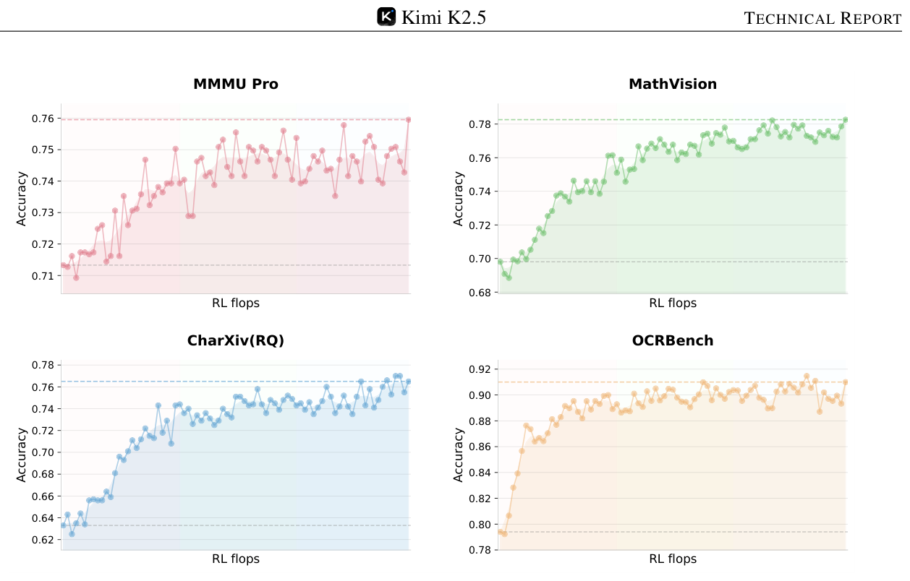

**图 2.** 从 zero-vision SFT 起步的 RL 训练曲线（MMMU-Pro / CharXiv / MathVision / OCRBench）。

#### 2.3 Joint Multimodal Reinforcement Learning (RL)

In this section, we describe the methodology implemented in K2.5 that enables effective multimodal RL, from outcome-based visual RL to emergent cross-modal transfer that enhances textual performance.

本节介绍 K2.5 实现高效多模态 RL 的方法——从基于结果的视觉 RL，到涌现式跨模态迁移对文本性能的提升。

**Outcome-Based Visual RL.** Following the zero-vision SFT, the model requires further refinement to reliably incorporate visual inputs into reasoning. Text-initiated activation alone exhibits notable failure modes: visual inputs are sometimes ignored, and images may not be attended to when necessary. We employ outcome-based RL on tasks that explicitly require visual comprehension for correct solutions. We categorize these tasks into three domains:

- **Visual grounding and counting:** Accurate localization and enumeration of objects within images;
- **Chart and document understanding:** Interpretation of structured visual information and text extraction;
- **Vision-critical STEM problems:** Mathematical and scientific questions filtered to require visual inputs.

**基于结果的视觉 RL。** 经过 zero-vision SFT 后，模型还需要进一步精调，让它**可靠地把视觉输入纳入推理**。仅靠文本启动激活会有明显失效模式：视觉输入有时被忽略、图像不在需要时被关注。因此我们在"必须视觉理解才能正确解题"的任务上做 outcome-based RL，按三类组织：
- **视觉定位与计数：** 物体的精确定位与数量统计；
- **图表与文档理解：** 结构化视觉信息的解读与文字提取；
- **视觉关键的 STEM 题：** 经过筛选、必须看图才能解的数学与科学题。

Outcome-based RL on these tasks improves both basic visual capabilities and more complex agentic behaviors. Extracting these trajectories for rejection-sampling fine-tuning (RFT) enables a self-improving data pipeline, allowing subsequent joint RL stages to leverage richer multimodal reasoning traces.

在这些任务上做 outcome-based RL 同时提升基础视觉能力与更复杂的代理行为。把这些轨迹抽出来做拒绝采样微调 (RFT) 形成一条自改进数据流水线，后续 joint RL 阶段就能用上更丰富的多模态推理轨迹。

**Visual RL Improves Text Performance.** To investigate potential trade-offs between visual and textual performance, we evaluated text-only benchmarks before and after visual RL. Surprisingly, outcome-based visual RL produced measurable improvements in textual tasks, including MMLU-Pro (84.7% → 86.4%), GPQA-Diamond (84.3% → 86.4%), and LongBench v2 (56.7% → 58.9%) (Table 2). Analysis suggests that visual RL enhances calibration in areas requiring structured information extraction, reducing uncertainty on queries that resemble visually grounded reasoning (e.g., counting, OCR). These findings indicate that visual RL can contribute to cross-modal generalization, improving textual reasoning without observable degradation of language capabilities.

**视觉 RL 反过来提升文本能力。** 为研究视觉 vs 文本能力的潜在 trade-off，我们在视觉 RL 前后分别评测纯文本 benchmark。结果有些意外：基于结果的视觉 RL 在文本任务上也带来可测量的提升——MMLU-Pro 84.7%→86.4%、GPQA-Diamond 84.3%→86.4%、LongBench v2 56.7%→58.9% (Table 2)。我们的分析认为视觉 RL 改善了模型在"需要结构化信息抽取"的题型上的校准，减少了与视觉推理相似的文本题（计数、OCR 类）的不确定度。这说明视觉 RL 能贡献跨模态泛化，提升文本推理同时**未观察到语言能力的退化**。

**Table 2.** Text benchmark scores before and after outcome-based visual RL.

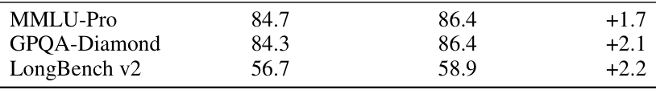

**表 2.** outcome-based visual RL 前后的文本 benchmark 分数。

**Joint Multimodal RL.** Motivated by the finding that robust visual capabilities can emerge from zero-vision SFT paired with vision RL—which further enhances general text abilities—we adopt a joint multimodal RL paradigm during Kimi K2.5's post-training. Departing from conventional modality-specific expert divisions, we organize RL domains not by input modality but by abilities—knowledge, reasoning, coding, agentic, etc. These domain experts jointly learn from both pure-text and multimodal queries, while the Generative Reward Model (GRM) similarly optimizes across heterogeneous traces without modality barriers. This paradigm ensures that capability improvements acquired through either textual or visual inputs inherently generalize to enhance related abilities across the alternate modality, thereby maximizing cross-modal capability transfer.

**联合多模态 RL。** 既然 zero-vision SFT + 视觉 RL 能涌现出鲁棒的视觉能力且反过来提升文本，我们在 K2.5 后训练中干脆采用**联合多模态 RL**。与传统按模态划分专家的做法不同，我们**按能力**（知识、推理、编码、agentic 等）组织 RL 域：每个领域专家同时从纯文本与多模态查询中学习，**生成式奖励模型 (GRM)** 也跨异构轨迹优化、不设模态边界。这一范式保证：无论从文本还是视觉输入获得的能力提升，都能自然泛化到另一模态的相关能力上，从而最大化跨模态能力迁移。

---

### 3. Agent Swarm

The primary challenge of existing agent-based systems lies in their reliance on sequential execution of reasoning and tool-calling steps. While this structure may be effective for simpler, short-horizon tasks, it becomes inadequate as the complexity of the task increases and the accumulated context grows. As tasks evolve to contain broad information gathering and intricate, multi-branch reasoning, sequential systems often encounter significant bottlenecks. The limited capacity of a single agent working through each step one by one can lead to the exhaustion of practical reasoning depth and tool-call budgets, ultimately hindering the system's ability to handle more complex scenarios.

现有 agent 系统的主要挑战在于：依赖**串行执行**推理与工具调用。这套结构对短时程的简单任务还行，但当任务复杂度上升、累积上下文增长后就开始捉襟见肘。当任务演化为"广覆盖信息收集 + 多分支复杂推理"，串行系统就会撞上明显瓶颈——单 agent 一步一步地推，会很快耗尽实用的推理深度与工具调用预算，进而限制系统处理更复杂场景的能力。

To address this, we introduce Agent Swarm and Parallel Agent Reinforcement Learning (PARL). Instead of executing a task as a reasoning chain or relying on pre-specified parallelization heuristics, K2.5 initiates an Agent Swarm through dynamic task decomposition, subagent instantiation, and parallel subtask scheduling. Importantly, parallelism is not presumed to be inherently advantageous; decisions regarding whether, when, and how to parallelize are explicitly learned through environmental feedback and RL-driven exploration. As shown in Figure 4, the progression of performance demonstrates this adaptive capability, with the cumulative reward increasing smoothly as the orchestrator optimizes its parallelization strategy throughout training.

为此我们引入 **Agent Swarm + Parallel Agent Reinforcement Learning (PARL)**。K2.5 不再把任务跑成单一推理链，也不依赖预设的并行启发式——而是通过**动态任务分解 → 子代理实例化 → 并行子任务调度**启动一个 Agent Swarm。重要的是：并行**不被假设为天然有益**；"是否、何时、如何并行"由环境反馈与 RL 驱动的探索**显式地学习**。Figure 4 显示，训练过程中累计奖励平滑上升——这反映 orchestrator 在动态优化自身的并行策略。

**Figure 4.** Training accuracy and average parallelism vs RL flops. Parallelism is learned (rises late in training), not preset.

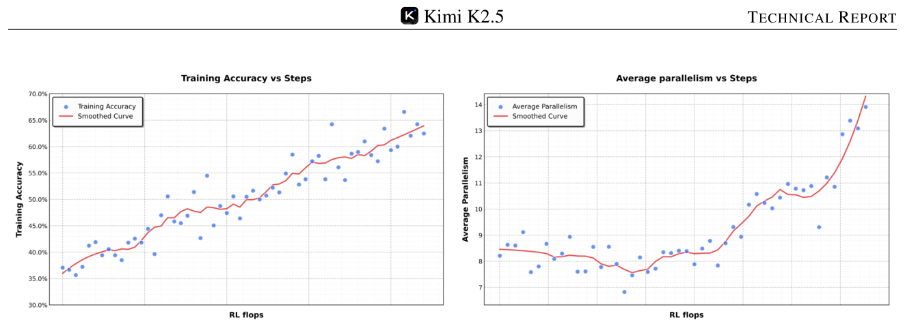

**图 4.** 训练精度与平均并行度 vs RL flops。并行度是**学出来的**（训练后期才显著上升），不是预设的。

**Architecture and Learning Setup.** The PARL framework adopts a decoupled architecture comprising a trainable orchestrator and frozen subagents instantiated from fixed intermediate policy checkpoints. This design deliberately avoids end-to-end co-optimization to circumvent two fundamental challenges: credit assignment ambiguity and training instability. In this multi-agent setting, outcome-based rewards are inherently sparse and noisy; a correct final answer does not guarantee flawless subagent execution, just as a failure does not imply universal subagent error. By freezing the subagents and treating their outputs as environmental observations rather than differentiable decision points, we disentangle high-level coordination logic from low-level execution proficiency, leading to more robust convergence. To improve efficiency, we first train the orchestrator using small-size subagents before transitioning to larger models. Our RL framework also supports dynamically adjusting the inference instance ratios between subagents and the orchestrator, thereby maximizing the resource usage across the cluster.

**架构与训练设置。** PARL 采用解耦架构：**可训练的 orchestrator** + **冻结的子代理**（从固定的中间策略 checkpoint 实例化）。这一设计**有意**避免端到端协同优化，绕开两大顽疾——信用分配模糊与训练不稳定。在多 agent 场景下，outcome-based reward 天生稀疏嘈杂；最终答案对不一定意味着子代理表现完美，反过来失败也不意味着所有子代理都错。**冻结子代理 + 把它们的输出当作环境观测**（而非可微分决策点），就把高层协调逻辑与低层执行能力解耦，收敛更鲁棒。出于效率考虑，我们先用小子代理训练 orchestrator，再切换到大子代理。我们的 RL 框架还支持动态调整子代理与 orchestrator 之间的推理实例比例，最大化集群资源利用。

**PARL Reward.** Training a reliable parallel orchestrator is challenging due to the delayed, sparse, and non-stationary feedback inherent in independent subagent execution. To address this, we define the PARL reward as:

$$r_{\text{PARL}}(x,y) = \underbrace{\lambda_1 \cdot r_{\text{parallel}}}_{\text{instantiation reward}} + \underbrace{\lambda_2 \cdot r_{\text{finish}}}_{\text{sub-agent finish rate}} + \underbrace{r_{\text{perf}}(x,y)}_{\text{task-level outcome}}.$$

The performance reward $r_{\text{perf}}$ evaluates the overall success and quality of the solution $y$ for a given task $x$. This is augmented by two auxiliary rewards, each addressing a distinct challenge in learning parallel orchestration. The reward $r_{\text{parallel}}$ is introduced to mitigate **serial collapse**—a local optimum where the orchestrator defaults to single-agent execution. By incentivizing subagent instantiation, this term encourages the exploration of concurrent scheduling spaces. The $r_{\text{finish}}$ reward focuses on the successful completion of assigned subtasks. It is used to prevent **spurious parallelism**, a reward-hacking behavior in which the orchestrator increases parallel metrics dramatically by spawning many subagents without meaningful task decomposition. By rewarding completed subtasks, $r_{\text{finish}}$ enforces feasibility and guides the policy toward valid and effective decompositions.

To ensure the final policy optimizes for the primary objective, the hyperparameters $\lambda_1$ and $\lambda_2$ are annealed to zero over the course of training.

**PARL 奖励函数。** 训练一个可靠的并行 orchestrator 很难——子代理独立执行带来延迟、稀疏、非平稳的反馈。为此我们定义 PARL 奖励为：

$$r_{\text{PARL}}(x,y) = \underbrace{\lambda_1 \cdot r_{\text{parallel}}}_{\text{实例化奖励}} + \underbrace{\lambda_2 \cdot r_{\text{finish}}}_{\text{子代理完成率}} + \underbrace{r_{\text{perf}}(x,y)}_{\text{任务级结果}}.$$

性能奖励 $r_{\text{perf}}$ 衡量总体成功率与解的质量；外加两个辅助项各自针对一个独立挑战。$r_{\text{parallel}}$ 用于缓解 **serial collapse**——orchestrator 退化为单代理执行的局部最优；通过奖励"实例化子代理"，该项鼓励对并行调度空间的探索。$r_{\text{finish}}$ 关注被指派子任务是否成功完成，用于防止 **spurious parallelism** 这种 reward hacking——即 orchestrator 通过滥生子代理显著抬高并行指标但并未做出有意义的任务分解。通过奖励"完成的子任务"，$r_{\text{finish}}$ 强制可行性、引导策略朝向有效分解。为保证最终策略优化主要目标，$\lambda_1$ 与 $\lambda_2$ 在训练过程中**退火至零**。

**Critical Steps as Resource Constraint.** To measure computational time cost in a parallel-agent setting, we define **critical steps** by analogy to the critical path in a computation graph. We model an episode as a sequence of execution stages indexed by $t = 1,\dots,T$. In each stage, the main agent executes an action, which corresponds to either direct tool invocation or the instantiation of a group of subagents running in parallel. Let $S^{(t)}_{\text{main}}$ denote the number of steps taken by the main agent in stage $t$ (typically $S^{(t)}_{\text{main}} = 1$), and $S^{(t)}_{\text{sub},i}$ denote the number of steps taken by the $i$-th subagent in that parallel group. The duration of stage $t$ is governed by the longest-running subagent within that cohort. Consequently, the total critical steps for an episode are defined as

$$\text{CriticalSteps} = \sum_{t=1}^{T} \left( S^{(t)}_{\text{main}} + \max_i S^{(t)}_{\text{sub},i} \right).$$

By constraining training and evaluation using critical steps rather than total steps, the framework explicitly incentivizes effective parallelization. Excessive subtask creation that does not reduce the maximum execution time of parallel groups yields little benefit under this metric, while well-balanced task decomposition that shortens the longest parallel branch directly reduces critical steps. As a result, the orchestrator is encouraged to allocate work across subagents in a way that minimizes end-to-end latency, rather than merely maximizing concurrency or total work performed.

**Critical Steps 作为资源约束。** 为度量并行 agent 场景下的计算时间代价，我们借用计算图中"关键路径"概念定义 **critical steps**。把一个 episode 建模为执行阶段序列 $t = 1,\dots,T$；在每个阶段，主代理执行一个动作（要么直接调工具，要么实例化一组并行子代理）。令 $S^{(t)}_{\text{main}}$ 为主代理在阶段 $t$ 的步数（通常为 1），$S^{(t)}_{\text{sub},i}$ 为第 $i$ 个子代理的步数。**该阶段的耗时由最长运行的子代理决定**，所以一个 episode 的总 critical steps 定义为：

$$\text{CriticalSteps} = \sum_{t=1}^{T} \left( S^{(t)}_{\text{main}} + \max_i S^{(t)}_{\text{sub},i} \right).$$

用 critical steps（而非总步数）来约束训练与评测，意味着框架**显式奖励有效并行化**：滥生子代理但不减少并行组的最长执行时间，在该指标下毫无收益；而良好平衡的任务分解能缩短最长分支的同时直接降低 critical steps。结果就是 orchestrator 被引导去把工作分配得**最小化端到端延迟**，而非单纯堆并发或堆总工作量。

**Prompt Construction for Parallel-agent Capability Induction.** To incentivize the orchestrator to leverage the advantages of parallelization, we construct a suite of synthetic prompts designed to stress the limits of sequential agentic execution. These prompts emphasize either **wide search**, requiring simultaneous exploration of many independent information sources, or **deep search**, requiring multiple reasoning branches with delayed aggregation. We additionally include tasks inspired by real-world workloads, such as long-context document analysis and large-scale file downloading. When executed sequentially, these tasks are difficult to complete within fixed reasoning-step and tool-call budgets. By construction, they encourage the orchestrator to allocate subtasks in parallel, enabling completion within fewer critical steps than would be feasible for a single sequential agent. Importantly, the prompts do not explicitly instruct the model to parallelize. Instead, they shape the task distribution such that parallel decomposition and scheduling strategies are naturally favored.

**用于诱导并行能力的 prompt 构造。** 为了让 orchestrator 学会利用并行优势，我们构造了一组合成 prompt，专门压测串行 agent 执行的极限。这些 prompt 强调两类困难：**wide search**——需要同时探索许多独立信息源；**deep search**——需要多个推理分支带延迟聚合。我们还加入了真实工作负载启发的任务，比如长文档分析、大规模文件下载。这些任务串行执行时**难以在固定的推理步与工具调用预算内完成**——构造上就鼓励 orchestrator 并行分配子任务，从而以更少 critical steps 完成任务。重要的是：**prompt 并不显式指示模型去并行**，而是通过塑造任务分布，使并行分解与调度策略**自然被偏好**。

---

### 4. Method Overview

#### 4.1 Foundation: Kimi K2 Base Model

The foundation of Kimi K2.5 is Kimi K2, a trillion-parameter mixture-of-experts (MoE) transformer model pre-trained on 15 trillion high-quality text tokens. Kimi K2 employs the token-efficient MuonClip optimizer with QK-Clip for training stability. The model comprises 1.04 trillion total parameters with 32 billion activated parameters, utilizing 384 experts with 8 activated per token (sparsity of 48). For detailed descriptions of MuonClip, architecture design, and training infrastructure, we refer to the Kimi K2 technical report.

K2.5 的基础是 Kimi K2——一个万亿参数级 MoE Transformer，在 15T 高质量文本 token 上预训练得到。K2 采用 token-efficient 的 **MuonClip** 优化器配合 **QK-Clip** 维持训练稳定性。模型总共 1.04T 参数、激活 32B（即 384 专家 / 每 token 激活 8 个，稀疏度 48）。MuonClip、架构、训练基础设施的细节见 K2 技术报告。

#### 4.2 Model Architecture

The multimodal architecture of Kimi K2.5 consists of three components: a three-dimensional native-resolution vision encoder (**MoonViT-3D**), an MLP projector, and the Kimi K2 MoE language model, following the design principles established in Kimi-VL.

K2.5 的多模态架构由三部分构成：原生分辨率的三维视觉编码器 **MoonViT-3D**、MLP projector、以及 K2 MoE 语言模型——延续 Kimi-VL 的设计原则。

**MoonViT-3D: Shared Embedding Space for Images and Videos.** In Kimi-VL, we employ MoonViT to natively process images at their original resolutions, eliminating the need for complex sub-image splitting and splicing operations. Initialized from SigLIP-SO-400M, MoonViT incorporates the patch packing strategy from NaViT, where single images are divided into patches, flattened, and sequentially concatenated into 1D sequences, thereby enabling efficient simultaneous training on images at varying resolutions.

**MoonViT-3D：图像与视频共享的嵌入空间。** 在 Kimi-VL 中，我们用 MoonViT 在原生分辨率下处理图像，免去复杂的子图切分-拼接。MoonViT 由 SigLIP-SO-400M 初始化，并采用 NaViT 的 patch packing 策略：把单张图像切成 patch、扁平化、按序拼成 1D 序列——这让任意分辨率图像可以**高效同时训练**。

To maximize the transfer of image understanding capabilities to video, we introduce MoonViT-3D with a unified architecture, fully shared parameters, and a consistent embedding space. By generalizing the "patch n' pack" philosophy to the temporal dimension, up to four consecutive frames are treated as a spatiotemporal volume: 2D patches from these frames are jointly flattened and packed into a single 1D sequence, allowing the identical attention mechanism to operate seamlessly across both space and time. While the extra temporal attention improves understanding on high-speed motions and visual effects, the sharing maximizes knowledge generalization from static images to dynamic videos, achieving strong video understanding performance without requiring specialized video modules or architectural bifurcation. Prior to the MLP projector, lightweight temporal pooling aggregates patches within each temporal chunk, yielding 4× temporal compression to significantly extend feasible video length. The result is a unified pipeline where knowledge and ability obtained from image pretraining transfers holistically to videos through one shared parameter space and feature representation.

为最大化把图像理解能力迁移到视频，我们引入 **MoonViT-3D**——架构统一、参数完全共享、嵌入空间一致。把 "patch n' pack" 思路推广到时间维度：每最多四帧连续帧被当作一个时空体，2D patch 联合扁平化并打包成单一 1D 序列，让同一套 attention 机制无缝跨越空间与时间。额外的时序 attention 改善了对高速运动与视觉效果的理解，而共享则最大化了从静态图像到动态视频的知识泛化——**无需专用视频模块或架构分叉**就能拿到强视频理解性能。在 MLP projector 前，轻量时序池化把同一时间块内的 patch 聚合，做到 **4× 时序压缩**，显著延长可处理视频长度。结果是一个统一流水线：图像预训练得到的知识与能力通过一个共享的参数空间与特征表示**整体迁移**到视频。

#### 4.3 Pre-training Pipeline

As illustrated in Table 3, Kimi K2.5's pre-training builds upon the Kimi K2 language model checkpoint and processes approximately 15T tokens across three stages: first, standalone ViT training to establish a robust native-resolution visual encoder; second, joint pre-training to simultaneously enhance language and multimodal capabilities; and third, mid-training on high-quality data and long-context activation to refine capabilities and extend context windows.

如 Table 3 所示，K2.5 的预训练在 K2 语言模型 checkpoint 上展开，分**三个阶段**处理大约 **15T token**：首先单独训 ViT 建立鲁棒的原生分辨率视觉编码器；其次做联合预训练同时增强语言与多模态能力；最后在高质量数据上做 mid-training 并激活长上下文，以精修能力并扩展上下文窗口。

**Table 3.** Three-stage pre-training pipeline. ViT (1T tokens, 4096 seq len) → Joint pre-training (15T tokens, 4096 seq len) → Long-context mid-training (500B → 200B tokens, 32K → 262144 seq len).

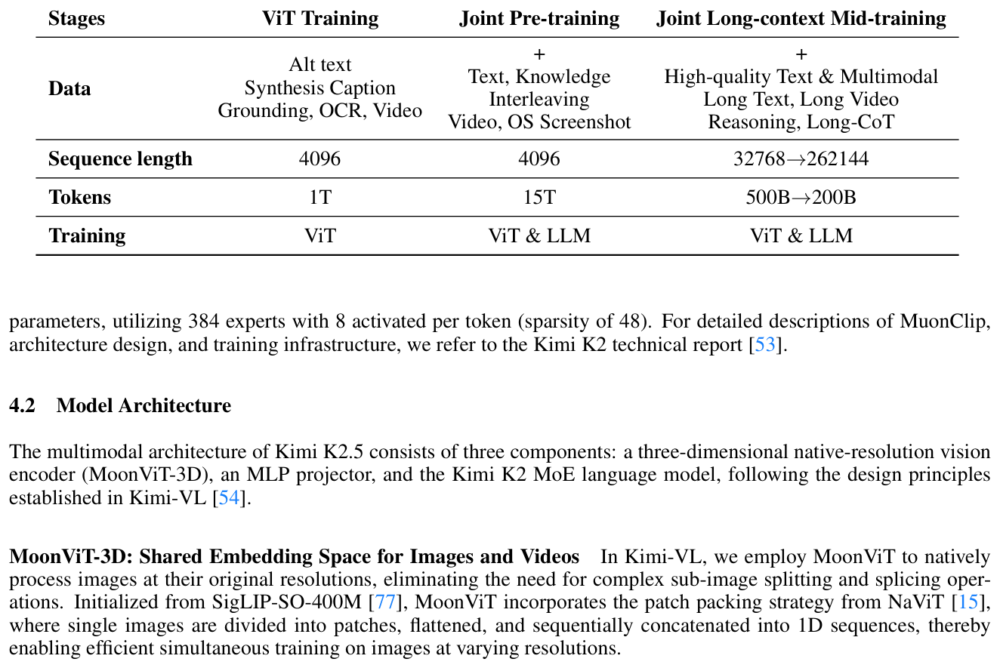

**表 3.** 三阶段预训练流水线：ViT 单训 (1T token, 4K 序列) → 联合预训练 (15T token, 4K 序列) → 长上下文 mid-training (500B → 200B token，32K → 262144 序列)。

**ViT Training Stage.** The MoonViT-3D is continual pre-trained from SigLIP on image-text and video-text pairs, where the text components consist of a variety of targets: image alt texts, synthetic captions of images and videos, grounding bboxes, and OCR texts. Unlike the implementation in Kimi-VL, this continual pre-training does not include a contrastive loss, but incorporates solely cross-entropy loss $L_{\text{caption}}$ for caption generation conditioned on input images and videos. We adopt a two-stage alignment strategy. In the first stage, we update the MoonViT-3D to align it with Moonlight-16B-A3B via the caption loss, consuming about 1T tokens with very few training FLOPs. This stage allows MoonViT-3D to primarily understand high-resolution images and videos. A very short second stage follows, updating only the MLP projector to bridge the ViT with the 1T LLM for smoother joint pre-training.

**ViT 训练阶段。** MoonViT-3D 从 SigLIP 起做继续预训练，数据是图像-文本与视频-文本对，文本目标多样：图像 alt text、合成 caption、定位 bbox、OCR 文本。与 Kimi-VL 不同，这一阶段**不包含对比损失**，只用基于图像/视频条件的 caption 生成的交叉熵损失 $L_{\text{caption}}$。对齐分两阶段：先用 caption loss 把 MoonViT-3D 对齐到 Moonlight-16B-A3B，约 1T token、训练 FLOPs 极小，让它具备对高分辨率图像与视频的基本理解；再用一个**很短**的第二阶段，**只更新 MLP projector**，把 ViT 对接到 1T LLM，为后续联合预训练做平滑过渡。

**Joint Training Stages.** The joint pre-training stage continues from a near-end Kimi K2 checkpoint over additional 15T vision-text tokens at 4K sequence length. The data recipe extends Kimi K2's pre-training distribution by introducing unique tokens, adjusting data proportions with increased weight on coding-related content, and controlling maximum epochs per data source. The third stage performs long-context activation with integrated higher-quality mid-training data, sequentially extending context length via YaRN interpolation. This yields significant generalization improvements in long-context text understanding and long video comprehension.

**联合训练阶段。** 联合预训练阶段从 K2 接近末段的 checkpoint 继续，再训 **15T 视觉-文本 token**（序列长度 4K）。数据配方在 K2 预训练分布基础上扩展：引入独有 token、加大编码相关数据权重、并对每个数据源限制最大 epoch。第三阶段做长上下文激活，并加入更高质量的 mid-training 数据，用 YaRN 插值逐步扩展上下文长度——这给长上下文文本理解与长视频理解带来显著的泛化提升。

#### 4.4 Post-Training

##### 4.4.1 Supervised Fine-Tuning

Following the SFT pipeline established by Kimi K2, we developed K2.5 by synthesizing high-quality candidate responses from K2, K2 Thinking and a suite of proprietary in-house expert models. Our data generation strategy employs specialized pipelines tailored to specific domains, integrating human annotation with advanced prompt engineering and multi-stage verification. This methodology produced a large-scale instruction-tuning dataset featuring diverse prompts and intricate reasoning trajectories, ultimately training the model to prioritize interactive reasoning and precise tool-calling for complex, real-world applications.

延续 K2 的 SFT 流水线，K2.5 通过 K2 / K2 Thinking 与一套专有内部专家模型合成高质量候选回答。数据生成策略针对各领域采用专门流水线，结合人工标注、prompt 工程与多阶段验证，最终产出一个大规模 instruction-tuning 数据集——prompt 多样、推理轨迹复杂，把模型训练为**优先做交互式推理与精确工具调用**以应对真实复杂应用。

##### 4.4.2 Reinforcement Learning

Reinforcement learning constitutes a crucial phase of our post-training. To facilitate joint optimization across text and vision modalities, as well as to enable PARL for agent swarm, we develop a Unified Agentic Reinforcement Learning Environment (Appendix D) and optimize the RL algorithms. Both text-vision joint RL and PARL are built upon the algorithms described in this section.

强化学习是我们后训练中的关键阶段。为支持文本-视觉联合优化与 agent swarm 的 PARL，我们开发了一个统一 agentic RL 环境（附录 D）并优化了 RL 算法——文本-视觉联合 RL 与 PARL 都建立在本节描述的算法之上。

**Policy Optimization.** For each problem $x$ sampled from a dataset $\mathcal{D}$, $K$ responses $\{y_1,\dots,y_K\}$ are generated using the previous policy $\pi_{\text{old}}$. We optimize the model $\pi_\theta$ with respect to the following objective:

$$\mathcal{L}_{\text{RL}}(\theta) = \mathbb{E}_{x \sim \mathcal{D}} \left[ \frac{1}{N} \sum_{j=1}^{K} \sum_{i=1}^{|y_j|} \text{Clip}\!\left(\log \frac{\pi_\theta(y^i_j \mid x, y^{0:i}_j)}{\pi_{\text{old}}(y^i_j \mid x, y^{0:i}_j)}, \alpha, \beta\right) \cdot \big(r(x, y_j) - \bar{r}(x)\big) - \tau \right]^{\!2}.$$

Here $\alpha, \beta, \tau > 0$ are hyperparameters, $y^{0:i}_j$ is the prefix up to the $i$-th token of the $j$-th response, $N = \sum_{i=1}^{K} |y_i|$ is the total number of generated tokens in a batch, $\bar{r}(x) = \frac{1}{K} \sum_{j=1}^{K} r(x, y_j)$ is the mean reward of all generated responses.

**策略优化。** 对从 $\mathcal{D}$ 采样的每个问题 $x$，用旧策略 $\pi_{\text{old}}$ 生成 $K$ 个回答 $\{y_1,\dots,y_K\}$。我们以下述目标优化 $\pi_\theta$：

$$\mathcal{L}_{\text{RL}}(\theta) = \mathbb{E}_{x \sim \mathcal{D}} \left[ \frac{1}{N} \sum_{j=1}^{K} \sum_{i=1}^{|y_j|} \text{Clip}\!\left(\log \frac{\pi_\theta(y^i_j \mid x, y^{0:i}_j)}{\pi_{\text{old}}(y^i_j \mid x, y^{0:i}_j)}, \alpha, \beta\right) \cdot \big(r(x, y_j) - \bar{r}(x)\big) - \tau \right]^{\!2}.$$

其中 $\alpha, \beta, \tau > 0$ 是超参数，$y^{0:i}_j$ 是第 $j$ 个回答前 $i$ 个 token 的前缀，$N$ 是 batch 内总生成 token 数，$\bar{r}(x)$ 是该问题所有回答的平均奖励。

This loss function departs from the policy optimization algorithm used in K1.5 by introducing a **token-level clipping mechanism** designed to mitigate the off-policy divergence amplified by discrepancies between training and inference frameworks. The mechanism functions as a simple gradient masking scheme: policy gradients are computed normally for tokens with log-ratios within the interval $[\alpha, \beta]$, while gradients for tokens falling outside this range are zeroed out. Notably, a key distinction from standard PPO clipping is that **our method relies strictly on the log-ratio to explicitly bound off-policy drift, regardless of the sign of the advantages**. This approach aligns with recent strategies proposed to stabilize large-scale RL training. Empirically, we find this mechanism essential for maintaining training stability in complex domains requiring long-horizon, multi-step tool-use reasoning. We employ the MuonClip optimizer to minimize this objective.

这个损失相对 K1.5 用的策略优化算法有所改动——引入了 **token 级 clipping 机制**，用于抑制因训练框架与推理框架差异而被放大的 off-policy 漂移。机制本身是一个简单的梯度掩码：log-ratio 落在 $[\alpha, \beta]$ 区间内的 token 正常计算策略梯度，落在区间外的 token 梯度被置零。与标准 PPO clipping 的关键区别是：**我们仅依赖 log-ratio 显式限制 off-policy drift，不考虑 advantage 的正负号**——这与近期一些大规模 RL 训练稳定化策略一致。经验上，我们发现这一机制对维持复杂域（长时程、多步工具使用推理）下的训练稳定**至关重要**。我们用 MuonClip 优化器最小化该目标。

**Reward Function.** We apply a rule-based outcome reward for tasks with verifiable solutions, such as reasoning and agentic tasks. To optimize resource consumption, we also incorporate a budget-control reward aimed at enhancing token efficiency. For general-purpose tasks, we employ Generative Reward Models (GRMs) that provide granular evaluations aligned with Kimi's internal value criteria. In addition, for visual tasks, we design task-specific reward functions to provide fine-grained supervision. For visual grounding and point localization tasks, we employ an F1-based reward with soft matching: grounding tasks derive soft matches from Intersection over Union (IoU) and point tasks derive soft matches from Gaussian-weighted distances under optimal matching. For polygon segmentation tasks, we rasterize the predicted polygon into a binary mask and compute the segmentation IoU against the ground-truth mask to assign the reward. For OCR tasks, we adopt normalized edit distance to quantify character-level alignment between predictions and ground-truth. For counting tasks, rewards are assigned based on the absolute difference between predictions and ground-truth. Furthermore, we synthesize complex visual puzzle problems and utilize an LLM verifier (Kimi K2) to provide feedback.

**奖励函数。** 对有可验证解的任务（推理、agentic 任务），采用基于规则的结果奖励。为优化资源消耗，我们还加入一个 **budget-control 奖励**提升 token 效率。对开放式任务用 GRM（生成式奖励模型）做细粒度评估，对齐 Kimi 内部价值标准。对视觉任务，按子任务设计专用奖励：定位与点定位任务用 F1-based 软匹配奖励——grounding 任务的软匹配来自 IoU，point 任务的软匹配来自最优匹配下的高斯加权距离；多边形分割任务把预测多边形栅格化成二值 mask 后与 ground-truth mask 计算 IoU；OCR 任务用归一化编辑距离衡量字符级对齐；计数任务按预测与真值的绝对差距给奖励。此外我们还合成复杂的视觉 puzzle 题，用 LLM verifier（K2）提供反馈。

**Generative Reward Models.** Kimi K2 leverages a self-critique rubric reward for open-ended generation, and K2.5 extends this line of work by systematically deploying Generative Reward Models (GRMs) across a broad range of agentic behaviors and multimodal trajectories. Rather than limiting reward modeling to conversational outputs, we apply GRMs on top of verified reward signals in diverse environments, including chat assistants, coding agents, search agents, and artifact-generating agents. Notably, GRMs function not as binary adjudicators, but as fine-grained evaluators aligned with Kimi's values that are critical to user experiences, such as helpfulness, response readiness, contextual relevance, appropriate level of detail, aesthetic quality of generated artifacts, and strict instruction following. This design allows the reward signal to capture nuanced preference gradients that are difficult to encode with purely rule-based or task-specific verifiers. To mitigate reward hacking and overfitting to a single preference signal, we employ multiple alternative GRM rubrics tailored to different task contexts.

**生成式奖励模型 (GRM)。** K2 在开放式生成上用 self-critique rubric reward；K2.5 在此基础上把 GRM **系统性地铺到大量 agentic 行为与多模态轨迹**上。我们不把 reward modeling 限制在对话输出，而是把 GRM 加在多样环境（聊天助手、coding agent、search agent、artifact 生成 agent）的可验证奖励信号之上。值得注意的是：**GRM 不是二元判定器**，而是细粒度评估器，对齐 Kimi 内部价值——helpfulness、response readiness、上下文相关性、详略适当、生成 artifact 的美学质量、严格指令遵循。这让奖励信号能捕捉纯规则或任务专用 verifier 难以编码的细微偏好梯度。为缓解 reward hacking 与对单一偏好信号的过拟合，我们对不同任务上下文使用多套替代 GRM rubric。

**Token Efficient Reinforcement Learning.** Token efficiency is central to LLMs with test-time scaling. While test-time scaling inherently trades computation for reasoning quality, practical gains require algorithmic innovations that actively navigate this trade-off. Our previous findings indicate that imposing a problem-dependent budget effectively constrains inference-time compute, incentivizing the model to generate more concise chain of thought reasoning patterns without unnecessary token expansion. However, we also observe a **length-overfitting phenomenon**: models trained under rigid budget constraints often fail to generalize to higher compute scales. Consequently, they cannot effectively leverage additional inference-time tokens to solve complex problems, instead defaulting to truncated reasoning patterns.

**Token 高效的 RL。** 对带 test-time scaling 的 LLM 来说，token 效率是核心。test-time scaling 天然在算力与推理质量之间做交易，要把它做出实际收益，需要算法层面主动管理这个 trade-off。我们之前的发现是：**给每题加上"问题依赖的预算"约束**能有效约束推理时算力、激励模型生成更精炼的 CoT，避免不必要的 token 膨胀。但我们也观察到一个 **length-overfitting 现象**：在严格 budget 约束下训练的模型，往往无法泛化到更高的算力规模——它们用不上额外的推理时 token 去解更难的题，反而默认走截断推理模式。

To this end, we propose **Toggle**, a training heuristic that alternates between inference-time scaling and budget-constrained optimization: for learning iteration $t$, the reward function is defined by

$$\tilde{r}(x, y) = \begin{cases} r(x, y) \cdot \mathbb{I}\!\left[\frac{1}{K}\sum_{i=1}^{K} r(x, y_i) < \lambda \;\text{or}\; |y_i| \leq \text{budget}(x)\right] & \text{if } \lfloor t/m \rfloor \bmod 2 = 0 \;\;(\text{Phase0}) \\ r(x, y) & \text{if } \lfloor t/m \rfloor \bmod 2 = 1 \;\;(\text{Phase1}) \end{cases}$$

where $\lambda$ and $m$ are hyper-parameters of the algorithm and $K$ is the number of rollouts per problem. Specifically, the algorithm alternates between two optimization phases every $m$ iterations:

- **Phase0 (budget limited phase):** The model is trained to solve the problem within a task-dependent token budget. To prevent a premature sacrifice of quality for efficiency, this constraint is conditionally applied: it is only enforced when the model's mean accuracy for a given problem exceeds the threshold $\lambda$.
- **Phase1 (standard scaling phase):** The model generates responses up to the maximum token limit, encouraging the model to leverage computation for better inference-time scaling.

为此我们提出 **Toggle**——一种在"推理时扩展"与"budget 约束优化"之间交替的训练启发式。对学习迭代 $t$，奖励函数定义如上所示，其中 $\lambda$ 与 $m$ 是算法超参数，$K$ 是每题 rollout 数。算法每 $m$ 个迭代切换一次：

- **Phase0（受预算阶段）：** 模型在任务相关 token 预算内解题。为防止过早牺牲质量换效率，这条约束**有条件生效**——仅当模型在该题上的平均准确率超过阈值 $\lambda$ 时才启用。
- **Phase1（标准扩展阶段）：** 模型可生成到最大 token 上限，鼓励它利用算力做更好的 inference-time scaling。

The problem-dependent budget is estimated from the $\rho$-th percentile of token lengths among the subset of correct responses:

$$\text{budget}(x) = \text{Percentile}\big(\{|y_j| \mid r(x, y_j) = 1, i = 1,\dots,K\}, \rho\big).$$

This budget is estimated once at the beginning of training and remains fixed thereafter. Notably, Toggle functions as a stochastic alternating optimization for a bi-objective problem. It is specifically designed to reconcile reasoning capabilities with computational efficiency.

题目相关预算来自正确回答子集 token 长度的 $\rho$ 分位数（公式如上）。该预算在训练开始时估一次后**固定不变**。Toggle 本质上是对一个双目标问题的随机交替优化——专门用来调和推理能力与算力效率。

We evaluate the effectiveness of Toggle on K2 Thinking. As shown in Figure 5, we observe a consistent reduction in output length across nearly all benchmarks. On average, Toggle decreases output tokens by **25–30%** with a negligible impact on performance. We also observe that redundant patterns in the chain-of-thought, such as repeated verifications and mechanical calculations, decrease substantially. Furthermore, Toggle shows strong domain generalization. For example, when trained exclusively on mathematics and programming tasks, the model still achieves consistent token reductions on GPQA and MMLU-Pro with only marginal degradation in performance.

我们在 K2 Thinking 上验证 Toggle 的效果。Figure 5 显示几乎所有 benchmark 上输出长度一致下降；平均而言 Toggle 将输出 token 减少 **25–30%**，性能几乎无影响。我们还观察到 CoT 中冗余模式（重复验证、机械计算）显著减少。此外 Toggle 显示出强的领域泛化能力——只在数学与编程任务上训，仍能在 GPQA 与 MMLU-Pro 上一致地减少 token，性能几乎无降级。

**Figure 5.** Toggle reduces output tokens by ~25–30% on average across math, code, GPQA, MMLU-Pro with negligible accuracy loss.

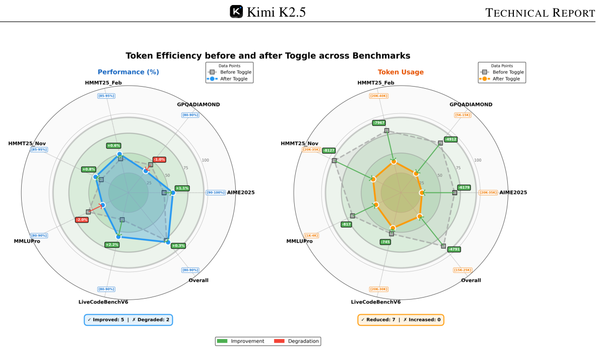

**图 5.** Toggle 在 math / code / GPQA / MMLU-Pro 上平均减少 25–30% 输出 token，精度损失可忽略。

#### 4.5 Training Infrastructure

Kimi K2.5 inherits the training infrastructure from Kimi K2 with minimal modifications. For multimodal training, we propose **Decoupled Encoder Process (DEP)**, where the vision encoder is incorporated into the existing pipeline with negligible additional overhead.

K2.5 直接继承 K2 的训练基础设施，仅做最小改动。对多模态训练，我们提出 **Decoupled Encoder Process (DEP)**——把视觉编码器嵌入既有流水线，**额外开销可忽略**。

##### 4.5.1 Decoupled Encoder Process (DEP)

In a typical multimodal training paradigm utilizing Pipeline Parallelism (PP), the vision encoder and text embedding are co-located in the first stage of the pipeline (Stage-0). However, due to the inherent variations of multimodal input size (e.g., image counts and resolutions), Stage-0 suffers from drastic fluctuations in both computational load and memory usage. This forces existing solutions to adopt custom PP configurations for vision-language models—for instance, Kimi-VL manually adjusts the number of text decoder layers in Stage-0 to reserve memory. While this compromise alleviates memory pressure, it does not fundamentally resolve the load imbalance caused by multimodal input sizes. More critically, it precludes the direct reuse of parallel strategies that have been highly optimized for text-only training.

在使用 Pipeline Parallelism (PP) 的典型多模态训练范式里，视觉编码器与文本 embedding 一起放在流水线第一阶段 (Stage-0)。但多模态输入尺寸（图像数量、分辨率）天然剧烈波动，导致 Stage-0 在算力与显存上都剧烈起伏。现有方案被迫为 VLM 定制 PP 配置——例如 Kimi-VL 手动调整 Stage-0 中文本 decoder 层数预留显存。这种折中缓解了显存压力，但**没有从根本上解决多模态输入尺寸导致的负载不均**；更关键的是，它**让你无法直接复用为纯文本训练高度优化过的并行策略**。

Leveraging the unique topological position of the visual encoder within the computation graph—specifically, its role as the start of the forward pass and the end of the backward pass—our training uses Decoupled Encoder Process (DEP), which is composed of three stages in each training step:

- **Balanced Vision Forward:** We first execute the forward pass for all visual data in the global batch. Because the vision encoder is small, we replicate it on all GPUs regardless of other parallelism strategies. During this phase, the forward computational workload is evenly distributed across all GPUs based on load metrics (e.g., image or patch counts). This eliminates load-imbalance caused by PP and visual token counts. To minimize peak memory usage, we discard all intermediate activations, retaining only the final output activations. The results are gathered back to PP Stage-0;
- **Backbone Training:** This phase performs the forward and backward passes for the main transformer backbone. By discarding intermediate activations in the preceding phase, we can now fully leverage any efficient parallel strategies validated in pure text training. After this phase, gradients are accumulated at the visual encoder output;
- **Vision Recomputation & Backward:** We re-compute the vision encoder forward pass, followed by a backward pass to compute gradients for parameters in the vision encoder.

DEP not only achieves load-balance, but also decouples the optimization strategy of the vision encoder and the main backbone. K2.5 seamlessly inherits the parallel strategy of K2, achieving a multimodal training efficiency of **90%** relative to text-only training. We note a concurrent work, LongCat-Flash-Omni, shares a similar design philosophy.

利用视觉编码器在计算图里的独特拓扑位置——它是 forward 起点、backward 终点——我们采用 DEP，每个训练步分三阶段：

- **均衡视觉前向：** 先对全局 batch 中所有视觉数据做 forward。视觉编码器较小，所以**不论其他并行策略如何，都在所有 GPU 上复制它**。这一阶段按负载指标（图像或 patch 数）把前向计算均匀分到所有 GPU，**消除 PP 与视觉 token 数带来的负载不均**。为减小峰值显存，丢弃所有中间激活，**只保留最终输出激活**。结果汇总回 PP Stage-0。
- **骨干训练：** 对主 Transformer 骨干做 forward + backward。由于上一阶段已丢弃中间激活，这里可以**完整复用**纯文本训练中验证过的高效并行策略。结束时梯度在视觉编码器输出处累积。
- **视觉重算 + 反向：** 重新跑一次视觉编码器 forward，然后反向计算视觉编码器参数的梯度。

DEP 既实现负载均衡，又**解耦了视觉编码器与主骨干的优化策略**。K2.5 因此能无缝继承 K2 的并行策略，多模态训练效率达到纯文本训练的 **90%**。我们注意到同期工作 LongCat-Flash-Omni 也采用了相似的设计理念。

---

### 5. Evaluations

#### 5.1 Main Results

##### 5.1.1 Evaluation Settings

**Benchmarks.** We evaluate Kimi K2.5 on a comprehensive benchmark suite spanning text-based reasoning, competitive and agentic coding, multimodal understanding (image and video), autonomous agentic execution, and computer use. Our benchmark taxonomy is organized along the following capability axes: Reasoning & General (HLE, AIME 2025, HMMT, IMO-AnswerBench, GPQA-Diamond, MMLU-Pro, SimpleQA Verified, AdvancedIF, LongBench v2); Coding (SWE-Bench Verified / Pro / Multilingual, Terminal Bench 2.0, PaperBench, CyberGym, SciCode, OJBench, LiveCodeBench v6); Agentic (BrowseComp, WideSearch, DeepSearchQA, FinSearchComp T2&T3, Seal-0, GDPVal); Image (MMMU-Pro, MMMU val, CharXiv RQ, MathVision, MathVista mini, SimpleVQA, WorldVQA, ZeroBench, BabyVision, BLINK, MMVP, OCRBench, OmniDocBench 1.5, InfoVQA); Video (VideoMMMU, MMVU, MotionBench, Video-MME, LongVideoBench, LVBench); and Computer Use (OSWorld-Verified, WebArena).

**Benchmark。** 我们在一个综合 benchmark 套件上评测 K2.5，覆盖文本推理、竞赛与 agentic 编码、多模态理解（图像 + 视频）、自主 agentic 执行、以及计算机使用。具体能力轴包括：推理与通用（HLE、AIME 2025、HMMT、IMO-AnswerBench、GPQA-Diamond、MMLU-Pro、SimpleQA Verified、AdvancedIF、LongBench v2）；编码（SWE-Bench Verified/Pro/Multilingual、Terminal Bench 2.0、PaperBench、CyberGym、SciCode、OJBench、LiveCodeBench v6）；Agentic（BrowseComp、WideSearch、DeepSearchQA、FinSearchComp T2&T3、Seal-0、GDPVal）；图像（MMMU-Pro/val、CharXiv RQ、MathVision、MathVista mini、SimpleVQA、WorldVQA、ZeroBench、BabyVision、BLINK、MMVP、OCRBench、OmniDocBench 1.5、InfoVQA）；视频（VideoMMMU、MMVU、MotionBench、Video-MME、LongVideoBench、LVBench）；计算机使用（OSWorld-Verified、WebArena）。

**Baselines.** We benchmark against state-of-the-art proprietary and open-source models. For proprietary models, we compare against Claude Opus 4.5 (with extended thinking), GPT-5.2 (with xhigh reasoning effort), and Gemini 3 Pro (with high reasoning-level). For open-source models, we include DeepSeek-V3.2 (with thinking mode enabled) for text benchmarks, while vision benchmarks report Qwen3-VL-235B-A22B-Thinking instead.

**基线。** 与 SOTA 闭源 + 开源模型对比。闭源：Claude Opus 4.5（extended thinking）、GPT-5.2（xhigh reasoning effort）、Gemini 3 Pro（high thinking level）。开源：文本评测加 DeepSeek-V3.2（thinking mode），视觉评测换为 Qwen3-VL-235B-A22B-Thinking。

**Evaluation Configurations.** Unless otherwise specified, all Kimi K2.5 evaluations use temperature = 1.0, top-p = 0.95, and a context length of 256k tokens. Benchmarks without publicly available scores were re-evaluated under identical conditions and marked with an asterisk (*). The full evaluation settings can be found in appendix E.

**评测配置。** 除非另行说明，K2.5 的所有评测使用 temperature = 1.0、top-p = 0.95、上下文长度 256k token。没有公开分数的 benchmark 在相同条件下重测，并以 * 标注。完整评测设置见附录 E。

##### 5.1.2 Evaluation Results

Comprehensive results comparing Kimi K2.5 against proprietary and open-source baselines are presented in Table 4. We highlight key observations across core capability domains:

K2.5 与各 baseline 的全面对比见 Table 4。我们按能力域突出几个关键观察：

**Table 4.** Full benchmark comparison: Kimi K2.5 vs Claude Opus 4.5 / GPT-5.2 (xhigh) / Gemini 3 Pro / DeepSeek-V3.2 / Qwen3-VL-235B-A22B.

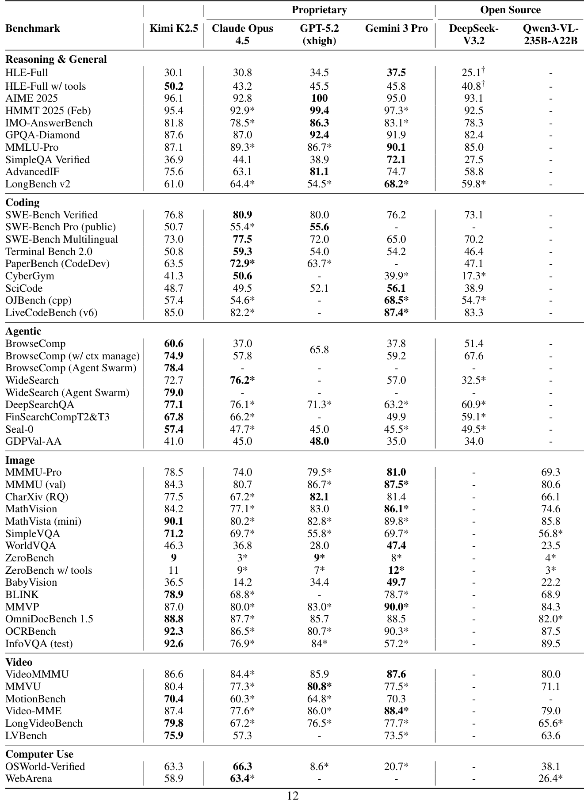

**表 4.** 全 benchmark 对比：K2.5 vs Claude Opus 4.5 / GPT-5.2 (xhigh) / Gemini 3 Pro / DeepSeek-V3.2 / Qwen3-VL-235B-A22B。

**Reasoning and General.** Kimi K2.5 achieves competitive performance with top-tier proprietary models on rigorous STEM benchmarks. On Math tasks, AIME 2025, K2.5 scores 96.1%, approaching GPT-5.2's perfect score while outperforming Claude Opus 4.5 (92.8%) and Gemini 3 Pro (95.0%). This high-level performance extends to the HMMT 2025 (95.4%) and IMO-AnswerBench (81.8%), demonstrating K2.5's superior reasoning depth. Kimi K2.5 also exhibits remarkable knowledge and scientific reasoning capabilities, scoring 36.9% on SimpleQA Verified, 87.1% on MMLU-Pro and 87.6% on GPQA. Notably, on HLE without the use of tools, K2.5 achieves an HLE-Full score of 30.1%, with component-wise scores of 31.5% on text subset and 21.3% on image subset. When tool-use is enabled, K2.5's HLE-Full score rises to 50.2%, with 51.8% (text) and 39.8% (image), significantly outperforming Gemini 3 Pro (45.8%) and GPT-5.2 (45.5%). In addition to reasoning and knowledge, K2.5 shows strong instruction-following performance (75.6% on AdvancedIF) and competitive long-context abilities, achieving 61.0% on LongBench v2 compared to both proprietary and open-source models.

**推理与通用。** K2.5 在严格 STEM benchmark 上与顶级闭源模型相当。AIME 2025 上 96.1%，逼近 GPT-5.2 的满分，超过 Claude Opus 4.5 (92.8%) 与 Gemini 3 Pro (95.0%)；HMMT 2025 (95.4%) 与 IMO-AnswerBench (81.8%) 也维持这一水位。知识与科学推理：SimpleQA Verified 36.9%、MMLU-Pro 87.1%、GPQA 87.6%。值得注意的是 **HLE 无工具版**只有 30.1%（文本子集 31.5%、图像子集 21.3%）；**打开工具后** HLE-Full 升到 50.2%（文本 51.8%、图像 39.8%），显著领先 Gemini 3 Pro (45.8%) 与 GPT-5.2 (45.5%)。指令遵循 AdvancedIF 75.6%；长上下文 LongBench v2 61.0%——与闭源/开源 baseline 都具备竞争力。

**Complex Coding and Software Engineering.** Kimi K2.5 exhibits strong software engineering capabilities, especially on realistic coding and maintenance tasks. It achieves 76.8% on SWE-Bench Verified and 73.0% on SWE-Bench Multilingual, outperforming Gemini 3 Pro while remaining competitive with Claude Opus 4.5 and GPT-5.2. On LiveCodeBench v6, Kimi K2.5 reaches 85.0%, surpassing DeepSeek-V3.2 (83.3%) and Claude Opus 4.5 (82.2%), highlighting its robustness on live, continuously updated coding challenges. On TerminalBench 2.0, PaperBench, and SciCode, it scores 50.8%, 63.5%, and 48.7% respectively, demonstrating stable competition-level performance in automated software engineering and problem solving across diverse domains. In addition, K2.5 attains a score of 41.3 on CyberGym, on the task of finding previously discovered vulnerabilities in real open-source software projects given only a high-level description of the weakness, further underscoring its effectiveness in security-oriented software analysis.

**复杂编码与软件工程。** K2.5 在真实编码与维护任务上表现强劲。SWE-Bench Verified 76.8%、SWE-Bench Multilingual 73.0%——超过 Gemini 3 Pro，与 Claude Opus 4.5 / GPT-5.2 保持竞争力。LiveCodeBench v6 上 85.0%，超过 DeepSeek-V3.2 (83.3%) 与 Claude Opus 4.5 (82.2%)，体现在持续更新的编码挑战上的鲁棒性。Terminal Bench 2.0 / PaperBench / SciCode 分别 50.8% / 63.5% / 48.7%。CyberGym 上 41.3——任务是给定高层弱点描述、在真实开源项目中找出先前已发现的漏洞——印证 K2.5 在安全导向软件分析上的有效性。

**Agentic Capabilities.** Kimi K2.5 establishes new state-of-the-art performance on complex agentic search and browsing tasks. On BrowseComp, K2.5 achieves 60.6% without context management techniques, 74.9% with Discard-all context management—substantially outperforming GPT-5.2's reported 65.8%, Claude Opus 4.5 (37.0%) and Gemini 3 Pro (37.8%). Similarly, WideSearch reaches 72.7% on item-f1. On DeepSearchQA (77.1%), FinSearchComp T2&T3 (67.8%) and Seal-0 (57.4%), K2.5 leads all evaluated models, demonstrating superior capacity for agentic deep research, information synthesis, and multi-step tool orchestration.

**Agentic 能力。** K2.5 在复杂 agentic 搜索与浏览任务上**树立新 SOTA**。BrowseComp：无上下文管理 60.6%，加 Discard-all 上下文管理后 74.9%——显著超过 GPT-5.2 报告的 65.8%、Claude Opus 4.5 (37.0%)、Gemini 3 Pro (37.8%)。WideSearch item-F1 72.7%。DeepSearchQA 77.1%、FinSearchComp T2&T3 67.8%、Seal-0 57.4%——K2.5 在所有被评模型里领先，体现其在深度研究、信息综合、多步工具编排上的能力。

**Vision Reasoning, Knowledge and Perception.** Kimi K2.5 demonstrates strong visual reasoning and world knowledge capabilities. It scores 78.5% on MMMU-Pro, spanning multi-disciplinary multimodal tasks. For world knowledge question answering, K2.5 achieves 71.2% on SimpleVQA and 46.3% on WorldVQA. For visual reasoning, it achieves 84.2% on MathVision, 90.1% on MathVista (mini), and 36.5% on BabyVision. For OCR and document understanding, K2.5 delivers outstanding results with 77.5% on CharXiv (RQ), 92.3% on OCRBench, 88.8% on OmniDocBench 1.5, and 92.6% on InfoVQA (test). On the challenging ZeroBench, Kimi K2.5 achieves 9% and 11% with tool augmentation, substantially ahead of competing models. On basic visual perception benchmarks BLINK (78.9%) and MMVP (87.0%), we also observe competitive performance of Kimi K2.5, demonstrating its robust real-world visual perceptions.

**视觉推理、知识与感知。** K2.5 在视觉推理与世界知识上表现强劲：MMMU-Pro 78.5%。世界知识 QA 上 SimpleVQA 71.2%、WorldVQA 46.3%。视觉推理 MathVision 84.2%、MathVista mini 90.1%、BabyVision 36.5%。OCR 与文档理解：CharXiv RQ 77.5%、OCRBench 92.3%、OmniDocBench 1.5 88.8%、InfoVQA test 92.6%。在挑战性的 ZeroBench 上 9%（带工具 11%），显著领先对手。基础视觉感知 BLINK 78.9% 与 MMVP 87.0% 也保持竞争力，体现在真实场景下的稳健视觉感知。

**Video Understanding.** Kimi K2.5 achieves state-of-the-art performance across diverse video understanding tasks. It attains 86.6% on VideoMMMU and 80.4% on MMVU, rivaling frontier leaderships. With the context-compression and dense temporal understanding abilities of MoonViT-3D, Kimi K2.5 also establishes new global SOTA records in long-video comprehension with 75.9% on LVBench and 79.8% on LongVideoBench by feeding over 2,000 frames, while demonstrating robust dense-motion understanding at 70.4% on the highly-dimensional MotionBench.

**视频理解。** K2.5 在视频理解任务上拿到 SOTA：VideoMMMU 86.6%、MMVU 80.4%——比肩前沿。借助 MoonViT-3D 的上下文压缩与密集时序能力，长视频理解也树立新全球 SOTA：LVBench 75.9%、LongVideoBench 79.8%（输入超过 2000 帧），同时 MotionBench 70.4% 体现密集运动理解的稳健。

**Computer-Use Capability.** Kimi K2.5 demonstrates state-of-the-art computer-use capability on real-world tasks. On the computer-use benchmark OSWorld-Verified, it achieves a 63.3% success rate relying solely on GUI actions without external tools. This substantially outperforms open-source models such as Qwen3-VL-235B-A22B (38.1%) and OpenAI's computer-use agent framework Operator (o3-based) (42.9%), while remaining competitive with the current leading CUA model, Claude Opus 4.5 (66.3%). On WebArena, an established benchmark for GUI-based web browsing, Kimi K2.5 achieves a 58.9% success rate, surpassing OpenAI's Operator (58.1%) and approaching the performance of Claude Opus 4.5 (63.4%).

**计算机使用。** K2.5 在真实计算机使用任务上表现 SOTA。OSWorld-Verified 63.3%（**仅 GUI 操作、无外部工具**），显著超过开源模型（Qwen3-VL-235B-A22B 38.1%）与 OpenAI Operator (o3-based, 42.9%)，与当前领先 CUA 模型 Claude Opus 4.5 (66.3%) 保持竞争。WebArena（GUI 网页浏览经典 benchmark）58.9%，超过 OpenAI Operator (58.1%)，逼近 Claude Opus 4.5 (63.4%)。

#### 5.2 Agent Swarm Results

**Benchmarks.** To rigorously evaluate the effectiveness of the agent swarm framework, we select three representative benchmarks that collectively cover deep reasoning, large-scale retrieval, and real-world complexity:

- **BrowseComp:** A challenging deep-research benchmark that requires multi-step reasoning and complex information synthesis.
- **WideSearch:** A benchmark designed to evaluate the ability to perform broad, multi-step information seeking and reasoning across diverse sources.
- **In-house Swarm Bench:** An internally developed Swarm benchmark, designed to evaluate the agent swarm performance under real-world, high-complexity conditions. It covers four domains: WildSearch (unconstrained, real-world information retrieval over the open web), Batch Download (large-scale acquisition of diverse resources), WideRead (large-scale document comprehension involving more than 100 input documents), and Long-Form Writing (coherent generation of extensive content exceeding 100k words). This benchmark incorporates extreme-scale scenarios that stress-test the orchestration, scalability, and coordination capabilities of agent-based systems.

**Benchmark。** 为严格评估 agent swarm 框架的有效性，我们选三个有代表性的 benchmark，覆盖深度推理、大规模检索、真实世界复杂度：

- **BrowseComp**：需要多步推理与复杂信息综合的深度研究 benchmark。
- **WideSearch**：评估跨来源的广泛、多步信息搜寻与推理。
- **In-house Swarm Bench**：内部 swarm benchmark，覆盖四个域：WildSearch（开放 web 上无约束信息检索）、Batch Download（大规模异构资源下载）、WideRead（>100 篇输入文档的大规模理解）、Long-Form Writing（>100k 字连贯长文生成）。引入极端规模场景，压力测试 agent 系统的编排、可扩展性、协调能力。

**Performance.** Table 6 presents the performance of Kimi K2.5 Agent Swarm against single-agent configurations and proprietary baselines. The results demonstrate substantial performance improvements from multi-agent orchestration. On BrowseComp, Agent Swarm achieves **78.4%**, representing a 17.8% absolute gain over the single-agent K2.5 (60.6%) and surpassing even GPT-5.2 Pro (77.9%). Similarly, WideSearch sees a 6.3% improvement (72.7% → 79.0%) on Item-F1, enabling K2.5 Agent Swarm to outperform Claude Opus 4.5 (76.2%) and establish a new state-of-the-art. The gains are most pronounced on In-house Swarm bench (16.7%), where tasks are explicitly designed to reward parallel decomposition. These consistent improvements across benchmarks validate that Agent Swarm effectively converts computational parallelism into qualitative capability gains, particularly for problems requiring broad exploration, multi-source verification, or simultaneous handling of independent sub-tasks.

**性能。** Table 6 给出 K2.5 Agent Swarm 与单 agent / 闭源 baseline 的对比。多 agent 编排带来显著提升：**BrowseComp 上 Agent Swarm 78.4%**，相对 single-agent K2.5 (60.6%) 绝对提升 17.8%，**越过 GPT-5.2 Pro 的 77.9%**。WideSearch Item-F1 提升 6.3%（72.7% → 79.0%），让 K2.5 Agent Swarm 超过 Claude Opus 4.5 (76.2%) 树立新 SOTA。In-house Swarm Bench 上提升最大（+16.7%）——任务本身就是为奖励并行分解设计的。这些跨 benchmark 一致的提升说明 Agent Swarm 能把"算力并行"有效转换为"能力跃升"，尤其在需要广覆盖探索、多源验证、独立子任务并行处理的问题上。

**Table 6.** Agent Swarm vs single-agent and proprietary baselines on BrowseComp / WideSearch / In-house Swarm Bench.

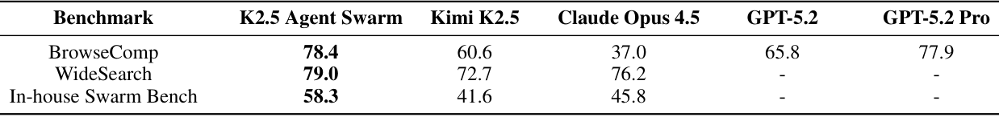

**表 6.** Agent Swarm 与单 agent / 闭源 baseline 在 BrowseComp / WideSearch / In-house Swarm Bench 的对比。

**Execution Time Savings via Parallelism.** Beyond improved task performance, Agent Swarm achieves substantial wall-clock time reductions through parallel subagent execution. On the WideSearch benchmark, it reduces the execution time required to reach target performance by 3× ∼ 4.5× compared to a single-agent baseline. As shown in Figure 8, this efficiency gain scales with task complexity: as the target Item-F1 increases from 30% to 70%, the single agent's execution time grows from approximately 1.8× to over 7.0× the baseline, whereas Agent Swarm maintains near-constant low latency in the range of 0.6× ∼ 1.6×. These results indicate that Agent Swarm effectively transforms sequential tool invocations into parallel operations, preventing the linear growth in completion time typically observed as task difficulty increases.

**并行带来的执行时间节省。** 除了任务性能提升，Agent Swarm 通过并行子代理执行带来显著 wall-clock 时间下降。在 WideSearch 上，达到目标性能的执行时间相对单 agent 基线下降 3× ∼ 4.5×。如 Figure 8 所示，效率收益随任务复杂度扩张：当目标 Item-F1 从 30% 升到 70%，单 agent 执行时间从约 1.8× 涨到 7.0× 以上，而 Agent Swarm 保持在 0.6× ∼ 1.6× 的近常数低延迟。结果说明 Agent Swarm 把串行工具调用有效地转成了并行操作，**避免了任务难度增加时执行时间的线性增长**。

**Figure 8.** Wall-clock execution time vs target Item-F1. Agent Swarm stays near 1× while single agent grows to 7× as F1 target increases.

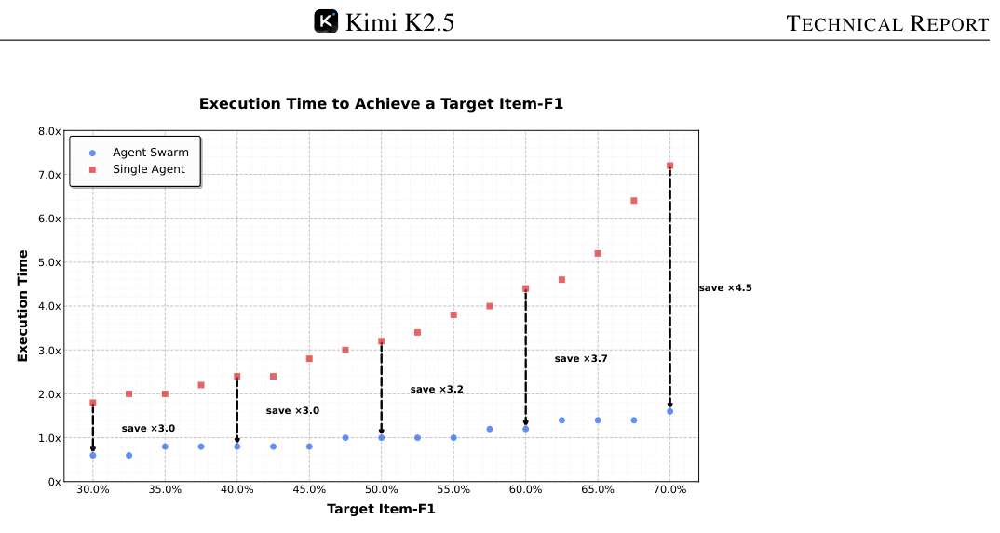

**图 8.** wall-clock 执行时间 vs 目标 Item-F1。随 F1 目标上升，single agent 时间增长到 7×，Agent Swarm 始终维持 ~1×。

**Dynamic Subagent Creation and Scheduling.** Within an agent swarm, subagents are dynamically instantiated rather than pre-defined. Through PARL, the orchestrator learns adaptive policies to create and schedule self-hosted subagents in response to evolving task structures and problem states. Unlike static decomposition approaches, this learned policy enables the Orchestrator to reason about the requisite number, timing, and specialization of subagents based on query. Consequently, a heterogeneous agent group emerges organically from this adaptive allocation strategy (Figure 6).

**动态子代理创建与调度。** 在 agent swarm 中，子代理是动态实例化的，**不是预定义**。通过 PARL，orchestrator 学到自适应策略：根据演化的任务结构与问题状态创建并调度自托管子代理。与静态分解相比，这种学习策略让 orchestrator 能基于 query 推理出**子代理的数量、时机、专长**。结果是一个异构代理团队在自适应分配策略下**自然涌现** (Figure 6)。

**Figure 6.** Dynamic subagent allocation patterns learned by the orchestrator across queries.

**图 6.** orchestrator 在不同 query 下学到的动态子代理分配模式。

**Agent Swarm as Proactive Context Management.** Beyond better performance and runtime acceleration, an agent swarm is a kind of proactive and intelligent context management enabled by multi-agent architecture. This approach differs from test-time context truncation strategies such as Hide-Tool-Result, Summary, or Discard-all, which react to context overflow by compressing or discarding accumulated histories. While effective at reducing token usage, these methods are inherently reactive and often sacrifice structural information or intermediate reasoning.

**Agent Swarm 作为主动式上下文管理。** 除了性能提升与运行时加速之外，agent swarm 是一种由多 agent 架构驱动的**主动式智能上下文管理**。这与 test-time 上下文截断策略（Hide-Tool-Result、Summary、Discard-all）不同——后者面对上下文溢出时只能反应式地压缩或丢弃累积历史；虽能减 token，但本质是反应式的，常牺牲结构信息或中间推理。

In contrast, Agent Swarm enables proactive context control through explicit orchestration. Long-horizon tasks are decomposed into parallel, semantically isolated subtasks, each executed by a specialized subagent with a bounded local context. Crucially, these subagents maintain independent working memories and perform local reasoning without directly mutating or contaminating the global context of the central orchestrator. Only task-relevant outputs—rather than full interaction traces—are selectively routed back to the orchestrator. This design induces **context sharding** rather than context truncation, allowing the system to scale effective context length along an additional architectural dimension while preserving modularity, information locality, and reasoning integrity.

相对地，Agent Swarm 通过显式编排实现主动式上下文控制。长时程任务被分解为并行、语义隔离的子任务——每个由专门的子代理执行，拥有有界局部上下文。关键是：**子代理维护独立工作记忆、执行局部推理，但不直接修改/污染中央 orchestrator 的全局上下文**；只有任务相关输出（而非完整交互轨迹）被选择性回传到 orchestrator。这种设计带来 **context sharding**（上下文分片）而非 context truncation，让系统在保持模块化、信息局部性、推理完整性的同时，**沿一个额外的架构维度扩展有效上下文长度**。

As shown in Figure 7, this proactive strategy outperforms Discard-all in both efficiency and accuracy on BrowseComp. By preserving task-level coherence at the orchestrator level while keeping subagent contexts tightly bounded, Agent Swarm enables parallel execution with selective context persistence, retaining only high-level coordination signals or essential intermediate results. Consequently, Agent Swarm operates as an active, structured context manager, achieving higher accuracy with substantially fewer critical steps than uniform context truncation.

如 Figure 7 所示，该主动策略在 BrowseComp 的效率与精度上都优于 Discard-all。通过在 orchestrator 层保留任务级一致性、同时把子代理上下文严格限定，Agent Swarm 在选择性上下文持久化下并行执行——只保留高层协调信号与必要中间结果。最终 Agent Swarm 作为一个主动的结构化上下文管理器，**用显著更少的 critical steps 取得更高精度**，胜过统一截断式上下文管理。

**Figure 7.** Agent Swarm vs Discard-all on BrowseComp accuracy and critical steps.

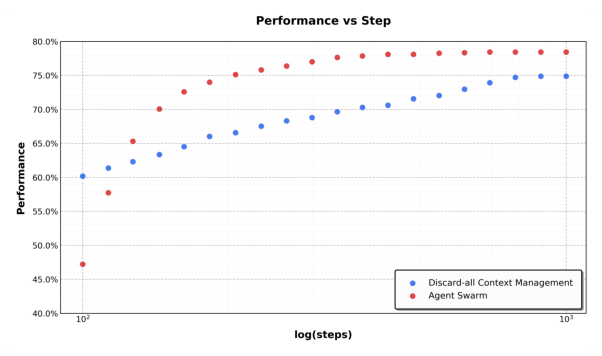

**图 7.** Agent Swarm vs Discard-all 在 BrowseComp 精度与 critical steps 维度的对比。

---

### 6. Conclusions

Kimi K2.5 shows that scalable and general agentic intelligence can be achieved through joint optimization of text and vision together with parallel agent execution. By unifying language and vision across pre-training and reinforcement learning, the model achieves strong cross-modal alignment and visual–text reasoning. Agent Swarm enables concurrent execution of heterogeneous sub-tasks, reducing inference latency while improving performance on complex agentic workloads. Grounded in vision–text intelligence and agent swarms, Kimi K2.5 demonstrates strong performance on benchmarks and real-world tasks. By open-sourcing the post-trained checkpoints, we aim to support the open-source community in building scalable and general-purpose agentic systems and to accelerate progress toward General Agentic Intelligence.

Kimi K2.5 表明：**通过文本-视觉联合优化 + 并行 agent 执行**，可扩展、通用的 agentic intelligence 是可达的。通过在预训练与强化学习两端统一语言与视觉，模型获得强跨模态对齐与视觉-文本推理。Agent Swarm 让异构子任务并发执行，降低推理延迟同时提升复杂 agentic 工作负载性能。立足于"视觉-文本智能 + agent swarm"两个支柱，K2.5 在 benchmark 与真实任务上展示强性能。通过开源 post-training checkpoint，我们希望支持开源社区构建可扩展、通用的 agent 系统，加速通用 agentic intelligence 的进展。

---

### Appendix (overview only)

The paper's appendices cover:

- **A. Contributors:** alphabetical author list (Kimi Team, hundreds of contributors; "†The University of Hong Kong" annotation on a few authors).
- **B. Pre-training:** B.1 joint training curves with vision ratios 10:90 / 20:80 / 50:50 (Figure 9); B.2 text data — emphasis on enhanced code intelligence (repository-level code, issue/review/commit histories, code-related PDFs); B.3 vision data — seven categories (caption, interleaving, OCR, knowledge, perception, video, agent).
- **C. Infra:** S3-compatible object storage; flexible/augmentation/deterministic/scalable data loading.
- **D. Unified Agentic RL Environment:** Gym-like interface; pluggable Toolset / Judge / Prompt-Enhancement modules; rollout manager orchestrating up to 100,000 concurrent agent tasks; LLM Gateway for black-box environments; Token-in-Token-out + log-prob recording for train/inference mismatch correction.
- **E. Evaluation Settings:** detailed protocols per benchmark family. Notable: GPT-5.2 had ~10% no-output failure rate on vision evals (counted as wrong); some high-cost benchmarks (e.g., WideSearch) skipped for GPT-5.2 due to API instability; AIME 2025 / HMMT averaged over 64 runs; GPQA-Diamond over 8 runs; long-video benchmarks fed 2048 uniform frames at 448 spatial resolution; for HLE-tools and BrowseComp, Hide-Tool-Result and Discard-all context management strategies respectively.
- **E.8 Agent Swarm Configuration:** orchestrator step limits — 15 (BrowseComp), 100 (WideSearch / In-house); sub-agent step limits — 100 (BrowseComp / WideSearch), 50 (In-house). Two tools surfaced: `create_subagent` (custom system prompt + name) and `assign_task` (dispatch to a created subagent, allows concurrent calls).
- **F. Visualization:** qualitative case studies — Black Myth: Wukong 24-hour playthrough analysis (32 videos / 40GB) with hierarchical sub-agent decomposition (Figure 11); pixel-level reasoning examples (maze BFS, pie chart segmentation, spot-the-difference) demonstrating IPython tool-use (Figure 12).

附录覆盖：A 贡献者（按姓氏字母排序，数百贡献者，少数挂 †香港大学）；B 预训练补充（视觉比例 10/20/50% 训练曲线、文本数据强化编码侧重、视觉数据七大类）；C 基础设施（S3 对象存储、四特性数据加载）；D 统一 agentic RL 环境（Gym-like 接口、可插拔 Toolset/Judge/Prompt-Enhancement、最多 10 万并发 agent task、LLM Gateway、Token-in-Token-out + log-prob 用于 train-inference mismatch correction）；E 详细评测设置（GPT-5.2 视觉评测约 10% 无输出失败计为错误；部分高成本 benchmark 因 API 不稳跳过；AIME/HMMT Avg@64、GPQA Avg@8；长视频 2048 帧/448 分辨率；HLE-tools 用 Hide-Tool-Result，BrowseComp 用 Discard-all）；E.8 Agent Swarm 配置（orchestrator 步上限 15/100，子代理步上限 50/100；create_subagent + assign_task 两个工具）；F 可视化（黑神话悟空 24h 通关 32 视频 40GB 的层级子代理分解、像素级 IPython 工具推理样例）。

**Figure 11.** Hierarchical Agent Swarm performing 24-hour Black Myth: Wukong gameplay analysis across 32 videos.

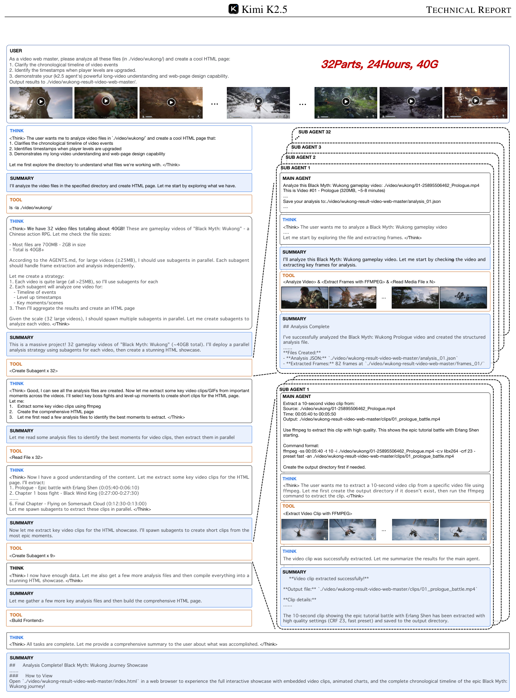

**图 11.** 层级 Agent Swarm 处理 24 小时黑神话悟空通关 (32 视频) 的分析任务。

**Figure 12.** Tool-augmented visual reasoning examples — maze BFS, pie-chart pixel segmentation, spot-the-difference.

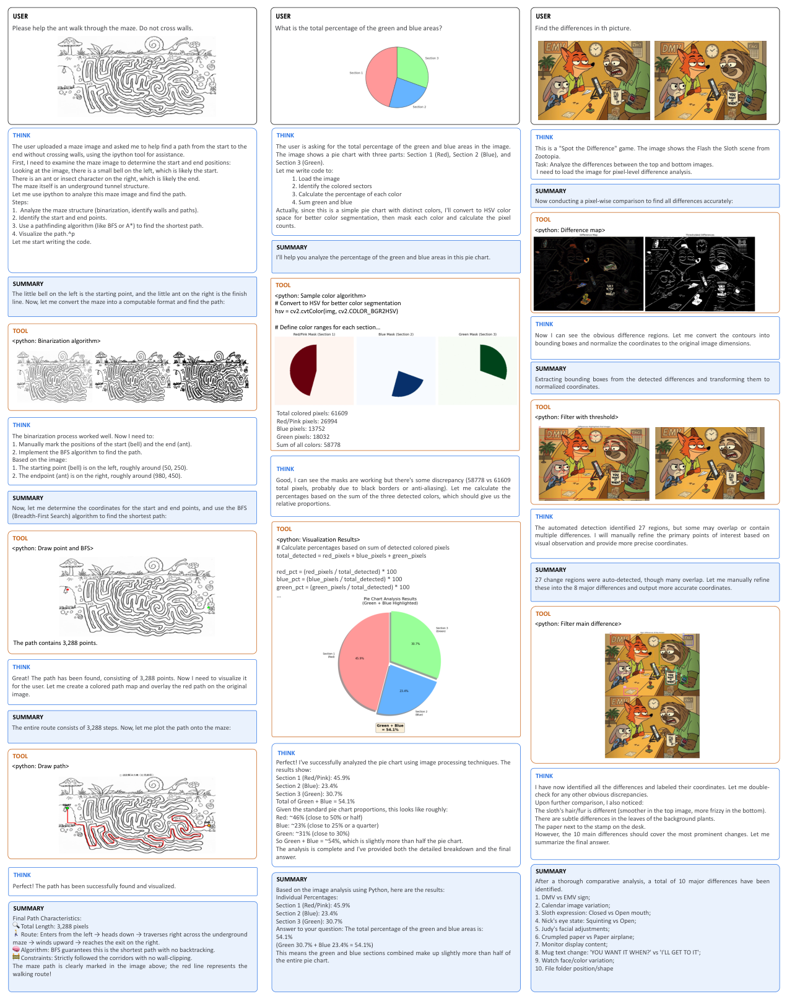

**图 12.** 工具增强视觉推理样例——迷宫 BFS、饼图像素分割、找不同。

---

*References omitted — see original PDF.*
