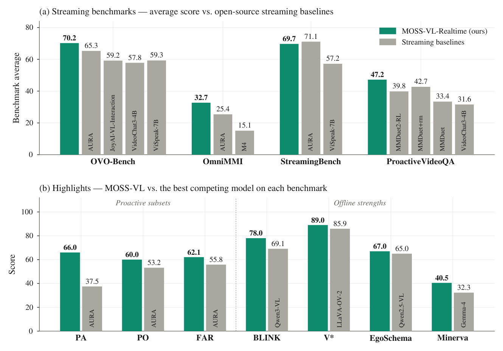
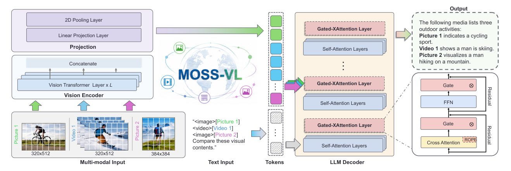
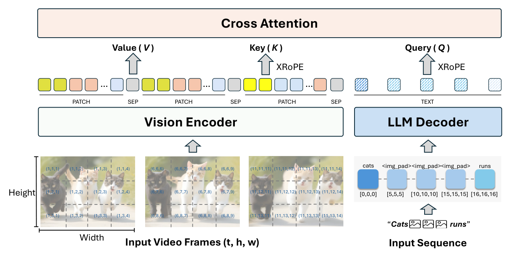
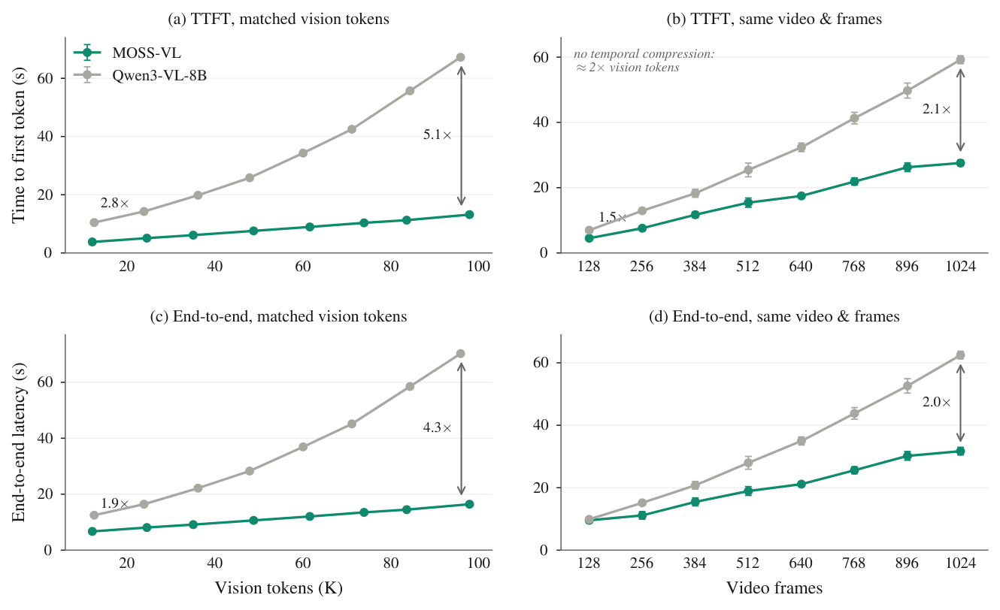
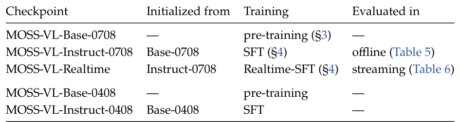
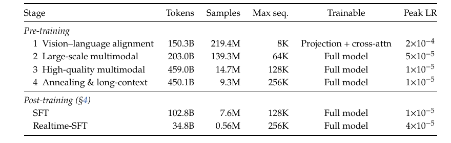
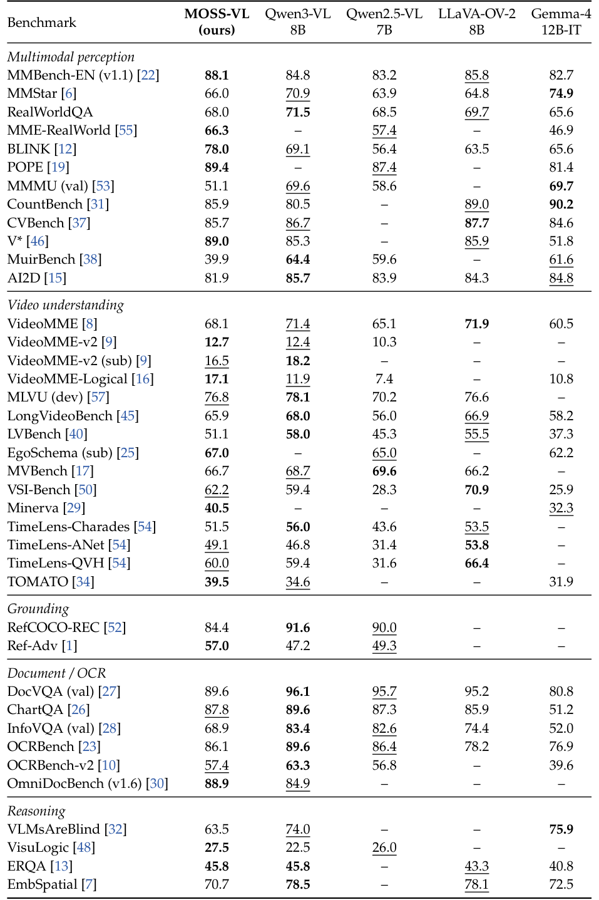
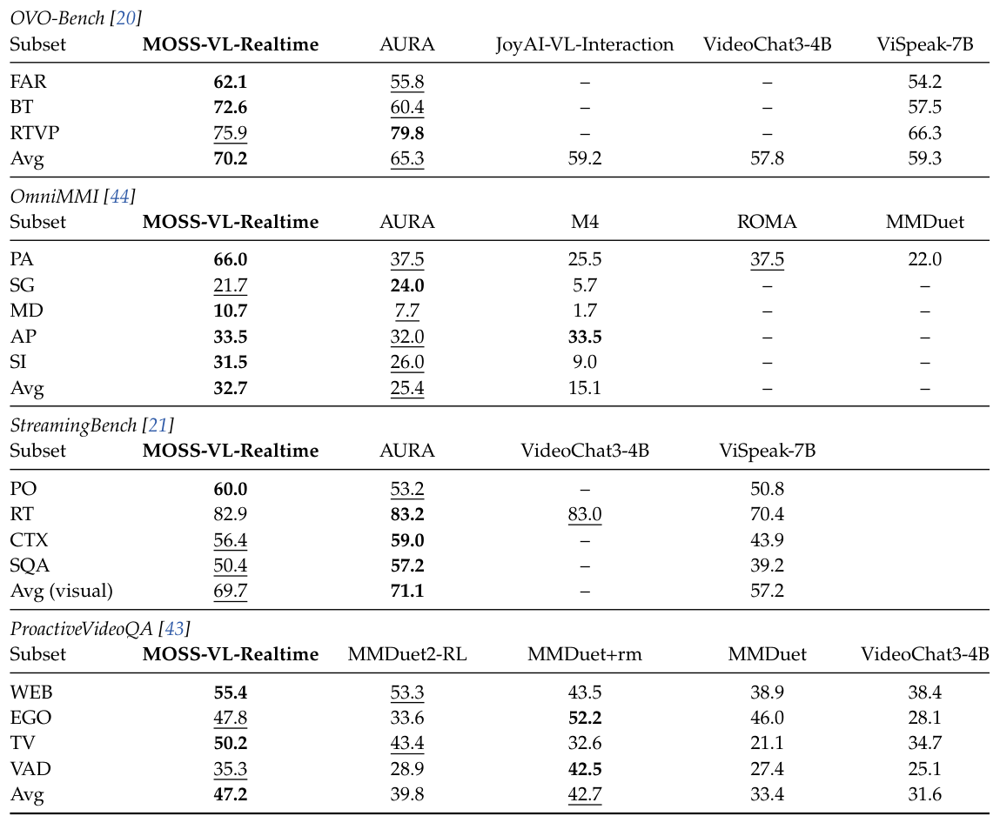
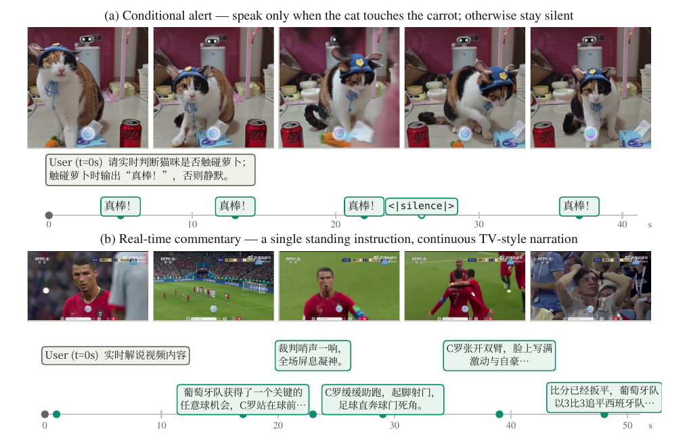
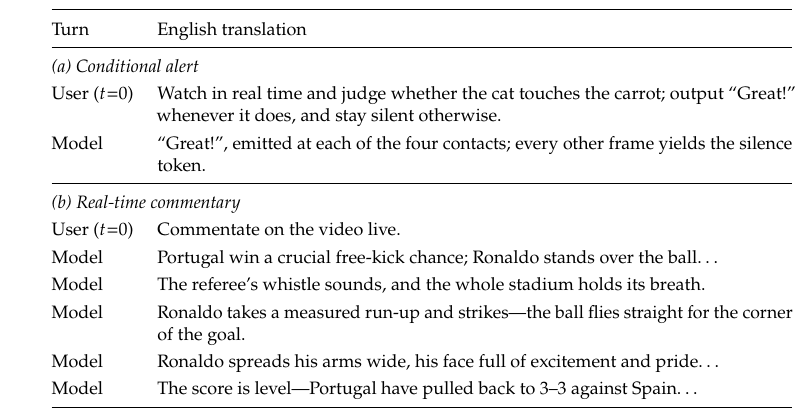

# MOSS-VL-2608

> Auto-extracted preview. 22 pages, 2-column, 10 figures.

Most open vision–language models understand video offline: given a finished clip, they read it end to end
and then answer questions about it [3, 4, 14]. The settings where video understanding matters most do
not wait for the clip to end. A live assistant watches a scene that is still unfolding, decides for itself when
something is worth saying, and must keep watching while it says it. Table 1 organizes this capability space
into five levels. L1 is the offline regime. L2–L4 form the streaming regime occupied by recent streaming
models [11, 24, 41, 47]: input arrives continuously, deliberate silence and persistent queries come into play, yet
the model stays blind for the duration of each reply. L5 adds the ability that separates real-time interaction
from everything below: perceiving while generating, so a reply can be revised or cut short the moment the
evidence changes.

MOSS-VL is an open vision–language model family that treats real-time interaction as a first-class capability,
and it reaches that capability by co-design rather than through any single component. The architecture
enables the behavior: the language decoder attends to vision only through gated cross-attention, so visual
tokens never enter the decoded sequence, and an arriving frame merely appends to the cross-attention
cache—the model naturally keeps perceiving while it generates (§2). XRoPE orders text and vision along one
shared timeline, and absolute timestamp tokens make wall-clock time explicit. The data injects the behavior:

### OpenMOSS Team∗

# arXiv:2608.15045v1  [cs.CV]  15 Aug 2026

Project: https://openmoss.ai/MOSS-VL/
Code: https://github.com/OpenMOSS/MOSS-VL
Models: https://huggingface.co/OpenMOSS-Team
Contact: pywang24@m.fudan.edu.cn, xpqiu@fudan.edu.cn

1
Introduction

∗Full contributors are listed in the Contributors section.

# MOSS-VL Technical Report

## Abstract

We present MOSS-VL, an open vision–language model family that treats real-time interaction—
perceiving while it speaks—as a first-class capability. It is co-designed across the stack: the language
decoder attends to vision only through gated cross-attention, so the model can naturally see incoming
frames while generating; a synthesized interaction corpus supervises when to speak, when to stay
silent, and when to revise; and a staged curriculum concentrates all real-time-specific training in
one light final stage over a strong offline foundation. Offline, MOSS-VL-Instruct is competitive
at comparable scale and leads temporal-reasoning video sets. Across four streaming benchmarks,
MOSS-VL-Realtime posts the best average on three (second on the fourth) among open-source
streaming models, sweeping the three subsets that squarely test proactive behavior—66.0 vs. 37.5
for the best baseline on OmniMMI Proactive Alerting. With 11.3B parameters but visual tokens
outside the decoded sequence, MOSS-VL widens its time-to-first-token advantage over same-backbone
Qwen3-VL-8B from 2.8× to 5.1× as visual context grows. We release all five checkpoints, the training
curriculum, and the real-time inference code at https://github.com/OpenMOSS/MOSS-VL.

a synthesized corpus of real-time interaction supervises when to speak, when to stay silent, and how to revise
a reply the scene has overturned (§4). The training strategy keeps the stack stable: a four-stage pre-training
curriculum and standard supervised fine-tuning build the offline foundation (§3), every real-time-specific
choice is concentrated in Realtime-SFT, one light final stage, and a single system prompt moves the same
weights among offline, streaming, and real-time operation. MOSS-VL continues a line that began with
MOSS-Video-Preview [39], which explored the real-time paradigm; this release redesigns the stack from
scratch and gives the line its first quantitative streaming evaluation.

Figure 1 previews the outcome. Offline, MOSS-VL-Instruct is competitive with open models of comparable
scale and leads the temporal-reasoning video sets Minerva, TOMATO, and VideoMME-Logical (§6.1). In the
streaming regime, the wins land precisely where timing is being tested: across four streaming benchmarks
against open-source streaming baselines, MOSS-VL-Realtime posts the best average on three of the four (and
is second on the fourth), sweeping the three subsets that squarely test proactive behavior—66.0 vs. 37.5 on
OmniMMI’s Proactive Alerting (§6.2). Efficiency follows from the same design: against Qwen3-VL-8B, built
on the same Qwen3-8B language backbone, the time-to-first-token gap widens from 2.8× to 5.1× as visual
context grows (§6.3). L5 behavior itself is demonstrated qualitatively, through live demos and the released
real-time inference code (§6.4); quantitative validation covers L2–L4, where public benchmarks exist.

(a) Streaming benchmarks — average score vs. open-source streaming baselines

80

#### 70.2

65.3

59.2
57.8
59.3

Benchmark average

60

40

#### 32.7

JoyAI-VL-Interaction

25.4

VideoChat3-4B

ViSpeak-7B

15.1

AURA

AURA

M4

OVO-Bench
OmniMMI
StreamingBench
ProactiveVideoQA
0

(b) Highlights — MOSS-VL vs. the best competing model on each benchmark

Proactive subsets
Offline strengths

100

80

#### 66.0

#### 62.1

#### 60.0

60

55.8

Score

53.2

37.5

40

AURA

AURA

AURA

PA
PO
FAR
BLINK
V*
EgoSchema
Minerva
0

MOSS-VL-Realtime (ours)
Streaming baselines

69.7
71.1

57.2

#### 47.2

39.8
42.7

33.4
31.6

VideoChat3-4B

MMDuet2-RL

MMDuet+rm

ViSpeak-7B

MMDuet

AURA

89.0
85.9

#### 78.0

69.1

67.0
65.0

#### 40.5

32.3

LLaVA-OV-2

Qwen2.5-VL

Qwen3-VL

Gemma-4

_Table 1 Levels of video understanding, from offline to real-time. Each level lights up one additional capability axis;
the dividing line between the streaming regime (L2–L4) and real-time (L5) is whether the model keeps perceiving while
it generates—L2–L4 models are blind during a reply, an L5 model is not. MOSS-VL-Realtime achieves L5 behavior,
demonstrated through live demos and the released real-time inference code, and is quantitatively validated at levels
L2–L4 on four streaming benchmarks; a dedicated benchmark for L5 behavior remains an open problem._

- • A stack co-designed for real-time interaction. The architecture enables it—gated cross-attention with
- XRoPE and absolute timestamps lets the model take in new frames naturally while it generates; the
- data injects it—synthesized streams supervise response timing; the training strategy keeps it stable—the
- language backbone stays intact behind zero-initialized gates.

- • Realtime-SFT, an interaction paradigm in one light stage. Two added state tokens, one shared system
- prompt, and a reweighted next-token loss—under 3% of total training tokens—teach when to speak, when
- to stay silent, and when to revise, delivering the best average on three of four streaming benchmarks and
- the proactive sweep above.

- • Timing understanding shows up offline as well. MOSS-VL-Instruct, trained without the real-time corpus,
- leads the temporal-reasoning video sets in our comparison—Minerva, TOMATO, VideoMME-Logical—
- echoing the perception and temporal-understanding foundations laid during pre-training.

- • More parameters, faster serving. MOSS-VL spends 11.3B parameters, yet visual tokens stay outside the
- decoded sequence, so serving latency grows more slowly with visual context than its same-backbone
- interleaved counterpart—measured in SGLang, not estimated. We release the complete training curriculum
- and all five checkpoints.

MOSS-VL pairs a native-resolution vision encoder with a language decoder initialized from Qwen3-8B [49],
and the two interact only through gated cross-attention (Figure 2). Visual tokens never enter the decoded

L1
offline
Watches the full video first, then an-
swers questions about it (multi-turn al-
lowed).

L2
streaming
Video arrives continuously; the user
may ask at any moment and the model
answers immediately—but it is blind
while replying.

L3
streaming
Adds waiting: if the answer is not yet de-
terminable, the model stays silent until
the key evidence appears, then answers.

L4
streaming
Adds persistent queries: one question
stays resident and the model re-answers
as the scene evolves (still blind during
each individual reply).

L5
real-time
Adds perception during generation: the
model keeps watching while it speaks,
revising or interrupting its own reply
the moment the evidence changes.

### In summary, our main contributions are:

2
Architecture

Capability axes

Level
Regime
Defining behavior
Stream.
input
Silence
Multi-
resp.
Perceive
while gen.

✗
–
✗
✗

✓
✗
✗
✗

✓
✓
✗
✗

✓
✓
✓
✗

✓
✓
✓
✓

sequence: each frame contributes a few timestamp tokens and one placeholder token to the text stream, while
its patch tokens are consumed as cross-attention keys and values. Table 2 lists the configuration.

The vision encoder is a 27-layer transformer initialized from the Qwen3-VL vision encoder [4]; it processes
images and frames at native resolution, from 4,096 to 16.8M pixels, drawing features from three intermediate
layers and the final layer. The projection module merges each 2 × 2 patch group and maps it into the decoder’s
hidden space. The decoder stacks 48 layers: 36 self-attention layers carried over from Qwen3-8B, and 12
gated cross-attention layers, one at every fourth position. Of the 11.3B total parameters, roughly 8.2B form
the language backbone, 2.3B the cross-attention stack, and 0.8B the vision encoder and projection module.

Each cross-attention layer follows the gated design of Flamingo [2]—queries come from the text hidden
states, keys and values from the visual tokens—implemented here with grouped-query attention (32 query
/ 8 key–value heads) and QK-RMSNorm. The layer wraps its attention and feed-forward paths in tanh
gates whose scalars are zero-initialized, so training starts from an intact language backbone (§3). The 36
self-attention layers never see visual tokens.

To our knowledge, XRoPE (cross-attention rotary position embedding) is the first position encoding introduced
for the cross-attention channel of a vision–language architecture: it gives the visual stream position information
that this channel otherwise lacks. XRoPE places text tokens and visual patches in one three-axis coordinate
space (𝑡, ℎ, 𝑤), ordered by their logical position in the stream (Figure 3). A text token advances all three axes
together, taking coordinate (𝑥, 𝑥, 𝑥). A frame whose merged patch grid is ℎ′ × 𝑤′ anchors at the coordinate 𝑡
following the preceding text, and its patches tile so height and width offsets ride on the shared temporal anchor. The separator token that closes the frame on the
vision side and the frame’s placeholder token in the text stream both take (𝑥, 𝑥, 𝑥) with 𝑥= max(𝑡+ ℎ′, 𝑡+ 𝑤′),
and the next text token continues from 𝑥+ 1: the two channels advance along a single timeline. The 64

2D Pooling Layer

Linear Projection Layer

#### Projection

Concatenate

Vision Transformer  Layer x L

#### Vision Encoder

“<image>[Picture 1] 
<video>[Video 1]
<image>[Picture 2]
Compare these visual 
contents.”

Picture 2

Picture 1

Video 1

320x512

320x512

384x384

Multi-modal Input
Text Input
LLM Decoder
Tokens

2.1
Components and Parameter Accounting

2.2
Gated Cross-Attention

2.3
XRoPE

#### Output

The following media lists three 
outdoor activities:
Picture 1 indicates a cycling 
sport.
Video 1 shows a man is skiing.
Picture 2 visualizes a man 
hiking on a mountain.

#### Gated-XAttention Layer

Self-Attention Layers

### …

#### Gated-XAttention Layer

Gate
⊗

…

Residual
Residual

FFN

Self-Attention Layers

⊗

Gate

#### Gated-XAttention Layer

…

Cross Attention
ROPE

Self-Attention Layers p𝑎,𝑏= (𝑡, 𝑡+ 𝑎, 𝑡+ 𝑏),
0 ≤𝑎< ℎ′, 0 ≤𝑏< 𝑤′,
(1)

rotary frequency pairs are split (24, 20, 20) across (𝑡, ℎ, 𝑤), and rotations are applied to text-side queries and
vision-side keys before they meet in cross-attention. The 𝑡axis is a relative sequence coordinate, not wall-clock
time; real timing enters through the timestamp tokens of §2.4.

Positions alone say nothing about wall-clock time, and frame rates vary: MOSS-VL samples video at
1–16 fps, motion-adaptive (Table 2). Each frame is therefore preceded in the text stream by an absolute
timestamp, <|time_start|>X.X seconds<|time_end|>, so the model reads real time from tokens rather
than inferring it from positions, and timing stays explicit under any sampling rate.

When a new frame arrives, only that frame is encoded; its keys and values are appended to the cross-attention
cache, and earlier frames are neither re-encoded nor their keys and values recomputed. The decoded sequence
grows by the frame’s timestamp tokens and a single placeholder token—patch tokens stay on the vision
side—so an arriving stream leaves the decoding state intact, and the next generated token already attends to
the updated cache through the gated layers. §6 quantifies the efficiency this yields at inference time (Figure 4).

We release five checkpoints of one architecture (Table 3). The 0708 run—MOSS-VL-Base, MOSS-VL-Instruct,
MOSS-VL-Realtime—is the subject of this report; the 0408 pair is an earlier, independently trained run of the
same architecture, released for research continuity.

…
…

…

PATCH
SEP
PATCH

## Vision Encoder

(1,1,1)
(1,1,2)
(1,1,3)
(1,1,4)

(6,6,6)
(6,6,7)
(6,6,8)
(6,6,9)

Height

(1,2,1)
(1,2,2)
(1,2,3)
(1,2,4)

(6,7,6)
(6,7,7)
(6,7,8)
(6,7,9)

(1,3,1)
(1,3,2)
(1,3,3)
(1,3,4)

(6,8,6)
(6,8,7)
(6,8,8)
(6,8,9)

Width

2.4
Absolute Timestamps

2.5
Real-Time by Construction

2.6
Released Models

## Cross Attention

Query ( Q )
Value ( V )
Key ( K )

XRoPE
XRoPE

SEP
PATCH

TEXT

SEP

## LLM Decoder

cats
runs
<img_pad><img_pad><img_pad>

(11,11,11) (11,11,12) (11,11,13) (11,11,14)

(11,12,11)
(11,12,12) (11,12,13) (11,12,14)

[0,0,0]
[5,5,5]
[10,10,10]

[15,15,15] [16,16,16]

(11,13,11)
(11,13,12) (11,13,13) (11,13,14)

“Cats                         runs”

Input Video Frames (t, h, w)
Input Sequence

_Table 2 MOSS-VL configuration, identical across all released checkpoints. Video-input ranges reflect the native training
setup; the released processor defaults to 1 fps and 256 frames, and our evaluations keep 1 fps with the cap raised to 768
frames (§6)._

MOSS-VL is pre-trained with a four-stage curriculum: vision–language alignment, large-scale multimodal
pre-training, high-quality multimodal pre-training, and a final stage of annealing and long-context training.
Table 4 lists the token budget, sample count, maximum sequence length, trainable modules, and peak learning
rate of every stage, including the two post-training stages of §4. The table shows the shape of the curriculum:
the maximum sequence length grows from 8K to 256K tokens, and the token budget shifts toward the later
stages while sample counts fall by orders of magnitude—many short samples early, far fewer but much longer
and denser ones late. Throughout, the data is decontaminated against our evaluation suites.

A defining trait of this training run is the scale of our data synthesis. Alongside data collected and reorganized
from existing corpora, we synthesize high-quality caption, OCR, grounding, and temporal-grounding
data at large scale throughout the curriculum. These four types cover the perceptual fundamentals of a
vision–language model—describing scenes, reading embedded text, localizing objects, and anchoring events
in time—and this synthesized core underpins the strong perception and temporal-understanding foundations
of the released models.

Stage 1 connects the two pre-trained components. Only the newly introduced parameters—the projection
module and the cross-attention layers—are updated, while the vision encoder and the language model remain
frozen; the high peak learning rate in Table 4 applies to these fresh modules alone. The data comprises two
categories, image captioning and OCR, and sequences stay short at 8K tokens.

Language decoder (initialized from Qwen3-8B)

Layers
48 = 36 self-attention + 12 gated cross-attention
Cross-attention placement
every 4th layer (indices 2, 6, . . . , 46)
Hidden size / FFN size
4096 / 12288
Attention heads
32 query / 8 key–value (GQA), head dim. 128
Position encoding
XRoPE: interleaved 3-axis RoPE (𝑡, ℎ, 𝑤),
sections (24, 20, 20), base 5 × 106

Context window
262,144 tokens
Vocabulary
151,936

Vision encoder (initialized from Qwen3-VL)

Layers
27
Hidden size / FFN size
1152 / 4304
Attention heads
16
Patch size
16 × 16 spatial, 1 frame temporal
Feature levels
layers {8, 16, 24} + final layer
Projection
2 × 2 spatial merge + MLP →4096
Input resolution
native dynamic, 4096–16.8M pixels

Video input

Frame sampling
dynamic 1–16 fps, motion-adaptive (1–2 fps typical)
Frames per video
up to 2,048 in training; 768 in our evaluations (released default 256)

Total parameters
11.3B (BF16)

3
Pre-Training

3.1
Stage 1: Vision–Language Alignment

With the connectors aligned, Stage 2 unfreezes the full model and supplies breadth. The mixture spans
image and video captioning, OCR, grounding, interleaved image–text documents, and text-only pre-training
corpora, together with multimodal understanding data over single images, multi-image sets, videos, and
plain text across diverse domains, and reasoning data. The context window extends to 64K tokens, which
admits long interleaved documents and video.

Stage 3 spends the largest token budget of the curriculum (Table 4) on its highest-quality data. The mixture
keeps the Stage-2 categories but rebalances them: captioning recedes, multimodal understanding and
reasoning data take a larger share, and mathematics, knowledge-intensive data, and temporal grounding
enter the mixture. Sequences extend to 128K tokens.

The final stage combines long-context training with high-quality annealing. One data strand consists of
long-video captioning, long-video QA, and long-video temporal grounding, together with long-document
and long-text data, mixed with a small share of the regular categories, and stretches sequences to 256K
tokens. The other is an annealing mixture that re-weights toward mathematics, knowledge-intensive data,
and instruction-tuning and QA data, and includes identity data. The curriculum yields MOSS-VL-Base, the
starting point for post-training (§4).

Checkpoint
Initialized from
Training
Evaluated in

MOSS-VL-Base-0708
—
pre-training (§3)
—
MOSS-VL-Instruct-0708
Base-0708
SFT (§4)
offline (Table 5)
MOSS-VL-Realtime
Instruct-0708
Realtime-SFT (§4)
streaming (Table 6)

MOSS-VL-Base-0408
—
pre-training
—
MOSS-VL-Instruct-0408
Base-0408
SFT
—

Stage
Tokens
Samples
Max seq.
Trainable
Peak LR

Pre-training
1 Vision–language alignment
150.3B
219.4M
8K
Projection + cross-attn
2×10−4

Post-training (§4)
SFT
102.8B
7.6M
128K
Full model
1×10−5

3.2
Stage 2: Large-Scale Multimodal Pre-Training

3.3
Stage 3: High-Quality Multimodal Pre-Training

3.4
Stage 4: Annealing and Long-Context Training

2 Large-scale multimodal
203.0B
139.3M
64K
Full model
5×10−5

3 High-quality multimodal
459.0B
14.7M
128K
Full model
1×10−5

4 Annealing & long-context
450.1B
9.3M
256K
Full model
1×10−5

Realtime-SFT
34.8B
0.56M
256K
Full model
4×10−5

Post-training proceeds in two supervised stages (Table 4); neither uses reinforcement learning or a thinking
mode. Standard supervised fine-tuning (SFT) turns MOSS-VL-Base into MOSS-VL-Instruct, an offline
instruction follower. Realtime-SFT then continues from MOSS-VL-Instruct (Table 3) and installs the real-time
interaction paradigm: deciding at every frame whether to speak, staying silent while nothing needs saying,
and revising an answer when the scene overturns it. Every real-time-specific design choice in MOSS-VL lives
in this final stage, which accounts for under 3% of the total training tokens.

We fine-tune MOSS-VL-Base on 7.6M instruction samples (102.8B tokens) with the standard next-token
cross-entropy loss over assistant responses, with sequences up to 128K tokens (Table 4). The samples
combine data collected and reorganized from existing corpora with data synthesized in house, and all
of it passes filtering, deduplication, decontamination against our evaluation suites, and quality screening
before entering the mixture. The mixture covers general question answering over single images, multi-image
sets, videos, and plain text; perception-centric tasks including OCR, document understanding, and spatial
and temporal grounding; image and video captioning; and reasoning-centric tasks spanning multimodal
reasoning, mathematics and other academic disciplines, code, and knowledge-intensive QA, together with
identity data.

Realtime-SFT teaches the model to treat incoming video as a stream of decisions rather than a finished artifact.
Training samples interleave text with frames in arrival order: every frame is followed by a decision slot,
and each slot takes one of three forms—<|silence|> (keep watching), <|response|> followed by text
(speak now), or a reply that ends with <|silence|> (finish speaking). A reply is spread over consecutive
slots frame by frame, emulating rate-limited real-time output, and a single user turn may contain several
separate emissions. Supporting this costs exactly two new vocabulary entries—the two state tokens, initialized
from the embeddings of semantically related existing tokens. The speak-or-wait decision itself is ordinary
next-token prediction: whenever the most probable next token is <|silence|>, the model waits for the next
frame; otherwise it decodes a reply. No dedicated decision head is attached.

Data characteristics.
What sets the Realtime-SFT corpus (0.56M samples, ≈34.8B tokens; Table 4) apart is that
every sample casts the model in an explicit interaction role rather than a plain QA role: standing instructions
that must fire exactly once when their condition is met; resident questions whose answers must update
as evidence accumulates; continuous real-time commentary; counting that accumulates across a stream;
probes of whether this is the right moment to speak; and video-independent dialogue that maintains identity
consistency. A further share of offline QA and general multimodal data preserves offline ability.

Data construction.
The corpus draws on two sources. We first collect open-source datasets for streaming video
understanding and subject them to strict filtering and re-annotation. More important, however, is the data we
synthesize ourselves, targeting the behaviors that existing datasets provide scarcely or not at all: staying silent
until evidence appears, revising an answer as the scene evolves, and recovering when a new event interrupts
a reply midway. Synthesis follows the caption-driven pipeline introduced in MOSS-Video-Preview [39]:
hierarchical, densely time-anchored captions are mined for state transitions of a focal object; each transition
yields a question, an immediately answerable reply, and a trajectory of updates; replies are anchored to visual
moments, laid out over frames with silence in between, and filtered for quality. This round upgrades three of
the pipeline’s four stages. Temporal anchoring is now verified frame by frame against the actual footage: each
reply is assigned the moment its evidence becomes visible and the moment it stops being valid. Hand-offs
are more natural: a reply overtaken by a new event is rewritten as a plain-language self-correction instead of
being marked with a dedicated interrupt token. Finally, a quality gate checks every sample against its frames
and keeps only those whose replies are grounded in what is visible at emission time.

4
Post-Training

4.1
Supervised Fine-Tuning

4.2
Realtime-SFT: Learning When to Speak

Corpus statistics.
The interaction-first emphasis is visible in the numbers. Across the corpus the model is
supervised on 2.2M emission decisions, 58.7% of which are self-timed rather than prompted by a fresh user
question; in 5.1% of samples the target event never occurs, and the correct behavior is to stay silent throughout.
Streams run at 1 fps for up to 768 frames (≈12.8 minutes) per window. The corpus is decontaminated against
our evaluation suites: benchmark videos are excluded via held-out lists.

Mode control in MOSS-VL amounts to a single system prompt. The streaming and real-time modes share
one prompt—real-time operation is a special case of streaming—and offline inference uses none. One set of
weights thus operates in three inference modes with zero architecture change. The prompt is reproduced
below; the full dialogue template, including frame and timestamp interleaving, is given in Appendix A.1.

Supervision covers only what the assistant controls: reply text and the two state tokens. System and user
turns and the expanded visual tokens are excluded from the loss. The central difficulty is imbalance: silence
slots vastly outnumber emission decisions, and under uniform weights the model simply learns to stay
silent. We therefore reweight the two state tokens with a focal factor and inverse-frequency class coefficients,
computing the class statistics over the global batch at every step, which keeps the class coefficients identical
across data-parallel ranks:

where ℓ𝑖is the token-level cross-entropy, 𝑚𝑖the supervision mask, 𝑝𝑖the predicted probability of the target
token, and 𝛾= 2. The coefficient 𝛼𝑘= (𝑛𝑠+ 𝑛𝑟)/(2 𝑛𝑘), with 𝑛𝑠and 𝑛𝑟counting silence and response targets
in the current global batch, equalizes the nominal, pre-focal weight of the two classes; reply text keeps
unit weight. Before focal modulation, the decision to speak and the decision to stay silent thus carry equal
aggregate weight in the state-token loss, no matter how rare speaking is.

One further masking choice matters specifically in streams. In offline chat, the token closing an assistant turn
marks the end of an exchange; in a stream, a turn boundary usually means the user interjected while the
world—and the conversation—continue. We therefore also exclude the assistant’s turn-final end token from
supervision, so the model never learns to wrap up merely because a new user turn appears. In a controlled
single-variable comparison, this masking raised emission frequency by 39% and mean reply length by 68%.

The behaviors installed here are evaluated quantitatively on four streaming benchmarks in §6 and qualitatively
in Figure 5.

MOSS-VL is trained on a Megatron-LM stack [35] that combines data, tensor, sequence, and context parallelism
to carry the curriculum from 8K- to 256K-token sequences (Table 4). Variable-length multimodal samples are
packed into full sequences, keeping batches dense across mixed image, video, and text data.

FlashAttention for cross-attention.
The gated cross-attention of §2.2 has a visibility pattern that off-the-shelf
attention kernels do not serve: each text query attends to the visual tokens of every frame that precedes it in
the stream (§2.5). Visibility is thus a per-query prefix of the key–value sequence, growing frame by frame.

4.3
Mode Control and Training Objective

### The shared streaming / real-time system prompt

ℒ=
Í
𝑖𝑚𝑖𝑤𝑖ℓ𝑖
Í
𝑖𝑚𝑖
,
𝑤𝑖=

5
Infrastructure

You are a helpful AI assistant specializing in real-time video analysis. The video streams to you frame
by frame. At every frame, you decide independently whether to respond or stay silent — output
<|silence|> when nothing relevant has happened, and respond when the visual content warrants it.

(
𝛼𝑦𝑖(1 −𝑝𝑖)𝛾
𝑦𝑖is a state token,
1
otherwise,
(2)

FlashAttention exposes causal or windowed masks, and materializing the pattern as a dense cross-attention
mask instead costs memory and bandwidth proportional to the product of the text and visual sequence
lengths. We therefore extend FlashAttention-3 [33] with a compact interface, cross_kv_boundary, which
encodes the visible prefix of each query row as one 32-bit integer and carries it through the operator schema,
the scheduler, and the CUDA forward and backward kernels. Key–value tiles beyond a row’s boundary are
pruned rather than computed and masked, so kernel cost tracks visibility. The backend covers the dense,
variable-length, and KV-cache execution paths—which keeps it compatible with packed training—and is
released with the model as a derivative of the upstream implementation.

Serving and release.
Our SGLang [56] integration of MOSS-VL is merged upstream, and the offline-serving
measurements of §6 (Figure 4) run on this stack. Real-time interaction ships separately as a Transformers
reference implementation, released with the model weights on GitHub and HuggingFace.

We evaluate each model in the regime it is built for: MOSS-VL-Instruct on an offline suite of 39 benchmarks
across five capability domains (Table 5), and MOSS-VL-Realtime on four streaming benchmarks—OVO-Bench
[20], OmniMMI [44], StreamingBench [21], and ProactiveVideoQA [43]—which together cover levels L2–L4

(a) TTFT, matched vision tokens

MOSS-VL
Qwen3-VL-8B

Time to first token (s)

60

5.1£

40

2.8£

20
40
60
80
100
0

(c) End-to-end, matched vision tokens

End-to-end latency (s)

60

4.3£

40

1.9£

0

20
40
60
80
100
Vision tokens (K)

6
Evaluation

(b) TTFT, same video & frames no temporal compression:

60

¼ 2£ vision tokens

2.1£

40

1.5£

128
256
384
512
640
768
896
1024
0

(d) End-to-end, same video & frames

60

2.0£

40

0

128
256
384
512
640
768
896
1024
Video frames

of the capability hierarchy in Table 1. All streaming evaluation is carried out in streaming fashion: frames
are fed as they would arrive, and every model runs under its own streaming protocol. Measured serving
efficiency (§6.3) and qualitative real-time sessions (§6.4) complete the picture.

Benchmark
MOSS-VL
(ours)
Qwen3-VL
8B
Qwen2.5-VL
7B
LLaVA-OV-2
8B
Gemma-4
12B-IT

Multimodal perception
MMBench-EN (v1.1) [22]
88.1
84.8
83.2
85.8
82.7
MMStar [6]
66.0
70.9
63.9
64.8
74.9
RealWorldQA
68.0
71.5
68.5
69.7
65.6
MME-RealWorld [55]
66.3
–
57.4
–
46.9
BLINK [12]
78.0
69.1
56.4
63.5
65.6
POPE [19]
89.4
–
87.4
–
81.4
MMMU (val) [53]
51.1
69.6
58.6
–
69.7
CountBench [31]
85.9
80.5
–
89.0
90.2
CVBench [37]
85.7
86.7
–
87.7
84.6
V* [46]
89.0
85.3
–
85.9
51.8
MuirBench [38]
39.9
64.4
59.6
–
61.6
AI2D [15]
81.9
85.7
83.9
84.3
84.8

Video understanding
VideoMME [8]
68.1
71.4
65.1
71.9
60.5
VideoMME-v2 [9]
12.7
12.4
10.3
–
–
VideoMME-v2 (sub) [9]
16.5
18.2
–
–
–
VideoMME-Logical [16]
17.1
11.9
7.4
–
10.8
MLVU (dev) [57]
76.8
78.1
70.2
76.6
–
LongVideoBench [45]
65.9
68.0
56.0
66.9
58.2
LVBench [40]
51.1
58.0
45.3
55.5
37.3
EgoSchema (sub) [25]
67.0
–
65.0
–
62.2
MVBench [17]
66.7
68.7
69.6
66.2
–
VSI-Bench [50]
62.2
59.4
28.3
70.9
25.9
Minerva [29]
40.5
–
–
–
32.3
TimeLens-Charades [54]
51.5
56.0
43.6
53.5
–
TimeLens-ANet [54]
49.1
46.8
31.4
53.8
–
TimeLens-QVH [54]
60.0
59.4
31.6
66.4
–
TOMATO [34]
39.5
34.6
–
–
31.9

Grounding
RefCOCO-REC [52]
84.4
91.6
90.0
–
–
Ref-Adv [1]
57.0
47.2
49.3
–
–

Document / OCR
DocVQA (val) [27]
89.6
96.1
95.7
95.2
80.8
ChartQA [26]
87.8
89.6
87.3
85.9
51.2
InfoVQA (val) [28]
68.9
83.4
82.6
74.4
52.0
OCRBench [23]
86.1
89.6
86.4
78.2
76.9
OCRBench-v2 [10]
57.4
63.3
56.8
–
39.6
OmniDocBench (v1.6) [30]
88.9
84.9
–
–
–

Reasoning
VLMsAreBlind [32]
63.5
74.0
–
–
75.9
VisuLogic [48]
27.5
22.5
26.0
–
–
ERQA [13]
45.8
45.8
–
43.3
40.8
EmbSpatial [7]
70.7
78.5
–
78.1
72.5

Table 5 compares MOSS-VL-Instruct with open models of comparable scale—Qwen3-VL-8B [4], Qwen2.5-
VL-7B [5], LLaVA-OneVision-2-8B [3], and Gemma-4-12B-IT [14]—over multimodal perception, video
understanding, grounding, document/OCR, and reasoning. MOSS-VL results sample video at 1 fps with at
most 768 frames, following a benchmark’s official protocol wherever one is prescribed; DocVQA and InfoVQA
use the validation split. Baseline numbers are taken from the respective official reports and reflect their
authors’ inference settings, which may differ from ours, particularly in video frame count. The exceptions
are the Gemma-4-12B-IT column, which we evaluated ourselves under the same protocol as MOSS-VL, and
the Qwen3-VL entry on OmniDocBench (v1.6), evaluated with the Markdown prompt from the official
Qwen3-VL cookbook; the remaining OmniDocBench baselines are omitted, as their official numbers are not
metric-comparable.

Perception is the strongest block: MOSS-VL-Instruct takes five of the twelve rows—MMBench-EN (88.1),
POPE (89.4), V* (89.0), and both MME-RealWorld (66.3) and BLINK (78.0) by 8.9-point margins. On video, it
leads the temporal-reasoning sets—Minerva (40.5), TOMATO (39.5), and VideoMME-Logical (17.1), each
by 4.9 points or more—plus EgoSchema (67.0), consistent with the perception and temporal-understanding
foundations built in §3. The wins extend across the remaining domains: the adversarial Ref-Adv grounding
set goes to MOSS-VL-Instruct by 7.7 points (57.0), OmniDocBench document parsing by 4.0 (88.9), and on
reasoning it takes VisuLogic (27.5) and shares the top ERQA score (45.8). The main gaps sit in MMMU,
document understanding, and standard grounding, both referring (RefCOCO-REC) and temporal (TimeLens);
the first two we return to in §7.

Table 6 reports subset-level results on the four streaming benchmarks. Baselines are open-source streaming
models—AURA [24], M4 (released with OmniMMI itself) [44], ROMA [36], JoyAI-VL-Interaction [51],
VideoChat3-4B [18], ViSpeak-7B [11], and the MMDuet family [41–43]; the panel follows each benchmark’s
published coverage and therefore differs across the four. Baseline numbers are taken from the respective
official reports, except MMDuet’s OmniMMI entry, which its own report does not cover and is taken from the
ROMA report; MOSS-VL-Realtime numbers are from our own evaluation under each benchmark’s official
protocol. MOSS-VL-Realtime runs an 8.2B language backbone, comparable to the 7–8B-class baselines; its
additional parameters lie outside the decoded sequence, in the vision encoder and the cross-attention stack
(§2).

Each benchmark reports at subset level. OVO-Bench separates forward active responding (FAR), backward
tracing (BT), and real-time visual perception (RTVP). OmniMMI covers proactive alerting (PA), dynamic state
grounding (SG), multi-turn dependency (MD), action prediction (AP), and speaker identification (SI); its
Avg is the mean of the five subsets, shown only for models with all five reported. StreamingBench groups
real-time visual understanding (RT) and contextual understanding (CTX), with proactive output (PO) and
sequential QA (SQA), subsets of CTX, listed separately for the proactive analysis; Avg (visual) is the mean of
the RT and CTX group scores—MOSS-VL takes no audio input, so the audio-dependent Omni-Source group
is not evaluated and no official overall score is reported. ProactiveVideoQA splits by video source into web
(WEB), egocentric (EGO), and TV-series (TV) video QA, plus video anomaly detection (VAD).

MOSS-VL-Realtime posts the best average on three of the four benchmarks—OVO-Bench (70.2 vs. 65.3
for the runner-up), OmniMMI (32.7 vs. 25.4), and ProactiveVideoQA (47.2 vs. 42.7)—and is second on
StreamingBench’s visual average (69.7 vs. AURA’s 71.1).

The subset pattern says more than the averages. The three subsets that squarely test proactive behavior—
speaking unprompted, at the right moment—all go to MOSS-VL-Realtime: Proactive Alerting on OmniMMI
(66.0 vs. 37.5), Proactive Output on StreamingBench (60.0 vs. 53.2), and Forward Active Responding on
OVO-Bench (62.1 vs. 55.8). ProactiveVideoQA, proactive in every subset, follows in aggregate, and Backward
Tracing on OVO-Bench (72.6 vs. 60.4) shows the accumulated stream history staying usable. The wins

6.1
Offline Results

6.2
Streaming Benchmarks

concentrate where response timing is the skill under test—the behavior Realtime-SFT supervises directly
(§4.2); where a subset reduces to perception QA over the current scene, AURA keeps the edge.

Figure 4 measures serving latency against Qwen3-VL-8B, which shares the Qwen3-8B language backbone
[49]; the comparison therefore isolates the vision-integration architecture. Both models run offline SGLang
serving on a single H200 (§5). With ViT output matched, the time-to-first-token gap widens from 2.8× to 5.1×
as visual context grows, and end-to-end latency from 1.9× to 4.3×. The same-video comparison is stricter for
us: MOSS-VL forgoes temporal compression so that each arriving frame can be encoded immediately (§2.5),
and thus carries about twice the vision tokens of Qwen3-VL on identical input—yet it never falls behind at
any measured point. The advantage widens with visual context, which is exactly the regime a real-time
assistant occupies: visual history accumulates by the minute while replies must keep arriving on time.

Figure 5 shows the installed behaviors in live operation, with two sessions from the released demo. Under a
standing conditional instruction, the model holds silence over the full stream and fires at each of the four
target contacts, and only there; under a single commentary instruction, it opens within a second and tracks a
free-kick sequence through the whistle, the strike, the celebration, and the updated scoreline. Between them,

OVO-Bench [20]
Subset
MOSS-VL-Realtime
AURA
JoyAI-VL-Interaction
VideoChat3-4B
ViSpeak-7B

FAR
62.1
55.8
–
–
54.2
BT
72.6
60.4
–
–
57.5
RTVP
75.9
79.8
–
–
66.3
Avg
70.2
65.3
59.2
57.8
59.3

OmniMMI [44]
Subset
MOSS-VL-Realtime
AURA
M4
ROMA
MMDuet

PA
66.0
37.5
25.5
37.5
22.0
SG
21.7
24.0
5.7
–
–
MD
10.7
7.7
1.7
–
–
AP
33.5
32.0
33.5
–
–
SI
31.5
26.0
9.0
–
–
Avg
32.7
25.4
15.1
–
–

StreamingBench [21]
Subset
MOSS-VL-Realtime
AURA
VideoChat3-4B
ViSpeak-7B

PO
60.0
53.2
–
50.8
RT
82.9
83.2
83.0
70.4
CTX
56.4
59.0
–
43.9
SQA
50.4
57.2
–
39.2
Avg (visual)
69.7
71.1
–
57.2

ProactiveVideoQA [43]
Subset
MOSS-VL-Realtime
MMDuet2-RL
MMDuet+rm
MMDuet
VideoChat3-4B

WEB
55.4
53.3
43.5
38.9
38.4
EGO
47.8
33.6
52.2
46.0
28.1
TV
50.2
43.4
32.6
21.1
34.7
VAD
35.3
28.9
42.5
27.4
25.1
Avg
47.2
39.8
42.7
33.4
31.6

6.3
Inference Efficiency

6.4
Qualitative Results

the sessions exercise the core interaction roles of the Realtime-SFT corpus (§4.2)—a standing instruction that
must fire exactly when its condition is met, and continuous real-time commentary—under real-world timing.

Read as a whole, the evaluation shows a pattern rather than a score. The streaming wins concentrate in the
subsets that test when to speak; the serving advantage widens exactly where visual history accumulates; the
offline strengths cluster on temporal-reasoning video sets. No single component explains this shape. It is
what co-design looks like from the outside: an architecture in which perception runs naturally alongside
generation, a corpus that supervises the response timing, and a curriculum that builds the foundation before
one light final stage makes it interactive. We treat the full system, not just the weights, as the release: alongside
all five checkpoints come the staged training curriculum (Table 4), the complete Realtime-SFT dialogue
template (Appendix A.1), the real-time inference implementation, the extended FlashAttention-3 backend
(§5), and the recorded live sessions of §6.4.

### The limits are equally visible. MOSS-VL-Instruct trails the strongest open models of its scale on reasoning-

(a) Conditional alert — speak only when the cat touches the carrot; otherwise stay silent

User (t=0s)  请实时判断猫咪是否触碰萝卜；
触碰萝卜时输出“真棒！”，否则静默。

(b) Real-time commentary — a single standing instruction, continuous TV-style narration

裁判哨声一响，
全场屏息凝神。

User (t=0s)  实时解说视频内容

葡萄牙队获得了一个关键的
任意球机会，C罗站在球前…

7
Discussion

真棒！
真棒！
真棒！
真棒！
<|silence|>

0
10
20
30
40
s

C罗张开双臂，脸上写满

激动与自豪…

比分已经扳平，葡萄牙队

C罗缓缓助跑，起脚射门，

以3比3追平西班牙队…

足球直奔球门死角。

0
10
20
30
40
50
s heavy suites such as MMMU and on document-centric benchmarks (Table 5): MOSS-VL ships without a
thinking mode, and its training optimizes for real-time video rather than exam-style reasoning. The capability
this report is built around is, at its highest level, still qualitatively attested: quantitative validation stops at
L2–L4 because public streaming benchmarks stop there, and no existing benchmark measures perception
during generation—whether a model revises or cuts short a reply the moment the scene overturns it.

Both limits mark the near-term agenda: reinforcement-learning post-training for the MOSS-VL series, already
on our public roadmap, and a dedicated benchmark for L5 behavior, which the field still lacks.

MOSS-VL makes real-time interaction a first-class capability of an open vision–language model family. It is
built in, not bolted on: gated cross-attention with XRoPE lets frames arrive while text is being generated,
synthesized interaction data teaches the model when to speak, when to wait, and when to revise, and a staged
curriculum confines every real-time-specific choice to one light final stage. In evaluation, MOSS-VL-Instruct
holds strong offline ground, especially on temporal-reasoning tasks, MOSS-VL-Realtime leads streaming
benchmarks wherever response timing is tested, and serving latency grows more slowly with visual context
than an interleaved peer’s. Weights, curriculum, and code are open.

Pengyu Wang∗, Chenkun Tan, Shaojun Zhou, Qirui Zhou, Yanxin Chen, Xingyang He, Huazheng Zeng, Jijun
Cheng, Chenghao Wang, Xiaomeng Qian, Pengfei Wang, Zhan Huang, Shanqing Gao, Wei Huang, Longjun
Cao, Wu Ran, Jie Liu, Changtai Zhu

Hongkai Wang, Yixian Tian, Chenghao Liu, Zhen Ye, Xinghao Wang, Botian Jiang, Guoguo Feng, Zhaoye Fei,
Ruixiao Li, Mingshu Chen, Yang Gao, Qinyuan Cheng, Shimin Li, Xipeng Qiu§

8
Conclusion

## Contributors

### Core Contributors

### Contributors

### Affiliations

Fudan University
Shanghai Innovation Institute
MOSI Intelligence

∗Project Lead.
§Corresponding Author.

[1] Arjun Akula, Spandana Gella, Yaser Al-Onaizan, Song-Chun Zhu, and Siva Reddy. Words aren’t enough, their order
matters: On the robustness of grounding visual referring expressions. In Proceedings of the 58th Annual Meeting of the
Association for Computational Linguistics, pages 6555–6565, Online, 2020. Association for Computational Linguistics.
doi: 10.18653/v1/2020.acl-main.586. URL https://aclanthology.org/2020.acl-main.586.

[2] Jean-Baptiste Alayrac, Jeff Donahue, Pauline Luc, Antoine Miech, Iain Barr, Yana Hasson, Karel Lenc, Arthur
Mensch, Katie Millican, Malcolm Reynolds, Roman Ring, Eliza Rutherford, Serkan Cabi, Tengda Han, Zhitao
Gong, Sina Samangooei, Marianne Monteiro, Jacob Menick, Sebastian Borgeaud, Andrew Brock, Aida Nematzadeh,
Sahand Sharifzadeh, Mikolaj Binkowski, Ricardo Barreira, Oriol Vinyals, Andrew Zisserman, and Karen Simonyan.
Flamingo: a visual language model for few-shot learning. ArXiv preprint, abs/2204.14198, 2022. URL https:
//arxiv.org/abs/2204.14198.

[3] Xiang An, Yin Xie, Feilong Tang, Yunyao Yan, Huajie Tan, Didi Zhu, Changrui Chen, Xiuwei Zhao, Bin Qin, Kaicheng
Yang, Yifei Shen, Yuanhan Zhang, Kaichen Zhang, Wenkang Zhang, Zheng Cheng, Nansen Zhang, Chunsheng
Wu, Chunjiang Ge, Zimin Ran, Dehua Song, Chunyuan Li, Shikun Feng, Ming Hu, Zhangquan Chen, Junbo Niu,
Bo Li, Ziyong Feng, Ziwei Liu, Zongyuan Ge, and Jiankang Deng. LLaVA-OneVision-2: Towards next-generation
perceptual intelligence. ArXiv preprint, abs/2605.25979, 2026. URL https://arxiv.org/abs/2605.25979.

[4] Shuai Bai, Yuxuan Cai, Ruizhe Chen, Keqin Chen, Xionghui Chen, Zesen Cheng, Lianghao Deng, Wei Ding, Chang
Gao, Chunjiang Ge, Wenbin Ge, Zhifang Guo, Qidong Huang, Jie Huang, Fei Huang, Binyuan Hui, Shutong Jiang,
Zhaohai Li, Mingsheng Li, Mei Li, Kaixin Li, Zicheng Lin, Junyang Lin, Xuejing Liu, Jiawei Liu, Chenglong Liu,
Yang Liu, Dayiheng Liu, Shixuan Liu, Dunjie Lu, Ruilin Luo, Chenxu Lv, Rui Men, Lingchen Meng, Xuancheng
Ren, Xingzhang Ren, Sibo Song, Yuchong Sun, Jun Tang, Jianhong Tu, Jianqiang Wan, Peng Wang, Pengfei Wang,
Qiuyue Wang, Yuxuan Wang, Tianbao Xie, Yiheng Xu, Haiyang Xu, Jin Xu, Zhibo Yang, Mingkun Yang, Jianxin
Yang, An Yang, Bowen Yu, Fei Zhang, Hang Zhang, Xi Zhang, Bo Zheng, Humen Zhong, Jingren Zhou, Fan Zhou,
Jing Zhou, Yuanzhi Zhu, and Ke Zhu. Qwen3-VL technical report. ArXiv preprint, abs/2511.21631, 2025. URL
https://arxiv.org/abs/2511.21631.

[5] Shuai Bai, Keqin Chen, Xuejing Liu, Jialin Wang, Wenbin Ge, Sibo Song, Kai Dang, Peng Wang, Shijie Wang, Jun
Tang, Humen Zhong, Yuanzhi Zhu, Mingkun Yang, Zhaohai Li, Jianqiang Wan, Pengfei Wang, Wei Ding, Zheren Fu,
Yiheng Xu, Jiabo Ye, Xi Zhang, Tianbao Xie, Zesen Cheng, Hang Zhang, Zhibo Yang, Haiyang Xu, and Junyang Lin.
Qwen2.5-VL technical report. ArXiv preprint, abs/2502.13923, 2025. URL https://arxiv.org/abs/2502.13923.

[6] Lin Chen, Jinsong Li, Xiaoyi Dong, Pan Zhang, Yuhang Zang, Zehui Chen, Haodong Duan, Jiaqi Wang, Yu Qiao,
Dahua Lin, and Feng Zhao. Are we on the right way for evaluating large vision-language models? ArXiv preprint,
abs/2403.20330, 2024. URL https://arxiv.org/abs/2403.20330.

[7] Mengfei Du, Binhao Wu, Zejun Li, Xuanjing Huang, and Zhongyu Wei. EmbSpatial-Bench: Benchmarking spatial
understanding for embodied tasks with large vision-language models. ArXiv preprint, abs/2406.05756, 2024. URL
https://arxiv.org/abs/2406.05756.

[8] Chaoyou Fu, Yuhan Dai, Yongdong Luo, Lei Li, Shuhuai Ren, Renrui Zhang, Zihan Wang, Chenyu Zhou, Yunhang
Shen, Mengdan Zhang, Peixian Chen, Yanwei Li, Shaohui Lin, Sirui Zhao, Ke Li, Tong Xu, Xiawu Zheng, Enhong Chen,
Caifeng Shan, Ran He, and Xing Sun. Video-MME: The first-ever comprehensive evaluation benchmark of multi-
modal LLMs in video analysis. ArXiv preprint, abs/2405.21075, 2024. URL https://arxiv.org/abs/2405.21075.

[9] Chaoyou Fu, Haozhi Yuan, Yuhao Dong, Yi-Fan Zhang, Yunhang Shen, Xiaoxing Hu, Xueying Li, Jinsen Su, Chengwu
Long, Xiaoyao Xie, Yongkang Xie, Xiawu Zheng, Xue Yang, Haoyu Cao, Yunsheng Wu, Ziwei Liu, Xing Sun, Caifeng
Shan, and Ran He. Video-MME-v2: Towards the next stage in benchmarks for comprehensive video understanding.
ArXiv preprint, abs/2604.05015, 2026. URL https://arxiv.org/abs/2604.05015.

[10] Ling Fu, Zhebin Kuang, Jiajun Song, Mingxin Huang, Biao Yang, Yuzhe Li, Linghao Zhu, Qidi Luo, Xinyu Wang,
Hao Lu, Zhang Li, Guozhi Tang, Bin Shan, Chunhui Lin, Qi Liu, Binghong Wu, Hao Feng, Hao Liu, Can Huang,
Jingqun Tang, Wei Chen, Lianwen Jin, Yuliang Liu, and Xiang Bai. OCRBench v2: An improved benchmark for
evaluating large multimodal models on visual text localization and reasoning. ArXiv preprint, abs/2501.00321, 2025.
URL https://arxiv.org/abs/2501.00321.

[11] Shenghao Fu, Qize Yang, Yuan-Ming Li, Yi-Xing Peng, Kun-Yu Lin, Xihan Wei, Jian-Fang Hu, Xiaohua Xie, and

## References

Wei-Shi Zheng. ViSpeak: Visual instruction feedback in streaming videos. ArXiv preprint, abs/2503.12769, 2025.
URL https://arxiv.org/abs/2503.12769.

https://arxiv.org/abs/2606.14777.

All three inference modes share the released ChatML-style chat template. Offline inference is standard:
the full video is encoded as one vision block and the model replies as an ordinary chat assistant, with no
dedicated system prompt. The streaming and real-time modes prepend the shared system prompt of §4.3
and lay every assistant turn out as an alternating stream of decision slots 𝑡𝑖and frame placeholders, so 𝑁frames leave the model 𝑁+1 decisions. Each slot takes one of three forms: <|silence|>—nothing to
say at this frame; <|response|> followed by a text chunk—speaking, not yet finished; or a chunk closed by
<|silence|>—the reply ends here. The session below shows the layout end to end. Line breaks in the actual
byte stream occur only after each role header and after each <|im_end|>; every other break is wrapping,
and the italic annotations are not part of the stream.

A
Real-Time Interaction Details

A.1
Real-Time Dialogue Template

### Real-time session layout (template level)

<|im_start|>system
the shared streaming / real-time system prompt (§4.3)<|im_end|>
— warm-up: the stream is already flowing, nobody has spoken —
<|im_start|>user
<|im_end|>
<|im_start|>assistant
<|silence|><|video|><|silence|><|video|><|silence|> . . . nothing happens, the model keeps silent . . . <|im_end|>
— a reply spread over consecutive frames; later the instruction fires a second time —
<|im_start|>user
Tell me when the door opens.<|im_end|>
<|im_start|>assistant
<|silence|><|video|><|silence|><|video|><|silence|><|video|><|response|>The door is opening,
<|video|><|response|>and a man in a red jacket steps in.<|silence|><|video|><|silence|>
<|video|><|response|>The door opens again,<|video|><|response|>another man, in a white shirt,
steps in.<|silence|><|im_end|>
— leading-slot dropout variant: the frame arrives first —
<|im_start|>user
What is the second man up to?<|im_end|>
<|im_start|>assistant
<|video|><|response|>He is sneaking around,<|video|><|response|>and has not noticed the first
man staring at him.<|silence|><|im_end|>

### Five details of this layout carry the design:

𝑡0 <|video|> 𝑡1 <|video|> 𝑡2 · · · <|video|> 𝑡𝑁,

The template keeps each frame as a single <|video|> placeholder; the processor—the same code path at
training and inference time—expands it into a timestamped vision block:

### <|vision_start|><|time_start|>7.0 seconds<|time_end|><|image_pad|><|vision_end|>

The timestamp is plain text carrying the frame’s arrival time, so the model reads the current stream time
directly from its input; <|image_pad|> is then replaced by the frame’s visual tokens according to its
resolution. Training and inference must agree on this expansion byte for byte—any deviation shifts the model
off its training distribution and suppresses emission.

At inference the runtime reproduces the training-time alternation with a strict handshake: it pushes one
frame, waits for the model to emit a fresh <|silence|>, and only then pushes the next. While a long reply
is still unfolding, a length budget releases the next frame instead, so the stream never stalls behind the reply.
Replies therefore unfold across consecutive slots, one chunk per frame, exactly as in training (§4.2).

Figure 5 shows excerpts of the model’s Chinese outputs; Table 7 gives our English translations of both sessions,
in output order.

A.2
Live-Demo Session Transcripts

Turn
English translation

(a) Conditional alert

Model
“Great!”, emitted at each of the four contacts; every other frame yields the silence
token.

(b) Real-time commentary

User (𝑡=0)
Commentate on the video live.

Model
Portugal win a crucial free-kick chance; Ronaldo stands over the ball. . .

Model
The referee’s whistle sounds, and the whole stadium holds its breath.

Model
Ronaldo spreads his arms wide, his face full of excitement and pride. . .

Model
The score is level—Portugal have pulled back to 3–3 against Spain. . .

User (𝑡=0)
Watch in real time and judge whether the cat touches the carrot; output “Great!”
whenever it does, and stay silent otherwise.

Model
Ronaldo takes a measured run-up and strikes—the ball flies straight for the corner
of the goal.
