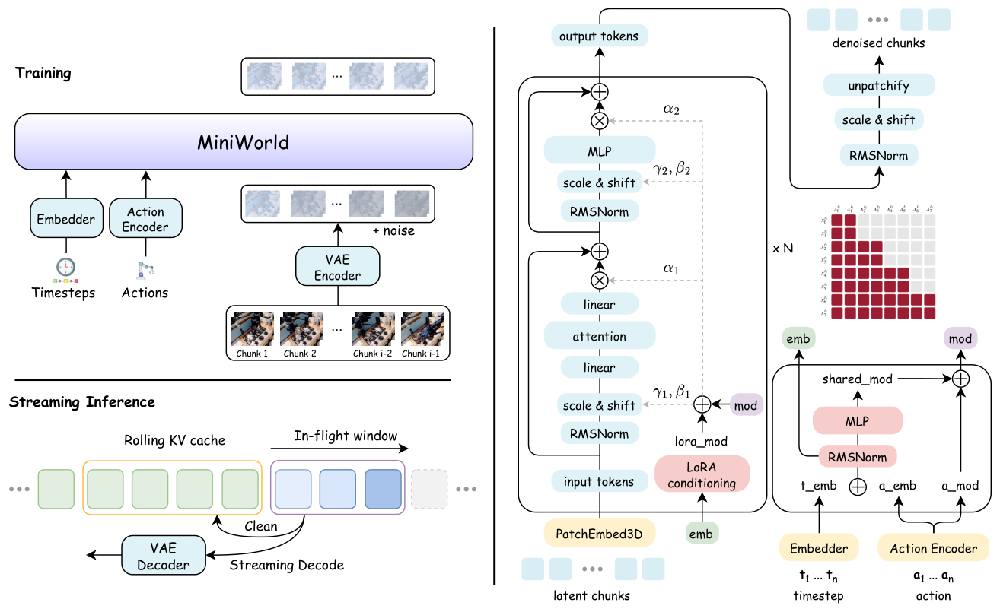
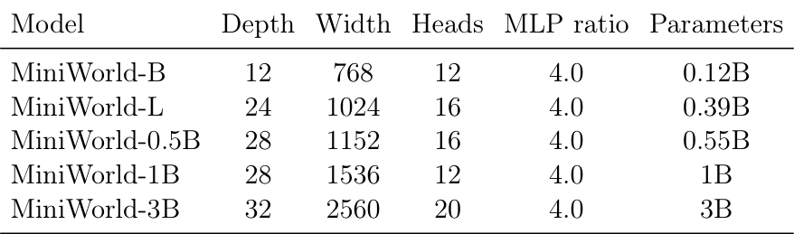
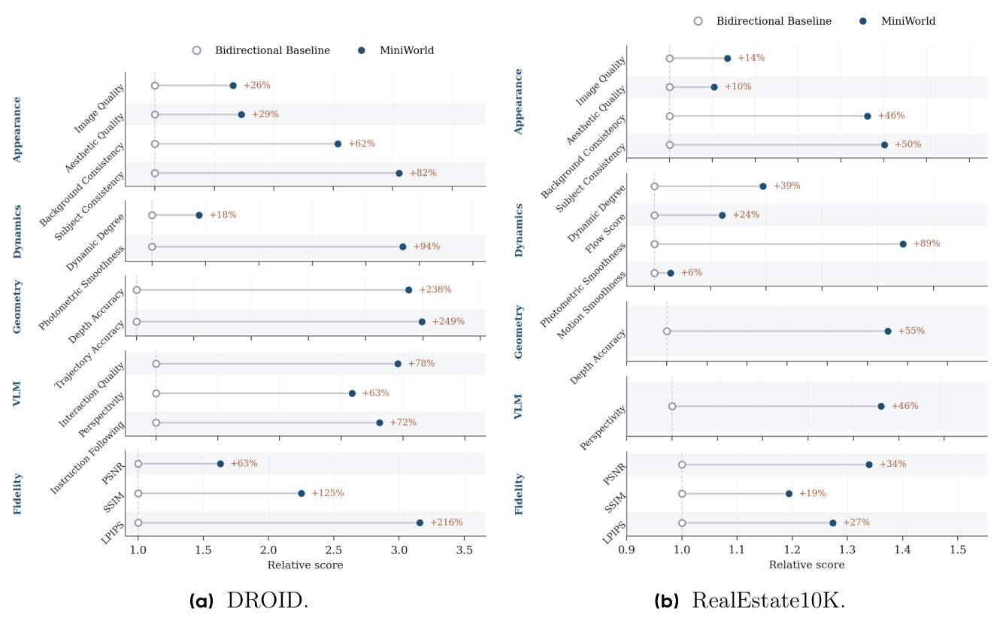
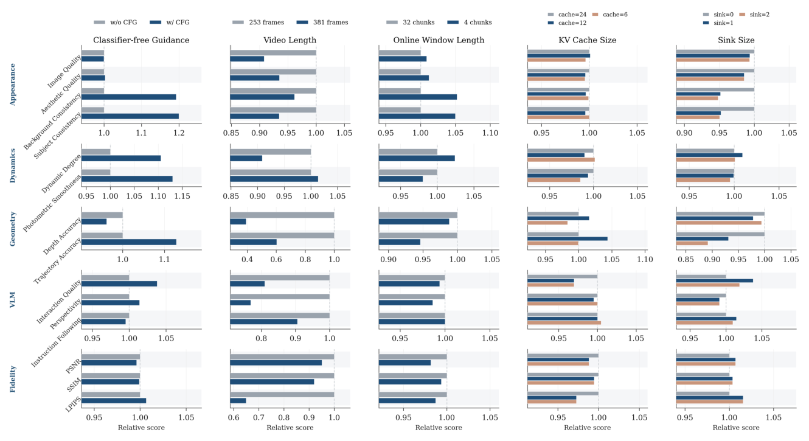
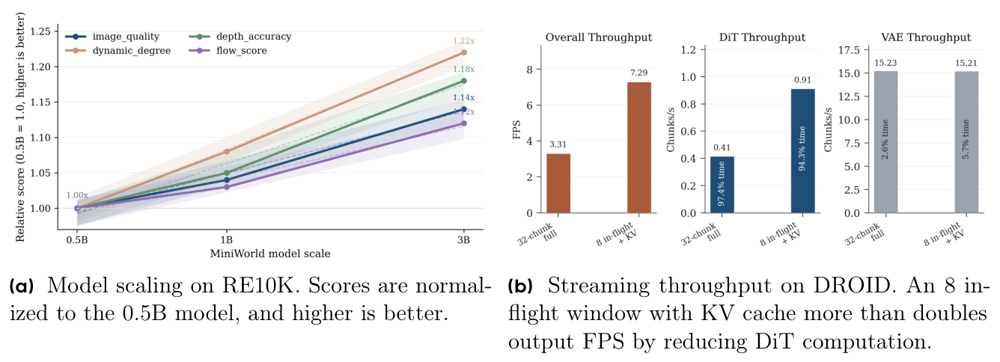

## 一页读懂 | Executive Reading

MiniWorld 最适合被读成一篇“研究基础设施论文”。它没有追逐更大的视频底座或更复杂的后训练，而是把问题收缩为：能否在有限算力下，从零训练一个与流式部署天然一致、端到端可复现的视频世界模型主体。论文给出的答案是一条紧凑配方：块因果 Video DiT 负责下一状态预测，分块扩散强制负责把训练中的噪声状态对齐到异步流式推理，两阶段持续训练负责把局部动力学扩展到长序列，滚动 KV cache 则把在线计算限制在固定窗口内。

真正起支撑作用的不是某个孤立模块，而是训练与推理之间的契约一致性。同一 chunk 内允许双向注意力，以保留局部时空建模能力；不同 chunk 之间严格因果。CoPP 进一步约束后续 chunk 的噪声不低于先前 chunk，使训练时见到的“过去较干净、未来较不确定”与流式生成一致。推理阶段，完成去噪的 chunk 被提交到缓存并停止重算，尚未完成的 chunk 在有限活动窗口中流水线并行去噪。

论文最直接的系统证据来自 1B 模型的 DROID 吞吐测试：把 32-chunk 完整窗口替换为 8 个在途 chunk 与 KV cache 后，稳态输出从 3.31 提升到 7.29 FPS，首个生成 chunk 的延迟由 74.0 秒降至 4.86 秒；消融同时显示，在线窗口缩小后，报告的质量指标整体基本不变。主质量结果在 DROID 和 RE10K 上也广泛优于一个固定 29 帧窗口的双向短视频基线，但这些结果只给出相对归一化分数，且主评测仅覆盖 50 个留出视频，因此更适合支持“这条流式配方明显优于该滑窗基线”，而不是支持无条件的通用能力结论。

标题中的“from scratch”需要精确理解：MiniWorld 的 Video DiT 与流式建模配方从零训练，但视频仍由预训练 Wan2.2 VAE 编解码。论文也没有给出 GPU 型号、各规模模型的精确训练时长、绝对评测分数或误差区间。因而，它最可信的贡献不是证明小算力已经触及视频世界模型的性能上限，而是提供了一条足够开放、结构清楚、可以被研究者重新训练和拆解的因果视频建模基线。

---

## 论证地图 | Argument Map

| 论证环节 | 内容 | 证据 / 位置 | 阅读判断 |
|---|---|---|---|
| 问题 | 双向视频扩散的训练结构与因果流式部署不一致，滑窗推理还会累积误差并丢失早期状态 | §1、§3.1 | 问题定义清楚，并直接对应曝光偏差与长期记忆两类失效 |
| 命题 | 在有限算力下，可以从零训练一个稳定、可扩展、可复现的流式视频世界模型主体 | Abstract、§1、§5 | 论文证明了可行性基线；“从零”不包括预训练 Wan2.2 VAE |
| 机制 | 块因果注意力、CoPP 非递减噪声、长序列持续训练与滚动缓存共同对齐训练和推理 | §3.2–§3.5、Eq. (4)–(7) | 是完整配方的贡献，现有消融不足以独立归因每个训练组件 |
| 质量证据 | DROID 与 RE10K 上广泛优于 29 帧双向滑窗基线 | Figure 2、§4.2 | 方向一致，但只有相对值、单一主基线和 50 个视频 |
| 效率证据 | 8-chunk 活动窗口将吞吐提升 2.20×、首 chunk 延迟降低 15.2× | Figure 4b、§4.4 | 对“有界在线 DiT 计算”是较直接的系统证据，测试关闭了 CFG |
| 边界 | 规模、数据、领域和长时稳定性仍有限，复杂交互中误差继续累积 | §5、Figure 3 | 论文自身承认其定位是开放实验台，而非流式世界模型的性能上限 |

---

## 关键证据 | Evidence & Tensions

### 值得吸收 | What Transfers

- §3.2：chunk 内双向、chunk 间因果的注意力模式，在局部视觉建模与流式因果性之间给出了清晰分工。
- §3.3 + Eq. (4)：CoPP 让噪声随 chunk 序号非递减，直接覆盖异步去噪中的中间状态，而非只训练“干净历史预测噪声未来”。
- §3.5：已完成 chunk 的 KV 永久冻结并复用，使在线注意力窗口的计算量不随已生成长度增长。
- §3.5：RoPE re-shifting 在淘汰旧缓存后重新编号保留 key，避免把位置外推到训练范围之外。
- Figure 4b：吞吐分解显示 94% 以上的逐 chunk 计算仍在 DiT，说明缓存优化击中了真实瓶颈而不是转移耗时。

### 值得推敲 | What Remains Unsettled

- §2、§4.1：模型主体虽从零训练，表征空间仍依赖预训练 Wan2.2 VAE；标题对“from scratch”的范围表达得比实验事实更宽。
- §4.1–§4.2：主结果只对比固定 29 帧滑窗的双向基线，没有 Self Forcing、Rolling Forcing 或等算力因果基线。
- Figure 2：所有主指标都以基线归一为 1，误差指标还取倒数；缺少绝对值、方差和置信区间，使提升的实际量级难以判断。
- §4.1：主评测使用 50 个留出视频和最大 checkpoint，尚不足以刻画长时漂移、身份切换与几何崩坏的尾部风险。
- Figure 3：sink frame 对多项指标中性或略有负面影响，因此“全局记忆锚点”的作用仍需更长时域、带早期状态召回的任务验证。

---

## 研究者评注 | Researcher Commentary

### “从零训练”真正切断了什么依赖

MiniWorld 切断的是对大规模双向视频 DiT、蒸馏教师和复杂后训练链的依赖，而不是对所有预训练视觉表示的依赖。Wan2.2 VAE 仍然定义了模型所见的时空压缩与重建上限。更准确的表述是“从零训练流式去噪器与世界建模主体”。这一边界并不削弱工作的工程价值，却决定了复现成本应同时计入 VAE 的可获得性与表征偏差。

### 贡献在于契约一致，而非单个新模块

块因果注意力、非递减噪声、持续训练、KV cache 和 RoPE 重编号都不是孤立出现的全新概念；MiniWorld 的贡献是把它们组织成一条从训练目标到部署状态前后一致的最小链路。现有实验足以说明整条链路有效，却没有用训练侧消融区分 CoPP、长序列持续训练与架构因果性各自贡献了多少。因此，后续研究引用它时，更稳妥的单位应是“可复现配方”，而不是某个模块的单独因果结论。

### 有界计算不等于长期记忆

滚动缓存证明的是计算和显存不必随序列长度线性增长，不是历史信息可以无损保留。缓存从 24 个 chunk 缩到 12 个几乎不影响当前评测，可能说明短期任务只需要有限历史，也可能说明现有指标没有要求模型恢复很早以前的状态。最能区分这两种解释的实验，是设计一个必须在数百帧之后召回初始对象属性或动作后果的交互任务，并同时扫描缓存长度、sink 策略与生成时域。

---

## 原文精读 | Semantic-chunk Bilingual Reading

### Abstract

<!-- chunk: A.01 | source: p1 abstract | role: thesis-and-recipe -->

**Original**

Video world models predict future observations conditioned on historical observations and control signals, enabling long-horizon generation through autoregressive state transitions. Unlike conventional video generation models that primarily capture visual appearance and motion, video world models learn the underlying dynamics governing environment evolution under agent actions. By modeling how the world responds to interactions, they provide a fundamental building block for embodied AI and interactive simulation.

Recent progress has largely relied on adapting pretrained video generation models through post-training or distillation. Although effective, these approaches often require complex training pipelines, substantial computational resources, and inevitably suffer from the mismatch between bidirectional pretraining and causal streaming inference. Recent studies have shown that training autoregressive video world models from scratch is both feasible and scalable. However, the community still lacks a lightweight, transparent, and fully reproducible baseline that can be trained end-to-end with modest computational resources.

We present MiniWorld, an accessible and reproducible framework for training streaming video world models from scratch. MiniWorld employs a block-causal Video Diffusion Transformer trained with Flow Matching in the latent space of a pretrained Video VAE. Building on Diffusion Forcing, it adopts a chunk-wise non-decreasing noise schedule together with two-stage continued training to improve temporal modeling and training stability. During inference, MiniWorld combines a rolling KV cache with pipelined asynchronous denoising for efficient streaming generation under bounded computation. The entire model can be trained within several days on a single 8-GPU server. By releasing the complete training and inference codebase, pretrained model checkpoints, and implementation details, we hope MiniWorld will facilitate future research on video world modeling.

**译文**

视频世界模型根据历史观测与控制信号预测未来观测，并通过自回归状态转移生成长时序内容。常规视频生成模型主要刻画视觉外观与运动，视频世界模型则进一步学习智能体动作作用下的环境演化动力学。通过建模世界如何响应交互，它们为具身智能和交互式仿真提供了基础组件。

近期进展大多依靠后训练或蒸馏，把预训练视频生成模型改造成世界模型。这类方法虽然有效，却常常需要复杂的训练流水线和大量算力，而且双向预训练与因果流式推理之间存在难以避免的错配。已有研究表明，从零训练自回归视频世界模型既可行，也能够扩展；但领域内仍缺少一种轻量、透明、可在有限算力下端到端训练且完整复现的基线。

MiniWorld 正是为此提出的一套开放框架。它在预训练 Video VAE 的潜空间中，以 Flow Matching 训练块因果 Video Diffusion Transformer；在 Diffusion Forcing 的基础上，引入 chunk 级非递减噪声调度与两阶段持续训练，以改善时间建模和训练稳定性。推理时，滚动 KV cache 与流水线异步去噪共同实现有界计算下的高效流式生成。整套模型可以在一台配备 8 张 GPU 的服务器上于数日内完成训练；作者同时发布训练与推理代码、预训练 checkpoint 和实现细节，希望降低视频世界模型研究的进入门槛。

> **句读**：`from scratch` 与同段的 `latent space of a pretrained Video VAE` 同时成立，说明“从零”指向 Video DiT 与训练配方，而非整个视觉编解码系统。

### 1. Introduction

<!-- chunk: 1.01 | source: p2 ¶1–2 | role: field-and-bottleneck -->

**Original**

Video world models have recently emerged as a promising paradigm for interactive visual simulation, where future observations are generated autoregressively from historical observations and control signals. Unlike conventional video generators that primarily synthesize realistic appearance and motion, video world models aim to capture the dynamics governing world evolution, enabling persistent state prediction over long horizons. Such capabilities are becoming increasingly important for embodied AI, interactive environment simulation, and general physical intelligence. Recent systems, including Genie [3], Cosmos [21], LingBot-World [17], Dreamx-world 1.0, Matrix-game 3.0, HappyOyster [1], DreamDojo [7], MAGI-1 [24], and SkyReels-V2 [26], have demonstrated the remarkable potential of large-scale video world models across these applications.

Despite this rapid progress, training a video world model from scratch remains prohibitively expensive for most researchers. The prevailing paradigm adapts pretrained bidirectional video diffusion models, such as Wan [30], into autoregressive world models through post-training techniques including fine-tuning, distillation, and reinforcement learning. While this approach effectively transfers the strong visual generation capability of large video foundation models, it requires complex multi-stage optimization pipelines and substantial computational resources. More fundamentally, bidirectional pretraining is intrinsically inconsistent with causal streaming inference, resulting in a structural mismatch between training and deployment.

**译文**

视频世界模型正在成为交互式视觉仿真的重要范式：模型以历史观测和控制信号为条件，自回归地产生未来观测。普通视频生成器主要合成逼真的外观和运动，视频世界模型则希望刻画支配世界演化的动力学，从而在长时间跨度上持续预测状态。这类能力对具身智能、交互式环境仿真和通用物理智能日益重要；Genie [3]、Cosmos [21]、LingBot-World [17]、Dreamx-world 1.0、Matrix-game 3.0、HappyOyster [1]、DreamDojo [7]、MAGI-1 [24] 与 SkyReels-V2 [26] 等系统已经展示了大规模视频世界模型的潜力。

然而，对多数研究者而言，从零训练视频世界模型仍然代价过高。主流做法是以 Wan [30] 等预训练双向视频扩散模型为起点，通过微调、蒸馏和强化学习等后训练技术把它改造成自回归世界模型。这条路线能够继承大型视频基础模型强大的视觉生成能力，却也需要复杂的多阶段优化与可观算力。更根本的矛盾在于，双向预训练与因果流式推理的结构并不一致，因此训练和部署之间天然存在错配。

<!-- chunk: 1.02 | source: p2 ¶3–5 | role: gap-and-proposal -->

**Original**

Existing work has demonstrated the feasibility of end-to-end autoregressive pretraining for video world models. MAGI-1 [24] demonstrates the scalability of chunk-wise autoregressive video pretraining, while SkyReels-V2 [26] further shows that Diffusion Forcing [4] provides an effective formulation for long-horizon video generation and world modeling. These advances suggest that training streaming video world models directly from scratch is becoming increasingly practical. Nevertheless, the community still lacks a lightweight and fully reproducible baseline that prioritizes simplicity, transparency, and accessibility over the continuous expansion of model scale and improvement of in-house data quality.

In this work, we present MiniWorld, an accessible recipe for training streaming video world models from scratch under modest computational budgets. MiniWorld adopts a block-causal Video Diffusion Transformer trained with Flow Matching in latent space. Building upon Diffusion Forcing, we introduce a chunk-wise non-decreasing noise scheduling strategy and a two-stage continued training paradigm, enabling efficient and stable world modeling while preserving a simple training procedure.

During inference, MiniWorld employs a rolling KV cache with pipelined asynchronous denoising, allowing long-horizon world generation under bounded computation and a flexible trade-off between generation quality and inference throughput. Unlike many recently released systems, MiniWorld deliberately avoids introducing proprietary datasets or sophisticated post-training. Instead, it delivers an essential minimal end-to-end pipeline covering data preprocessing, model training, streaming inference, and evaluation. The complete model can be trained in several days on a single 8-GPU server, making streaming world model research substantially more accessible.

**译文**

已有工作证明了端到端自回归预训练视频世界模型的可行性。MAGI-1 [24] 展示了 chunk 级自回归视频预训练的扩展能力，SkyReels-V2 [26] 则进一步说明 Diffusion Forcing [4] 可以有效表述长视频生成与世界建模。这些进展意味着，直接从零训练流式视频世界模型正在变得可行。领域内仍缺少的，是一条把简洁、透明和可获得性置于持续扩大模型与改进内部数据质量之前的轻量、完整可复现基线。

MiniWorld 因而给出一套面向有限算力的训练配方：以 Flow Matching 在潜空间中训练块因果 Video Diffusion Transformer，并在 Diffusion Forcing 之上加入 chunk 级非递减噪声调度与两阶段持续训练，在保持训练流程简洁的同时改善效率、稳定性和时间建模能力。

推理阶段，MiniWorld 以滚动 KV cache 配合流水线异步去噪，在有界计算下生成长时序世界，并允许使用者在生成质量与吞吐之间调整取舍。它刻意不依赖专有数据或复杂后训练，而是提供覆盖数据预处理、模型训练、流式推理和评测的最小端到端流水线。作者称，完整模型可在单台 8-GPU 服务器上于数日内训练完成。

<!-- chunk: 1.03 | source: p3 contributions | role: stated-contributions -->

**Original**

Our contributions are summarized as follows:

- We introduce MiniWorld, a lightweight and fully reproducible framework that makes training streaming video world models from scratch feasible under modest computational budgets.
- We develop a practical streaming world modeling recipe that integrates block-causal Video DiT, chunk-wise non-decreasing noise scheduling, two-stage continued training, and rolling-KV streaming inference.
- We release the full data processing, training, inference, and evaluation pipeline, offering a transparent and extensible open-source baseline for future research.

We hope MiniWorld demonstrates that stable long-horizon, action-conditioned streaming world modeling does not require prohibitive compute, and can instead be studied through a compact, open, and reproducible experimental platform.

**译文**

作者将贡献概括为三点：第一，MiniWorld 是一个轻量且完整可复现的框架，使研究者能够在有限算力下从零训练流式视频世界模型；第二，它把块因果 Video DiT、chunk 级非递减噪声调度、两阶段持续训练和滚动 KV 流式推理整合成一套实用配方；第三，作者开放完整的数据处理、训练、推理和评测流程，为后续研究提供透明、可扩展的基线。

论文希望由此说明，稳定、长时、动作条件下的流式世界建模不必以高不可攀的算力为前提，也可以在一个紧凑、开放且可复现的实验平台上开展。

### 2. Preliminaries: Rectified Flow

<!-- chunk: 2.01 | source: p3 §2 | role: mathematical-basis -->

**Original**

MiniWorld is built upon Rectified Flow [20], a simple formulation of Flow Matching [18]. Following modern latent video generation frameworks, all modeling is performed in the latent space of a pretrained video VAE. Given a latent video sample $x$ and Gaussian noise $\epsilon$, Rectified Flow constructs a linear interpolation

$$
z_\tau = (1-\tau)x + \tau\epsilon, \qquad \tau \in [0,1],
\tag{1}
$$

and trains the model to predict the corresponding velocity field $v^*(x,\epsilon)=x-\epsilon$.

During inference, generation starts from Gaussian noise and progressively integrates the learned velocity field to recover the target latent sequence. Throughout this paper, we use the pretrained Wan2.2 VAE to encode videos into latent representations, and all training and streaming inference are conducted in this latent space.

**译文**

MiniWorld 建立在 Rectified Flow [20] 上，后者是 Flow Matching [18] 的一种简洁形式。与现代潜空间视频生成框架一致，MiniWorld 的全部建模都发生在预训练视频 VAE 的潜空间中。给定视频潜变量样本 $x$ 与高斯噪声 $\epsilon$，Rectified Flow 在二者之间构造线性插值

$$
z_\tau = (1-\tau)x + \tau\epsilon, \qquad \tau \in [0,1],
\tag{1}
$$

并训练模型预测对应的速度场 $v^*(x,\epsilon)=x-\epsilon$。推理从高斯噪声出发，逐步积分学到的速度场，以恢复目标潜变量序列。全文使用预训练 Wan2.2 VAE 将视频编码为潜表示，训练与流式推理也全部在这一潜空间内完成。

### 3. Method

<!-- chunk: 3.00 | source: p3 §3 opening | role: section-roadmap -->

**Original**

In this section, we present the proposed MiniWorld framework. We first formulate streaming video world modeling as a next-state prediction problem, and then describe the block-causal Video DiT architecture, conditioning mechanism, training strategy, and streaming inference pipeline.

**译文**

本节介绍 MiniWorld 框架：首先把流式视频世界建模表述为下一状态预测问题，随后依次说明块因果 Video DiT、条件机制、训练策略与流式推理流水线。

#### 3.1 Problem Formulation

<!-- chunk: 3.1.01 | source: p3–4 §3.1 | role: fixed-window-failure -->

**Original**

The objective of a video world model is to predict future observations conditioned on historical observations and control signals. Formally, given a sequence of observed frames $x_{1:h}$ and future actions $c_{h+1:T}$, the model aims to generate the future video sequence $x_{h+1:T}$.

A straightforward solution is to formulate this task as conditional video generation within a fixed temporal window. During training, historical frames remain clean while future frames are jointly perturbed by diffusion noise, allowing a bidirectional Video DiT to denoise all future frames in parallel. Since every predicted frame can attend to all other future frames, this formulation fully exploits future temporal context and has demonstrated strong performance on short-video generation and video completion.

However, long-horizon deployment typically requires autoregressive streaming inference. A common strategy is to repeatedly generate a fixed-length video segment, append the generated frames to the history, and slide the temporal window forward. This introduces a fundamental mismatch between training and inference. During training, the historical context always comes from ground-truth videos, whereas during inference it is replaced by previously generated predictions. Consequently, prediction errors accumulate over time and continuously propagate to future generations, resulting in the well-known exposure bias. Furthermore, because the temporal window has a fixed length, early observations are progressively discarded as generation proceeds. Without an explicit mechanism for maintaining long-term world states across windows, the model gradually loses historical information, leading to temporal drift and degraded long-range consistency.

**译文**

视频世界模型的目标，是根据历史观测与控制信号预测未来观测。形式化地说，给定已观测帧序列 $x_{1:h}$ 和未来动作 $c_{h+1:T}$，模型需要生成未来视频序列 $x_{h+1:T}$。

一种直接做法，是把任务写成固定时间窗口内的条件视频生成。训练时保持历史帧干净，同时对所有未来帧加入扩散噪声，使双向 Video DiT 能够并行去噪。每个预测帧都可以关注其他未来帧，因此这种形式可以充分利用未来时间上下文，并且已经在短视频生成和视频补全上表现良好。

问题出现在需要长时部署时。自回归流式推理通常反复生成一个定长片段，把结果追加到历史，再向前滑动时间窗口。训练阶段的历史上下文始终来自真实视频，推理时却会被模型此前的预测替代，于是预测误差持续累积并传向后续生成，形成曝光偏差。固定窗口还会随着生成推进逐渐丢弃早期观测；如果没有跨窗口维护长期世界状态的显式机制，模型会不断遗忘历史，最终出现时间漂移和长程一致性退化。

<!-- chunk: 3.1.02 | source: p4–5 §3.1 | role: reformulation -->

**Original**

Despite these limitations, the continuation paradigm remains attractive because it can directly leverage the strong visual generation capability of existing bidirectional video diffusion models. Accordingly, recent studies have sought to improve this framework from different perspectives, including reducing the training-inference mismatch, introducing causal modeling, and maintaining rolling historical states through KV caching [12, 19, 39].

The above analysis suggests that the primary bottleneck of fixed-window video diffusion lies not in visual generation quality itself, but in the inherent discrepancy between the training objective and the streaming inference process. Rather than adapting a bidirectional video diffusion model through post hoc modifications, MiniWorld is built directly upon an action-conditioned next-state prediction formulation. This formulation substantially reduces the mismatch between training and inference while naturally supporting long-horizon streaming generation and persistent world-state transitions.

**译文**

尽管存在上述问题，续写式范式仍有吸引力，因为它能直接继承现有双向视频扩散模型强大的视觉生成能力。近期研究因而从多个方向修补这套框架，包括缩小训练与推理的差异、引入因果建模，以及用 KV cache 维护滚动历史状态 [12, 19, 39]。

论文据此把固定窗口视频扩散的主要瓶颈定位在训练目标与流式推理过程之间的内在错配，而不是视觉生成质量本身。MiniWorld 不再事后改造双向视频扩散模型，而是直接采用动作条件下的下一状态预测形式。这样既缩小训练和推理的差异，也天然支持长时流式生成与持续的世界状态转移。

**Figure 1.** Overview of MiniWorld. Videos are encoded into latent representations by a pretrained Video VAE, while actions are converted into latent-frame-aligned conditioning signals. MiniWorld partitions the latent sequence into temporal chunks and trains a block-causal Video DiT with chunk-wise non-decreasing noise schedules. During streaming inference, future chunks are denoised asynchronously, completed chunks are committed to a rolling KV cache as persistent history, and the active denoising window remains bounded as generation proceeds.

**图 1.** MiniWorld 总览。视频由预训练 Video VAE 编码为潜表示，动作则转换为与潜变量帧对齐的条件信号。MiniWorld 将潜变量序列切分为时间 chunk，以 chunk 级非递减噪声调度训练块因果 Video DiT。流式推理时，未来 chunk 异步去噪；已经完成的 chunk 被提交到滚动 KV cache，作为持续历史；活动去噪窗口则始终保持有界。

#### 3.2 Block-Causal Video DiT

<!-- chunk: 3.2.01 | source: p5 §3.2 | role: architecture-and-attention -->

**Original**

MiniWorld is built upon a single-stream Video Diffusion Transformer (Video DiT) trained with Rectified Flow [20]. Given a noisy latent video, a 3D patch embedding layer converts the latent volume into visual tokens. Diffusion timesteps, robot actions, and camera poses are incorporated as conditioning signals through a unified modulation framework.

To enable streaming generation, MiniWorld employs block-causal self-attention, which partitions the video sequence into a series of temporally ordered chunks. Tokens within the same chunk attend bidirectionally to each other, while cross-chunk attention is strictly causal, such that each chunk can only access preceding chunks. This attention pattern preserves rich spatial-temporal interactions within individual chunks while enforcing the causal dependency required for autoregressive streaming generation.

**译文**

MiniWorld 的主体是以 Rectified Flow [20] 训练的单流 Video Diffusion Transformer。对于带噪视频潜变量，3D patch embedding 首先把潜变量体转换为视觉 token；扩散时间步、机器人动作和相机位姿则通过统一调制框架注入为条件信号。

为支持流式生成，MiniWorld 使用块因果自注意力，把视频序列切分为按时间排序的一组 chunk。同一 chunk 内的 token 可以双向注意，跨 chunk 注意力则严格因果，每个 chunk 只能访问此前的 chunk。这样既保留了 chunk 内丰富的时空交互，也满足自回归流式生成所需的因果依赖。

<!-- chunk: 3.2.02 | source: p5 §3.2 | role: action-conditioning -->

**Original**

Action Conditioning. Robot actions are incorporated through an AdaLN-based conditioning mechanism. For each latent frame, the action encoder transforms the action input $a_t$ into an action embedding $e_t^a$ and an action modulation vector $m_t^a$:

$$
(e_t^a,m_t^a)=E_{act}(a_t).
\tag{2}
$$

The action embedding is added to the diffusion timestep embedding and passed through a shared modulation network to produce the base AdaLN parameters. The action modulation vector is then added residually to the generated parameters before being applied to all Transformer blocks. This design explicitly decouples semantic conditioning from feature modulation. The action embedding interacts with the diffusion timestep to capture the global denoising state, while the modulation vector directly adjusts the AdaLN parameters, providing a more expressive and efficient mechanism for action conditioning.

**译文**

在动作条件机制中，机器人动作通过 AdaLN 注入。对每个潜变量帧，动作编码器把输入动作 $a_t$ 转换为动作嵌入 $e_t^a$ 与动作调制向量 $m_t^a$：

$$
(e_t^a,m_t^a)=E_{act}(a_t).
\tag{2}
$$

动作嵌入先与扩散时间步嵌入相加，再经过共享调制网络产生基础 AdaLN 参数；动作调制向量随后以残差形式加到这些参数上，并应用于全部 Transformer block。该设计显式分离语义条件与特征调制：动作嵌入通过和扩散时间步交互来刻画整体去噪状态，调制向量则直接调整 AdaLN 参数，从而以更灵活、有效的方式表达动作条件。

<!-- chunk: 3.2.03 | source: p5–6 §3.2 | role: modulation-scaling-and-cfg -->

**Original**

To further improve conditioning flexibility, we introduce an AdaLN-LoRA modulation network. Instead of learning an independent modulation network for every Transformer block, all layers share a common modulation branch, while each block learns only a lightweight low-rank residual,

$$
M^\ell(e)=M_{shared}(e)+W^\ell_{up}\,\sigma\!\left(W^\ell_{down}e\right).
\tag{3}
$$

The low-rank residual is zero-initialized so that the model starts from a fully shared modulation network and progressively learns layer-specific adaptations during training, increasing conditioning capacity with only a marginal parameter overhead.

During training, structured condition dropout is performed by replacing action inputs with a null condition for classifier-free guidance. Since the initial observation has no preceding action, the first latent frame is always assigned the null action embedding.

Model Scaling. MiniWorld adopts a unified architecture family with model sizes up to 3B parameters. All variants share the same block-causal Transformer architecture, conditioning interface, and patch size, differing only in network width and hidden dimension. Unless otherwise specified, we report results using two configurations: MiniWorld-0.5B (28 layers, hidden size 1152, 16 attention heads) and MiniWorld-1B (28 layers, hidden size 1536, 12 attention heads).

**译文**

为进一步提高条件调制的灵活性，MiniWorld 引入 AdaLN-LoRA 调制网络。它不为每个 Transformer block 独立学习整套调制网络，而是让所有层共享一个调制分支，每个 block 只学习轻量低秩残差：

$$
M^\ell(e)=M_{shared}(e)+W^\ell_{up}\,\sigma\!\left(W^\ell_{down}e\right).
\tag{3}
$$

低秩残差采用零初始化，使模型从完全共享的调制网络开始训练，再逐步学习逐层适配；由此只需很小的额外参数量，就能扩大条件建模容量。训练时，模型还会把动作输入替换为空条件，执行结构化条件 dropout，以支持无分类器引导。由于初始观测之前不存在动作，第一个潜变量帧始终使用空动作嵌入。

MiniWorld 采用统一的架构族，最大规模为 3B 参数。不同变体共享块因果 Transformer、条件接口和 patch 大小，只改变网络深度、宽度与隐藏维度。若无特别说明，论文主要报告 MiniWorld-0.5B（28 层、隐藏维度 1152、16 个注意力头）与 MiniWorld-1B（28 层、隐藏维度 1536、12 个注意力头）。

#### 3.3 Chunk-wise Noise Scheduling

<!-- chunk: 3.3.01 | source: p6 §3.3 | role: diffusion-forcing-and-monotonicity -->

**Original**

Following Diffusion Forcing [4], MiniWorld assigns independent diffusion timesteps to different latent chunks within the same training sequence, rather than conditioning each prediction on a fully denoised previous chunk as in teacher-forcing-based autoregressive diffusion. This formulation avoids explicitly unrolling next-chunk prediction during training and enables asynchronous denoising across chunks, allowing multiple future chunks to be processed concurrently during streaming inference.

We further impose a non-decreasing timestep constraint on chunk-wise noise levels,

$$
\tau_1 \le \tau_2 \le \cdots \le \tau_M.
\tag{4}
$$

Here $\tau=0$ denotes clean data and $\tau=1$ denotes pure noise. This constraint enforces a causal denoising order in which earlier chunks are always cleaner than later ones, reflecting the practical inference state that past observations have largely converged while future contents remain uncertain. As discussed in AR-Diffusion [28], restricting timestep compositions to monotonic schedules also substantially reduces the search space of asynchronous diffusion trajectories, leading to more stable optimization and faster convergence.

**译文**

沿用 Diffusion Forcing [4]，MiniWorld 为同一训练序列中的不同潜变量 chunk 分配相互独立的扩散时间步，而不是像基于 teacher forcing 的自回归扩散那样，让每次预测都依赖一个已经完全去噪的前序 chunk。这种表述不需要在训练时显式展开逐 chunk 预测，同时允许不同 chunk 异步去噪，使多个未来 chunk 能在流式推理中并行处理。

MiniWorld 进一步对 chunk 级噪声施加非递减时间步约束：

$$
\tau_1 \le \tau_2 \le \cdots \le \tau_M.
\tag{4}
$$

其中 $\tau=0$ 表示干净数据，$\tau=1$ 表示纯噪声。这一约束规定了因果去噪顺序：越早的 chunk 始终越干净，越后的 chunk 越不确定，与实际推理中“过去观测大体收敛、未来内容仍待确定”的状态一致。AR-Diffusion [28] 还指出，把时间步组合限制为单调调度可以显著缩小异步扩散轨迹的搜索空间，从而提高优化稳定性并加快收敛。

> **句读**：这里的 `causal denoising order` 约束的是不同 chunk 的噪声状态，而不是说 chunk 内部也必须逐 token 单向去噪；chunk 内注意力仍是双向的。

<!-- chunk: 3.3.02 | source: p6–7 §3.3 | role: copp-loss-and-conditioning -->

**Original**

Following the probability propagation strategy in AR-Diffusion [28], we extend the frame-level FoPP scheduler to chunk-wise generation, resulting in a Chunk-oriented Probability Propagation (CoPP) scheduler. CoPP maintains the balanced sampling property of FoPP over both timestep compositions and individual diffusion timesteps while operating on latent chunks. Specifically, an anchor chunk is first randomly selected and assigned a timestep sampled from a logit-normal distribution. The timesteps of neighboring chunks are then propagated outward from the anchor under the non-decreasing constraint, producing a valid chunk-wise timestep composition.

Compared with naively sampling monotonic timestep sequences, CoPP preserves the favorable timestep distribution of FoPP while exposing the model to a diverse set of valid chunk-wise diffusion trajectories, improving robustness across different streaming inference schedules. Given the sampled timestep sequence, flow matching is performed only on the prediction chunk set $\Omega$, while observed history chunks are treated as conditions and excluded from the optimization:

$$
L_{FM}=\frac{1}{|\Omega|}\sum_{n\in\Omega}
\left\|[v_\theta(z_\tau,\tau,c)]_n-(x_n-\epsilon_n)\right\|_2^2.
\tag{5}
$$

To support different streaming generation scenarios within a unified training framework, MiniWorld randomly adopts one of two in-context conditioning modes during training. In image-to-video mode, only the first frame is kept clean, while the remaining frames in the first chunk are diffused. In video-to-video mode, the entire first chunk is treated as observed context and remains noise-free. Randomly mixing the two conditioning modes enables the model to support both image-to-video and video-to-video generation at inference time without changing the training objective.

**译文**

MiniWorld 按照 AR-Diffusion [28] 的概率传播思路，把帧级 FoPP 调度器扩展到 chunk 级生成，得到面向 chunk 的概率传播调度器 CoPP。CoPP 以潜变量 chunk 为单位操作，同时保持 FoPP 对时间步组合和单个扩散时间步的均衡采样性质。具体来说，它先随机选取一个锚点 chunk，从 logit-normal 分布中采样该 chunk 的时间步，再在非递减约束下向两侧传播相邻 chunk 的时间步，形成合法的 chunk 级时间步组合。

与直接采样单调时间步序列相比，CoPP 既保留 FoPP 较合适的时间步分布，也让模型接触更多合法的 chunk 级扩散轨迹，从而适应不同的流式推理调度。给定采样后的时间步序列，Flow Matching 只在预测 chunk 集合 $\Omega$ 上计算；已经观测到的历史 chunk 只作为条件，不进入优化目标：

$$
L_{FM}=\frac{1}{|\Omega|}\sum_{n\in\Omega}
\left\|[v_\theta(z_\tau,\tau,c)]_n-(x_n-\epsilon_n)\right\|_2^2.
\tag{5}
$$

为在同一训练框架中支持不同流式生成场景，MiniWorld 会随机选择两种上下文条件模式之一。图生视频模式只保持第一帧干净，首个 chunk 的其余帧仍参与扩散；视频生视频模式则把整个首 chunk 视为已观测上下文，保持无噪。随机混合两种模式，使模型无需改变训练目标，就能在推理时同时支持图生视频与视频生视频。

#### 3.4 Two-stage Continued Training

<!-- chunk: 3.4.01 | source: p7 §3.4 | role: curriculum -->

**Original**

To improve long-horizon generation while maintaining training efficiency, MiniWorld adopts a two-stage training strategy. In the pre-training stage, the model is trained on short video clips of 21/46 frames, allowing it to efficiently learn local action-conditioned state transitions with substantially reduced computational cost. The model is then continually trained on longer sequences of 125/253 frames at the same spatial resolution. Rather than modifying the training objective, the second stage simply exposes the model to longer causal contexts, longer action trajectories, and longer camera-pose trajectories.

We apply timestep shifting during the long-horizon training stage by reparameterizing the diffusion timestep as

$$
\tilde{\tau}=\frac{s\tau}{1+(s-1)\tau},
\tag{6}
$$

where $s$ denotes the shift factor. Timestep shifting reallocates the sampling density over diffusion timesteps and has been shown to improve optimization for large-scale diffusion models. The long-horizon training stage exposes the model to substantially longer temporal contexts, enabling it to better exploit extended histories during inference.

**译文**

为了兼顾长时生成与训练效率，MiniWorld 采用两阶段训练。预训练阶段先使用 21 帧和 46 帧短片段，使模型以较低计算成本学习动作条件下的局部状态转移；随后在相同空间分辨率下，继续训练 125 帧和 253 帧长序列。第二阶段不改变训练目标，只让模型接触更长的因果上下文、动作轨迹和相机位姿轨迹。

长时训练阶段还会重新参数化扩散时间步：

$$
\tilde{\tau}=\frac{s\tau}{1+(s-1)\tau},
\tag{6}
$$

其中 $s$ 是偏移因子。时间步偏移会重新分配不同扩散时间步上的采样密度，已有研究表明它有助于大型扩散模型的优化。长时阶段由此让模型接触显著更长的时间上下文，以便在推理时更充分地利用延伸历史。

#### 3.5 Streaming Inference

<!-- chunk: 3.5.01 | source: p7–8 §3.5 | role: asynchronous-update -->

**Original**

At inference time, MiniWorld performs streaming generation through asynchronous chunk-wise denoising. At any moment, the sequence consists of two parts: a committed history that has already converged to the data manifold and a set of future chunks that are still undergoing denoising. During each denoising step, a future chunk is allowed to attend only to the committed history and to preceding chunks within the active window that satisfy the chunk-wise causal constraint. The latent state of chunk $G_m$ is updated as

$$
z_{G_m}^{s+1}=z_{G_m}^{s}-\Delta\tau_m^s
[v_\theta(z^s,\tau^s,c)]_{G_m},
\qquad \Delta\tau_m^s\le 0.
\tag{7}
$$

Once a chunk reaches the data endpoint, its latent is finalized and its Transformer key-value pairs are committed to a rolling KV cache. Owing to the chunk-wise causal attention structure, committed chunks will never be modified by subsequent denoising steps, allowing their cached representations to be safely reused without recomputation. Consequently, MiniWorld supports arbitrarily long video generation while maintaining a bounded active attention window.

**译文**

推理时，MiniWorld 通过异步 chunk 级去噪实现流式生成。任意时刻的序列都由两部分组成：已经收敛到数据流形并被提交的历史，以及仍在去噪的一组未来 chunk。每一步去噪中，一个未来 chunk 只能关注已提交历史，以及活动窗口内满足 chunk 级因果约束的前序 chunk。chunk $G_m$ 的潜状态按下式更新：

$$
z_{G_m}^{s+1}=z_{G_m}^{s}-\Delta\tau_m^s
[v_\theta(z^s,\tau^s,c)]_{G_m},
\qquad \Delta\tau_m^s\le 0.
\tag{7}
$$

当某个 chunk 到达数据端点后，其潜变量被固定，对应的 Transformer key-value 对被提交到滚动 KV cache。由于注意力在 chunk 间严格因果，已经提交的 chunk 不会再被后续去噪修改，因此缓存表示可以安全复用而无需重算。这样，MiniWorld 在保持活动注意力窗口有界的同时，可以继续生成任意长度的视频。

> **句读**：`arbitrarily long` 描述的是算法允许持续推进、在线窗口保持有界，并不意味着模型能无损记住任意久远的状态。

<!-- chunk: 3.5.02 | source: p8 §3.5 | role: rolling-memory-and-rope -->

**Original**

Structured Rolling KV Cache. MiniWorld partitions the inference state into committed history and an active denoising window. The committed history consists of a persistent sink anchor together with a fixed-length FIFO cache, while future chunks remain inside the active window and are progressively denoised according to the chunk-wise autoregressive schedule.

As generation proceeds, newly completed chunks are committed to the cache, while newly initialized noisy chunks continuously enter the active window. Once the cache exceeds its predefined capacity, the oldest cached chunks are discarded. The initial clean context is permanently retained as a sink anchor, whereas only subsequent history chunks participate in the FIFO eviction process. Throughout inference, the active window therefore maintains a fixed computational cost independent of the generated sequence length.

RoPE Re-shifting. Although the KV cache has a fixed capacity, newly generated chunks continuously advance the temporal positions. Directly appending new chunks would therefore require extrapolating Rotary Position Embeddings (RoPE) beyond the position range observed during training. To avoid this issue, after each cache update we apply RoPE re-shifting to the retained keys by subtracting the temporal offset introduced by the evicted chunks, effectively re-indexing the sliding window from the beginning. Since values are independent of positional rotations, they remain unchanged. When a sink anchor is present, it always occupies the first position and is excluded from the re-shifting operation, while the remaining cached chunks are shifted accordingly. This procedure keeps both queries and cached keys within the positional range seen during training without altering their relative temporal relationships.

**译文**

结构化滚动 KV cache 把推理状态分成已提交历史与活动去噪窗口。已提交历史包含一个永久保留的 sink anchor 和一个定长 FIFO cache；未来 chunk 则停留在活动窗口中，按 chunk 级自回归调度逐步去噪。

随着生成推进，新完成的 chunk 不断写入 cache，新初始化的噪声 chunk 则持续进入活动窗口。cache 超过预设容量后，最旧的历史 chunk 被淘汰。最初的干净上下文会作为 sink anchor 永久保留，只有后续历史参与 FIFO 淘汰。由此，活动窗口在整个推理过程中保持固定计算成本，不依赖已经生成的序列长度。

固定容量的 cache 并不能阻止新 chunk 的时间位置持续向前增长；如果直接追加，就必须把 RoPE 外推到训练时从未见过的位置。MiniWorld 在每次 cache 更新后，对保留的 key 执行 RoPE re-shifting：减去被淘汰 chunk 带来的时间偏移，相当于从头重新编号滑动窗口。value 不依赖位置旋转，因此保持不变；sink anchor 始终占据第一个位置，不参与重编号，其余 cache chunk 则相应平移。这样既让 query 和 cache key 留在训练位置范围内，又不改变它们的相对时间关系。

<!-- chunk: 3.5.03 | source: p8 §3.5 | role: pipelined-denoising -->

**Original**

Pipelined Denoising. MiniWorld allows multiple future chunks to remain at different diffusion timesteps simultaneously. Consequently, several chunks can be denoised in parallel within the active window, forming a pipelined inference process. Since the number of denoising updates available to each chunk depends on the autoregressive stride and the size of the active window, the sampler adaptively allocates the timestep interval $\Delta\tau$ such that every chunk reaches the data endpoint before being committed to the cache.

This asynchronous denoising strategy enables a flexible trade-off between inference throughput and generation quality by adjusting the pipeline depth, while requiring no modification to the trained model parameters. Combined with chunk-wise causal attention, block-wise noise scheduling, and long-horizon training, it forms the complete streaming inference framework of MiniWorld.

**译文**

在流水线去噪中，多个未来 chunk 可以同时处于不同扩散时间步，因此活动窗口能够并行去噪多个 chunk，形成流水线推理。每个 chunk 可以获得的去噪更新次数取决于自回归步长与活动窗口大小，采样器因而自适应分配时间步间隔 $\Delta\tau$，确保每个 chunk 都能在提交到 cache 前到达数据端点。

通过调整流水线深度，这种异步去噪可以灵活交换推理吞吐与生成质量，而且无需修改训练后的模型参数。它与 chunk 级因果注意力、分块噪声调度和长时训练共同构成 MiniWorld 的完整流式推理框架。

### 4. Experiments

#### 4.1 Experimental Setup

<!-- chunk: 4.1.01 | source: p9 §4.1 | role: datasets-and-conditioning -->

**Original**

Datasets. We evaluate MiniWorld on two real-world benchmarks with different control modalities: DROID [14] and RealEstate10K (RE10K) [38]. DROID evaluates embodied world modeling under low-level robot actions, while RE10K evaluates camera-controlled scene prediction under camera trajectories. All videos are resized to $240\times320$ and encoded into the latent space of the pretrained Wan2.2 VAE, which has a temporal compression ratio of $4\times$, a spatial compression ratio of $16\times$, and 48 latent channels.

Condition Processing. MiniWorld uses the same latent-frame-aligned conditioning interface across domains. For DROID, each video frame is paired with a 7-dimensional robot action consisting of a 6-DoF Cartesian end-effector displacement and a gripper position. Each action dimension is normalized by percentile statistics and clipped to $[-1,1]$:

$$
a \leftarrow 2\frac{a-q_{0.01}}{q_{0.99}-q_{0.01}}-1.
\tag{8}
$$

Since one latent frame corresponds to four RGB frames, four consecutive robot actions are concatenated into a 28-dimensional latent-frame action token.

For RE10K, camera intrinsics and extrinsics are converted into per-pixel ray origins and directions following the NeRF convention. Each scalar is encoded with 15 sinusoidal frequency bands, producing a 180-channel pose representation per RGB frame; four consecutive pose maps are concatenated to obtain a 720-channel spatial condition aligned with each latent frame.

**译文**

MiniWorld 在控制模态不同的两个真实世界数据集上评测：DROID [14] 用低层机器人动作检验具身世界建模，RealEstate10K（RE10K）[38] 则以相机轨迹为控制，检验场景预测。所有视频缩放到 $240\times320$，再由预训练 Wan2.2 VAE 编码；该 VAE 的时间压缩率为 $4\times$、空间压缩率为 $16\times$，潜变量通道数为 48。

不同领域共享同一套与潜变量帧对齐的条件接口。DROID 的每个视频帧配有一个 7 维机器人动作，由 6-DoF 笛卡尔末端执行器位移和夹爪位置组成。各动作维度按第 1 与第 99 百分位数归一化，再截断到 $[-1,1]$：

$$
a \leftarrow 2\frac{a-q_{0.01}}{q_{0.99}-q_{0.01}}-1.
\tag{8}
$$

一个潜变量帧对应四个 RGB 帧，因此连续四个机器人动作会拼接为 28 维的潜变量帧动作 token。

RE10K 的相机内参与外参按照 NeRF 约定转换为逐像素射线原点和方向。每个标量使用 15 个正弦频带编码，每个 RGB 帧由此得到 180 通道位姿表示；再拼接连续四个位姿图，形成与每个潜变量帧对齐的 720 通道空间条件。

<!-- chunk: 4.1.02 | source: p9–10 §4.1 | role: training-recipe -->

**Original**

Training Details. All models are trained from scratch using the recipe in Section 3. We use a latent chunk size of 2, so each causal chunk contains two consecutive latent frames. Training proceeds in two stages. In the short-horizon stage, we first train on 21-frame clips and then continue on 46-frame clips, using a global batch size of 64 and a learning rate of $1\times10^{-4}$ with the Muon optimizer [13]. This stage encourages efficient learning of local action-conditioned dynamics while maximizing sample coverage.

We then enter the long-video continued-training stage, where the model is trained on 125-frame sequences before being further continued on 253-frame rollouts. We adopt the Muon optimizer with a global batch size of 8, and linearly warm up the learning rate from 0 to $2\times10^{-5}$ at the start of long-video continued training. This stage exposes the model to significantly longer causal contexts, bringing the training distribution closer to that encountered during streaming inference.

For the noise scheduler, we use 50 discretized training-time bins with monotonic CoPP timestep compositions; timesteps are shifted using the SD3-style reparameterization, with the shift factor automatically determined by the number of latent tokens. For timestep sampling, we use the default logit-normal distribution with $P_{mean}=0$ and $P_{std}=1$. During training, the action condition is randomly dropped with a probability of 10% to enable classifier-free guidance at inference time. All experiments are conducted on a single server equipped with 8 GPUs using bf16 mixed-precision training.

**译文**

所有模型都按照第 3 节的配方从零训练。潜变量 chunk 大小设为 2，因此每个因果 chunk 包含两个连续潜变量帧。短时阶段先训练 21 帧片段，再继续训练 46 帧片段；优化器使用 Muon [13]，全局 batch size 为 64，学习率为 $1\times10^{-4}$。这一阶段以较低成本学习局部动作条件动力学，并尽量提高样本覆盖。

长视频持续训练阶段先使用 125 帧序列，再继续到 253 帧 rollout。优化器仍为 Muon，全局 batch size 降到 8；进入长视频阶段时，学习率从 0 线性预热到 $2\times10^{-5}$。更长的因果上下文使训练分布更接近流式推理时遇到的状态。

噪声调度使用 50 个离散训练时间步 bin，并采用单调 CoPP 时间步组合；时间步通过 SD3 风格的重新参数化进行偏移，偏移因子由潜变量 token 数自动确定。时间步采样使用默认 logit-normal 分布，$P_{mean}=0$、$P_{std}=1$。训练时以 10% 概率随机丢弃动作条件，以便推理时使用无分类器引导。全部实验均在一台 8-GPU 服务器上，以 bf16 混合精度完成。

<!-- chunk: 4.1.03 | source: p10 §4.1 | role: model-family-and-evaluation -->

**Original**

Model Configuration. MiniWorld adopts a unified architecture family across model scales. All variants use the same block-causal Transformer design, conditioning interface, patch size, and MLP ratio, and differ only in depth, width, number of attention heads, and parameter count. Table 1 summarizes the model configurations used in this study.

**Table 1.** Model configurations. All variants use the same block-causal attention pattern, conditioning interface, patch size, and MLP ratio.

Evaluation Protocol. We compare MiniWorld with a bidirectional short-video baseline, which performs sliding-window prediction using a fixed 29-frame window under the same control sequence. All evaluations use a single observed frame as context. The main figures report relative scores, with the bidirectional short-video baseline normalized to 1. For error metrics such as LPIPS and depth error, we invert the ratio so that larger values consistently indicate better performance. In addition to PSNR, SSIM, and LPIPS [31, 36], we report WorldArena-style metrics [25] covering appearance, dynamics, geometry, VLM-based functional quality, and fidelity. Unless otherwise specified, MiniWorld uses classifier-free guidance with scale 2 during quality evaluation. The main results use the largest evaluated checkpoint in this study on 50 held-out videos with 253-frame streaming rollouts.

**译文**

MiniWorld 在不同规模上采用统一架构族。所有变体使用相同的块因果 Transformer、条件接口、patch 大小和 MLP ratio，只改变深度、宽度、注意力头数和参数量。表 1 汇总了从 0.12B 到 3B 的模型配置。

**表 1.** 模型配置。所有变体共享块因果注意力模式、条件接口、patch 大小与 MLP ratio。

评测把 MiniWorld 与一个双向短视频基线比较；该基线在相同控制序列下，以固定 29 帧窗口执行滑窗预测。所有评测都只给定一个观测帧作为上下文。主图报告相对分数，并把双向短视频基线归一化为 1；对于 LPIPS 和深度误差等误差指标，论文对比值取倒数，从而统一成数值越大越好。除 PSNR、SSIM 与 LPIPS [31, 36] 外，评测还使用 WorldArena 风格指标 [25]，覆盖外观、动力学、几何、基于 VLM 的功能质量和保真度。若无特别说明，质量评测中的无分类器引导 scale 为 2。主结果使用论文评测的最大 checkpoint，在 50 个留出视频上执行 253 帧流式 rollout。

> **句读**：`relative scores` 与 `invert the ratio` 意味着图 2 不能恢复绝对误差，也不能从百分比直接判断实际视觉差异。

#### 4.2 Main Results

<!-- chunk: 4.2.01 | source: p10–11 §4.2 | role: cross-domain-results -->

**Original**

Figure 2a reports the DROID comparison. MiniWorld improves nearly all displayed metrics over the bidirectional short-video baseline, with especially large gains in geometry and fidelity. Trajectory Accuracy improves by 249%, Depth Accuracy by 238%, LPIPS by 216%, and SSIM by 125%. Appearance metrics improve consistently by 26% to 82%, and VLM judge scores improve by 63% to 78%. These gains indicate that MiniWorld does not merely sharpen individual frames: it better preserves robot-object geometry, maintains temporally coherent manipulation dynamics, and produces behavior that is more consistent with the conditioning signal.

Figure 2b reports the corresponding RE10K results. The improvements are more moderate than on DROID but remain broad across metric groups: Photometric Smoothness improves by 89%, Depth Accuracy by 55%, Subject Consistency by 50%, Background Consistency by 46%, and Perspectivity by 46%. Standard fidelity metrics also improve, with PSNR, SSIM, and LPIPS gaining 34%, 19%, and 27%, respectively. This cross-domain trend is important because RE10K removes robot interaction and instead stresses camera-conditioned geometry. The same streaming architecture therefore transfers from action-conditioned manipulation to camera-controlled scene prediction without relying on a dataset-specific evaluation artifact.

**译文**

图 2a 给出 DROID 对比。相对于双向短视频基线，MiniWorld 在几乎全部展示指标上都有提升，几何与保真度的相对增益尤其大：Trajectory Accuracy 提升 249%，Depth Accuracy 提升 238%，LPIPS 提升 216%，SSIM 提升 125%；外观指标提高 26% 至 82%，VLM judge 分数提高 63% 至 78%。作者据此认为，MiniWorld 的收益不只是单帧锐度，更包括机器人与物体几何、操控过程的时间一致性，以及与条件信号相符的行为。

RE10K 上的提升较 DROID 温和，但仍覆盖多个指标组：Photometric Smoothness 提升 89%，Depth Accuracy 提升 55%，Subject Consistency 提升 50%，Background Consistency 与 Perspectivity 均提升 46%；PSNR、SSIM 和 LPIPS 分别提高 34%、19% 和 27%。RE10K 不含机器人交互，更强调相机条件下的几何一致性，因此作者把这一结果解读为同一流式架构可以从动作条件操控迁移到相机控制场景预测，而非只在单一数据集的评测口径上获益。

**Figure 2.** Main results on DROID and RealEstate10K. The bidirectional short-video baseline is normalized to 1. For error metrics, the relative ratio is inverted so that larger values indicate better performance.

**图 2.** DROID 与 RealEstate10K 的主结果。双向短视频基线被归一化为 1；误差指标的相对比值取倒数，使数值越大统一表示越好。

#### 4.3 Ablations

<!-- chunk: 4.3.01 | source: p11–12 §4.3 | role: cfg-and-horizon -->

**Original**

We next ablate the main inference choices on DROID. Figure 3 compares paired settings by normalizing the left setting in each column to 1, and groups metrics into Appearance, Dynamics, Geometry, VLM, and Fidelity.

First, classifier-free guidance (CFG) improves quality without materially changing frame-level fidelity. Enabling CFG improves the average displayed metric by about 5.5%, with the clearest gains in Appearance (+9.9%) and Dynamics (+11.8%), while Fidelity remains nearly unchanged. This suggests that guidance acts as a clean quality knob rather than being responsible for the efficiency results.

Second, increasing the generated video length from 253 to 381 frames preserves the core visual and temporal behavior but exposes the remaining long-horizon failure modes. Appearance and Dynamics retain approximately 94% and 96% of the shorter-rollout score, respectively, whereas Geometry, VLM quality, and Fidelity degrade more noticeably. Thus MiniWorld remains stable over substantially longer rollouts, but geometric accuracy and perceptual fidelity remain the most sensitive dimensions as prediction errors accumulate.

**译文**

论文随后在 DROID 上消融主要推理选择。图 3 的每一列都比较一对设置，并把左侧设置归一化为 1；指标被归入 Appearance、Dynamics、Geometry、VLM 与 Fidelity 五组。

首先，无分类器引导能提高质量，但几乎不改变逐帧保真度。开启 CFG 后，图中指标平均提高约 5.5%，其中 Appearance 提高 9.9%，Dynamics 提高 11.8%，Fidelity 基本不变。这说明引导可以作为独立的质量旋钮，而不是效率收益的来源。

其次，把生成长度从 253 帧延伸到 381 帧后，核心视觉与时间行为大体保持，但剩余的长时失效开始显现。Appearance 和 Dynamics 分别保留短 rollout 分数的约 94% 与 96%，Geometry、VLM 质量和 Fidelity 则退化得更明显。换言之，MiniWorld 在显著更长的 rollout 上仍较稳定，但随着预测误差累积，几何精度和感知保真度最为敏感。

<!-- chunk: 4.3.02 | source: p12 §4.3 | role: window-and-memory -->

**Original**

Third, reducing the online denoising window from a 32-chunk full window to an 8 in-flight window with KV cache preserves nearly the same quality. The average relative score across all displayed categories is approximately unchanged: Appearance slightly improves, Dynamics remains effectively stable, and Geometry, VLM, and Fidelity stay within a few percent of the full-window setting. This result demonstrates that a small online window can match the quality of full-window inference by committing completed chunks to the rolling KV cache.

Fourth, we study whether the model requires a large retained history once the online denoising window is fixed. Using MiniWorld-1B on DROID with $T=64$, eight in-flight chunks, and one resident sink frame, we vary the KV-cache size from 24 chunks to 12 and 6 chunks. The trend is largely flat: reducing the cache to 12 chunks is nearly indistinguishable from using 24 chunks, while a 6-chunk cache introduces only small single-digit changes. Appearance and Dynamics remain within approximately 1% of the 24-chunk reference, and Geometry is similarly stable, with only minor changes in Depth Accuracy and comparable Trajectory Accuracy. These results suggest that, for this horizon, MiniWorld does not rely on retaining the full 24-chunk history once the active denoising window and sink anchor are fixed.

**译文**

第三项消融把在线去噪窗口从完整的 32 个 chunk 缩到带 KV cache 的 8 个在途 chunk，质量几乎不变。所有展示类别的平均相对分数基本持平：Appearance 略有上升，Dynamics 实质稳定，Geometry、VLM 与 Fidelity 和完整窗口相比只相差几个百分点。结果说明，把完成去噪的 chunk 提交到滚动 cache 后，小型在线窗口可以达到与完整窗口相近的质量。

第四项消融在在线窗口固定后改变保留历史长度。实验使用 DROID 上的 MiniWorld-1B，设 $T=64$、8 个在途 chunk 和 1 个常驻 sink frame，把 KV-cache 大小从 24 个 chunk 减到 12 个和 6 个。整体趋势较平：12 个 chunk 与 24 个几乎不可区分，6 个 chunk 也只带来个位数百分比的变化。Appearance 和 Dynamics 与 24-chunk 参考值相差约 1%，Geometry 同样稳定，Depth Accuracy 只有小幅变化，Trajectory Accuracy 则相当。这提示在当前时域和活动窗口设置下，MiniWorld 不依赖完整保留 24 个历史 chunk。

<!-- chunk: 4.3.03 | source: p12 §4.3 | role: sink-ablation -->

**Original**

Finally, we ablate the number of resident sink frames using MiniWorld-1B on DROID with $T=64$ and a 24-chunk KV cache. Compared with the no-sink setting, adding one or two sink frames is mostly neutral rather than uniformly beneficial. Appearance and Dynamics decrease slightly, while VLM-based and semantic-consistency metrics improve modestly; Trajectory Accuracy decreases mildly as the sink size increases. We therefore interpret sink anchors as a memory-stabilization mechanism that can preserve global context without collapsing quality, rather than as the primary source of the DROID quality gains. The dominant improvement instead comes from the KV-cache streaming design itself.

**译文**

最后，论文在 DROID 的 MiniWorld-1B 上设 $T=64$ 与 24-chunk KV cache，消融常驻 sink frame 数量。与不使用 sink 的设置相比，加入一个或两个 sink frame 的总体效果接近中性，并非普遍有益：Appearance 和 Dynamics 略降，基于 VLM 的指标与语义一致性小幅提高，Trajectory Accuracy 则随 sink 增大而轻微下降。作者因此把 sink anchor 解释为一种不会显著破坏质量的记忆稳定机制，而非 DROID 质量增益的主要来源；主要提升仍来自 KV-cache 流式设计。

**Figure 3.** Quality ablations on DROID. Each column compares one inference factor while keeping the remaining settings fixed; the left setting in each column is normalized to 1.

**图 3.** DROID 上的质量消融。每列只改变一个推理因素，其余设置保持不变；每列左侧设置归一化为 1。

#### 4.4 Analysis

<!-- chunk: 4.4.01 | source: p12 §4.4 | role: scaling -->

**Original**

Scaling Behavior. Figure 4a compares MiniWorld variants on RE10K under identical training and evaluation settings and a fixed inference horizon, with all scores normalized to the 0.5B model. Performance improves monotonically from 0.5B to 1B and 3B across image quality, dynamic degree, depth accuracy, and flow score, indicating that the architecture benefits consistently from increased capacity rather than trading one aspect of generation quality for another. At 3B parameters, MiniWorld improves dynamic degree by 22%, depth accuracy by 18%, image quality by 14%, and flow score by 12% over the 0.5B model. The larger gains in dynamics and geometry show that scaling primarily strengthens motion modeling and 3D consistency, while still delivering clear improvements in appearance and flow quality.

**译文**

图 4a 在相同训练、评测设置和固定推理时域下，比较 RE10K 上不同规模的 MiniWorld，并把所有分数归一化到 0.5B 模型。从 0.5B 扩展到 1B 和 3B 时，图像质量、动态程度、深度精度和光流分数都单调提高，说明增加容量并未以牺牲某一项生成质量为代价。与 0.5B 相比，3B 模型的动态程度提高 22%，深度精度提高 18%，图像质量提高 14%，光流分数提高 12%。动力学和几何上的较大增益提示，扩展容量主要强化运动建模与三维一致性，同时也改善外观和光流质量。

<!-- chunk: 4.4.02 | source: p12–13 §4.4 | role: throughput-and-latency -->

**Original**

Throughput Analysis. We measure streaming throughput using a dedicated DROID benchmark on the 1B model. To isolate system throughput from guidance overhead, the benchmark disables classifier-free guidance ($cfg=1$), runs 3 warmup clips and 20 timed clips per setting, and reports steady-state timing after the first generated chunk.

Replacing the 32-chunk full window with an 8 in-flight window plus KV cache increases steady output throughput from 3.31 FPS to 7.29 FPS, corresponding to a $2.20\times$ speedup. The decomposition shows that this gain comes from reducing DiT computation: DiT throughput increases from 0.41 to 0.91 chunks/s, while VAE throughput remains around 15.2 chunks/s in both settings. Consistently, DiT accounts for 97.4% of per-chunk compute in the full-window setting and 94.3% with KV cache, whereas the VAE contributes only 2.6% and 5.7%. Therefore, the VAE is not the inference bottleneck; the efficiency improvement is achieved by bounding the online DiT attention window and reusing committed history through the rolling KV cache.

The same benchmark also shows a substantial improvement in streaming responsiveness. The first generated chunk latency decreases from 74.0 seconds to 4.86 seconds, a $15.2\times$ reduction. Together with the quality ablations, these results demonstrate that MiniWorld improves throughput and latency without collapsing long-horizon generation quality.

**译文**

吞吐分析使用 1B 模型和专门的 DROID benchmark。为把系统吞吐与引导开销分离，测试关闭无分类器引导（$cfg=1$），每个设置先运行 3 个预热 clip，再计时 20 个 clip，并在首个 chunk 生成后统计稳态时间。

把 32-chunk 完整窗口替换为 8 个在途 chunk 加 KV cache 后，稳态输出吞吐从 3.31 FPS 提升到 7.29 FPS，即 $2.20\times$ 加速。分解结果显示，收益来自减少 DiT 计算：DiT 吞吐从 0.41 提高到 0.91 chunks/s，VAE 吞吐在两种设置下都维持约 15.2 chunks/s。完整窗口中，DiT 占逐 chunk 计算的 97.4%；使用 KV cache 后仍占 94.3%，VAE 则只占 2.6% 和 5.7%。因此，推理瓶颈不是 VAE；效率提升来自限制在线 DiT 注意力窗口，并通过滚动 KV cache 复用已提交历史。

同一 benchmark 还显示流式响应显著改善：首个生成 chunk 的延迟从 74.0 秒降至 4.86 秒，降低 $15.2\times$。结合质量消融，作者据此认为 MiniWorld 在提升吞吐和降低延迟的同时，没有使长时生成质量崩坏。

**Figure 4.** Scaling and throughput analyses of MiniWorld. (a) Model scaling on RE10K; scores are normalized to the 0.5B model. (b) Streaming throughput on DROID; an 8 in-flight window with KV cache more than doubles output FPS by reducing DiT computation.

**图 4.** MiniWorld 的扩展与吞吐分析。（a）RE10K 上的模型扩展，分数归一化到 0.5B 模型。（b）DROID 上的流式吞吐；8 个在途 chunk 配合 KV cache，通过减少 DiT 计算使输出 FPS 提升超过一倍。

### 5. Discussion

<!-- chunk: 5.01 | source: p13–14 §5 | role: positioning -->

**Original**

Positioning. MiniWorld demonstrates that a streaming video world model can be trained from scratch using an accessible and reproducible recipe under modest computational budgets. Rather than adapting a large bidirectional video generator into a causal predictor, MiniWorld directly optimizes streaming autoregressive prediction through block-causal attention, chunk-wise diffusion forcing, and train-test-aligned inference. Despite its simplicity, this formulation produces stable long-horizon rollouts across multiple domains while remaining practical for researchers without large-scale infrastructure.

Rather than pursuing state-of-the-art generation quality, MiniWorld is intended as a transparent baseline for video world modeling. While large bidirectional video generation models remain preferable when maximizing perceptual quality, MiniWorld emphasizes reproducibility and deployment consistency, making it well suited for studying streaming world models in academic research.

We hope MiniWorld provides a practical foundation for investigating problems specific to streaming world models, including temporal memory, causal representation learning, long-horizon error accumulation, and train-test-aligned optimization, while lowering the engineering barrier to developing and evaluating new algorithmic ideas.

**译文**

论文把 MiniWorld 定位为一条在有限算力下可获得、可复现的从零训练流式视频世界模型配方。它不把大型双向视频生成器事后改造成因果预测器，而是通过块因果注意力、chunk 级 Diffusion Forcing 和训练-测试对齐的推理，直接优化流式自回归预测。尽管结构简洁，该形式仍能在多个领域产生较稳定的长时 rollout，也适合缺少大规模基础设施的研究者使用。

MiniWorld 并不追求最先进的生成质量，而是希望成为透明的视频世界建模基线。如果目标只是最大化感知质量，大型双向视频生成模型仍然更合适；MiniWorld 优先考虑可复现性与部署一致性，因此更适合作为学术界研究流式世界模型的实验平台。作者希望它能降低开发与评测新算法的工程门槛，并支持时间记忆、因果表示学习、长时误差累积和训练-测试对齐优化等问题。

<!-- chunk: 5.02 | source: p14 §5 | role: limitations-and-future -->

**Original**

Limitations. Despite these encouraging results, several limitations remain. Our experiments are conducted at relatively modest model and data scales compared with frontier video foundation models, and the evaluated domains cover only a limited range of world dynamics. Although long-horizon drift is substantially reduced, prediction errors still accumulate over extended rollouts, particularly in complex interactive scenarios. Consequently, MiniWorld should be viewed as a reproducible baseline rather than the performance ceiling of streaming world models.

Future Directions. Future work includes scaling training to larger and more diverse video-action corpora, developing stronger train-test-aligned optimization strategies, such as supervised fine-tuning and reinforcement learning, and improving deployment efficiency through history compression, few-step distillation, and model quantization. We hope this baseline serves as a foundation for future research on scalable and efficient streaming world models.

**译文**

论文也明确列出局限：与前沿视频基础模型相比，实验中的模型和数据规模较小，评测领域只覆盖有限类型的世界动力学。虽然长时漂移显著减轻，预测误差仍会在延伸 rollout 中累积，复杂交互场景尤其如此。因此，MiniWorld 应被视为可复现基线，而不是流式世界模型的性能上限。

后续方向包括扩展到规模更大、类型更多的视频-动作语料，开发监督微调与强化学习等更强的训练-测试对齐优化，以及通过历史压缩、少步蒸馏与模型量化提高部署效率。作者希望这条基线能支撑可扩展、高效率流式世界模型的进一步研究。

### 6. Related Work

#### 6.1 Video Generation

<!-- chunk: 6.1.01 | source: p14–15 §6.1 | role: video-foundation-models -->

**Original**

Diffusion models have become the dominant paradigm for high-fidelity visual generation, beginning with denoising diffusion probabilistic models [10], latent diffusion models [23], and more recent flow-matching and rectified-flow formulations [18, 20]. The same principles have been extended to video generation through large spatio-temporal backbones and compact video latent spaces. Sora frames large-scale video generation as a step toward world simulation, showing that sufficiently scaled video models can synthesize realistic motion and camera dynamics from text prompts [2]. Open-source systems such as Open-Sora [37], CogVideoX [34], HunyuanVideo [16], and Wan [30] further demonstrate that Diffusion Transformers, 3D video VAEs, progressive training, and large-scale data curation can produce strong open video generators. Autoregressive alternatives such as VideoPoet [15] model video, image, text, and audio as discrete token sequences with a decoder-only Transformer, highlighting the flexibility of language-model-style generation for multimodal video tasks.

These video foundation models provide the visual modeling substrate for modern world models, but most of them are trained as bidirectional or fixed-window generators. During denoising, future frames can attend to one another, which improves short-range visual quality but does not directly match the causal, streaming setting required by interactive prediction. MiniWorld inherits the latent video modeling advantages of this line of work, including a pretrained video VAE and a DiT-style denoiser, but changes the training objective and attention structure to directly optimize action- or camera-conditioned next-state prediction.

**译文**

扩散模型已经成为高保真视觉生成的主流范式，其发展包括去噪扩散概率模型 [10]、潜扩散模型 [23]，以及更近期的 Flow Matching 与 Rectified Flow [18, 20]。大型时空骨干与紧凑视频潜空间把同样的原理扩展到视频生成。Sora 把大规模视频生成视为迈向世界仿真的一步，说明足够规模的视频模型可以根据文本提示合成逼真的运动与相机动力学 [2]。Open-Sora [37]、CogVideoX [34]、HunyuanVideo [16] 与 Wan [30] 等开放系统进一步表明，Diffusion Transformer、3D video VAE、渐进训练和大规模数据整理可以构成强大的开放视频生成器。VideoPoet [15] 等自回归路线则用 decoder-only Transformer 把视频、图像、文本和音频建模为离散 token 序列，体现了语言模型式生成在多模态视频任务中的灵活性。

这些视频基础模型为现代世界模型提供了视觉建模底座，但大多以双向或固定窗口生成器训练。去噪过程中，未来帧之间可以相互关注，这有利于短期视觉质量，却不直接符合交互式预测所要求的因果流式场景。MiniWorld 继承预训练 video VAE 与 DiT 去噪器等潜视频建模能力，同时改变训练目标和注意力结构，直接优化动作或相机条件下的下一状态预测。

#### 6.2 World Models and Interactive Simulation

<!-- chunk: 6.2.01 | source: p15 §6.2 | role: world-model-lineage -->

**Original**

World models were originally studied as compact predictive dynamics models for model-based reinforcement learning. Early neural world models learned latent environment dynamics for policy optimization [8], while DreamerV3 scaled recurrent latent dynamics to diverse control domains with robust model-based learning [9]. Recent progress shifts the focus from low-dimensional latent dynamics toward visually realistic, controllable simulators. GAIA-1 models autonomous driving as unsupervised next-token prediction over video, text, and action tokens, producing controllable driving scenarios with emergent scene and geometry understanding [11]. UniSim learns an interactive real-world simulator by orchestrating heterogeneous image, robotics, and navigation data, enabling both high-level language instructions and low-level controls to produce visual interaction outcomes [33]. Genie learns a latent action space from unlabelled internet videos and uses an autoregressive dynamics model to create controllable interactive environments without ground-truth action labels [3]. More recent world foundation model efforts, including Cosmos [21], DreamDojo [7], and LingBot-World [17], push toward general-purpose physical-AI simulators and robot world models built from large-scale video and embodied data.

This line of work establishes the importance of learning future observations conditioned on actions, instructions, or control trajectories. However, many frontier systems rely on very large proprietary datasets, large pretrained video backbones, and complex post-training pipelines. MiniWorld addresses a complementary problem: it is not intended to be the largest or most visually capable world simulator, but rather a transparent and reproducible recipe for training streaming video world models from scratch under modest compute. This positioning makes MiniWorld suitable for studying causal memory, long-horizon error accumulation, and control-conditioned dynamics without depending on closed training infrastructure.

**译文**

世界模型最初被研究为模型式强化学习中的紧凑预测动力学模型。早期神经世界模型学习环境的潜在动力学，以优化策略 [8]；DreamerV3 则把循环潜动力学扩展到多种控制领域，形成稳健的模型式学习方法 [9]。近期研究把重心从低维潜动力学转向视觉逼真且可控的模拟器。GAIA-1 把自动驾驶写成对视频、文本和动作 token 的无监督下一 token 预测，生成可控驾驶场景，并呈现一定的场景和几何理解 [11]。UniSim 组织异构图像、机器人与导航数据来学习交互式真实世界模拟器，使高层语言指令和低层控制都能产生视觉交互结果 [33]。Genie 从无标注网络视频中学习潜动作空间，再用自回归动力学模型构造无需真实动作标签的可控交互环境 [3]。Cosmos [21]、DreamDojo [7] 与 LingBot-World [17] 等更近期工作，则依托大规模视频与具身数据，推进通用物理 AI 模拟器和机器人世界模型。

这条路线说明，以动作、指令或控制轨迹为条件学习未来观测非常重要，但许多前沿系统依赖超大专有数据集、大型预训练视频骨干与复杂后训练。MiniWorld 解决的是互补问题：它无意成为最大或视觉能力最强的世界模拟器，而是希望在有限算力下，提供一条透明、可复现的流式视频世界模型训练配方，使研究者无需依赖封闭训练基础设施，也能研究因果记忆、长时误差累积和控制条件动力学。

#### 6.3 Autoregressive Video Diffusion

<!-- chunk: 6.3.01 | source: p16 §6.3 | role: causal-diffusion-foundations -->

**Original**

A central challenge in video world modeling is reconciling the sample quality of diffusion models with the causality and unbounded horizon of autoregressive prediction. Diffusion Forcing trains sequence models to denoise tokens with independent noise levels, combining variable-length next-token prediction with the guidance and denoising flexibility of diffusion [4]. DFoT extends this idea to video by enabling conditioning on arbitrary history frames and introducing History Guidance, which improves temporal consistency and supports very long rollouts [27]. AR-Diffusion further introduces non-decreasing frame-wise corruption timesteps and specialized timestep schedulers, reducing the discrepancy between training and asynchronous autoregressive inference [28]. These works provide the conceptual basis for treating video generation as a partially denoised causal sequence rather than as a fixed-window denoising problem.

**译文**

视频世界建模的核心难题之一，是同时保留扩散模型的样本质量，以及自回归预测的因果性与无界时域。Diffusion Forcing 让序列模型在相互独立的噪声水平上去噪不同 token，把变长下一 token 预测与扩散的引导、去噪灵活性结合起来 [4]。DFoT 把这一思路扩展到视频，允许模型以任意历史帧为条件，并引入 History Guidance，以改善时间一致性、支持超长 rollout [27]。AR-Diffusion 进一步加入帧级非递减扰动时间步和专门的时间步调度器，缩小训练与异步自回归推理之间的差异 [28]。这些工作共同奠定了一个视角：视频生成可以被看作部分去噪的因果序列，而不只是固定窗口中的去噪问题。

<!-- chunk: 6.3.02 | source: p16 §6.3 | role: post-training-family -->

**Original**

Another family of methods adapts pretrained bidirectional video diffusion models into causal or streaming generators. Ca2-VDM introduces causal feature computation and cache sharing to avoid recomputing overlapping context frames during autoregressive generation [6]. CausVid converts a pretrained bidirectional DiT into a few-step autoregressive generator via asymmetric distillation and KV caching, achieving low-latency streaming generation [35]. Self Forcing addresses exposure bias by training autoregressive video diffusion models on their own generated histories with rolling KV caches [12], while Causal Forcing analyzes the architectural gap between bidirectional teachers and causal students and uses an autoregressive teacher for ODE initialization before distillation [39]. Rolling Forcing reduces long-horizon drift through rolling-window joint denoising, attention sinks, and few-step distillation over extended windows [19]. These methods are highly relevant to interactive video generation, but they are typically post-training or distillation procedures built on top of pretrained bidirectional models.

**译文**

另一类方法把预训练双向视频扩散模型改造成因果或流式生成器。Ca2-VDM 引入因果特征计算与 cache 共享，避免自回归生成时重复计算重叠上下文帧 [6]。CausVid 通过非对称蒸馏与 KV cache，把预训练双向 DiT 转换为少步自回归生成器，以实现低延迟流式生成 [35]。Self Forcing 使用模型自己生成的历史和滚动 KV cache 训练自回归视频扩散模型，以缓解曝光偏差 [12]；Causal Forcing 分析双向教师与因果学生之间的架构差异，并在蒸馏前用自回归教师初始化 ODE [39]。Rolling Forcing 则通过滚动窗口联合去噪、attention sink 和扩展窗口上的少步蒸馏减轻长时漂移 [19]。这些方法都与交互视频生成高度相关，但通常属于建立在预训练双向模型之上的后训练或蒸馏流程。

<!-- chunk: 6.3.03 | source: p16 §6.3 | role: scaled-causal-systems -->

**Original**

Recent large-scale autoregressive video systems demonstrate that causal diffusion can scale. MAGI-1 generates videos by autoregressively predicting fixed-length chunks with monotonically increasing per-chunk noise, supports streaming generation with constant peak inference cost, and scales to very large context lengths [24]. SkyReels-V2 combines MLLM-based video understanding, multi-stage pretraining, reinforcement learning, and diffusion forcing with non-decreasing noise schedules to support infinite-length film generation [26]. Long-Context State-Space Video World Models explore a different memory mechanism by combining local attention with state-space temporal memory for efficient long-range causal prediction [22]. MiniWorld follows the same broader direction of causal long-video modeling, but deliberately keeps the recipe compact: a block-causal Video DiT, chunk-wise non-decreasing noise scheduling, two-stage continued training, and rolling-cache streaming inference are trained end-to-end from scratch rather than inherited through large-scale post-training.

**译文**

近期大规模自回归视频系统表明，因果扩散同样可以扩展。MAGI-1 通过自回归预测定长 chunk 生成视频，各 chunk 的噪声单调增加；它能够以恒定峰值推理成本执行流式生成，并扩展到很长的上下文 [24]。SkyReels-V2 结合基于 MLLM 的视频理解、多阶段预训练、强化学习，以及带非递减噪声调度的 Diffusion Forcing，以支持无限长度影片生成 [26]。Long-Context State-Space Video World Models 则探索另一种记忆机制，把局部注意力与状态空间时间记忆结合，用于高效的长程因果预测 [22]。MiniWorld 沿着同一条因果长视频建模方向前进，但刻意保持配方紧凑：块因果 Video DiT、chunk 级非递减噪声调度、两阶段持续训练和滚动 cache 流式推理从零端到端训练，而非从大规模后训练中继承。

#### 6.4 Control, Geometry, and Evaluation for Embodied Video Prediction

<!-- chunk: 6.4.01 | source: p16–17 §6.4 | role: datasets-and-evaluation -->

**Original**

Embodied world models must preserve not only visual realism, but also control consistency, geometry, and physical plausibility. DROID provides large-scale in-the-wild robot manipulation trajectories with real robot actions, making it a natural benchmark for action-conditioned visual dynamics [14]. RealEstate10K provides camera trajectories and posed videos for evaluating camera-controlled scene prediction and long-horizon view synthesis [38]. Geometry Forcing shows that aligning diffusion-model representations with features from a pretrained 3D foundation model can improve visual quality and 3D consistency on camera-view-conditioned and action-conditioned video generation tasks [32]. These works motivate MiniWorld's dual evaluation setting: robot-action-conditioned prediction on DROID and camera-pose-conditioned streaming generation on RealEstate10K.

Evaluation remains an open problem. Standard metrics such as SSIM, LPIPS, and FVD [29, 31, 36] measure frame fidelity and distributional video quality, but do not fully capture memory persistence, action controllability, 3D consistency, or utility for downstream embodied agents. Recent benchmarks such as WorldScore [5] and WorldArena [25] reflect this shift toward evaluating world generation as an interactive and functional capability. MiniWorld therefore reports conventional reconstruction and perceptual metrics while emphasizing long-horizon streaming behavior, action consistency, and failure modes such as drift, identity switching, and geometry inconsistency.

**译文**

具身世界模型不仅要保持视觉真实感，还要保持控制一致性、几何结构与物理合理性。DROID 提供大规模、真实机器人动作驱动的野外操控轨迹，适合评测动作条件下的视觉动力学 [14]。RealEstate10K 提供相机轨迹和带位姿视频，可用于评测相机控制场景预测与长时视图合成 [38]。Geometry Forcing 则表明，把扩散模型表示与预训练 3D 基础模型的特征对齐，可以改善相机视角条件与动作条件视频生成中的视觉质量和三维一致性 [32]。这些工作共同构成 MiniWorld 的双数据集评测设计：在 DROID 上测试机器人动作条件预测，在 RealEstate10K 上测试相机位姿条件的流式生成。

世界模型评测本身仍是开放问题。SSIM、LPIPS 和 FVD [29, 31, 36] 等标准指标衡量逐帧保真度与分布层面的视频质量，却无法完整覆盖记忆保持、动作可控性、三维一致性，或模型对下游具身智能体的效用。WorldScore [5] 与 WorldArena [25] 等近期 benchmark 体现了新的评测方向：把世界生成视为交互和功能能力。MiniWorld 因而同时报告常规重建、感知指标，并强调长时流式行为、动作一致性，以及漂移、身份切换和几何不一致等失效模式。

---

*References omitted — see original PDF.*

## 术语与符号 | Terms & Notation

| 原文 | 译法 / 保留形式 | 本文中的具体含义 |
|---|---|---|
| block-causal attention | 块因果注意力 | chunk 内双向、chunk 间严格因果的注意力模式 |
| Diffusion Forcing | 保留原文 | 为不同序列单元分配独立噪声水平的扩散序列建模框架 |
| CoPP | 面向 chunk 的概率传播调度器 | 在非递减约束下，从锚点向相邻 chunk 传播时间步 |
| committed history | 已提交历史 | 已完成去噪、KV 已写入 cache 且不再更新的 chunk |
| in-flight window | 在途窗口 | 尚未完成去噪、仍参与在线计算的未来 chunk 集合 |
| sink anchor | 保留 `sink anchor` | 永久保留的初始干净上下文，不参与 FIFO 淘汰 |
| RoPE re-shifting | 保留原文 | 淘汰旧 chunk 后重新平移保留 key 的位置编号 |
