## 总结 | Summary

### 研究问题与动机

指令驱动的图像编辑（InstructPix2Pix、Flux.1 Kontext、GPT-4o、Bagel 等）把"滑块式低层参数调节"升级为"自然语言指令"，但代价是把**任务分解、指令设计、多轮迭代评估**全部压在用户身上。论文把这三重负担概括为"三大障碍"：专业壁垒（expertise barrier）、算法选型（algorithm selection）、交互复杂度（interaction complexity）。其主张：计算摄影的下一前沿不是再造一个更强的单步 editor，而是一个能像人类修图师那样"感知—规划—执行—评估"的**自主编辑 agent**。

### 核心贡献

1. **PhotoAgent 系统**：一个由 Perceiver（Qwen3-VL 等 VLM）、MCTS-based Planner、Executor（OpenCV/PIL 传统工具 + Flux.1 Kontext / Step1X-Edit / GPT-4o 等生成式模型）、Evaluator（CLIP/LAION/ImageReward/UGC 评估器集成）组成的闭环四模块框架；将照片编辑显式建模为**长时程决策问题**，以蒙特卡洛树搜索（MCTS）在编辑动作空间做探索式规划，显著区别于 ReAct / HuggingGPT 这类**开环或无模拟**的 agent。
2. **UGC-Edit 数据集 + UGC 奖励模型**：约 7000 张真实用户拍摄照片（LAION Aesthetic + RealQA 两阶段过滤），按 1–5 打分；在 Qwen2.5-VL 上用 **GRPO** 做 group-wise 排序学习，得到专用于 UGC 场景的美学奖励模型，用于指导 MCTS 搜索。
3. **1017 张真实拍摄测试基准**：覆盖人像、风光、城市建筑、食物、夜景等典型 UGC 场景，用多个基线方法编辑后做量化+用户调查。
4. **sim-to-real 模拟加速策略**：用 1/2 或 1/4 分辨率做 MCTS rollout 以压低算力，再用全分辨率重评 top-K；实验证明 1/2 分辨率下 top-1 保留率 85%、top-3 保留率 100%。

### 方法要点

PhotoAgent 的单步迭代在时刻 $t$ 执行如下闭环：

1. **Perceiver**：VLM 接收当前图 $I_t$ + 场景类型 + 历史记忆，输出 $K$ 条原子化候选编辑动作 $\{a_t^k\}_{k=1}^K$（支持完全自主和用户意图引导两种 prompt）。
2. **Planner (MCTS)**：从当前状态作根节点，以 UCT 策略做"选择—扩展—模拟（rollout）—反向传播"四阶段。rollout 在降分辨率下进行以控制算力，叶节点处由 Evaluator 给出奖励 $G$ 反向传播，更新 $Q(s,a)$、$N(s,a)$。最终按访问次数选出前 $K$ 个候选。
3. **Executor**：对 top-K 候选的每一个，按动作类型路由到最合适的工具（低层调整 → OpenCV/PIL；语义类 → Flux / Step1X-Edit / GPT-4o 等），并可并行跑两个候选后择优。
4. **Evaluator**：集成 NIQE + BRISQUE + CLIP 美学评分 + ImageReward + UGC 评估器的加权打分（权重分别为 1.0 / 2.0 / 2.0 / 0.8，总归一 5.8）。若候选最高分 > $I_{t-1}$ 分数，则更新为 $I_{t+1}$，否则回滚。

终止条件为最大迭代数或 $N$ 轮无提升。

### 实验与结果

- **数据集 / 基线**：1017 张真实照片测试集；非 agent 基线（InstructPix2Pix、SDXL+Prompt、Flux.1 Kontext）、agent 基线（HuggingGPT、ReAct 开环、ReAct 闭环）、以及 GPT-4o。单步基线统一使用模糊 prompt "make this image better"。
- **关键指标**（PhotoAgent 最佳数据 vs GPT-4o）：CLIP Similarity 0.6254 vs 0.6015、ImageReward 0.4079 vs 0.4115、BRISQUE↓ 0.6217 vs 0.7215、Laion-Reward 0.5134 vs 0.5131、UGC Score 4.176 vs 4.210。PhotoAgent 在 CLIP Similarity、BRISQUE、Laion-Reward 上取得最佳；UGC Score 与 GPT-4o 基本打平但略低（注意 UGC Score 是论文自训练的 reward model 输出，属于 self-evaluation）。
- **User Study**（20 人 × 27 场景共 540 票）：PhotoAgent 得票 42.0%，GPT-4o 30.2%，ReAct 闭环 15.2%，HuggingGPT 12.6%。**这是最硬的证据**。
- **消融**：去 UGC evaluator → Laion-Reward 明显下降；MCTS 模拟数降到 10 或搜索深度降到 1 → 多步编辑效果降低；附录 Table 6 显示模拟数从 5→20，BRISQUE 从 0.6292 → 0.6217，差距其实不大。
- **算力 caveat**：默认配置单张图 ~470s（MCTS 占 53%、executor 占 38%），即便简化到 10 次模拟也要 ~100s。

### 适用范围与假设

- 适用：**用户自拍 + 需要美学提升**的场景（UGC 照片增强、批量修图 API、智能相册后端处理）。不适合保真优先的恢复任务（医学、测量、遥感）。
- 关键假设：
  1. VLM perceiver 能稳定产生多样且语义合理的 atomic 编辑动作（依赖提示词工程）。
  2. 低分辨率 rollout 的排序与全分辨率一致（paper 已验证，但仅在 1/2、1/4 两个 grid）。
  3. 集成式 evaluator + UGC reward model 能足够近似人类美学偏好（user study 验证）。
  4. 编辑工具池覆盖足够广，路由逻辑能把指令送到合适的编辑器。

---

## 要点提醒 | Key Highlights to Focus On

- 🔑 **§3 PhotoAgent + Fig. 2**：Perceiver → Planner(MCTS) → Executor → Evaluator 的四模块闭环是全文的骨架。MCTS 的四阶段（selection / expansion / simulation / backpropagation）理解透了，整篇论文也就通了。附录 Algorithm 1 的伪代码值得对照 Fig. 2 一起看。

- 📊 **Table 2（User Study）是真正的 headline**，不是 Table 1。Table 1 里 PhotoAgent 只在 BRISQUE 和 CLIP Similarity 这两个指标显著领先，其它指标与 GPT-4o 互有胜负；但 User Study 42% vs 30.2% 的断层式差距才是说服力所在 —— 客观指标在 UGC 美学上本来就不够有区分度，这点论文在 §2 "Image Evaluation" 里自己也承认了。

- ✳️ **§4 UGC Reward Model 的训练方式**：论文把 **GRPO（DeepSeekMath 提出的 RL 算法）** 套在美学评分回归上，这是不寻常的设计 —— 通常美学评分用 MSE/Ranking loss 回归即可。GRPO 从 group 内的相对排名学习，理论上对标注噪声更稳健，但 paper 没做 GRPO vs 直接回归 / vs Bradley-Terry 的 ablation，这点是 load-bearing 但没被验证的设计。

- ⚠️ **Caveat 1（最值得警惕）**：UGC Score 指标是论文自己训练的评估器输出，又用它作为 MCTS 的 reward。也就是说"MCTS 靠它找方向 → Table 1 里它也来打分"——这构成 **Goodhart 陷阱 / reward hacking** 的风险，论文没有用独立盲评来隔离这个问题。所有"在 UGC Score 上的领先"都要打折看。

- ⚠️ **Caveat 2**：non-agent 基线被喂了"make this image better"这种极短 prompt，这对 GPT-4o / Flux.1 Kontext 极其不公平。真实 PhotoAgent 内部 perceiver 会生成一堆精细 prompt 送给同款编辑器 —— 所以对比的是"智能分解 prompt + 闭环搜索"vs"单句模糊 prompt"，不是"闭环 vs 开环"。

- 🔑 **附录 A（Sim-to-Real Gap）+ Table 3**：这是论文最扎实的工程部分 —— 1/2 分辨率下 top-1 保留 85%、top-3 保留 100%，Spearman 0.94。如果想复现或把类似 MCTS-on-images 用到自己的系统里，这个分辨率权衡的数据是最有价值的参考。

- ⚠️ **Caveat 3（运行时代价）**：Table 5 显示默认配置 ~470s/image。即使缩到 10 次模拟也要 ~100s。消费级前端产品基本不可用，适合的是后端批处理或商业 API 场景。作者在 §F 给了三条加速方向（MCTS budget、换 editor、模型量化），但没有一条能把延迟压到秒级以内。

---

## 深度思考 | Independent Analysis

### 与当前 SOTA / 最新趋势的关系

PhotoAgent 在 2026 年初的时间点上，是一个典型的"**test-time compute + tool use + RL reward**"三件套组合在视觉编辑领域的落地，可以从三个脉络看它的位置：

1. **与"推理时扩展（test-time scaling）"的共振**。2024–2025 年 OpenAI o1、DeepSeek-R1 把"推理时用更多算力换更好答案"推到 LLM 主舞台，PhotoAgent 实际上是把同一思路搬到图像编辑：用 MCTS 展开搜索树、用低分辨率 rollout 作廉价仿真、最后全分辨率 re-score。这并不是本文的原创，真正有意思的贡献是**验证了 test-time search 在开放域、不可微分、主观评价为主的视觉任务上也能见效**。相比 AlphaCode / AlphaProof 那类"有 verifier 的 search"，这里的 verifier 是 learned reward，噪声大得多。

2. **与 agentic photo editing 的赛道内对比**。JarvisArt（专注 retouching 参数）、MonetGPT（用 LLM 调 Lightroom）、4KAgent（专注超分）、PhotoArtAgent、GenArtist 都是 2024–2025 年陆续涌现的同类工作；PhotoAgent 相对它们的增量主要在**显式的 MCTS 规划 + UGC reward model**两项，而在 tool pool、prompt design、memory 这些维度上并未显著拓宽边界。换句话说，这是一篇"**在已成形的 agent photo editor 赛道里加入 search 机制**"的论文，不是开辟新范式。

3. **与 world-model / learned-simulator 思路的连接**。本文把"1/4 分辨率 + 同编辑器"当作快速近似环境做 rollout —— 这其实是 Dreamer / GameGen / Genie 那条"learned simulator for RL"的变体，只是这里的 simulator 不是 learned，而是"同一 editor 在降分辨率下的行为"。这样的"硬件减速版真环境"保真度高但成本优势不如 learned world model 那么大。一个自然的后续方向是：**训练一个 lightweight diffusion editor 作为 MCTS 的 rollout 环境**，这才能真正把仿真成本拉下来。

### Load-bearing 假设与方法批判

论文的结果能不能成立，取决于几个没被充分检验的假设，按"load-bearing 程度"排序：

1. **Evaluator + UGC reward 质量**。这是整个系统的上限。消融里去掉 UGC evaluator，Laion-Reward 明显下降，作者解读为"UGC reward 很重要"；但更谨慎的读法是"**评估器质量 = 系统上限**"——一旦 evaluator 被 editor 学会刷分（adversarial），整个搜索就会把系统带偏。论文缺一个 robustness check（比如用独立人类评审对 PhotoAgent 最高分的图做盲评，看看分布是否倾斜）。

2. **MCTS 相对 Best-of-N 的增量**。如果把 MCTS 换成"**独立采 N 条编辑序列，每条独立完成到深度 3，取 reward 最高的那条**"这种 Best-of-N 基线，PhotoAgent 还能赢多少？论文**没做**这个消融，但它是"**真的是树搜索有用，还是仅仅多做几次尝试有用**"这个关键问题的答案。就附录 Table 6 的数据看（5 次 sim 和 20 次 sim 的 BRISQUE 只差 0.0075），我怀疑 Best-of-N 已经能吃掉大部分 gain。

3. **低分辨率 rollout 的保真性**。Table 3 显示 1/2 resolution 下 top-1 retention 85%、1/4 下 75%；也就是在 1/4 下，搜索出来的最优动作有 1/4 概率会被真分辨率推翻。在多步链式编辑下（depth=3），误差会乘起来：0.75³ ≈ 0.42，意味着"低分辨率推荐出来的三步编辑序列"只有约 42% 的概率是真分辨率下的最优或次优。论文靠"final re-score + closed-loop replan"来缓解，但这也意味着**真实运行时你根本没有 depth=3 的 lookahead 优势**，更像一个 branching-1 的贪婪+回溯。

4. **perceiver 的 prompt 稳定性**。论文没给 perceiver 的 prompt，也没消融 prompt 变化对 candidate 多样性的影响。我的猜测是这部分相当脆弱 —— 一旦换 VLM（比如把 Qwen3-VL 换成 LLaVA），结果分布会明显移动。作者自己都说"详见附录 H"，但未见实际复现级的 prompt disclosure。

### 实验设计批判

- **基线公平性**：non-agent 组（InstructPix2Pix、SDXL、Flux.1 Kontext、GPT-4o）被要求处理"make this image better"这种空 prompt。这违背这些模型的使用常识 —— 公平做法应该至少加一个"让 GPT-4o 自己扩写详细 prompt 后再编辑"的 baseline（即 single-step prompt enhancer + editor），这其实就是 PhotoAgent 的 perceiver 孤立出来的能力，本身就构成独立可测的强 baseline。
- **缺失的基线**：最近的 Nano Banana（Gemini 2.5 Flash Image）、GPT Image-1、Omniedit 等 native instruction editing 模型没进基线。Flux.1 Kontext 是最强的开源基线，但商业 API 级别的竞品缺席。
- **数据集偏向**：UGC-Edit 来自 LAION + RealQA，reward model 又在这上面训；test set 包括 Lofter、Flickr、self-captured —— 有分布漂移，但并不明显。更重要的是 RealQA 是以中文为主的 AutoNavi 数据，"文化中性"的声明（§E）需要更强的证据（比如跨文化 user study）。
- **Self-evaluation 暴露**：前文已述，UGC Score 既是 reward 又是 metric，这是评估学里的大忌。
- **Ablation 维度不足**：应该有但没有的 ablation：GRPO vs MSE regression vs Bradley-Terry；perceiver 换 VLM；Best-of-N baseline；去掉 memory module。

### 可扩展性、部署与失败模式

- **算力问题（§F 所说的硬约束）**：默认 ~470s/image，量化 + 换 Step1X-Edit + 降模拟数可降到 ~100s，仍然远离实时。消费端 App 无法直接用；合适的部署路径是 **"商业修图 SaaS 的云端批处理 / 夜间自动增强"** —— 用户早晨收到一批已修好的图。这类产品最适合 PhotoAgent。
- **奖励黑客（reward hacking）**：UGC reward 如果被执行器"摸出规律"，会出现"边缘像素加颗粒 → BRISQUE 降 → 被视为改进"之类的捷径。论文用了集成 evaluator 缓解，但未做 adversarial probing。
- **语义一致性**：多步编辑下容易出现主体漂移（第一次把人拉远，第二次又把人拉近）。memory module 理应解决，但论文没展示这类失败案例的对比。
- **伦理 / 人脸**：论文提到"对人像优先保留人脸，允许更激进的背景修改"——这在消费端风险可控，但在新闻/纪实摄影场景会造成事实失真。适用范围要在产品层显式限定。
- **Figure 9 展示的失败案例**：已经很高质量的输入被 over-edit；过暗输入难以解读 —— 这是**评估器和生成器耦合失败**的经典表现。解法可能是加"refuse-to-edit" head，让 evaluator 显式输出"无需编辑"选项。

### 我会接着做的实验

如果接手这个工作并有一个小型 GPU 集群，会按优先级跑：

1. **Best-of-N baseline ablation**：固定 perceiver 生成 $N=20$ 候选动作，每个独立执行到 depth=3，取 reward 最高的。若 MCTS 不能显著超越 Best-of-N，论文的规划叙事需要重写。
2. **Learned light-weight simulator**：训一个小的 LoRA-tuned diffusion editor 作为 MCTS rollout 环境，替代"降分辨率 Flux"；目标是把单次 rollout 从秒级压到毫秒级，从而敢增加搜索预算。
3. **Perceiver scaling law**：固定其它模块，把 perceiver 从 Qwen2-VL-7B 换到 Qwen3-VL-72B / GPT-4o 分别测 candidate 质量和最终分数。如果换大 perceiver 就能显著提升，甚至可以论证 MCTS 其实不必要。
4. **独立盲评**：雇 50 个非参与者做双盲 A/B，把 UGC Score 这个 self-evaluation 的偏差量化出来。
5. **跨域迁移**：把同一框架用在**短视频调色** / **商品图美化**上，验证框架是否真的通用，还是对"UGC 单图美学增强"过拟合。

---

## 原文精读 | Bilingual Full Text

> 提取说明：本文由 `paper-reading` skill 自动从 PDF 提取段落与插图，少数段落（如嵌入在 Figure 内部的 UI 标签）已手工剔除；Table 1/3/5 为纯文本表格，无法自动渲染为插图，在对应位置以表格文字重述。fig_05 与 fig_04 渲染重复、fig_09（Table 4）因全宽表跨栏被裁半，请在此两处以原 PDF 为准。

### Abstract

With the recent fast development of generative models, instruction-based image editing has shown great potential in generating high-quality images. However, the quality of editing highly depends on carefully designed instructions, placing the burden of task decomposition and sequencing entirely on the user. To achieve autonomous image editing, we present PhotoAgent, a system that advances image editing through explicit aesthetic planning. Specifically, PhotoAgent formulates autonomous image editing as a long-horizon decision-making problem. It reasons over user aesthetic intent, plans multi-step editing actions via tree search, and iteratively refines results through closed-loop execution with memory and visual feedback, without requiring step-by-step user prompts. To support reliable evaluation in real-world scenarios, we introduce UGC-Edit, an aesthetic evaluation benchmark consisting of 7,000 photos and a learned aesthetic reward model. We also construct a test set containing 1,017 photos to systematically assess autonomous photo editing performance. Extensive experiments demonstrate that PhotoAgent consistently improves both instruction adherence and visual quality compared with baseline methods. The project page is https://mdyao.github.io/PhotoAgent.

随着生成模型的迅速发展，指令驱动的图像编辑已经展现出生成高质量图像的巨大潜力。然而，编辑效果高度依赖于精心设计的指令，使得任务分解和顺序编排的负担完全落在用户身上。为了实现自主图像编辑，我们提出 **PhotoAgent**，一个通过显式美学规划推进图像编辑的系统。具体而言，PhotoAgent 将自主图像编辑建模为一个长时程决策问题（long-horizon decision-making）：系统对用户的美学意图进行推理，通过树搜索（tree search）规划多步编辑动作，并借助带记忆与视觉反馈的闭环执行迭代地细化结果，无需用户逐步提供提示。为了在真实场景下支持可靠的评估，我们引入 **UGC-Edit**—— 一个包含 7000 张照片的美学评估基准与一个学到的美学奖励模型（reward model）。我们还构建了一个包含 1017 张照片的测试集，用于系统性地评估自主照片编辑性能。大量实验表明，相比基线方法，PhotoAgent 在指令遵循和视觉质量两方面都取得了一致的提升。项目主页：https://mdyao.github.io/PhotoAgent。

### 1. Introduction

Recent instruction-based image editing models (InstructPix2Pix, SDXL, SD, GPT-4o, Flux.1 Kontext, Bagel, etc.) enable amateur users to achieve professional photo edits through natural language commands (e.g., "remove the passersby"), rather than solely manipulating low-level sliders (e.g., brightness and color). This shift broadens the scope of computational photography, moving beyond fidelity to the captured scene toward fidelity to the user's aesthetic intent, thereby democratizing powerful photographic expression.

近年来的指令驱动图像编辑模型（InstructPix2Pix、SDXL、SD、GPT-4o、Flux.1 Kontext、Bagel 等）让非专业用户可以通过自然语言指令（例如"去掉画面中的路人"）就实现专业级照片编辑，而不再只能操纵亮度、色彩这类低层参数滑块。这一转变拓宽了计算摄影的外延 —— 从追求对"被拍摄场景"的保真度，转向追求对"用户美学意图"的保真度，进而把强大的影像表达能力普及到普通用户手中。

Despite these advances, a critical bottleneck remains: these powerful models fundamentally rely on continuous user involvement, as shown in Fig. 1. Their effectiveness largely depends on the user's ability to design precise and sequential instructions, which is difficult for amateur users. This reliance introduces several fundamental limitations: (1) **Expertise barrier**: Effective interaction requires expert knowledge. Amateur users often struggle either with designing articulate and precise editing instructions (e.g., decomposing "make my photo better" into detailed steps) or with evaluating whether editing results meet professional quality standards. (2) **Algorithm selection**: Different editing tasks require different specialized models. A single model may not be sufficient for all tasks, so users need to switch between models to achieve the desired results. (3) **Interaction complexity**: These models often require users, even professional ones, to issue multiple iterative commands, which is inherently time-consuming and prevents full automation for batch processing.

尽管进步显著，一个关键瓶颈仍然存在：如 Fig. 1 所示，这类强大模型本质上依赖用户的持续投入，其效果在很大程度上取决于用户能否设计出精确且有序的指令 —— 对普通用户来说这相当困难。这种依赖带来了几个根本性的限制：(1) **专业壁垒（expertise barrier）**：有效交互需要专业知识。普通用户常常难以给出清晰精确的编辑指令（例如把"把照片修得更好看"拆解成具体步骤），也难以判断编辑结果是否达到专业品质。(2) **算法选型（algorithm selection）**：不同编辑任务需要不同的专用模型，单一模型难以全面胜任，用户需要在多个模型之间切换。(3) **交互复杂度（interaction complexity）**：即便是专业用户也经常需要反复下达多条指令，这在本质上耗时且无法对批量图片做完全自动化处理。

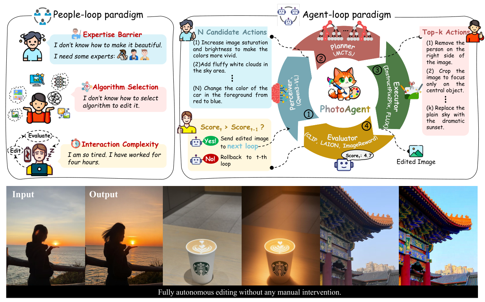

**图 1.** *PhotoAgent 可自主地执行契合人类美学的高层、具备语义意义的编辑，超越了仅在色彩、对比度、光照等低层参数上的调整。左上：传统 People-loop 范式，用户承担专业壁垒、算法选型、交互复杂度三重负担；右侧：Agent-loop 范式，由 Perceiver（VLM）、Planner（MCTS）、Executor（InstructPix2Pix / Flux 等）、Evaluator（CLIP、LAION、ImageReward 集成）构成闭环，实现无人工干预的完全自主编辑。*

We argue that the next frontier in computational photography is not merely a single powerful editor or processor, but an autonomous editing agent that can enhance photos without requiring expert-level operation. Such an agent would emulate the decision-making process of a human photo editor, who strategically selects and sequences tools based on an assessment of the image's needs, and edits with specific tools. Recently, large vision and multimodal models (LVMs) have demonstrated remarkable perception and instruction-conditioned editing capabilities, making an autonomous editing agent feasible.

我们主张，计算摄影的下一前沿不是单一更强的 editor 或处理器，而是一个**无需用户达到专家级水平**就能增强照片的自主编辑智能体（agent）。这样的 agent 应当模拟人类修图师的决策过程 —— 能基于对图像需求的判断，策略性地选择并编排工具，用特定工具完成编辑。近期，大型视觉与多模态模型（LVM）已经展现出令人印象深刻的感知能力和指令条件下的编辑能力，使得构建这样一个自主编辑 agent 成为可能。

In this paper, we introduce **PhotoAgent**, a novel autonomous system that integrates large vision and multimodal models (LVMs) with a suite of editing tools into a coherent framework, enabling fully automated, high-quality photo editing. As illustrated in Fig. 1, PhotoAgent introduces **exploratory visual aesthetic planning** within a closed-loop framework. Unlike open-loop systems (e.g., GenArtist) that execute linear action sequences without feedback, PhotoAgent continuously evaluates its edits and strategically explores the editing space. This helps to avoid both short-sighted decisions and irrecoverable artifacts that commonly happen in greedy approaches, enabling coherent and high-quality results. In addition, PhotoAgent enables **context editing**, moving beyond the low-level adjustments (e.g., color, contrast, illumination) that existing photo-editing agents primarily perform. This is achieved through programmatic control over a rich library of editing actions and flexible editing tools, enabling semantically meaningful manipulations such as adding a sun to a dim sky, making the scene feel more vibrant and lively, or modifying objects in the scene.

本文提出 **PhotoAgent**：一个将大视觉-多模态模型与一组编辑工具有机整合到同一框架下的新颖自主系统，能完全自动地生产高质量照片编辑结果。如 Fig. 1 所示，PhotoAgent 在闭环框架内引入**探索式视觉美学规划（exploratory visual aesthetic planning）**。与 GenArtist 这类**开环**系统（执行线性动作序列而无反馈）不同，PhotoAgent 持续评估自身的编辑结果，并策略性地探索编辑空间。这有助于避免贪婪式做法常见的短视决策与不可恢复伪影，从而得到连贯一致、高质量的结果。此外，PhotoAgent 支持**语境式编辑（context editing）**，超出现有摄影编辑 agent 普遍停留的低层调整（色彩、对比度、光照等）范畴；这是通过对丰富的编辑动作库与灵活工具的程序化控制实现的，可以完成诸如"在昏暗天空中加太阳"、"让场景更鲜活生动"或"修改场景中的物体"等具有语义意义的操作。

To achieve this, PhotoAgent consists of four core components: a **perceiver**, a **planner**, an **executor**, and an **evaluator**. The process begins with a VLM-based perceiver (e.g., Qwen3-VL) that interprets the input image and produces a set of semantically meaningful editing actions. These candidate actions are then passed to a Monte Carlo Tree Search (MCTS)-based planner, which explores possible editing trajectories in a tree structure and selects the top-K most promising actions. This exploratory mechanism ensures that our system embodies exploratory visual aesthetic planning, avoiding myopic decisions. The selected actions are subsequently executed using either advanced image generation tools (e.g., Flux.1 Kontext) or traditional image processing libraries (e.g., OpenCV/PIL). Finally, the evaluator integrates feedback from multiple scoring modules, allowing only those actions that positively contribute to the image's aesthetic quality to pass. By iterating through this perceive–plan–execute–evaluate cycle, PhotoAgent forms a fully closed-loop process, enabling autonomous and reliable progress toward the final editing goal.

为实现这一目标，PhotoAgent 由四个核心组件构成：**感知器（perceiver）**、**规划器（planner）**、**执行器（executor）** 和 **评估器（evaluator）**。流程从基于 VLM 的 perceiver（如 Qwen3-VL）开始，它解读输入图像并产出一组具有语义意义的候选编辑动作。这些动作随后被送入一个基于蒙特卡洛树搜索（Monte Carlo Tree Search, MCTS）的 planner，其以树结构探索可能的编辑轨迹，并选出前 $K$ 条最有前景的动作。这一探索机制确保系统体现出"探索式视觉美学规划"，避免短视决策。所选动作接着交给 executor 执行：要么调用先进的图像生成工具（如 Flux.1 Kontext），要么调用传统图像处理库（如 OpenCV/PIL）。最后，evaluator 整合多个评分模块的反馈，仅让真正提升图像美学质量的动作通过。通过反复迭代"感知—规划—执行—评估"循环，PhotoAgent 构成一个完全闭环的流程，朝最终编辑目标自主而可靠地推进。

Additionally, one major challenge in this design is that existing image quality evaluation methods are insufficient for user-driven photo editing, also referred to as user-generated content (UGC). The core issue lies in the composition of existing datasets, where existing datasets are overly generic, containing AI-generated images, screenshots, advertisements, and posters, rather than authentic user-captured photographs. To address this, we introduce **UGC-Edit**, a dataset of 7,000 real user photos annotated with human aesthetic scores. We also train a reward model on UGC-Edit, enabling reliable evaluation of aesthetic quality for multi-step image editing. Finally, to comprehensively evaluate the editing, we construct a test set of real photographs consisting of 1,017 images, on which our system achieves state-of-the-art results across quantitative metrics, qualitative assessment, and user studies.

此外，本设计还面临一个重大挑战：现有图像质量评估方法无法胜任用户自产内容（user-generated content, UGC）的摄影编辑。问题根源在于现有数据集的构成 —— 这些数据集过于泛化，混入了 AI 生成图、截图、广告、海报等，并不是真正的用户拍摄照片。为此，我们引入 **UGC-Edit**：一个包含 7000 张真实用户照片并带有人工美学评分的数据集。我们还在 UGC-Edit 上训练了一个奖励模型，从而能对多步图像编辑进行可靠的美学质量评估。最后，为了综合评估编辑效果，我们构建了一个由 1017 张真实照片构成的测试集；在其上，我们的系统在量化指标、定性评价和用户研究三方面均取得了当前最优的结果。

In summary, this work makes the following contributions:

- We propose **PhotoAgent**, an autonomous editing system that integrates a closed-loop architecture with a suite of editing and evaluation tools, enabling robust multi-step editing.
- We introduce a **visual aesthetic planner** to explore sequences of editing actions over long horizons, enabling deliberate, goal-driven image editing.
- We present the **UGC-Edit dataset** and introduce a reward model to support aesthetic research in autonomous image editing. We also introduce a test set of real photographs for evaluating autonomous photo editing.
- Extensive experiments demonstrate that our complete system achieves significant improvements in editing quality.

综上所述，本文的贡献如下：

- 提出 **PhotoAgent**：一个将闭环架构与一整套编辑/评估工具整合在一起的自主编辑系统，支持稳健的多步编辑。
- 引入**视觉美学规划器**，在长时程上探索编辑动作序列，实现审慎、目标驱动的图像编辑。
- 发布 **UGC-Edit 数据集**并给出对应的奖励模型，以支撑自主图像编辑中的美学研究；同时提供一个用于评估自主摄影编辑的真实照片测试集。
- 大量实验表明，完整系统在编辑质量上取得显著提升。

### 2. Related Work

**Image Editing.** Early pioneering works primarily leverage Generative Adversarial Networks (GANs) or conditional encoder-decoder architectures for tasks like style transfer and attribute manipulation. For example, CycleGAN proposes unpaired image-to-image (I2I) translation, and StarGAN enables multi-attribute manipulation within a single model. However, these approaches are inherently limited since their editing capabilities are confined to the narrow distribution of their training data, which often struggle with open-vocabulary requests. They frequently produce low-resolution or artifact-ridden outputs.

**图像编辑。** 早期开创性工作主要基于生成对抗网络（GAN）或条件式编码器-解码器架构来完成风格迁移、属性操控等任务。例如 CycleGAN 提出了非配对的 image-to-image (I2I) 翻译，StarGAN 在单一模型中实现了多属性操控。然而这些方法本质上受限于训练数据的狭窄分布，难以处理开放词表（open-vocabulary）的请求，输出常常是低分辨率或充满伪影的。

A paradigm shift was ushered in by the advent of powerful diffusion models and their integration with natural language. Models like Stable Diffusion treat image editing as conditional image generation, where the input image serves as a foundational condition. Recent methods (e.g., Prompt-to-Prompt, InstructPix2Pix) manipulate the features in latent space to enable highly flexible editing following open-vocabulary instructions. This progress continues with next-generation architectures based on flow matching (e.g., Flux) and the integration of powerful Multimodal Large Language Models (MLLMs) like GPT-4o, Show-o, Bagel, Nano Banana and HunyuanImage-3.0, which aim to tightly couple reasoning and generation. Despite these remarkable advances, a critical limitation exists. These models act primarily as single-step, static executors. Their performance is highly sensitive to meticulously engineered, low-level prompts, placing the burden of designing instructions and evaluations on the amateur user. These limitations prevent the method from handling complex, autonomous multi-step editing tasks, highlighting the need for a higher-level, planning-based framework.

一次范式转变由强大的扩散模型以及它们与自然语言的融合推动。Stable Diffusion 这类模型将图像编辑视为条件式图像生成，输入图像作为基本条件。近期方法（例如 Prompt-to-Prompt、InstructPix2Pix）在潜空间（latent space）中操纵特征，实现了对开放词表指令的高度灵活的编辑。基于流匹配（flow matching）的下一代架构（如 Flux），以及与强多模态大模型 MLLM（如 GPT-4o、Show-o、Bagel、Nano Banana、HunyuanImage-3.0）的结合，继续推动着这一进程，目标是将推理与生成紧密耦合。然而一个关键局限始终存在：这些模型本质上是单步、静态的执行器；其性能对精心调教的低层 prompt 非常敏感，把设计指令和评估结果的重担压在了非专业用户头上。这些局限使其无法处理复杂的、自主的多步编辑任务，凸显了引入更高层次、规划式框架的必要。

**Planning with Autonomous Agents.** To overcome the above limitations, a promising direction is to design an autonomous agent framework capable of multi-step planning and execution. Early works such as AlphaGo employ planning algorithms like Monte Carlo Tree Search (MCTS) to navigate state spaces. Recently, LLM-based agents leverage LLM's reasoning capability to decompose tasks into sequences of actions (e.g., HuggingGPT, ReAct, and Voyager).

**基于自主智能体的规划。** 为克服上述局限，一个有前景的方向是设计能进行多步规划与执行的自主 agent 框架。早期工作如 AlphaGo 采用 MCTS 这类规划算法遍历状态空间。近年，基于大模型的 agent（如 HuggingGPT、ReAct、Voyager）则借助 LLM 的推理能力把任务分解为动作序列。

Within computer vision, works have explored integrating planning into image editing tasks. Some approaches, such as JarvisArt, MonetGPT, and PhotoArtAgent leverage an LLM as a planner to parse a complex instruction into a sequence of calls to specialized image processing software. However, existing methods mainly focus on low-level editing tasks, such as color, tone, or exposure adjustments using procedural software tools like Lightroom or GIMP, which are limited to pure retouching.

在计算机视觉领域，已有工作尝试把规划引入图像编辑任务。JarvisArt、MonetGPT、PhotoArtAgent 等方法用 LLM 作为规划器，把复杂指令拆解为对专用图像处理软件的一连串调用。然而现有方法主要关注低层编辑任务（色彩、色调、曝光等），使用 Lightroom、GIMP 等程序化工具，仅限于纯粹的后期修饰。

More recent researches begin to explore directly applying MCTS and other search strategies to the text-to-image (T2I) generation process itself, building a search tree in the latent or textual space to find sequences of actions that better satisfy a high-level goal. However, existing methods have no planning capability for instruction-based image editing. Our approach addresses this through an MCTS planner that considers internal simulation with external execution. We also employ a learned reward model trained on user preferences to guide the search. This combination enables robust planning with a diverse toolset and is supported by a new editing-specific benchmark for evaluation.

更晚近的研究开始直接把 MCTS 等搜索策略应用到文本生图（text-to-image, T2I）的生成过程本身，在潜空间或文本空间中建搜索树，寻找更满足高层目标的动作序列。然而现有方法对指令驱动的图像编辑并不具备规划能力。本文通过一个**同时考虑内部仿真与外部执行**的 MCTS 规划器来填补这一空缺；同时，我们使用一个在用户偏好上训练得到的奖励模型引导搜索。这一组合使得我们在多样化工具集上的规划变得稳健，并以一个新的、面向编辑场景的基准（benchmark）支撑评估。

**Image Evaluation.** In an automated image editing pipeline, the evaluator is important, as it defines the reward function that guides the agent's actions and determines the final output. Traditional full-reference image quality metrics, such as Peak Signal-to-Noise Ratio (PSNR) and Structural Similarity Index (SSIM), are not suited for this open-world setting. They require a ground-truth target image, which is obviously impossible for creative editing tasks.

**图像评估。** 在自动化图像编辑流水线中，评估器至关重要 —— 它定义了指导 agent 动作、决定最终产出的奖励函数。传统全参考（full-reference）质量指标如 PSNR、SSIM 并不适合这种开放世界场景，因为它们需要一张 ground-truth 目标图，而这对于创造性编辑任务显然不存在。

The community then turns to no-reference metrics, including distribution-based measures like Fréchet Inception Distance (FID), aesthetic predictors, or CLIP-based image-text alignment scores. While a step forward, these metrics are often too broad to provide reliable, fine-grained signals for specific editing tasks on user-generated content (UGC). They cannot capture the subtle quality differences that are crucial in specific image editing tasks, such as aesthetic-oriented editing. To address this limitation, we introduce a specialized UGC evaluation dataset and train a reward model on the dataset. The reward model is adopted from a pretrained vision-language model (VLM) that contains inherent knowledge. The dataset and model enable learning of aesthetic evaluation, providing precise feedback to guide the agent toward high-quality results.

社区于是转向无参考指标：基于分布的 FID、美学预测器、或 CLIP 基础上的图文对齐分数。这些虽然是进步，但往往过于粗放，无法在 UGC 场景的具体编辑任务中提供可靠且细粒度的信号，也难以捕捉美学导向编辑中至关重要的细微差异。针对这一局限，我们引入一个面向 UGC 的专用评估数据集，并在其上训练一个奖励模型 —— 该模型从预训练视觉-语言模型（VLM）初始化以保留其先验知识。数据集与模型共同支撑了美学评估能力的学习，为 agent 提供精确反馈以产出高质量结果。

### 3. PhotoAgent

We propose PhotoAgent, an autonomous image editing system capable of executing multi-step editing tasks through a structured, closed-loop framework. As shown in Fig. 1, the system comprises four core components: a perceiver that interprets the input image and generates candidate editing actions, an MCTS-based planner that explores and selects potential editing actions, an executor that applies the edits, and an evaluator that assesses the editing results. In addition, PhotoAgent incorporates a tool-selection module to dynamically choose suitable editing tools and a memory module that records editing history, enabling informed planning, reflection, and consistent decision-making across multiple editing steps. The system operates iteratively through a perceive–plan–execute–evaluate cycle, where the closed-loop process continues until the editing objective is met or a termination condition is satisfied.

我们提出 PhotoAgent：一个能够在结构化闭环框架下完成多步编辑任务的自主图像编辑系统。如 Fig. 1 所示，系统由四个核心组件构成：负责解读输入图像并生成候选编辑动作的 perceiver；基于 MCTS 探索并选择编辑动作的 planner；执行编辑的 executor；评估编辑结果的 evaluator。此外，PhotoAgent 包含一个动态选择合适编辑工具的**工具选择模块**，以及一个记录编辑历史的**记忆模块**，使得跨多轮编辑的规划、反思、决策能保持一致性且有据可依。系统通过"感知—规划—执行—评估"循环迭代运行，闭环过程持续进行，直到达成编辑目标或触发终止条件。

**Perceiver: Instruction Generation.** The perceiver utilizes a VLM, e.g., LLaVA, Qwen3-VL, to analyze the visual input $I_t$ and generate a set of $K$ diverse and atomic editing actions $\{a_t^k\}_{k=1}^K$. To this end, we introduce a structured, context-aware multimodal prompting scheme that conditions the VLM on both the current visual scene and aesthetic attributes, enabling the perceiver to act as an aesthetic-driven instruction generator. This structured, context-aware scheme has the following capabilities. (a) The perceiver supports both fully autonomous editing, where no explicit user command is provided, and user-guided editing, where users may express intent through mood, atmosphere, or feeling rather than concrete objects or operations. (b) We also let the perceiver infer the scene type and use it with the scene-aware prompt. This allows the agent to generate tailored strategies for different types of scenes. For example, for images with a human subject, we prioritize maintaining the character's appearance while allowing more aggressive modifications to the background. (c) Moreover, we perform memory mechanisms that record the outcomes of each editing round to guide subsequent instruction generation. Over time, these records form a static strategy memory that helps the agent improve continuously and produce diverse, contextually appropriate edits. See Appendix H for detailed prompt and memory (history) design.

**Perceiver：指令生成。** Perceiver 使用一个 VLM（如 LLaVA、Qwen3-VL）分析视觉输入 $I_t$，并生成一组 $K$ 个多样且原子化的编辑动作 $\{a_t^k\}_{k=1}^K$。为此我们引入了一种结构化、上下文感知的多模态提示方案，把 VLM 同时锚定在当前视觉场景和美学属性上，使 perceiver 成为一个"美学驱动的指令生成器"。此方案具备以下能力：(a) Perceiver 同时支持完全自主编辑（用户不给显式命令）和用户引导编辑（用户可以用情绪、氛围、感觉等抽象描述来表达意图，而非具体对象或操作）。(b) 我们让 perceiver 自行推断场景类型并把它输入场景感知的提示，使 agent 能对不同场景生成定制策略。例如对人像，我们优先保持人物外貌，而允许对背景做更激进的修改。(c) 我们还引入记忆机制（memory），记录每一轮编辑的结果以指导后续指令生成。这些记录随时间累积形成静态策略记忆，帮助 agent 持续改进并产生多样、符合上下文的编辑。详细的 prompt 与历史设计见附录 H。

**Planner: MCTS-Based Action Exploration.** The planner chooses the candidate actions through an MCTS-based planning process, as shown in Fig. 2. Specifically, unlike existing methods that edit without planning, our planner enables the agent to simulate sequences of future edits, evaluating their long-term consequences before execution. This approach avoids short-sighted decisions and irreversible mistakes. To achieve this, MCTS consists of four phases: selection, expansion, simulation, and backpropagation.

**Planner：基于 MCTS 的动作探索。** Planner 通过一个基于 MCTS 的规划流程挑选候选动作，如 Fig. 2 所示。与那些"直接编辑、不做规划"的现有方法不同，本规划器让 agent 能**先仿真未来的编辑序列**，在真正执行前评估其长期后果；这一做法避免了短视决策与不可逆错误。MCTS 由四个阶段构成：选择（selection）、扩展（expansion）、模拟（simulation）、反向传播（backpropagation）。

In the selection phase, the planner starts from the root node representing the current image and chooses which candidate edits to explore next. These candidates come from the perceiver's output. The traversal balances exploration of new edits with exploitation of high-reward ones. When reaching a leaf node, the expansion phase adds new child nodes representing potential editing actions. For example, when evaluating an action like "adjust the color balance to enhance the blue of the sky and the green of the water", it creates a new node to represent the resulting image state.

在选择阶段，planner 从代表当前图像的根节点出发，决定接下来探索哪条候选编辑 —— 候选来自 perceiver 的输出。遍历策略在"探索新编辑"与"利用高奖励编辑"之间取得平衡。抵达叶节点时，扩展阶段会添加新子节点以表示潜在的编辑动作；例如，在评估"调整色彩平衡以增强天空蓝色与水面绿色"这样一个动作时，会创建一个新节点来表示对应的图像状态。

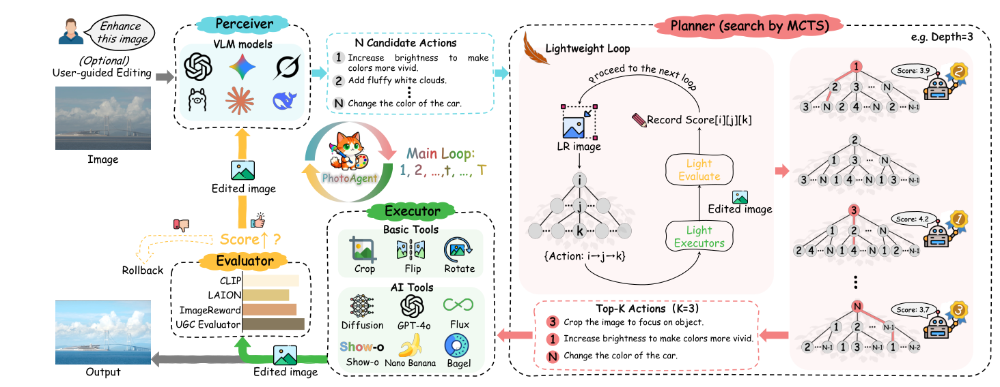

**图 2.** *PhotoAgent 的详细循环。首先，Perceiver 从当前图像提取语义线索并提出 N 条候选编辑动作；随后 Planner（MCTS 搜索）在轻量 loop 中按深度 d（例如 3）对候选动作做仿真，在降分辨率下由 Light Evaluate + Light Executors 打分并记录 Score[i][j][k]，选出 Top-K 动作；Executor 用基础工具（Crop/Flip/Rotate）或 AI 工具（Diffusion/GPT-4o/Flux/Show-o/Nano Banana/Bagel）执行，Evaluator 集成 CLIP、LAION、ImageReward、UGC Evaluator 给分后判断 Score 是否提升，不提升则回滚（Rollback）。*

In the simulation phase, we evaluate candidate edits efficiently using a fast-approximation environment. To speed up simulations, we use reduced-resolution processing, which preserves essential visual and semantic information. We verify that this approximation does not introduce a significant sim-to-real gap, as demonstrated in Appendix A.

在仿真阶段，我们用一个"快速近似环境"高效评估候选编辑。为加速仿真，我们采用降分辨率处理，同时保留关键的视觉和语义信息。我们验证了这一近似不会带来显著的 sim-to-real 差距，见附录 A。

Finally, during backpropagation, we calculate the reward value and propagate it back through the tree. This updates the visit count and average reward of each visited node, helping the selection phase make better decisions. After a number of simulations, the algorithm selects the action with the highest average reward or the most visits from the root node for actual execution.

最后，在反向传播阶段，我们计算奖励值并沿树回传，更新每个被访问节点的访问次数和平均奖励，帮助下一轮选择阶段做出更好决策。在若干次仿真之后，算法从根节点挑选平均奖励最高或访问次数最多的动作作为实际执行对象。

**Executor: Action Execution.** Then, the executors actually run the selected actions on the image. In practice, we select the top-K actions rather than only the action with the highest score, which ensures robustness and avoids simulation inaccuracies in the previous step. For each action, our system selects between traditional operators, e.g., color adjustment or cropping via OpenCV/PIL, and advanced generative models, e.g., FLUX.1 Kontext or Step1X-Edit. We then employ the evaluator to evaluate all results, retaining only the highest-scoring output as the next state $I_{t+1}$. This approach ensures that our final decisions are grounded in real outcomes rather than simulated estimates, significantly improving the reliability of our editing trajectory.

**Executor：动作执行。** 接下来，executor 在图像上真正执行选定动作。实践中我们选择 top-K 条动作而非仅选最高分那条，以此提升鲁棒性、规避上一步仿真误差。对每条动作，系统在两类工具之间选择：传统运算符（如 OpenCV/PIL 实现的色彩调整、裁剪）和先进生成模型（如 FLUX.1 Kontext、Step1X-Edit）。随后 evaluator 评估所有结果，只保留得分最高的输出作为下一状态 $I_{t+1}$。这种做法把最终决策锚定在真实结果而非仿真估计上，显著提升了编辑轨迹的可靠性。

**Evaluator: Outcome Evaluation.** The evaluator assesses the set of edited images $\{I_t^k\}_{k=1}^K$ produced by executing the top-K actions, and outputs each an assessment score $\{r_t^k\}_{k=1}^K$. PhotoAgent employs an ensemble evaluation strategy that integrates traditional no-reference metrics (such as NIQE and BRISQUE), modern instruction-based assessment (such as CLIP-based aesthetic scoring and instruction-following evaluation), and customizable perceptual models (see Section 4), to provide a comprehensive evaluation. We provide detailed settings in the Appendix C.

**Evaluator：结果评估。** Evaluator 对执行 top-K 动作得到的编辑图集合 $\{I_t^k\}_{k=1}^K$ 逐一打分，输出评估分数 $\{r_t^k\}_{k=1}^K$。PhotoAgent 采用集成式评估策略：融合传统无参考指标（NIQE、BRISQUE 等）、基于指令的现代评估（基于 CLIP 的美学评分、指令遵循评估）、以及可定制的感知模型（见 §4），以提供全面评估。详细设置见附录 C。

The highest candidate score is compared against the score of the input image $I_{t-1}$. If an improvement is observed, the corresponding image is selected as the next state. Otherwise, the system reverts to $I_{t-1}$. The process terminates when the maximum number of steps is reached or updates no longer change the result.

候选最高分会与输入图 $I_{t-1}$ 的分数比较；若有提升则取对应图为新状态，否则回退到 $I_{t-1}$。当达到最大步数或更新不再改变结果时，流程终止。

### 4. Evaluation for Editing Systems

Effective evaluation is critical for autonomous image editing, where systems must assess aesthetic quality in a way that aligns with human preferences and directly guides multi-step decision-making. Existing image quality metrics are largely designed for generic images and are ill-suited for user-generated photos, especially in editing scenarios that require fine-grained and subjective judgments. To address this limitation, as shown in Fig. 3, we introduce a comprehensive evaluation framework that includes (i) a UGC-specific preference dataset for training aesthetic reward models, (ii) a learned reward model tailored to user-generated photos. Furthermore, we construct a real-world photo editing benchmark for evaluating end-to-end editing performance.

对自主图像编辑而言，有效评估至关重要：系统必须以与人类偏好一致的方式评估美学质量，并直接指导多步决策。现有图像质量指标大多面向泛化图像设计，不适合 UGC 照片 —— 尤其是在需要细粒度、主观判断的编辑场景。为此，如 Fig. 3 所示，我们引入一个综合评估框架，包含：(i) 面向 UGC 的偏好数据集，用于训练美学奖励模型；(ii) 一个为用户照片量身定制的、学得的奖励模型。同时，我们还构建了一个真实世界照片编辑基准，用于评估端到端的编辑表现。

**UGC-Edit Dataset.** As shown in Fig. 3, we introduce UGC-Edit, a dataset of approximately 7,000 authentic user-generated photos designed for training aesthetic evaluation models in photo editing systems. Images are sourced from the LAION Aesthetic dataset and the RealQA benchmark. As they contain diverse web images beyond real user photos, we apply a two-stage filtering process: a vision-language model first categorizes image types, followed by manual verification to retain only images with clear UGC characteristics. We merge the two sources and normalize all aesthetic scores to a unified 1–5 scale. This dataset serves exclusively as supervision for training a UGC-specific reward model aligned with human aesthetic preferences.

**UGC-Edit 数据集。** 如 Fig. 3 所示，我们引入 UGC-Edit：约 7000 张真实用户照片组成的数据集，用于训练摄影编辑系统中的美学评估模型。图像来源于 LAION Aesthetic 数据集与 RealQA 基准。由于它们本身还包含各种网络图像而非仅限真实用户照片，我们采用两阶段过滤：先由视觉-语言模型做图像类型分类，再经人工校验，只保留具备明显 UGC 特征的图像。两来源合并后，所有美学评分统一归一到 1–5 标度。该数据集专用于训练与人类美学偏好对齐的 UGC 专用奖励模型。

**UGC Reward Model.** We train a UGC-specific reward model on UGC-Edit to predict fine-grained aesthetic scores reflecting human preferences, as shown in Fig. 3. The model is initialized from a pretrained vision-language model (Qwen2.5-VL) and optimized using Group Relative Policy Optimization (GRPO), which learns from relative rankings within image groups. This training strategy improves robustness to annotation noise and enables the model to capture subtle aesthetic cues for guiding multi-step photo editing. Importantly, the learned reward model constitutes one component of our evaluation framework. Final performance is assessed using a comprehensive evaluation protocol that combines multiple complementary metrics and human judgments. Detailed analyses are provided in Appendix B and C.

**UGC 奖励模型。** 我们在 UGC-Edit 上训练一个 UGC 专用奖励模型，用于预测反映人类偏好的细粒度美学分数，如 Fig. 3 所示。模型从预训练视觉-语言模型 Qwen2.5-VL 初始化，使用 **Group Relative Policy Optimization（GRPO）** 进行优化 —— 该方法从图像组内的相对排名中学习。这一训练策略提升了对标注噪声的鲁棒性，使模型能捕捉细微的美学线索以指导多步编辑。值得强调的是，学到的奖励模型只是我们评估框架的组件之一；最终性能通过综合协议评估，该协议融合了多种互补指标与人类判断。详细分析见附录 B 与 C。

**Editing Benchmark for Final Evaluation.** To evaluate the end-to-end performance of photo editing systems, we construct a separate benchmark consisting of 1,017 real-world photographs captured by different users and devices. It covers a diverse range of common photographic scenes, including portrait photography, natural landscapes, urban and architectural scenes, food photography, everyday objects, and low-light or night-time imagery. Each image is edited using multiple baseline methods for final evaluation. We report quantitative metrics, qualitative comparisons, and user study results on this benchmark to assess real-world editing effectiveness.

**用于最终评估的编辑基准。** 为评估摄影编辑系统的端到端性能，我们另构建了一个由 1017 张真实照片组成的基准，来自不同用户、不同设备。基准覆盖常见摄影题材：人像、自然风光、城市与建筑、食物、日常物品、夜景或低光场景。每张图都由多个基线方法进行编辑，供最终评估。我们在该基准上报告定量指标、定性对比以及用户研究结果，以衡量真实世界编辑效果。

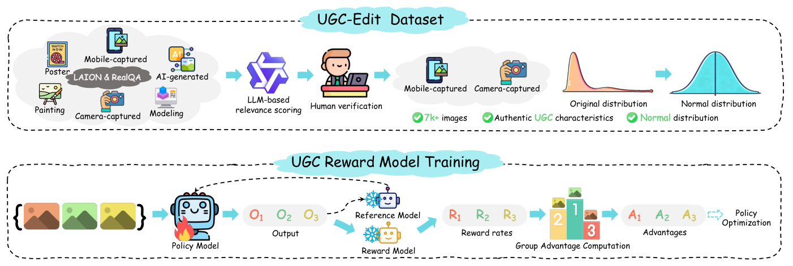

**图 3.** *UGC-Edit 数据集构建与奖励模型训练流程。从 LAION + RealQA 的多样图源出发（含海报、手机拍摄、AI 生成、绘画、建模、相机拍摄），先用 LLM 做相关性打分、再人工校验，最终保留 7k+ 张具备 UGC 特征的图像并将分数分布归一到近似正态。下半部分：以策略模型（Policy Model）为主、参考模型（Reference Model）与奖励模型（Reward Model）为辅，通过 Group Advantage Computation 从组内奖励 $\{R_1, R_2, R_3\}$ 得到优势 $\{A_1, A_2, A_3\}$ 进行策略优化（GRPO）。*

### 5. Experiments

#### 5.1 Implementation Details

We choose two groups of baselines for comparison, including non-agent methods and agent methods. For non-agent methods, we compare with InstructPix2Pix, SDXL+Prompt, and Flux.1 Kontext, which performs editing in a single step without planning capabilities. We use the vague editing prompt (i.e., "make this image better") to reflect realistic scenarios with ambiguous user intent. For agent methods, we compare with HuggingGPT (which generates all editing commands in a single call), ReAct (Open-loop, iteratively plans and executes without evaluation), and ReAct (Closed-loop, iteratively plans and incorporates an evaluator to decide action retention).

我们选取两组基线做对比：非 agent 方法与 agent 方法。非 agent 组包括 InstructPix2Pix、SDXL+Prompt、Flux.1 Kontext —— 这些方法在单步中完成编辑、无规划能力。我们对它们使用模糊 prompt（"make this image better"）以模拟真实中用户意图不明的场景。agent 组包括 HuggingGPT（单次调用生成全部编辑命令）、ReAct 开环（迭代规划+执行，无评估反馈）、ReAct 闭环（迭代规划并引入评估器来决定是否保留动作）。

We calculate two types of metrics: semantic alignment and non-reference image quality. For semantic alignment, we use CLIP Similarity (↑) to measure how well the edited image preserves the original content. For image quality, we report ImageReward (↑) to approximate human preference alignment, BRISQUE (↓) for non-reference image quality, and Laion-Reward (↑) for general aesthetic preference. Additionally, we report UGC Score (↑), which is calculated from our reward model fine-tuned on user-generated content (Section 4) to better reflect users' aesthetic preferences.

我们计算两类指标：语义对齐和无参考图像质量。语义对齐用 **CLIP Similarity（↑）** 衡量编辑图对原图内容的保真度。图像质量方面报告：**ImageReward（↑）** 近似人类偏好对齐、**BRISQUE（↓）** 无参考图像质量、**Laion-Reward（↑）** 通用美学偏好。此外我们还报告 **UGC Score（↑）**，由我们在用户自产内容上微调的奖励模型（§4）给出，以更好反映用户美学偏好。

#### 5.2 Main Results

**Quantitative Results.** We show the quantitative results in Table 1. It can be seen that PhotoAgent achieves the best BRISQUE score, which reveals the effectiveness of our framework. In contrast, GPT-4o exhibits an over-editing intent, often outputting overly vivid colors and exaggerated contrast. While such outputs may score well on perceptual metrics, they can introduce significant image distortions. In addition, our method attains competitive performance on other metrics such as ImageReward. As for agent-based baselines, their overall performance is limited. In open-loop settings, this is mainly because they lack visual feedback, which can cause errors to accumulate and the system to drift away from the correct trajectory. In closed-loop settings, their performance is also constrained, which may lead to suboptimal or short-sighted decisions. The results demonstrate the effectiveness of the PhotoAgent, especially in producing consistent improvements in both semantic alignment and aesthetic quality.

**量化结果。** Table 1 给出量化结果。可以看到 PhotoAgent 取得最佳 BRISQUE 分数，揭示本框架的有效性。对比之下，GPT-4o 表现出过度编辑倾向，常输出过鲜亮的色彩与夸张对比度 —— 虽然这在某些感知指标上可能讨巧，但会引入明显图像畸变。在 ImageReward 等其它指标上我们方法也具有竞争力。对基于 agent 的基线来说，整体表现受限：开环设置下主要是缺少视觉反馈，误差容易累积并使系统偏离正轨；闭环设置下其表现也受限，可能导致次优或短视的决策。结果展示了 PhotoAgent 在语义对齐与美学质量两端同时持续改善的有效性。

**Table 1.** *Quantitative comparison of different planning strategies. The best results are in bold, and the second best are underlined.*

| Methods | CLIP Similarity ↑ | ImageReward ↑ | BRISQUE ↓ | Laion-Reward ↑ | UGC Score ↑ |
|---|---|---|---|---|---|
| GPT-4o | 0.6015 | **0.4115** | 0.7215 | 0.5131 | **4.210** |
| InstructPix2Pix | 0.6123 | 0.3824 | 0.6976 | 0.4826 | 3.428 |
| SDXL | 0.6079 | 0.3801 | 0.7189 | 0.4944 | 3.277 |
| Flux.1 Kontext | 0.6037 | 0.3971 | 0.6831 | 0.4973 | 3.561 |
| HuggingGPT | 0.6006 | 0.3993 | 0.6992 | 0.4921 | 3.420 |
| ReAct (Open-loop) | 0.6059 | 0.3872 | 0.6485 | 0.4989 | 3.175 |
| ReAct (Closed-loop) | 0.6027 | 0.3962 | 0.6422 | 0.5011 | 3.258 |
| **PhotoAgent (Ours)** | **0.6254** | 0.4079 | **0.6217** | **0.5134** | 4.176 |

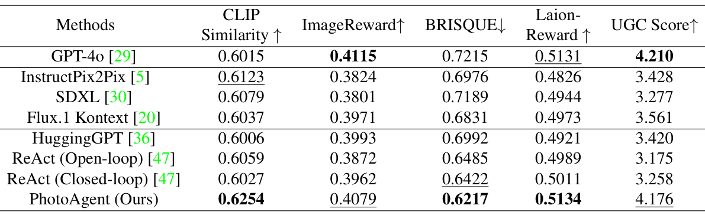

**表 1.** *不同规划策略的量化对比。最佳加粗，次佳加下划线。PhotoAgent 在 CLIP Similarity、BRISQUE、Laion-Reward 上取得最佳，UGC Score 接近 GPT-4o。*

**Qualitative Results.** We also show qualitative comparisons in Fig. 4 to clearly demonstrate PhotoAgent's effectiveness. We observe that non-agent methods, such as GPT-4o, often apply generic edits and fail to address specific issues when given vague instructions (e.g., "make this image better"). Meanwhile, we find that agent-based baselines often suffer from error accumulation and make short-sighted planning decisions, resulting in unsatisfactory visual output. In contrast, PhotoAgent effectively explores multiple editing paths through a closed-loop planning mechanism, and progressively selects and executes the most appropriate editing actions.

**定性结果。** Fig. 4 的定性对比清晰展示 PhotoAgent 的效果。我们观察到：非 agent 方法（如 GPT-4o）在面对模糊指令（如"make this image better"）时往往做通用化的编辑、无法针对具体问题；agent 基线则经常受累于误差累积和短视规划，输出质量不佳。相比之下，PhotoAgent 通过闭环规划机制有效探索多条编辑路径，逐步选择并执行最合适的编辑动作。

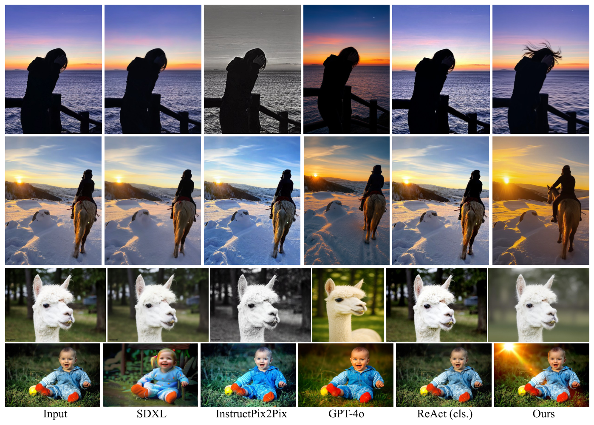

**图 4.** *定性结果。PhotoAgent 通过自主改善色彩协调性、构图与美学表现力生成更具视觉愉悦感的编辑，往往能带来更强的视觉叙事（行依次为人物剪影、骑马雪景、羊驼、婴儿；列为 Input / SDXL / InstructPix2Pix / GPT-4o / ReAct (cls.) / Ours）。*

**User Study.** To further validate the effectiveness and robustness of PhotoAgent, we conduct a user study involving 20 participants across 27 real-world editing scenarios, collecting a total of 540 votes. Participants are asked to select their preferred result based on both visual quality and willingness to share. As shown in Table 2, PhotoAgent is consistently favored over several baseline methods, demonstrating its effectiveness in real-world settings.

**用户调查。** 为进一步验证 PhotoAgent 的有效性与鲁棒性，我们开展了 20 名参与者、27 个真实编辑场景、共计 540 票的用户调查。参与者依据视觉质量和分享意愿选择偏好结果。如 Table 2 所示，PhotoAgent 持续优于多个基线方法，展现了其真实场景下的有效性。

**Table 2.** *User study results (percentage of votes selecting each method as the best).*

| Method | HuggingGPT | ReAct (cls.) | GPT-4o | **PhotoAgent (Ours)** |
|---|---|---|---|---|
| Vote % | 12.6% | 15.2% | 30.2% | **42.0%** |

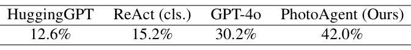

**表 2.** *用户调查结果：各方法被选为最佳的票数占比。PhotoAgent 以 42.0% 遥遥领先 GPT-4o（30.2%），两个 agent 基线得票率更低。*

#### 5.3 Ablation Studies

We perform ablation studies to verify the key designs of PhotoAgent. We examine the effect of the UGC evaluator by removing it from the framework, which significantly decreases aesthetic metrics like Laion-Reward. This confirms the reward model's effectiveness in editing preferences. In addition, we investigate the importance of simulation times. Limiting the number of MCTS simulations to 10 results in suboptimal decisions, which demonstrates the necessity of strategic planning. Likewise, reducing the MCTS search depth to 1 can effectively implement greedy selection, leading to lower performance on multi-step edits. Overall, our results indicate that the evaluator, the depth of planning, and the number of simulations all play important roles in PhotoAgent's performance. Additional details are provided in the Appendix.

我们对 PhotoAgent 的关键设计做消融。一是去除 UGC evaluator：Laion-Reward 等美学指标明显下降，印证奖励模型在编辑偏好捕捉上的有效性。二是研究仿真次数的重要性：限制 MCTS 仿真次数到 10，决策次优化，说明策略规划的必要性。三是将 MCTS 搜索深度降到 1（实际等价于贪婪选择），在多步编辑上表现下降。总体而言，evaluator、规划深度与仿真次数都对 PhotoAgent 的性能有重要影响。更多细节见附录。

#### 5.4 Analysis

**Comparison with existing editing agents.** Compared with recent editing agent systems such as JarvisArt, 4KAgent, and Agent Banana, PhotoAgent is designed as a more general and flexible framework for agentic photo editing.

**与已有编辑 agent 的对比。** 与 JarvisArt、4KAgent、Agent Banana 等近期编辑 agent 系统相比，PhotoAgent 被设计为一个更通用、更灵活的代理式照片编辑框架。

First, while many existing systems are developed around specific tasks (for example, JarvisArt focuses on image retouching, and 4KAgent targets super-resolution), PhotoAgent is explicitly formulated as a general photo-editing agent. It can handle a broad spectrum tasks ranging from basic retouching (exposure, color and tone adjustments) to high-level semantic operations such as object addition/removal, composition changes, and background replacement.

第一，已有系统多围绕特定任务展开（例如 JarvisArt 专注于修图、4KAgent 针对超分辨率），而 PhotoAgent 显式定位为通用摄影编辑 agent。它能处理从基础修饰（曝光、色彩、色调调整）到高阶语义操作（物体增删、构图变更、背景替换）的广泛任务。

Second, rather than binding to a single editor, PhotoAgent integrates a pool of heterogeneous executors and dynamically routes each instruction type to the empirically best-performing tool on public multi-turn editing benchmarks, so as to fully exploit different tools' strengths.

第二，PhotoAgent 不绑定单一 editor，而是整合一个异构执行器池，按每种指令类型动态路由到在公开多轮编辑基准上表现最好的工具，从而充分发挥不同工具的优势。

Third, PhotoAgent includes a UGC-oriented evaluator trained on real user photos and aesthetic ratings, so that the resulting images better reflect real users' preferences and values instead of optimizing only generic aesthetic scores.

第三，PhotoAgent 内置一个面向 UGC 的评估器，在真实用户照片与美学评分上训练得到；这使得结果图像更能反映真实用户的偏好与价值取向，而不只是优化通用美学分数。

Finally, PhotoAgent incorporates a long-horizon planning mechanism that supports exploratory aesthetic optimization, which is beneficial for the multi-round editing. Collectively, these distinctions position our method as a more general, adaptive, and user-aligned alternative to prior specialized solutions.

最后，PhotoAgent 引入长时程规划机制以支持探索式美学优化，这在多轮编辑中带来可观收益。综合以上差异，本方法相对先前那些专用方案更为通用、自适应且用户对齐。

**Editing Process.** As shown in Fig. 5, PhotoAgent first adjusts the overall tone to significantly enhance the image's aesthetic quality. Based on it, PhotoAgent can further edit specific objects, such as flying birds, which makes scene appear more lively and dynamic. This iterative strategy allows PhotoAgent to simultaneously preserve the original content and improve aesthetics, highlighting its effectiveness and robustness in producing visually compelling results.

**编辑过程。** 如 Fig. 5 所示，PhotoAgent 先整体调整色调以显著提升图像美学质量；在此基础上，它能进一步编辑具体对象（如飞鸟），让场景显得更鲜活、有动态感。这种迭代策略让 PhotoAgent 能同时保留原内容并提升美学，体现其在生成视觉吸引力结果上的有效性与稳健性。

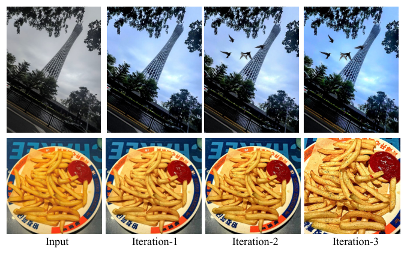

**图 5.** *PhotoAgent 的三步迭代编辑过程（Input → Iteration-1 → Iteration-2 → Iteration-3）。首步先对整张图做色调/天空提升，第二、三步再加入具体对象（飞鸟）或精细细节（薯条纹理），展示"先整体、后局部"的贪婪策略。*

**User-guided Editing.** PhotoAgent supports not only fully autonomous editing, but also user-guided editing, which is common in real-world usage. In the user-guided setting, users are not required to specify concrete objects or explicit editing operations. Instead, they may express high-level intent through abstract descriptions such as mood, atmosphere, or emotional tone. As illustrated in Fig. 6, PhotoAgent is able to interpret such guidance and produce visually appealing results with distinct styles under different prompts. This flexibility enables PhotoAgent to effectively align with the real-world application scenarios.

**用户引导编辑。** PhotoAgent 不仅支持完全自主编辑，也支持用户引导编辑 —— 后者在真实使用中非常常见。用户无需指定具体对象或显式编辑操作，而可以通过抽象描述（情绪、氛围、情感色调）表达高层意图。如 Fig. 6 所示，PhotoAgent 能解读这些引导，并在不同 prompt 下生成具有差异风格的、视觉愉悦的结果。这种灵活性让 PhotoAgent 能有效贴合真实应用场景。

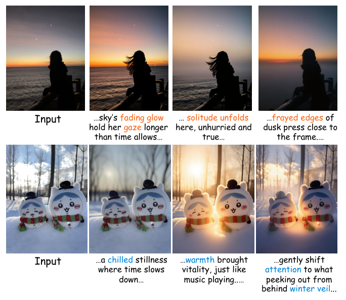

**图 6.** *用户引导的编辑。第一行：对同一张剪影 Input，根据"sky's fading glow"、"solitude unfolds"、"frayed edges of dusk"三种不同情绪提示给出不同风格的美学调整。第二行：对雪中玩偶 Input，按"chilled stillness"、"warmth brought"、"gently shift attention"分别生成不同氛围的结果。*

**Terminate Condition.** PhotoAgent employs two complementary early stopping strategies to prevent unnecessary edits on high-quality images: (1) a maximum iteration limit, which forces termination after a predefined number of steps, and (2) a no-improvement criterion, which stops editing if the evaluator detects no significant score improvement over N consecutive iterations. These mechanisms ensure that high-quality images are not over-edited.

**终止条件。** PhotoAgent 采用两个互补的早停策略防止对高质量图的不必要编辑：(1) 最大迭代上限，在预设步数后强制终止；(2) 无提升准则，若 evaluator 连续 N 轮都未检测到显著分数提升，则停止编辑。这些机制确保高质量图像不会被过度编辑。

### 6. Conclusion

We present PhotoAgent, an autonomous image editing system that reframes photo editing as a sequential decision-making process, reducing the reliance on precise human instructions. The novelty arises from the coordinated interaction of multiple modules rather than innovating on the underlying editing models themselves. Specifically, the system integrates four key components: an LLM-based perceiver, an MCTS-driven exploration strategy, a tool-based executor, and a VLM-based evaluator, forming a closed-loop framework supported by the proposed UGC-Edit dataset. Experimental results demonstrate that PhotoAgent outperforms existing methods in producing semantically coherent and aesthetically consistent enhancements. The framework provides a foundation for more photo editing in future work.

我们提出 PhotoAgent：一个将照片编辑重新建模为顺序决策过程的自主图像编辑系统，降低了对精确人工指令的依赖。新颖之处在于多模块的协同运作，而非对底层编辑模型本身的创新。具体来说，系统融合了四个关键组件：基于 LLM 的 perceiver、MCTS 驱动的探索策略、工具式 executor、基于 VLM 的 evaluator，构成一个以 UGC-Edit 数据集支撑的闭环框架。实验结果表明，PhotoAgent 在生成语义连贯、美学一致的增强结果上优于已有方法。该框架为未来更多的摄影编辑工作奠定了基础。

---

*References omitted — see original PDF.*

---

### 附录精读（关键内容节译） | Appendix Highlights (condensed bilingual)

#### A. Sim-to-Real Gap in Low-Resolution Planner Simulation

PhotoAgent uses reduced-resolution rollouts to make MCTS planning computationally feasible. This raises the question of whether an action sequence that scores well in low-resolution simulation remains optimal when executed at full resolution. To address this, the system incorporates several design choices that effectively control the sim-to-real gap.

PhotoAgent 在 MCTS 规划中使用降分辨率 rollout 以压低算力；这自然引出一个问题：在低分辨率仿真里得分高的动作序列，放到全分辨率执行时还是最优的吗？系统通过若干设计有效控制这一 sim-to-real gap。

- **Evaluator Consistency across Resolutions**：Evaluator 在不同分辨率下打分一致性高，Table 3 给出量化对齐。
- **Full-Resolution Re-Scoring of Top-K Candidates**：MCTS 仅保留 top-K 候选，送入全分辨率评估后再选；避免低分辨率误差传到最终决策。
- **Closed-Loop Replanning after Each Executed Edit**：每次执行一步完毕，MCTS 从新图重启搜索，从而不让仿真与执行间的偏差跨步累积。

**Table 3.** *Consistency between simulated (low-resolution) rewards and full-resolution rewards.*

| Metric | 1/2 resolution | 1/4 resolution |
|---|---|---|
| Top-1 retention (same best) | 85% | 75% |
| Top-3 retention | 100% | 90% |
| Spearman correlation | 0.94 | 0.79 |
| Kendall τ | 0.90 | 0.73 |

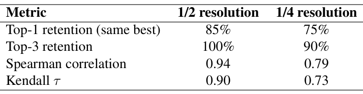

**表 3.** *仿真（低分辨率）奖励与全分辨率奖励之间的一致性。即便在 1/4 分辨率下，top-3 保留率仍达 90%，但 top-1 只有 75%，这是论文认为还需 full-res re-score 的主因。*

#### B. Generalization of UGC Reward Model

To test how well our reward model generalizes beyond the UGC-Edit dataset, we evaluate it on the external PARA dataset, which includes a wide variety of content, styles, and lighting conditions. PARA provides aesthetic scores annotated by humans. Table 4 shows the correlation between the model's predictions and human aesthetic judgments. The model achieves SRCC scores around 0.75, surpassing prior state-of-the-art PIAA models, which attain roughly 0.70–0.72.

为检验奖励模型在 UGC-Edit 之外的泛化能力，我们在外部 PARA 数据集上评估 —— 该数据集覆盖多样的内容、风格与光照条件并提供人工美学评分。Table 4 展示模型预测与人类判断的相关性。模型取得约 0.75 的 SRCC，超过此前 SOTA 的个性化图像美学评估模型（PIAA）大约 0.70–0.72 的水平。

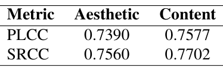

**Table 4.** *Correlation of the reward model with human judgments on the PARA dataset.*

| Metric | Aesthetic | Content |
|---|---|---|
| PLCC | 0.7390 | 0.7577 |
| SRCC | 0.7560 | 0.7702 |

**表 4.** *奖励模型与 PARA 数据集上人类判断的相关性。SRCC ≈ 0.75 已超过此前 SOTA 的 PIAA（约 0.70–0.72）。*

#### C. Experimental details

- **MCTS 伪代码**：见下方 Algorithm 1（从根节点 $s_t$ 出发，以 UCT 选择动作直至叶节点 $s_L$；在 $s_L$ 用 perceiver 扩展，之后 rollout 至深度 $d$ 由 evaluator 给出奖励 $G$；$G$ 沿路径反向传播更新 $Q(s,a)$、$N(s,a)$）。
- **VLM Planner 超参**：max token 1024，temperature 0.7，top-p 0.8。
- **Evaluator 权重**：CLIP=1.0、aesthetic model=2.0、ImageReward=2.0、UGC evaluator=0.8，总归一为 5.8。UGC evaluator 生成端 temperature 0.7、top-p 0.9、max token 32。

#### D. More Visual Results

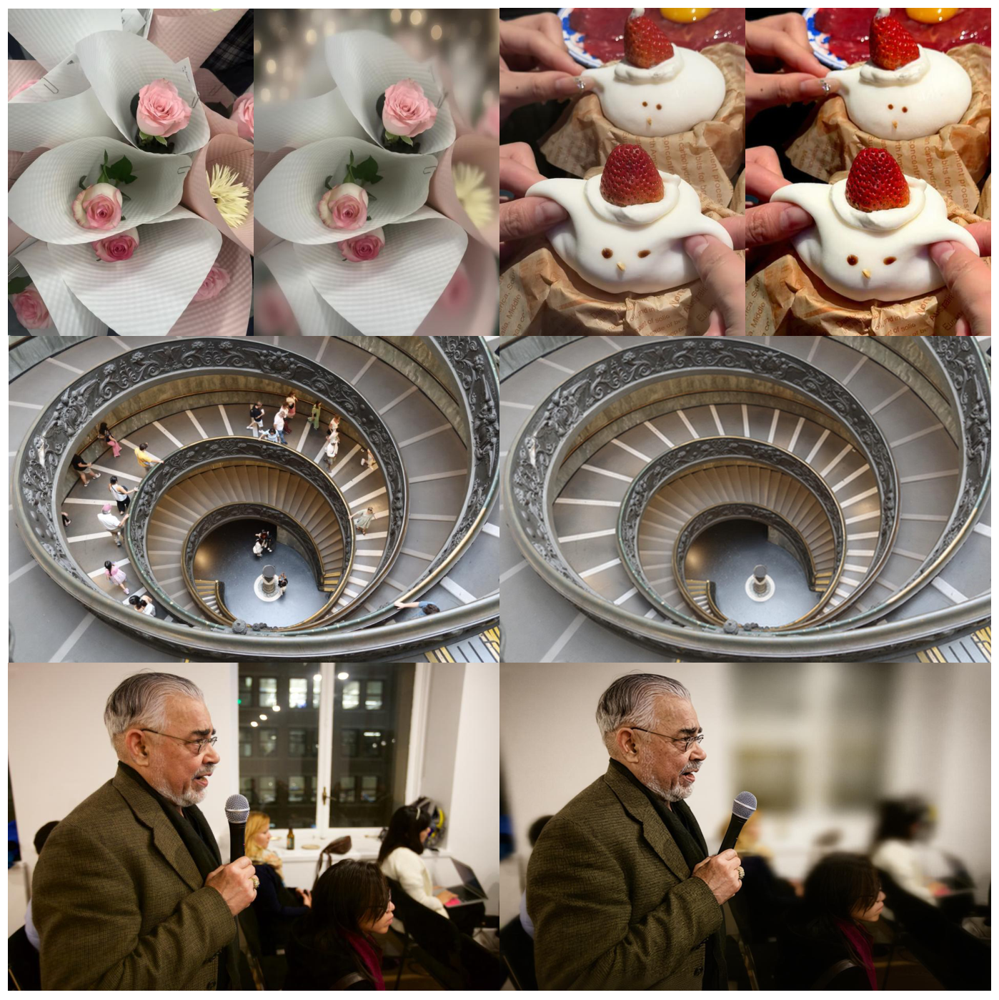

**图 7.** *PhotoAgent 的更多视觉结果（见附录，三行分别为静物茶艺、罗马螺旋楼梯、演讲者肖像）。*

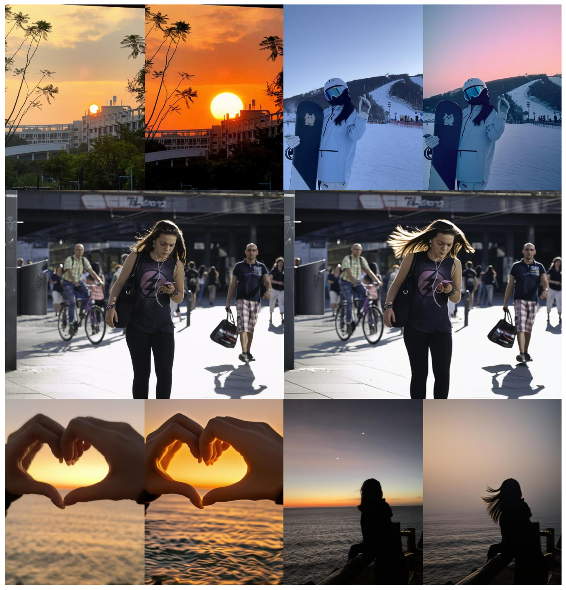

**图 8.** *PhotoAgent 的更多视觉结果（雪景滑雪、街拍、海边剪影三组"input vs PhotoAgent 输出"）。*

#### E. Dataset Diversity and Fairness

UGC-Edit 构建自两大来源：LAION（偏英文、来自网站）和 RealQA（偏中文、来自高德 AutoNavi），一起覆盖了旅游景点、餐厅、酒店、休闲场所等多样真实场景。作者在初步核查中未发现对非西方或非主流美学风格的系统性偏差。1017 张测试集来自 Lofter、Flickr、自拍照片、精选网络公共内容与少量 LAION 过滤后的真实 UGC，覆盖人像、风光、城市建筑、静物/食物、夜景等。

#### F. Computational Cost

Multiple factors, including the number of simulations, the choice of executors, and GPU utilization, influence the running time of our system. We conduct a full profiling pass under the default configuration (search depth of 3, maximum of 20 simulations per iteration, and 3 editing iterations).

多种因素 —— 包括仿真次数、executor 选择、GPU 利用率 —— 共同影响系统运行时间。我们在默认配置（搜索深度 3、每轮最多 20 次仿真、3 轮编辑）下做了全流程 profiling。

**Table 5（文本重述）.** *Runtime breakdown of PhotoAgent under the default configuration.*

| Component | Time (s) | Percentage (total / parent) |
|---|---|---|
| Perceiver | ~10 | 2.1% |
| Planner (MCTS) | ~250 | 53.2% / 100% |
| → Executor (within MCTS) | ~170 | 36.2% / 68.0% |
| → Evaluator (within MCTS) | ~80 | 17.0% / 32.0% |
| Executor (final full-res) | ~180 | 38.3% |
| Evaluator (final full-res) | ~30 | 6.4% |
| **Total†** | **~470** | 100% |

† Excludes initialization and duplicated evaluator time.

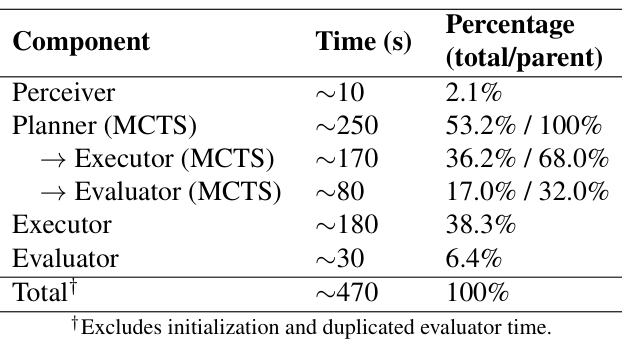

**表 5.** *默认配置下的运行时分解。MCTS 占一半以上，其中 executor 开销又占 MCTS 内的 68%；最终全分辨率 executor 再占 38% 总时间。对比 ReAct (cls.) 约 120s，本系统在一个量级之内但明显更重。*

论文进一步给出三条潜在加速路径：

- **MCTS Search Budget**（见 Table 6）：把仿真数从 20 降到 5，时间从 ~250s 跌到 ~60s，但 BRISQUE/LAION-Reward/UGC 分数仅有小幅下降 —— 默认参数偏重质量而非速度，存在显著可达的"更快操作点"。
- **Changing Editing Model**：PhotoAgent 与工具解耦，换更快生成模型立即受益。例如在 1080p 分辨率下 Step1x-Edit 约 10s，Flux.1 Kontext-Dev 约 20s。
- **Model Acceleration**：量化 FLUX.1 Kontext 到 FP8/FP4 可获 >2× 显存节省、在 NVIDIA Blackwell 上推理明显加速；配合 TensorRT 编译或低精度 evaluator，算法本身无需改动。

**Table 6.** *Impact of simulation budget on accuracy and runtime.*

| Simulations | Time (s) | BRISQUE ↓ | Laion-Reward ↑ | UGC Score ↑ |
|---|---|---|---|---|
| 5 | ~60 | 0.6292 | 0.5083 | 3.982 |
| 10 | ~120 | 0.6270 | 0.5099 | 4.005 |
| 15 | ~185 | 0.6246 | 0.5103 | 4.121 |
| 20 | ~250 | 0.6217 | 0.5134 | 4.176 |

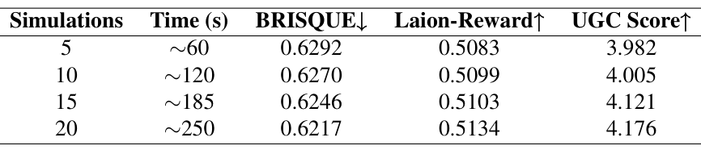

**表 6.** *仿真预算对精度与运行时的影响。注意 5 次仿真与 20 次仿真的 BRISQUE 仅差 0.0075，说明 MCTS 边际收益递减 —— 是我批评 "Best-of-N 可能已足够" 的实证依据。*

#### G. Future Work

First, different application domains may require specialized editing tools (e.g., fidelity-oriented restoration models for medical/scientific images). Second, practical deployment frequently involves combining heterogeneous tools (local enhancement models + commercial APIs); a unified plugin-style interface would simplify management. Third, different domains require evaluators aligned with their specific attributes (e.g., diagnostic or structural metrics for scientific imagery). Finally, new domains often require specialized evaluation metrics; non-photorealistic or artistic content (illustrations, anime, heavily stylized renderings) may need domain-specific fine-tuning.

不同应用领域可能需要专用编辑工具（如医学/科学图像偏好保真式重建模型）。实际部署常涉及异构工具（本地增强模型 + 商业 API）组合 —— 一个统一的插件式接口可简化管理。不同领域需要配套的评估器（如科学图像的诊断/结构指标）。最后，新领域常需专用评估指标；非写实或艺术风格内容（插画、动漫、强风格渲染）可能需要领域专用数据微调。

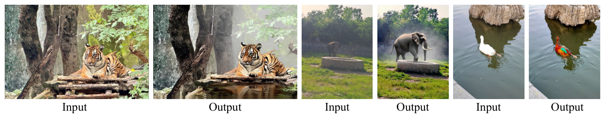

**图 9.** *PhotoAgent 的一些失败案例：编辑器可能做出过度修改。这提示 evaluator 需要对"无需修改"的高质量输入更敏感，未来工作中可加入显式"refuse-to-edit" 选项。*

---

*End of bilingual reading. References, Appendix H (detailed prompts + memory design) and raw reference list omitted — please see original PDF.*
