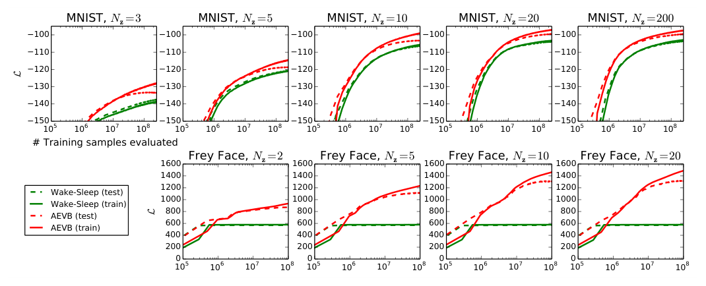
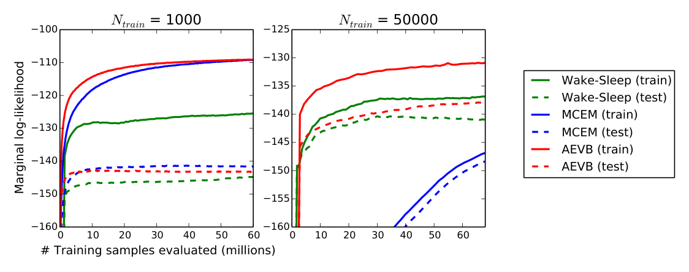
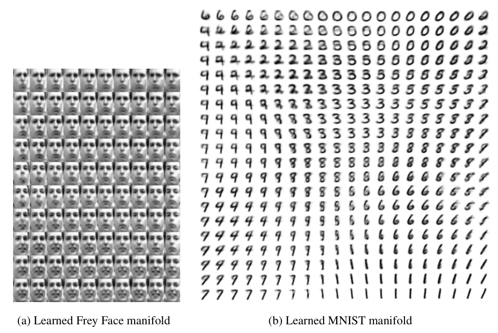

## 一页读懂 | Executive Reading

《Auto-Encoding Variational Bayes》首先是一篇推断算法论文，其次才是一篇“自编码器”论文。它面对的真正瓶颈是：在含连续潜变量的有向概率模型中，边缘似然 \(p_\theta(x)\) 与真实后验 \(p_\theta(z\mid x)\) 往往都不可积；传统 mean-field 变分推断又依赖模型特定的解析期望，因此很难与大数据、非线性神经网络和 minibatch 优化兼容。

论文的关键动作是把来自 \(q_\phi(z\mid x)\) 的随机样本写成 \(z=g_\phi(\epsilon,x)\)，其中噪声 \(\epsilon\) 来自与 \(\phi\) 无关的固定分布。随机性由此被移到计算图的输入端，期望中的被积函数则成为关于 \(\phi\) 的可微函数。这个 pathwise gradient 构造产生 SGVB 估计器，使变分下界可以直接用标准反向传播与随机梯度优化。

AEVB 在此基础上再做一步：用 recognition model \(q_\phi(z\mid x)\) 直接预测每个样本的近似后验参数。它不再为每个新样本单独运行一轮迭代推断，而是让所有样本共享一套推断网络；这就是后来所谓 amortized inference。高斯特例中，KL 项可以解析计算，只对重建项采样，于是得到今天最熟悉的 VAE 目标：先验匹配正则项与期望重建对数似然之和。

原论文的实验规模很小，却与其主张匹配：在 MNIST 和 Frey Face 的 MLP 模型上，AEVB 相比 Wake-Sleep 更快提高训练与测试 variational lower bound；在仅有 3 维潜空间、借助 HMC 估计边缘似然的窄协议下，AEVB 也比 Wake-Sleep 与 MCEM 收敛更快。它们支持“估计器可用且适合随机优化”，但不足以支持现代语境下关于生成质量、可解释表示或普适最优性的强结论。

因此，这篇论文最耐久的遗产是三件事的耦合：可微的重参数化估计、跨样本共享的摊销推断、以及用 ELBO 联合训练生成模型与推断模型。autoencoder 只是让这套概率推断机制获得直观工程接口；真正改变研究实践的是，复杂潜变量模型第一次能够像普通神经网络一样端到端、minibatch 化地训练。

---

## 论证地图 | Argument Map

| 论证环节 | 内容 | 证据 / 位置 | 阅读判断 |
|---|---|---|---|
| 问题 | 边缘似然、真实后验和 mean-field 所需期望在非线性连续潜变量模型中都可能不可积 | §2.1 | 问题界定准确，并把“大数据”与“逐样本采样太慢”纳入同一约束 |
| 命题 | 对可重参数化的连续随机变量，ELBO 可获得低方差、可反向传播的随机估计 | §2.3–§2.4，Eq. (4)–(8) | 这是论文最直接、最一般的算法贡献 |
| 摊销机制 | recognition model 以一次前向计算给出 \(q_\phi(z\mid x)\) 的参数，并与生成模型联合训练 | §1、§2.2–§2.3 | 推断成本从“每个样本一次优化”改为“共享网络一次计算” |
| VAE 特例 | 对角高斯后验、标准高斯先验与 Bernoulli/Gaussian decoder 产生熟悉的 KL + reconstruction 目标 | §3，Eq. (9)–(10) | 是 SGVB/AEVB 的一个实例，不是方法的全部适用范围 |
| 实验证据 | AEVB 在 MNIST/Frey Face 上比 Wake-Sleep 更快获得更高 lower bound；低维似然实验也更快收敛 | Figure 2–3，§5 | 支持优化可行性，但数据、模型与评测协议都很窄 |
| 边界 | 主要处理连续潜变量；后验族与 encoder 带来近似和摊销误差；高维边缘似然估计不可靠 | §2.4、§5、Appendix D | 论文没有证明“VAE 表示天然可解释”或“ELBO 等价于样本质量” |

---

## 关键证据 | Evidence & Tensions

### 值得吸收 | What Transfers

- Eq. (1)–(3)：把 \(\log p_\theta(x)\) 写成 ELBO 与 posterior KL gap 的和，清楚区分“模型没有拟合数据”和“推断分布没有贴近真实后验”两类误差。
- Eq. (4)–(5)：\(z=g_\phi(\epsilon,x)\) 将分布参数的梯度改写为确定性计算路径上的梯度，是比“VAE 结构”更一般的可复用贡献。
- Eq. (7) + Appendix B：当 KL 可解析时，仅采样重建项即可降低估计方差；这是分布选择与优化稳定性之间的明确接口。
- §2.3：实验中 \(L=1\) 的单样本估计配合 \(M=100\) 的 minibatch 已可训练，说明随机性可以由批内样本共同平均。
- §2.2：recognition model 不要求 mean-field 的闭式坐标更新，从而允许用神经网络学习后验参数。

### 值得推敲 | What Remains Unsettled

- Figure 2：AEVB 与 Wake-Sleep 的曲线没有误差带，Adagrad 全局步长又按训练集早期表现选择，无法估计不同随机种子下的稳定优势。
- Figure 3：边缘似然比较只在 3 维潜空间中可靠；附录明确指出更高维度时估计会失真，因此不能把结果外推到一般高维 VAE。
- §3：对角高斯 \(q_\phi(z\mid x)\) 是简化选择。论文没有分离 approximate-family gap 与 amortization gap，也没有检验多峰后验。
- Appendix A：二维流形可视化展示了平滑插值，却没有标签无关的定量指标，不能据此声称潜变量已经解耦。
- §6：论文所说“theoretical advantages are reflected in experiments”是可行性层面的呼应，并非对估计器方差、偏差或样本效率的系统统计验证。

---

## 研究者评注 | Researcher Commentary

### “VAE”这个名字遮住了论文最深的贡献

若只把 VAE 记成 encoder、采样、decoder 三段式，很容易把它误解为一种具体网络。原论文的逻辑顺序恰好相反：先需要一个能对变分期望求梯度的通用估计器，再把这个估计器用于带每样本潜变量的 i.i.d. 数据，最后才得到以神经网络实现的 variational auto-encoder。网络结构可以替换，后验与似然也可以替换；真正稳定不变的是路径梯度和摊销推断接口。

### ELBO 同时训练两件事，因此也混合两类失败

Eq. (1) 表明 \(\log p_\theta(x)-\mathcal L\) 等于 \(D_{KL}(q_\phi(z\mid x)\Vert p_\theta(z\mid x))\)。这意味着 ELBO 变差，既可能是生成模型 \(p_\theta\) 不好，也可能是近似后验 \(q_\phi\) 表达力不足；反过来，ELBO 提升也不自动等价于潜变量更有语义。后来常见的 posterior collapse、loose bound 与 amortization gap，都可以在这条分解上定位。原论文没有解决这些问题，但提供了描述它们的共同坐标系。

### 重参数化不是“把采样变成确定性”

随机性没有消失，而是被显式隔离为外生噪声 \(\epsilon\)。关键收益是：在固定一次噪声抽样后，样本 \(z\) 对 \(\phi\) 的依赖可微，因此能获得 pathwise derivative。这个表述也揭示边界：如果离散选择无法构造合适的可微路径，标准高斯重参数化就不能直接套用；VQ-VAE 等后续工作必须另造梯度接口。

### 一个更能验收原始主张的现代实验

应在同一生成模型、同一 posterior family 和相同计算预算下，比较 pathwise gradient、score-function estimator、逐样本优化 VI 与 amortized VI；同时报告梯度方差、ELBO、真实或高精度近似 log-likelihood、每样本推断延迟以及 amortization gap。这样才能分别验证“梯度更好”“推断更快”和“后验更准”，而不是用一条训练曲线承载全部结论。

---

## 原文精读 | Semantic-chunk Bilingual Reading

以下按论文论证顺序覆盖正文；参考文献条目省略。附录保留与可视化、KL 解析解、网络参数化、似然估计、MCEM 对照和 full VB 推导直接相关的内容。

### Abstract

**Original**

How can we perform efficient inference and learning in directed probabilistic models, in the presence of continuous latent variables with intractable posterior distributions, and large datasets? We introduce a stochastic variational inference and learning algorithm that scales to large datasets and, under some mild differentiability conditions, even works in the intractable case.

**译文**

当有向概率模型含有连续潜变量、后验分布不可积，而且数据规模很大时，怎样才能高效完成推断与学习？论文提出一种可扩展到大数据的随机变分推断与学习算法；只要满足较温和的可微条件，即便相关分布和期望无法解析求解，这套算法仍然适用。

作者把贡献分成两层。第一，重参数化 variational lower bound，得到可由标准随机梯度直接优化的下界估计器。第二，对每个样本都带连续潜变量的 i.i.d. 数据，用同一个 approximate inference model（也称 recognition model）拟合不可积真实后验，从而把后验推断做得尤其高效。实验结果用于说明这些理论与计算优势能够在实际训练中体现。

> **句读**：原文的 “under some mild differentiability conditions” 是明确限定条件，应译为“在满足可微条件时”，不能扩张成“对任意潜变量模型都适用”。

### 1. Introduction

**Original**

The variational Bayesian approach involves the optimization of an approximation to the intractable posterior. Unfortunately, the common mean-field approach requires analytical solutions of expectations with respect to the approximate posterior, which are also intractable in the general case.

**译文**

变分贝叶斯通过优化一个可处理的分布来逼近不可积后验。困难在于，常见 mean-field 方法仍要求解析计算相对于近似后验的若干期望；一旦 likelihood 由带非线性隐层的神经网络给出，这些期望本身通常也不可积。论文因此不再寻找模型特定的坐标更新，而是构造一个可微、无偏的 variational lower bound 随机估计器 SGVB，并直接使用 stochastic gradient ascent。

对 i.i.d. 数据，AEVB 进一步让 recognition model 学会从 \(x\) 直接产生近似后验。这样，学习生成参数时不必为每个数据点运行昂贵的 MCMC 或迭代推断；训练完成后的推断网络还可用于识别、去噪、表征和可视化。当 recognition model 由神经网络实现时，便得到 variational auto-encoder。

### 2. Method

#### 2.1 Problem scenario

**译文**

设数据集 \(X=\{x^{(i)}\}_{i=1}^N\) 由 i.i.d. 样本构成。每个样本先由先验 \(p_{\theta^\*}(z)\) 产生连续潜变量，再由条件分布 \(p_{\theta^\*}(x\mid z)\) 产生观测；真实参数 \(\theta^\*\) 与各样本的 \(z^{(i)}\) 都不可见。论文只要求先验与 likelihood 属于参数化分布族，而且密度对 \(\theta\) 和 \(z\) 几乎处处可微。

目标场景刻意不假设边缘分布或后验可积：\(p_\theta(x)=\int p_\theta(z)p_\theta(x\mid z)dz\) 可能无法计算或求导，真实后验 \(p_\theta(z\mid x)\) 也可能不可用，连合理 mean-field 方法需要的积分都可能不可积。与此同时，数据大到不适合 batch optimization，而为每个样本单独运行 Monte Carlo EM 的采样循环又过慢。

论文希望同时解决三个任务：高效近似估计生成参数 \(\theta\)；给定 \(x\) 后高效推断其潜变量 \(z\)；以及支持需要 \(p(x)\) 的边缘推断任务。作者指出，同一思路还可扩展到对全局参数做 variational inference，并可用于 online 或 non-stationary 数据；正文为简化而固定数据集，full VB 版本放在 Appendix F。

#### 2.2 The variational bound

**Original**

\[
\log p_\theta(x^{(i)}) =
D_{KL}(q_\phi(z\mid x^{(i)})\Vert p_\theta(z\mid x^{(i)}))
+ \mathcal L(\theta,\phi;x^{(i)}).
\]

**译文**

论文引入 recognition model \(q_\phi(z\mid x)\) 逼近真实后验。它不必是 mean-field 分解，也不需要从闭式期望中逐样本计算参数；\(\phi\) 会与生成参数 \(\theta\) 共同学习。从 coding 视角，\(q_\phi\) 是 probabilistic encoder：给定 \(x\)，输出可能生成该样本的 code 分布；\(p_\theta(x\mid z)\) 是 probabilistic decoder：给定 code，输出观测分布。

Eq. (1) 把单样本 log marginal likelihood 分成 posterior KL gap 与 \(\mathcal L\)。由于 KL 非负，\(\mathcal L\) 是下界：

\[
\mathcal L
= \mathbb E_{q_\phi(z\mid x)}[-\log q_\phi(z\mid x)+\log p_\theta(x,z)]
= -D_{KL}(q_\phi(z\mid x)\Vert p_\theta(z))
+ \mathbb E_q[\log p_\theta(x\mid z)].
\]

第一种形式适合一般联合分布，第二种形式把目标解释为“贴近先验”与“解释数据”两部分。优化的难点主要在 \(\phi\)：直接使用 score-function 形式 \(f(z)\nabla_\phi\log q_\phi(z)\) 的 Monte Carlo 梯度方差很高，在本文场景中并不实用。

#### 2.3 The SGVB estimator and AEVB algorithm

**Original**

\[
\tilde z=g_\phi(\epsilon,x), \qquad \epsilon\sim p(\epsilon).
\]

**译文**

若能把 \(\tilde z\sim q_\phi(z\mid x)\) 改写为固定噪声 \(\epsilon\sim p(\epsilon)\) 经可微变换 \(g_\phi\) 得到的样本，那么

\[
\mathbb E_{q_\phi(z\mid x)}[f(z)]
=\mathbb E_{p(\epsilon)}[f(g_\phi(\epsilon,x))]
\approx \frac1L\sum_{l=1}^L f(g_\phi(\epsilon^{(l)},x)).
\]

据此，把 ELBO 的随机变量换成 \(g_\phi(\epsilon,x)\)，便得到 generic SGVB estimator。若 KL 项可以解析积分，则只需采样 \(\log p_\theta(x\mid z)\)，得到方差通常更低的第二版估计器。对随机抽取的 minibatch \(X^M\)，再以 \(N/M\) 缩放样本和，就可无偏估计完整数据集下界并使用 SGD、Adagrad 等方法更新 \(\theta,\phi\)。

作者在实验中发现，只要 minibatch 足够大，例如 \(M=100\)，每个数据点用 \(L=1\) 个样本即可。Algorithm 1 的本质非常简洁：采一个 minibatch，采辅助噪声，计算 minibatch ELBO 的梯度，再用标准随机优化器更新生成模型与推断模型。

这一目标也解释了 autoencoder 联系。KL 项约束 encoder 产生的分布不要偏离 prior；期望 log-likelihood 相当于概率意义下的负重建误差。区别在于，decoder 接收的不是确定性 code，而是 \(q_\phi(z\mid x)\) 的样本。

#### 2.4 The reparameterization trick

**Original**

For the univariate Gaussian case, \(z\sim \mathcal N(\mu,\sigma^2)\) can be reparameterized as \(z=\mu+\sigma\epsilon\), where \(\epsilon\sim\mathcal N(0,1)\).

**译文**

重参数化的实质是把“分布随 \(\phi\) 改变”改写为“固定噪声经过随 \(\phi\) 改变的函数”。在单变量高斯中，\(z=\mu+\sigma\epsilon\)；于是对 \(q_\phi\) 的期望可转成对标准高斯噪声的期望，并对 \(\mu,\sigma\) 反向传播。

论文列出三类构造：可使用 inverse CDF 的分布；location-scale family；以及由其他随机变量组合得到的分布，如 Log-Normal、Gamma、Dirichlet、Beta 与 Chi-Squared。若这些方式都不直接适用，还可用与 PDF 计算量相近的 inverse-CDF approximation。这里的范围仍是可构造近似可微路径的连续随机变量。

### 3. Example: Variational Auto-Encoder

**译文**

VAE 特例使用标准各向同性高斯先验 \(p(z)=\mathcal N(0,I)\)。对实值数据，decoder \(p_\theta(x\mid z)\) 为多变量 Gaussian；对二值数据则为 Bernoulli，其分布参数由单隐层 MLP 从 \(z\) 计算。真实后验仍不可积，近似后验选择对角高斯：

\[
q_\phi(z\mid x)=\mathcal N(z;\mu(x),\operatorname{diag}(\sigma^2(x))).
\]

encoder MLP 输出 \(\mu(x)\) 与 \(\sigma(x)\)，随后用

\[
z=\mu(x)+\sigma(x)\odot\epsilon,\qquad \epsilon\sim\mathcal N(0,I)
\]

采样。由于 prior 与 posterior approximation 都是 Gaussian，KL 可以解析求解，最终单样本目标由一项关于 \(\mu,\sigma\) 的闭式 KL 与 Monte Carlo reconstruction term 组成。论文强调，对角 Gaussian 是简化选择，而不是 SGVB 方法本身的限制。

### 4. Related work

**译文**

论文把 AEVB 与 Wake-Sleep 对照：两者都有 recognition model，计算复杂度相近；但 Wake-Sleep 并行优化两个并不共同对应 marginal-likelihood bound 的目标，而 AEVB 直接优化同一个 variational lower bound。Wake-Sleep 的优势是可以处理离散潜变量。

作者还讨论 stochastic variational inference、高方差 score-function 梯度的 control variate、自然参数的随机线性回归，以及独立提出的 stochastic backpropagation。对 autoencoder 文献，论文指出普通 reconstruction criterion 不足以保证有用表征，而 SGVB 的 regularizer 由 variational bound 决定，不需要额外选择一个表征正则超参数。与 DARN 等工作的差别在于，本文面向更一般的连续潜变量有向模型。

### 5. Experiments

**译文**

实验在 MNIST 与 Frey Face 上训练图像生成模型，并比较 variational lower bound 与估计 marginal likelihood。encoder 与 decoder 使用相同数量的隐藏单元；Frey Face 为连续数据，Gaussian decoder 的均值经 sigmoid 约束到 \((0,1)\)。训练使用 stochastic gradient ascent，加上对应 \(p(\theta)=\mathcal N(0,I)\) 的轻微 weight decay；AEVB 与 Wake-Sleep 采用相同 recognition model、相同随机初始化和 minibatch \(M=100\)，每个数据点只采 \(L=1\) 个潜变量样本。

Figure 2 比较不同潜维度下的 lower bound。MNIST 使用 500 个隐藏单元，Frey Face 使用 200 个以抑制过拟合。AEVB 的训练和测试曲线普遍比 Wake-Sleep 更快上升、最终更高；额外增加潜变量没有在这些实验中造成明显过拟合，作者将其解释为 variational bound 的正则作用。

**图 2.** AEVB 与 Wake-Sleep 的训练/测试 lower-bound 曲线。红色 AEVB 在报告的潜维度上普遍收敛更快。

边缘似然实验只在低维潜空间中进行，因为高维情况下估计不可靠。encoder/decoder 各有 100 个隐藏单元、潜变量维度为 3；AEVB 和 Wake-Sleep 与使用 HMC 的 MCEM 比较。Figure 3 显示，在 \(N_{train}=1{,}000\) 和 \(50{,}000\) 两种规模下，AEVB 更快达到较高 train/test marginal log-likelihood。不过这项结果依赖 Appendix D 的低维 HMC 估计协议，不应推广为任意 VAE 的精确 likelihood 结论。

**图 3.** 低维 MNIST 协议下的估计 marginal log-likelihood。AEVB 曲线收敛最快；MCEM 在大数据设置中受逐样本采样成本影响明显。

### 6. Conclusion and 7. Future work

**译文**

论文总结：SGVB 为连续潜变量提供了一个可微、可用标准随机梯度优化的 variational lower-bound 估计器；AEVB 则在每样本连续潜变量的 i.i.d. 数据上，用 SGVB 学习 approximate inference model，从而实现高效推断与学习。作者把层次生成模型、卷积 encoder/decoder、时间序列、全局参数的 SGVB，以及含潜变量的监督模型列为后续方向。

### Appendix A–F

**译文**

Appendix A 用二维潜变量网格展示 Frey Face 与 MNIST 的生成流形，并比较 2、5、10、20 维潜空间的 MNIST 样本。图像说明 decoder 对相邻潜变量给出平滑变化，但它是可视化证据，不等价于语义因素已被识别。

Appendix B 推导标准高斯 prior 与对角高斯 approximate posterior 的解析 KL：

\[
-D_{KL}(q_\phi(z\mid x)\Vert p(z))
=\frac12\sum_j\left(1+\log\sigma_j^2-\mu_j^2-\sigma_j^2\right).
\]

Appendix C 给出实验中的 MLP 参数化。Bernoulli decoder 用 sigmoid 输出每个维度的概率；Gaussian encoder/decoder 由 MLP 输出均值与 log variance。这里的网络很简单，进一步强调论文贡献主要在推断与目标函数。

Appendix D 的 marginal-likelihood estimator 使用 posterior 样本与一个辅助 \(q(z)\) 进行调和均值式估计，并明确只在采样空间维度低于约 5 且样本充分时可靠。实验对训练集与测试集各取前 1,000 个数据点，每点用 HMC 抽取 50 个潜变量样本。

Appendix E 描述 MCEM：不使用 encoder，而是通过 posterior gradient 运行 HMC；每轮包含 10 个 leapfrog steps，并把接受率调到 90%，随后做 5 次权重更新。这个协议说明 MCEM 的慢不仅是优化器差异，也来自每数据点的迭代采样。

Appendix F 把 variational inference 扩展到全局参数 \(\theta\)。作者同时为 \(q_\phi(\theta)\) 与 \(q_\phi(z\mid x)\) 构造重参数化，用两个独立辅助噪声把完整 lower bound 改写成可微 Monte Carlo 估计；若 prior 与两个 approximate posterior 都是 Gaussian，又可解析消去四个项以降低方差。正文没有给出该 full VB 版本的实验，作者将其留作未来工作。

*References omitted — see original PDF.*

---

## 术语与符号 | Terms & Notation

| 原文 | 译法 / 保留形式 | 本文中的具体含义 |
|---|---|---|
| SGVB | 随机梯度变分贝叶斯估计器 | 用重参数化得到的可微 ELBO Monte Carlo estimator |
| AEVB | 自动编码变分贝叶斯算法 | 用 SGVB 联合训练 recognition model 与 generative model |
| recognition model | 识别模型 / 推断模型 | \(q_\phi(z\mid x)\)，从观测直接预测近似后验参数 |
| reparameterization | 重参数化 | 把 \(z\sim q_\phi\) 改写为固定噪声经可微函数得到 |
| ELBO | 证据下界 / 变分下界 | \(\log p_\theta(x)\) 的可优化下界 |
| \(D_{KL}(q\Vert p)\) | KL 散度 | 本文方向是 approximate posterior 到 target/prior |
| \(L\) | 每数据点 Monte Carlo 样本数 | 原实验在 \(M=100\) 时通常取 \(L=1\) |
