## 总结 | Summary

VC-STaR 是 STaR [Zelikman et al., 2022] 在 VLM 侧的对比变体：load-bearing 的发现是 Fig. 1b——把单图 VQA 替换成「视觉相似 + 同义问题」的对比 VQA 对（论文称 C&H 设定）后，模型不仅能修正自己原本的幻觉性 rationale，且几乎不引入新错误。在此观察上做 SFT 数据自蒸馏，Qwen2.5VL-7B 在 6 个基准上平均 +2.4%，增益集中在幻觉类——MMVP +5.7、HallusionBench +3.2；同样配方在 Qwen2.5VL-3B / InternVL2.5-8B 上复现，证明模型无关。

机制上是 thinking → contrasting → rethinking 三步：先以 ground-truth 为 hint 让 VLM $\theta$ 写粗 rationale $r_i$；再让同一 $\theta$ 在双图对比下产出 contrastive analysis $c_i$；最后由**外部 LLM** $\psi$=Qwen2.5-72B 执行 $\tilde r_i = f(r_i, c_i \mid \psi, \delta^r)$ 把 $c_i$ 中的视觉证据按 $r_i$ 的结构重写。对比对 curation 用自训的 ID-based metric-learning 视觉 encoder（避开 CLIP 偏全局 / DINO 偏实例的两端）+ 双阈值召回（$\phi^q=0.15$，general 类 $\phi^v=0.5$、icon/几何/chart 类 $\phi^v=0.3$）+ **median-only 难度过滤**——从 240k 原始候选筛到 86k，再经文本匹配后处理得 VisCoR-55K。GQA 上的关键消融（Table 4）显示负对比对（不同答案）单用 +5.2、正对比对单用 +1.4、组合 +9.3，意味着 contrasting 的真正信号来自**反例/反事实**，不是相似性。

真正可被搬走的是 curation pipeline 与 median-only 这条难度采样发现（Table 3：加 easy 样本反而单调降点，+40k 时 −2.6 avg），而非 "contrasting" 这个叙事本身。方法适用于「能从 VQA 池中检索出视觉相似 + 同义问题对」的任务（reasoning/math/chart/OCR/general 已验证）；对纯 caption 即可解、或对比对难构造的开放生成任务（VideoQA、自由对话）不再天然有效。最大代价：rethinking 步依赖一个 72B 外部 LLM 重写，这把「自改进」的标签压到边界——严格意义上是「VLM 提供视觉证据 + 大 LLM 文本整理」的两阶段教师组合。

---

## 要点提醒 | Highlights

### 值得关注 | Worth Absorbing

- **Table 4（GQA 正/负对比对消融）** — 正对 +1.4、负对 +5.2、组合 +9.3，全文最有启发的一组数字。说明 contrasting 的有效信号本质是「反例提供差异维度」，而非「相似图共享语义锚点」；任何 contrastive-data 工作都应直接对照这条结果。
- **Table 3（easy 样本对 SFT 的反作用）** — +20k easy −1.5 avg、+40k easy −2.6 avg，单调降点。这是个反直觉但产品意义重大的发现：reasoning SFT 的边际数据如果"难度密度低"，反而让模型在简单题上 overthink。所有 visual-reasoning 数据集工作都该把这个对照表跑一次。
- **§3.1 视觉 embedding 选型** — 显式拒绝 CLIP（偏全局）和 DINO（偏实例），自训 ID-based metric-learning encoder 做 cross-domain pair retrieval。这是 curation 能在 21 个 VQA 数据集上 work 的工程内核，但论文没单独 ablate 这个 encoder（值得作为未来工作的独立 baseline）。
- **附录 A.3 完整公开三个 prompt** — thinking / contrasting / rethinking 三段都给了原文，可直接复用做对照实验或迁移到其它领域。在 self-improving 文献里这种透明度并不常见。

### 值得推敲 | Worth Questioning

- **§3.2 Eq. (4) 把 rationale 重写交给 Qwen2.5-72B 外部 LLM** — 视觉信息由 VLM 看了再交给一个大 4–10× 的 LLM 重写，pipeline 更接近"两阶段教师组合"而非纯自改进。论文未做"换 7B 同档 LLM 重写"的对照——这一组对照决定了「方法本质」与「教师红利」的边界。
- **Table 1 的 off-the-shelf 数据集对比并非同 teacher** — LLaVA-CoT 用 GPT-4o、R1-OneVision 用 DeepSeek-R1、LPT 用类似 LLM、本文用 Qwen2.5-72B。论文只控制 base model 与 SFT 配置，未控制 rationale 生成 teacher 的能力差异；将「VC-STaR 强于 LLaVA-CoT」的差距完全归因于 contrasting 机制，证据不足。
- **Fig. 1b 是全文最 load-bearing 的实证**——但样本量、来源、错误类型分布只有"a group of failure cases"一句话。若不同领域（OCR / 数学 / 通用）C&H 设定下"是否引入新错误"的曲线形态不同，VC-STaR 在该域的有效性应当对应退化（弱迹象：MMStar 仅 +0.6 avg）。
- **STaR / Verifier / Feedback 三个自改进基线统一在 VisCoR-55K 上跑** — 控制干净，但等于让对手在"作者精挑过的对比对池"上玩。若改用各自原始数据池或 raw 86k median 池，VC-STaR 相对它们的差距未必这么大。Table 1 缺这一对照。

---

## 深度思考 | Analysis

### 真正的贡献是 curation，不是 contrasting

论文标题与叙事都把 contrasting 摆在中心，但把 Table 3（median-only）、Table 4（负对 >> 正对）、Fig. 7（240k → 86k → 55K 的难度漏斗）三件事放在一起看，可被复用的核心是**一套面向 reasoning SFT 的数据 curation 方法论**——visual-text 双阈值召回 + median 难度过滤 + 文本匹配后处理——而 contrasting 只是 rationale 修正阶段的一个具体载体。如果负对比对单独已能拿 +5.2 而正对比对只 +1.4，那"对比"在该框架里的角色更接近「为每个样本附一个反事实参考」，下一篇真正干净的工作应该是去掉双图对比的复杂性，直接让 LLM 合成反事实问答对，看看是否单调更优。

### 在 2024-2026 自改进 / 教师蒸馏图景里的位置

把 VC-STaR 与 R1-OneVision [Yang et al., 2025b] / LPT [Liao et al., 2025] / LLaVA-CoT [Xu et al., 2025] 并排，区别其实是 teacher 组合，不是范式：R1-OneVision 走"caption → DeepSeek-R1"，LLaVA-CoT 走"GPT-4o 填模板"，VC-STaR 走"VLM 看图 + Qwen2.5-72B 重写"。它对前两者的最大正面差异是 rationale 来源**仍由 VLM 直接看图**而非由 caption 中介，这是真贡献；但 rethinking 引入 72B LLM 让"自改进"的标签变得可争议——严格说更像 hybrid teacher。与 Img-Diff [Jiao et al., 2025] / C³L [Ma et al., 2024] 这条「对比对用于 instruction-tuning 数据合成」的支线相比，VC-STaR 的差异是 contrasting 用在 rationale 修正而非样本生成，这是相对独立的、可被引用的贡献位。

### 如果由我接手

单一关键实验：把 rethinking 步的 LLM 从 Qwen2.5-72B 降到 Qwen2.5-7B（与 base VLM 同档），其余不变，重跑 6 基准。结果有两种走向：(a) 性能塌陷 → 论文应改名为「contrastive-aware teacher distillation」，自改进叙事不成立；(b) 性能保持 → 方法本质验证，可正式称为自改进。这一组对照成本不到全套实验的 1/10，但决定了方法在文献里的归类位置。

---

## 原文精读 | Bilingual Full Text

### Abstract

Reasoning has emerged as a key capability of large language models. In linguistic tasks, this capability can be enhanced by self-improving techniques that refine reasoning paths for subsequent finetuning. However, extending these language-based self-improving approaches to vision language models (VLMs) presents a unique challenge: visual hallucinations in reasoning paths cannot be effectively verified or rectified.

推理已成为大语言模型的关键能力。在语言任务中，这种能力可由自改进（self-improving）技术增强——对推理路径进行精化后再进行微调。然而，把这类基于语言的自改进方法迁移到视觉-语言模型（VLM）上面临一个特有挑战：推理路径中的**视觉幻觉**无法被有效验证或纠正。

Our solution starts with a key observation about visual contrast: when presented with a contrastive VQA pair, i.e., two visually similar images with synonymous questions, VLMs identify relevant visual cues more precisely. Motivated by this observation, we propose Visual Contrastive Self-Taught Reasoner (VC-STaR), a novel self-improving framework that leverages visual contrast to mitigate hallucinations in model-generated rationales.

我们的解法源自一个关于视觉对比的关键观察：当 VLM 看到一个 contrastive VQA pair——即两张视觉相似、问题同义的样本——时，它能更精确地识别相关视觉线索。据此我们提出 VC-STaR（Visual Contrastive Self-Taught Reasoner），一种利用视觉对比来缓解模型自生成 rationale 中幻觉的自改进框架。

We collect a diverse suite of VQA datasets, curate contrastive pairs according to multi-modal similarity, and generate rationales using VC-STaR. Consequently, we obtain a new visual reasoning dataset, VisCoR-55K, which is then used to boost the reasoning capability of various VLMs through supervised finetuning. Extensive experiments show that VC-STaR not only outperforms existing self-improving approaches but also surpasses models finetuned on the SoTA visual reasoning datasets, demonstrating that the inherent contrastive ability of VLMs can bootstrap their own visual reasoning. Project at: https://github.com/zhiyupan42/VC-STaR.

我们汇集了一组多样化的 VQA 数据集，按多模态相似度筛出对比对，再用 VC-STaR 生成 rationale。由此得到新的视觉推理数据集 VisCoR-55K，用以通过监督微调（SFT）提升各类 VLM 的推理能力。大量实验表明：VC-STaR 不仅强于现有自改进方法，也超过在当前 SOTA 视觉推理数据集上微调的模型，说明 VLM 自带的对比能力足以引导自身的视觉推理。代码：https://github.com/zhiyupan42/VC-STaR 。

### 1. Introduction

The scaling of large language models (LLM) has led to the emergence of reasoning capabilities (Wei et al., 2022a), making a transition from System 1 to System 2 (Kahneman, 2011) and enabling language models to tackle complex, multi-step problems (Wei et al., 2022b; Kojima et al., 2022). This emergent ability can be further enhanced by various techniques (Wang et al., 2023b; Li et al., 2023b; Hao et al., 2023; Gao et al., 2023; OpenAI, 2024b; Guo et al., 2025). Among them, self-improving approaches (Zelikman et al., 2022; Gulcehre et al., 2023; Madaan et al., 2023; Qu et al., 2024; Ma et al., 2025) form a prominent branch, mainly because they can be easily applied and extended without external reward models (Lu et al., 2024a), predefined step decomposition (Liu et al., 2025), or specially designed reasoning structures (Li et al., 2025).

LLM 的扩展（scaling）催生了推理能力的涌现 [Wei et al., 2022a]，标志着从 System 1 向 System 2 的过渡 [Kahneman, 2011]，让语言模型能处理复杂的多步问题 [Wei et al., 2022b; Kojima et al., 2022]。这一涌现能力可被多种技术进一步增强 [Wang et al., 2023b; Li et al., 2023b; Hao et al., 2023; Gao et al., 2023; OpenAI, 2024b; Guo et al., 2025]。其中，自改进方法 [Zelikman et al., 2022; Gulcehre et al., 2023; Madaan et al., 2023; Qu et al., 2024; Ma et al., 2025] 是一个显著分支——其优势在于无需外部奖励模型 [Lu et al., 2024a]、无需预定义的步骤分解 [Liu et al., 2025]、也无需专门设计的推理结构 [Li et al., 2025]，因而易于扩展。

However, it is infeasible to directly adapt such language-based self-improving methods to vision language models (VLMs) (Liu et al., 2023; Bai et al., 2025). Previous self-improving approaches focus on textual coherence and the quality of the final answer (Zelikman et al., 2022; Zhang et al., 2024a), while they are unable to verify or rectify the visual hallucinations that persist in current VLMs (Tong et al., 2024; Li et al., 2024). Even worse, they may get stuck in speculative reasoning that privileges textual priors over real visual evidence (Favero et al., 2024; Wu et al., 2025). We claim that the key problem for self-improving in VLMs is: how to rectify visual hallucinations in VLMs' reasoning paths for high-quality visual rationale generation.

然而，把这类语言侧的自改进方法直接搬到 VLM [Liu et al., 2023; Bai et al., 2025] 并不可行。已有的自改进方法关注文本连贯与最终答案质量 [Zelikman et al., 2022; Zhang et al., 2024a]，无法验证或纠正当前 VLM 中持续存在的视觉幻觉 [Tong et al., 2024; Li et al., 2024]。更糟的是，它们可能陷入"以文本先验代替真实视觉证据"的猜测式推理 [Favero et al., 2024; Wu et al., 2025]。我们认为，VLM 自改进的关键问题是：**如何纠正 VLM 推理路径中的视觉幻觉，以生成高质量的视觉 rationale**。

Our solution is built upon an interesting observation: VLMs can see better during contrasting. As shown in Fig. 1a, the VLM generates a wrong rationale with visual hallucinations given a single visual question answering (VQA) sample. Instead, when presented with a contrastive VQA pair, i.e., two similar images with synonymous questions (Setting C in sub-figure 1b), the model captures fine-grained visual evidence more accurately and rectifies the erroneous rationale. Statistics of this phenomenon on a group of failure cases are shown in Fig. 1b. Compared with the hints-only (Setting H in sub-figure 1b) self-improving (provide the model with the ground-truth answers), the hints and contrasting (Setting C&H in sub-figure 1b) setting not only prevents the model from making new errors but also leads to the rectification of its original hallucinations.

我们的解法源自一个有趣的观察：**VLM 在对比时看得更清楚**。如 Fig. 1a 所示，给单张 VQA 样本时，VLM 会生成带视觉幻觉的错误 rationale；而面对一个 contrastive VQA pair——两张相似图、两个同义问题（Fig. 1b 中的 C 设置）——模型能更准确地捕捉细粒度视觉证据，并修正错误推理。Fig. 1b 给出了在一组失败案例上的统计：相比仅给 hint（即 ground-truth 答案）的 H 设置，hint + contrast 的 C&H 设置不仅不引入新错误，还能修正模型原本的幻觉。

**Figure 1.** Contrasting makes the VLM see better. (a) Contrastive VQA pairs compels a more accurate response. (b) Compared with a previous self-improving setting (with hint, H) which has many failure cases, the contrasting setting (C) and the C&H setting introduces nearly no new errors and rectifies many erroneous samples.

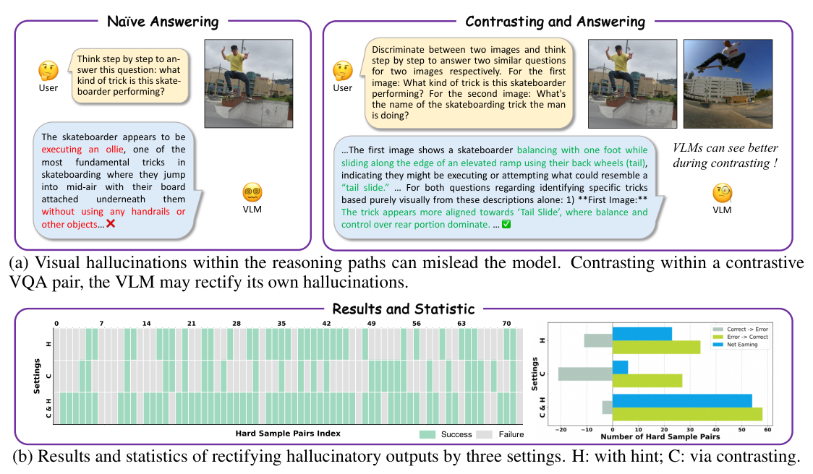

**图 1.** 对比让 VLM 看得更清楚。(a) 对比 VQA 对促使更准确的回答。(b) 与仅带 hint（H）的传统自改进设置——其失败案例较多——相比，对比设置（C）和 C&H 设置几乎不引入新错误，并能修正大量原本错误的样本。

Motivated by this, we propose a new self-improving framework, Visual Contrastive Self-Taught Reasoner (VC-STaR). VC-STaR contains three steps: (1) think step by step and generate a coarse rationale; (2) compare visual queries in a contrastive VQA pair and provide a contrastive analysis; (3) rethink and refine the coarse rationale via an LLM based on the contrastive analysis. In order to guarantee the scalability of VC-STaR, we also propose a task-agnostic contrastive VQA pair curation framework, which can be readily adapted to various VQA tasks, e.g., reasoning (Lu et al., 2021b), math (Gao et al., 2025), chart (Liu et al., 2024a), and OCR (Yuan et al., 2022). Specifically, we curate the contrastive VQA pairs within individual datasets, based on the similarity of both images and questions. We utilize these contrastive VQA pairs to generate faithful rationales, resulting in a novel Visual Contrastive Reasoning dataset (VisCoR-55K) as illustrated in Fig. 2. Finetuning with VisCoR-55K enhances VLMs' visual reasoning capability.

由此我们提出新的自改进框架 VC-STaR。它包含三步：(1) think step by step，生成粗 rationale；(2) 在 contrastive VQA pair 中对比两张图，给出 contrastive analysis；(3) rethink——由一个 LLM 依据 contrastive analysis 重写粗 rationale。为了保证 VC-STaR 的可扩展性，我们还提出一套**任务无关**的 contrastive VQA pair curation 框架，可适配 reasoning [Lu et al., 2021b]、math [Gao et al., 2025]、chart [Liu et al., 2024a]、OCR [Yuan et al., 2022] 等多种 VQA 任务。具体地，我们在每个数据集内按图像与问题的相似度筛对比对，再用其生成更可信的 rationale，得到 Fig. 2 所示的 VisCoR-55K 数据集。在 VisCoR-55K 上微调可提升 VLM 的视觉推理能力。

**Figure 2.** VisCoR-55K. We introduce the Visual Contrastive Reasoning dataset (VisCoR-55K), a new collection of 55K high-quality visual reasoning samples spanning 21 datasets in 5 categories.

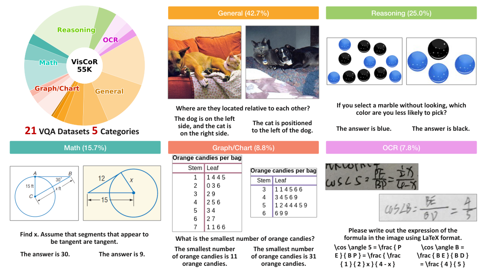

**图 2.** VisCoR-55K：包含 55K 条高质量视觉推理样本，覆盖 21 个数据集、5 大类别。

VC-STaR achieves prominent results on a wide range of challenging benchmarks, including MMVP (Tong et al., 2024), HallusionBench (Guan et al., 2024), MathVista (Lu et al., 2024b), MathVision (Wang et al., 2024), and MMStar (Chen et al., 2024c). On the one hand, VC-STaR outperforms existing self-improving baselines. On the other hand, it exhibits a clear advantage over models trained on recently proposed reasoning datasets. The experimental results validate that visual reasoning capability of VLMs can be bootstrapped through the lens of contrast.

VC-STaR 在多个具挑战性的基准上表现突出，包括 MMVP [Tong et al., 2024]、HallusionBench [Guan et al., 2024]、MathVista [Lu et al., 2024b]、MathVision [Wang et al., 2024] 与 MMStar [Chen et al., 2024c]。一方面，VC-STaR 超过现有自改进基线；另一方面，相对于近期提出的推理数据集训练的模型也有明显优势。结果证实：**透过对比之镜，VLM 的视觉推理能力可被自我引导**。

### 2. Related Works

#### Reasoning in Language

Dual-system theory (Kahneman, 2011) illustrates two systems in human cognition: a fast, intuitive System 1 and a slow, deliberate System 2 which is akin to emergent reasoning capability of LLMs (Wei et al., 2022a). Consequently, reasoning enhancement (Wei et al., 2022b; Kojima et al., 2022) is considered a pathway to elevate LLMs' cognitive performance. One solution involves a reward model (Li et al., 2023b; Lu et al., 2024a), often coupled with Monte Carlo tree search (Hao et al., 2023; Zhang et al., 2024a), to discover optimal reasoning paths. However, this solution is constrained by the need of an auxiliary model and the requirement for reasoning step dividing (Liu et al., 2025).

双系统理论 [Kahneman, 2011] 把人类认知划分为快速直觉的 System 1 与缓慢深思的 System 2，后者与 LLM 的涌现推理能力相似 [Wei et al., 2022a]。因此推理增强 [Wei et al., 2022b; Kojima et al., 2022] 被视为提升 LLM 认知性能的路径之一。一种方案是引入奖励模型 [Li et al., 2023b; Lu et al., 2024a]，常与蒙特卡洛树搜索（MCTS）[Hao et al., 2023; Zhang et al., 2024a] 配合以发现最优推理路径，但受限于辅助模型与推理步骤切分。

Another way employs macro reasoning actions (Gao et al., 2023; Khot et al., 2023; Yang et al., 2025a) to inject human prior knowledge, however, hand-crafted macro actions struggle to adapt to diverse reasoning scenarios. While reinforcement learning (Rafailov et al., 2023; Trung et al., 2024; Guo et al., 2025) has also attracted the attention, its success relies on the data format and the design of reward functions. Self-improving methods (Zhang et al., 2024a) offer a more scalable alternative, enabling LLMs to refine its own reasoning by constructing high-quality reasoning data (Wang et al., 2023b), utilizing ground-truth answers as hints (Zelikman et al., 2022), or leveraging internal feedback (Qu et al., 2024). With fewer external constraints, self-improving methods pave the way for more flexible and general language reasoners.

另一类做法是使用宏观推理动作 [Gao et al., 2023; Khot et al., 2023; Yang et al., 2025a] 来注入人类先验，但手工定义的宏动作难以泛化到多样推理场景。强化学习方向 [Rafailov et al., 2023; Trung et al., 2024; Guo et al., 2025] 也受关注，但成功取决于数据格式与奖励函数设计。自改进方法 [Zhang et al., 2024a] 提供了更具可扩展性的替代——通过构造高质量推理数据 [Wang et al., 2023b]、把 ground-truth 答案作为 hint [Zelikman et al., 2022]、或利用内部反馈 [Qu et al., 2024] 来精化自身推理。外部约束更少，更具普适性。

#### Reasoning in Vision

Human reasoning is stimulated not only by textual input but also by visually-related queries. Fostering the visual reasoning ability (Zhang et al., 2024c) for VLMs (Liu et al., 2023; Li et al., 2023a) is therefore a critical frontier topic. Early attempts often rely on external scaffolding like scene graphs (Mitra et al., 2024), macro actions (Xu et al., 2025; Dong et al., 2025), or bounding boxes highlighting key region in images (Shao et al., 2024). However, such approaches suffer from fundamental limitations: they are constrained by the data structure or tend to generate stereotyped reasoning paths.

人类推理不仅源于文本输入，也来自视觉相关的提问。因而提升 VLM [Liu et al., 2023; Li et al., 2023a] 的视觉推理能力 [Zhang et al., 2024c] 是一个关键的前沿议题。早期工作依赖外部脚手架——场景图 [Mitra et al., 2024]、宏动作 [Xu et al., 2025; Dong et al., 2025]、或标注关键区域的 bounding box [Shao et al., 2024]——但这些方法受数据结构限制，或容易产生模板化的推理路径。

Despite these advances, the self-improving paradigm which has shown its effectiveness in text-only domain is underexplored for visual reasoning. The primary obstacle is the visual hallucinations embedded in reasoning paths cannot be easily rectified by existing text-centric self-improving frameworks (Zhang et al., 2024a; Zelikman et al., 2022; Qu et al., 2024). The proposed VC-STaR attempts to bridge this gap through the lens of contrast.

尽管如此，已在纯文本域被证有效的自改进范式在视觉推理上仍未被充分探索。核心障碍是：嵌入推理路径中的视觉幻觉无法被现有以文本为中心的自改进框架 [Zhang et al., 2024a; Zelikman et al., 2022; Qu et al., 2024] 轻易修正。VC-STaR 试图通过对比来弥合这一缺口。

#### Power of Contrasting

Contrasting has shown effectiveness in a wide range of machine learning topics. By comparing different views (Tian et al., 2020), e.g., data augmentations, of the same sample while distinguishing them from others (Wang & Isola, 2020), contrastive self-supervised learning methods (He et al., 2020; Grill et al., 2020; Radford et al., 2021; Liang et al., 2022; Pan et al., 2023) excel at learning potent feature representations. Explicitly cross-image contrasting is also studied under uni-modal setting (Pan et al., 2023; Ding et al., 2024; Chen et al., 2024a) and multi-modal setting (Park et al., 2019; Kim et al., 2021; Yao et al., 2022; Dunlap et al., 2024).

对比在机器学习多个分支中已显效用。通过对比同一样本的不同视图（如数据增强）[Tian et al., 2020] 同时与其他样本区分 [Wang & Isola, 2020]，对比自监督方法 [He et al., 2020; Grill et al., 2020; Radford et al., 2021; Liang et al., 2022; Pan et al., 2023] 学到了有力的特征表示。显式跨图像对比则在单模态 [Pan et al., 2023; Ding et al., 2024; Chen et al., 2024a] 与多模态 [Park et al., 2019; Kim et al., 2021; Yao et al., 2022; Dunlap et al., 2024] 设置下均有研究。

Based on these advancements, VLMs are endowed with robust capabilities for multi-image comprehension and comparison (Alayrac et al., 2022; Bai et al., 2025; Chameleon, 2025; Lin et al., 2025). Some prior works have leveraged contrasting to create better instruction-tuning data (Jiao et al., 2025; Ma et al., 2024). However, how contrasting can help visual reasoning remains an open question. We observe that VLMs' inherent comparative ability can be repurposed to actively suppress its own visual hallucinations, bootstrapping their visual reasoning capability. This discovery offers a new perspective about the power of contrasting in reasoning.

得益于此，VLM 拥有了较强的多图理解与比较能力 [Alayrac et al., 2022; Bai et al., 2025; Chameleon, 2025; Lin et al., 2025]。部分先前工作用对比构造更好的 instruction tuning 数据 [Jiao et al., 2025; Ma et al., 2024]。然而，对比如何帮助视觉推理仍是开放问题。我们观察到 VLM 自带的比较能力可以被重新利用来主动抑制其自身的视觉幻觉，从而引导视觉推理能力的提升——这为"对比在推理中的作用"提供了一个新视角。

### 3. Visual Contrastive Self-Taught Reasoner (VC-STaR)

Let $\theta$ be a VLM and $D=\{(v_i, q_i, a_i)\}_{i=1}^N$ be a set of visual question answering (VQA). The VQA set consists $N$ triplets, where $v_i, q_i, a_i$ represent the $i$-th image, question, and corresponding ground-truth answer, respectively. Following previous self-taught reasoners (Zelikman et al., 2022; Madaan et al., 2023), the original VQA dataset $D$ can be enriched by generating a rationale $r$ with $\theta$ for each triplet, which transforms $D$ into a visual reasoning dataset $R=\{(v_i, q_i, a_i, r_i)\}_{i=1}^M$. However, as mentioned in Sec. 1, rationale $r_i$ may be contaminated by visual hallucinations.

设 $\theta$ 为 VLM，$D=\{(v_i,q_i,a_i)\}_{i=1}^N$ 为 VQA 集合，包含 $N$ 个三元组（图、问、答）。沿用已有 self-taught reasoner [Zelikman et al., 2022; Madaan et al., 2023] 的做法，可由 $\theta$ 为每条样本生成 rationale $r$，把 $D$ 扩展为视觉推理数据集 $R=\{(v_i,q_i,a_i,r_i)\}_{i=1}^M$。但如 §1 所述，$r_i$ 会被视觉幻觉污染。

Motivated by the observation illustrated in Fig. 1, VC-STaR aims to refine rationale $r_i$ into a more faithful one $\tilde r_i$ by contrasting the $(v_i, q_i, a_i)$ with a contrastive VQA counterpart sample $(\hat v_i, \hat q_i, \hat a_i)$ where $q_i$ is synonymous with $\hat q_i$ and $v_i$ shares similar context with $\hat v_i$. The contrastive VQA pairs $P=\{((v_i,q_i,a_i),(\hat v_i, \hat q_i, \hat a_i))\}_{i=1}^K$ support the contrasting and rationale refining process. The contrastive VQA pairs are curated by searching $(\hat v_i, \hat q_i, \hat a_i)$ for $(v_i, q_i, a_i)$ within diverse data groups in $D$ for different VQA tasks, ensuring the generalization of VC-STaR.

受 Fig. 1 观察启发，VC-STaR 通过把 $(v_i,q_i,a_i)$ 与对比 VQA 样本 $(\hat v_i,\hat q_i,\hat a_i)$ 进行对比——其中 $q_i$ 与 $\hat q_i$ 同义、$v_i$ 与 $\hat v_i$ 视觉相似——把 $r_i$ 精化为更可信的 $\tilde r_i$。对比对集合 $P=\{((v_i,q_i,a_i),(\hat v_i,\hat q_i,\hat a_i))\}_{i=1}^K$ 支撑了对比与 rationale 精化过程。在 $D$ 内按不同 VQA 任务的数据组分别搜索匹配，保证泛化性。

The VC-STaR is designed to address two key challenges: (1) how to curate meaningful contrastive VQA pairs; (2) how to transfer the fine-grained discriminative ability from dual-image contrasting to refine the single-image reasoning. Sec. 3.1 elaborates on the pipeline for curating contrastive VQA pairs. Building upon this foundation, Sec. 3.2 introduces our contrasting and rethinking procedure which embeds the dual-image comparison into a new reasoning path, guided by an LLM, to produce a more faithful rationale. The refined rationales are then used to construct a new reasoning dataset $\tilde R=\{(v_i, q_i, a_i, \tilde r_i)\}_{i=1}^L$, which we name the Visual Contrastive Reasoning dataset (VisCoR-55K). The VLM $\theta$ is updated to a new version $\tilde\theta$ with improved reasoning capability by finetuning on VisCoR-55K.

VC-STaR 要解决两个关键问题：(1) 如何筛出有意义的对比对；(2) 如何把双图对比时获得的细粒度判别能力迁移到单图推理。§3.1 介绍对比对 curation 流水线；§3.2 介绍 contrasting + rethinking 过程，借助 LLM 把双图比较嵌入到一条新的推理路径中，得到更可信的 rationale。精化后的 rationale 构成新数据集 $\tilde R=\{(v_i,q_i,a_i,\tilde r_i)\}_{i=1}^L$，即 VisCoR-55K。在其上微调，把 $\theta$ 更新为推理能力更强的 $\tilde\theta$。

#### 3.1 Contrastive VQA Pair Curation

To ensure the generalization of VC-STaR, the contrastive VQA pair curation pipeline should be flexible enough across a wide spectrum of VQA tasks. For better contrasting, each contrastive VQA pair $((v_i, q_i, a_i), (\hat v_i, \hat q_i, \hat a_i))$ should possess three key properties: (1) $q_i$ and $\hat q_i$ are synonymous. This shared question acts as a semantic anchor, grounding the two images $v_i$ and $\hat v_i$ at the same point in the semantic space. The images thus represent different manifestations of this anchor, providing a solid basis for contrasting; (2) $v_i$ and $\hat v_i$ are visually similar. $v_i$ and $\hat v_i$ should not be trivially distinct but exhibit visual similarity, creating a confusing contrasting. This visual proximity compels VLMs to engage in fine-grained contrasting to discriminate subtle differences; (3) $q_i$ is reasoning dependent. $q_i$ should be reasoning-provoking rather than one that can be solved by a straightforward answer. To achieve these requirements, as illustrated in Fig. 3, we propose a three-stage curation pipeline:

为保证 VC-STaR 的泛化性，对比对 curation 必须能跨多种 VQA 任务工作。每个对比对 $((v_i,q_i,a_i),(\hat v_i,\hat q_i,\hat a_i))$ 应满足三条性质：(1) $q_i$ 与 $\hat q_i$ 同义——共享问题作为语义锚点，把两张图绑定在语义空间同一位置，使两图成为该锚点的不同呈现，构成稳固的对比基础；(2) $v_i$ 与 $\hat v_i$ 视觉相似——不可平凡可分，必须形成"易混淆的对比"，迫使 VLM 进行细粒度判别；(3) $q_i$ 依赖推理——必须是需要推理而非一眼能答的问题。为此，如 Fig. 3 所示，我们设计了三阶段流水线：

**Figure 3.** Contrastive VQA pair curation pipeline. To facilitate effective contrastive analysis, we curate corresponding challenging counterparts from the data pool of multi-task VQA datasets.

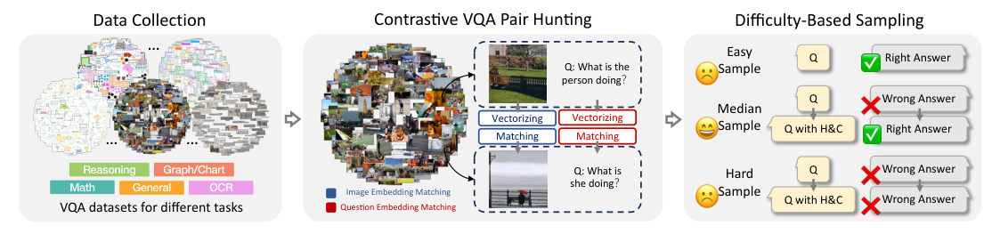

**图 3.** 对比 VQA 对 curation 流水线：从多任务 VQA 数据池中为每条样本筛出有挑战性的对比样本。

**Data Collection.** We collect 21 VQA datasets spanning five categories: reasoning (Zhang et al., 2019; Kiela et al., 2020; Lu et al., 2021b), graph/chart (Kembhavi et al., 2016; Mathew et al., 2022; Masry et al., 2022; Tang et al., 2023; Lu et al., 2023; Liu et al., 2024a), math (Lu et al., 2021a; Cao & Xiao, 2022; Gao et al., 2025), general (Zhu et al., 2016; Johnson et al., 2017; Acharya et al., 2019; Schwenk et al., 2022; Wang et al., 2023a; Chen et al., 2024b), and OCR (ICDAR, 2019; Yuan et al., 2022; Zhang et al., 2024b). This broad collection enriches the diversity of our curated pairs, which ensures the generalization ability of the finetuned model.

**数据采集**：汇集 21 个 VQA 数据集，五大类：reasoning [Zhang et al., 2019; Kiela et al., 2020; Lu et al., 2021b]、graph/chart [Kembhavi et al., 2016; Mathew et al., 2022; Masry et al., 2022; Tang et al., 2023; Lu et al., 2023; Liu et al., 2024a]、math [Lu et al., 2021a; Cao & Xiao, 2022; Gao et al., 2025]、general [Zhu et al., 2016; Johnson et al., 2017; Acharya et al., 2019; Schwenk et al., 2022; Wang et al., 2023a; Chen et al., 2024b]、OCR [ICDAR, 2019; Yuan et al., 2022; Zhang et al., 2024b]。多样化的数据使 curated 对比对具备覆盖面，从而保证微调后模型的泛化能力。

**Contrastive VQA Pair Hunting.** In order to compute the similarity of VQA pairs, we first represent the question $q_i$ and the image $v_i$ by high-dimensional embeddings, denoted as $e^q_i$ and $e^v_i$ respectively. We use GTE (Li et al., 2023c) text embeddings to represent the questions. In terms of image embedding, existing models fall into two types, i.e., vision-language contrastive learning approaches (Radford et al., 2021; Tschannen et al., 2025) while vision-only self-supervised learning methods (Zhang et al., 2023; Oquab et al., 2024). The former ones mainly capture at global semantic information, while the later ones are good at instance discrimination. Neither of them are generic enough to adapt to the diverse domains. To tackle the dilemma, we build a versatile visual embedding model based on ID-based visual metric learning (Ypsilantis et al., 2024; An et al., 2023).

**对比对筛选**：先把问题 $q_i$ 与图像 $v_i$ 编码为高维向量 $e^q_i$、$e^v_i$。问题用 GTE 文本嵌入 [Li et al., 2023c]。图像嵌入方面，现有方案分两类：视觉-语言对比学习（如 CLIP [Radford et al., 2021]、SigLIP-2 [Tschannen et al., 2025]）偏全局语义；纯视觉自监督（DINO [Zhang et al., 2023]、DINOv2 [Oquab et al., 2024]）擅长实例判别。两者都不足以跨域通用。为此，我们基于 ID-based 视觉度量学习 [Ypsilantis et al., 2024; An et al., 2023] 自训了一个通用视觉嵌入模型。

Hunting for a counterpart $(\hat v_i, \hat q_i, \hat a_i)$ is then performed dataset-by-dataset. A sample $(v_j, q_j, a_j)$ is recalled as a valid counterpart if it satisfies: $\gamma(e^v_i, e^v_j) < \phi^v$ and $\gamma(e^q_i, e^q_j) < \phi^q$, where $\gamma(\cdot, \cdot)$ is the cosine distance, and $\phi^v$ and $\phi^q$ are pre-defined thresholds for visual and question similarity, respectively. Any sample that fails to meet both conditions is dropped.

随后按数据集逐一搜索对比样本：当 $(v_j,q_j,a_j)$ 同时满足 $\gamma(e^v_i,e^v_j)<\phi^v$ 与 $\gamma(e^q_i,e^q_j)<\phi^q$（$\gamma$ 为余弦距离，$\phi^v,\phi^q$ 为预设阈值）时召回为对比样本，否则丢弃。

**Difficulty-Based Data Sampling.** For the goal of developing visual reasoning capability, $q_i$ should be a difficult question requires reasoning rather than a straightforward one. We define the levels of difficulty based on the performance of VLM $\theta$: (1) easy samples are with the simple $q_i$ which can be correctly answered by $\theta$ without any auxiliary help; (2) median samples are with $q_i$ which makes $\theta$ initially fails but succeeds when contrasting with $(\hat v_i, \hat q_i, \hat a_i)$ based on provided hint $a_i$ (the C&H setting introduced in Fig. 1); (3) hard samples are the ones with $q_i$ that cannot be correctly addressed by $\theta$ even with the help of contrasting. We only keep median-difficult contrastive VQA pairs for the rationale generating.

**基于难度的采样**：为了有效培养视觉推理能力，$q_i$ 应当是需要推理的难题而非直答题。难度按 VLM $\theta$ 的表现划分：(1) easy：$\theta$ 无任何辅助即可答对；(2) median：$\theta$ 直接答错，但在 hint $a_i$ 与对比样本 $(\hat v_i,\hat q_i,\hat a_i)$ 协助下能答对（即 Fig. 1 的 C&H 设置）；(3) hard：即使加上对比仍答错。我们**只保留 median 样本**用于 rationale 生成。

#### 3.2 Contrasting and Rethinking

Rationales in the reasoning dataset $R = \{(v_i, q_i, a_i, r_i)\}_{i=1}^M$ generated by the VLM $\theta$ itself include visual hallucinations. To achieve the goal:

由 VLM $\theta$ 自生成的 rationale 集合 $R$ 含视觉幻觉。目标是：

$$
R = \{(v_i, q_i, a_i, r_i)\}_{i=1}^M \to \tilde R = \{(v_i, q_i, a_i, \tilde r_i)\}_{i=1}^M, \quad (1)
$$

where $\tilde r_i$ is the rectified rationale, we use the contrastive VQA counterpart $(\hat v_i, \hat q_i, \hat a_i)$ to provoke a rethinking action to refine $r_i$ into $\tilde r_i$. As illustrated in Fig. 4, this pipeline includes three steps:

其中 $\tilde r_i$ 是修正后的 rationale。我们用对比样本 $(\hat v_i,\hat q_i,\hat a_i)$ 触发一次 rethinking，把 $r_i$ 精化为 $\tilde r_i$。如 Fig. 4 所示，包含三步：

**Figure 4.** Faithful rationale generation pipeline. A contrastive analysis can be obtained based on the curated contrastive VQA pair. Leveraging the contrastive analysis, an LLM rectifies the original rationale into a more faithful one.

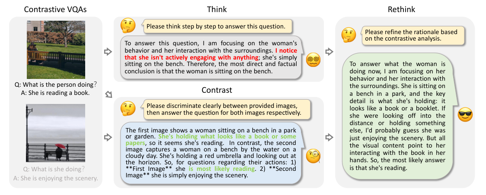

**图 4.** 可信 rationale 生成流水线：基于 curated 对比对得到 contrastive analysis，LLM 据此把原始 rationale 精化为更可信版本。

**Thinking step.** Following the design of Zelikman et al. (2022) to provide the VLM $\theta$ with ground-truth answer $a_i$ as hints, we prompt the VLM $\theta$ to generate the coarse rationale $r_i$ for the target VQA sample $(v_i, q_i, a_i)$ as follows:

**Thinking 步**：沿用 STaR [Zelikman et al., 2022]，把 ground-truth 答案 $a_i$ 作为 hint 提供给 VLM $\theta$，让其为目标样本 $(v_i,q_i,a_i)$ 生成粗 rationale $r_i$：

$$
r_i = f(v_i, q_i, a_i \mid \theta, \delta^t), \quad (2)
$$

where $f$ is a inference process with a "thinking prompt" $\delta^t$. Details of $\delta^t$ are in the Sec. A.3.

其中 $f$ 是带 thinking prompt $\delta^t$ 的推理过程，$\delta^t$ 详见 §A.3。

**Contrasting step.** Asking the VLM $\theta$ to compare the target VQA sample $(v_i, q_i, a_i)$ with its contrastive counterpart $(\hat v_i, \hat q_i, \hat a_i)$ results in a contrastive analysis $c_i$ which may provide more faithful visual information:

**Contrasting 步**：让 VLM $\theta$ 比较目标样本与对比样本，得到 contrastive analysis $c_i$，提供更可信的视觉信息：

$$
c_i = f((v_i, q_i, a_i), (\hat v_i, \hat q_i, \hat a_i) \mid \theta, \delta^c), \quad (3)
$$

where the $\delta^c$ is the "contrasting prompt". When $a_i$ has the same meaning as $\hat a_i$, $\delta^c$ requires summarizing the common patterns of $v_i$ and $\hat v_i$; When $a_i$ is different from $\hat a_i$, $\delta^c$ expects the analysis about the fine-grained differences between $v_i$ and $\hat v_i$. Details of $\delta^c$ are in the Sec. A.3.

其中 $\delta^c$ 是 contrasting prompt：当 $a_i$ 与 $\hat a_i$ 同义时，$\delta^c$ 要求总结两图共性；当不同时，$\delta^c$ 要求分析两图的细粒度差异。$\delta^c$ 详见 §A.3。

**Rethinking step.** As demonstrated in Fig. 1, $c_i$ is more trustworthy than $r_i$. Hence, we adopt a LLM $\psi$ to transfer the information from $c_i$ to a new reasoning path according to $r_i$:

**Rethinking 步**：如 Fig. 1 所示，$c_i$ 比 $r_i$ 更可信。我们用一个 LLM $\psi$ 把 $c_i$ 的信息按 $r_i$ 的结构迁入一条新的推理路径：

$$
\tilde r_i = f(r_i, c_i \mid \psi, \delta^r), \quad (4)
$$

where $\delta^r$ is the "rethinking prompt" which asks the LLM $\psi$ to rectify the visual hallucinations in $r_i$ according to the visual information from $c_i$. $\delta^r$ requires LLM $\psi$ to respond like directly answering the question $q_i$, details are in the Sec. A.3.

其中 $\delta^r$ 是 rethinking prompt，要求 $\psi$ 依据 $c_i$ 的视觉信息修正 $r_i$ 中的幻觉，并以"直接回答 $q_i$"的口吻输出。详见 §A.3。

To ensure the quality of the $\tilde R$, we finalize the visual reasoning dataset by employing a text-matching post-processing to filter out samples that contain incorrect reasoning patterns. The final visual reasoning dataset contains 55K VQA samples with corresponding rationales, a.k.a., the VisCoR-55K.

为保证 $\tilde R$ 的质量，最后用基于文本匹配的后处理过滤掉包含错误推理模式的样本，最终得到 55K 条 VQA + rationale 的 VisCoR-55K。

### 4. Experiments

#### 4.1 Setup

Section 4.1 details our experimental setup, including the supervised finetuning process and the benchmarks used to evaluate the effectiveness of the VC-STaR. In Section 4.2, we present a comprehensive performance comparison. As a self-improving method for visual reasoning, we benchmark VC-STaR against two primary groups: (1) other self-improving baselines adaptable to visual reasoning, and (2) models trained on off-the-shelf visual reasoning datasets. Finally, Section 4.3 provides in-depth ablation studies on designs of our method, including the contrastive VQA pair construction, the generalization on other base models, the difficulty sampling strategy, and the effect of the types of contrastive VQA counterpart.

§4.1 给出实验设置（SFT 过程、评测基准）；§4.2 综合对比；作为视觉推理的自改进方法，VC-STaR 对比两类基线：(1) 可适配视觉推理的自改进方法；(2) 在已有视觉推理数据集上训练的模型。§4.3 深入消融：对比对构造、模型无关性、难度采样、对比类型的影响。

**Implementation Details.** Using the LLaMA-factory framework (Zheng et al., 2024), we finetune the model for 3 epochs via full-parameter supervised finetuning (SFT), with the vision tower's parameters frozen. The SFT utilizes a learning rate of 1e-5, a batch size of 256. The inference process of the finetuned model does not require such a contrastive pipeline illustrated in Fig. 4, and it follows the standard inference paradigm of VLMs. As for the curation of contrastive VQA pair, the question similarity threshold $\phi^q$ is set to 0.15 and the visual similarity threshold $\phi^v$ is set as 0.5 for datasets of general images. For the datasets including icon, geometry, chart or graph images, the visual similarity threshold $\phi^v$ is set as 0.3. The LLM $\psi$ used in the rethinking step of our rationale generation pipeline is the open-sourced Qwen2.5-72B.

**实现细节**：使用 LLaMA-factory [Zheng et al., 2024]，全参数 SFT 3 epoch，冻结视觉塔；学习率 1e-5，batch size 256。微调后的模型推理时无需对比流水线，按 VLM 标准推理执行。对比对 curation 中 $\phi^q=0.15$；general 图像 $\phi^v=0.5$，icon/几何/chart/graph 类 $\phi^v=0.3$。Rethinking 步使用的 LLM $\psi$ 为开源的 Qwen2.5-72B。

**Evaluation Benchmarks.** We employ 6 benchmarks designed to assess its robustness against hallucination, mathematical reasoning, and general abilities. The MMVP (Tong et al., 2024) and Hallusion (Guan et al., 2024) benchmarks focus on visual hallucination, and the MathVista (Lu et al., 2024b) and MathVision (Wang et al., 2024) benchmarks are about the mathematical reasoning. The MMStar (Chen et al., 2024c) is a highly curated benchmark, composed of purified samples from multiple benchmarks, e.g., MMMU (Yue et al., 2024) and MMBench (Liu et al., 2024b). The MME-RealWorld benchmark (Zhang et al., 2025b) is a large-scale, human-annotated benchmark for difficult, real-world tasks. Therefore, MMStar and MME-RealWorld are suitable to evaluate the general perceptual and cognitive abilities under varied scenarios.

**评测基准**：选 6 个基准覆盖幻觉鲁棒性、数学推理与通用能力。MMVP [Tong et al., 2024] 和 HallusionBench [Guan et al., 2024] 关注视觉幻觉；MathVista [Lu et al., 2024b] 与 MathVision [Wang et al., 2024] 关注数学推理；MMStar [Chen et al., 2024c] 由 MMMU [Yue et al., 2024]、MMBench [Liu et al., 2024b] 等的精筛样本构成；MME-RealWorld [Zhang et al., 2025b] 是大规模人工标注的真实世界难任务基准。MMStar 与 MME-RealWorld 适合评估多场景的通用感知与认知能力。

#### 4.2 Main Results

**Comparison with the base model.** To evaluate the effectiveness of our approach, we employ Qwen2.5VL-7B as the base model and adopt the "think step by step" prompt to enable chain-of-thought reasoning. We compare our method against this baseline, with results summarized in Table 1. VC-STaR demonstrates consistent performance gains across diverse challenging benchmarks, achieving an average improvement of 2.4%. Notably, it yields substantial improvements of 5.7% and 3.2% on MMVP and the Hallusion Benchmark, respectively, validating its efficacy in mitigating hallucinations within the reasoning process. Our approach also shows its enhanced reasoning capabilities on mathematical benchmark, i.e., MathVista and MathVision. Furthermore, the improvement on the MMStar and MME-RealWorld underscore the generalizability of the VC-STaR under varied challenging general-purpose scenarios.

**与基模型的对比**：以 Qwen2.5VL-7B 为基模型，采用 "think step by step" 触发 CoT 推理。结果见 Table 1。VC-STaR 在各基准上一致提升，平均 +2.4%。MMVP +5.7%、HallusionBench +3.2%，证实其在抑制推理过程幻觉上的有效性；MathVista 与 MathVision 上的提升说明数学推理也增强；MMStar 与 MME-RealWorld 的增益体现其通用场景泛化性。

**Table 1.** Performance comparison with self-improving baselines and the models trained on off-the-shelf visual reasoning datasets on hallucination, math, and general benchmarks.

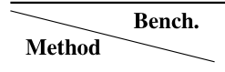

**表 1.** 在幻觉、数学、通用三类基准上，与自改进基线及在已有视觉推理数据集上训练的模型对比。

For qualitative validation, Figure 5 provides visual comparisons that offer deeper insights. The visualizations reveal that our model excels at grounding its textual rationales in the corresponding visual evidence. This capability remains robust even when confronted with visually complex patterns, thereby effectively mitigating hallucinations.

定性方面，Fig. 5 给出可视化对比：模型擅长把文本 rationale 锚定到对应视觉证据上；即使面对视觉复杂图样仍稳健，从而抑制幻觉。

**Figure 5.** Qualitative Comparison with base model. The second row shows the directly response from the base model, the third row shows the response with "think step by step", the last row shows the response of our VC-STaR.

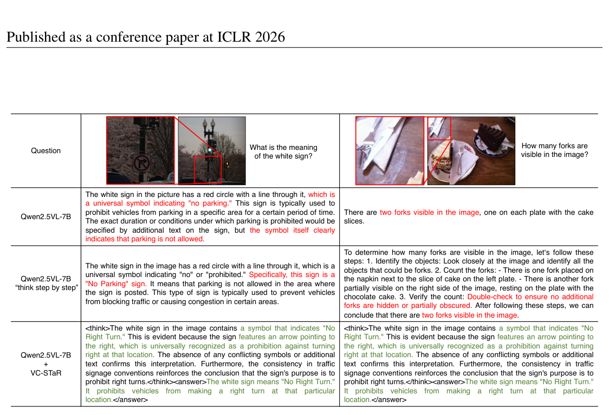

**图 5.** 与基模型的定性对比。第二行为基模型直接回答，第三行为 "think step by step" 提示下的回答，第四行为 VC-STaR 的回答。

**Comparison with self-improving baselines.** We reproduce three self-improving baselines and compare VC-STaR against them. Each baseline is applied to the Qwen2.5VL-7B base model and generates rationales on VisCoR-55K for finetuning, differing in their core improvement mechanism: (1) STaR (Zelikman et al., 2022): Leverages ground-truth answers to regenerate rationales for incorrect predictions. (2) Verifier (Lu et al., 2024a): Filters out visually hallucinated rationales via a self-verification step (Zhang et al., 2025a) to ensure visual grounding. (3) Feedback (Qu et al., 2024): Refines rationales based on self-generated feedback in a recursive manner. Table 1 reveals a critical trade-off: existing self-improving methods boost performance on hallucination benchmarks at the expense of math and general capabilities. Our approach mitigates this pattern and achieves robust, consistent performance gains.

**与自改进基线的对比**：复现三种自改进基线，统一在 Qwen2.5VL-7B 上、统一用 VisCoR-55K 生成 rationale 后微调，仅核心机制不同：(1) STaR [Zelikman et al., 2022] 用 ground-truth 重生错答的 rationale；(2) Verifier [Lu et al., 2024a] 通过自验证 [Zhang et al., 2025a] 过滤幻觉 rationale；(3) Feedback [Qu et al., 2024] 基于自生反馈递归精化。Table 1 揭示关键 trade-off：已有方法在幻觉基准上的提升伴随着数学与通用能力的下降，而我们的方法减轻了这一现象，取得鲁棒一致的提升。

**Comparison with off-the-shelf visual reasoning datasets.** We also evaluate VC-STaR against base model finetuned on four off-the-shelf visual reasoning datasets. These datasets represent diverse strategies for rationale generation. For instance, Virgo (Du et al., 2025) makes the VLM think slowly with purely textual rationales. In contrast, LLaVA-CoT (Xu et al., 2025) leverages hand-crafted templates filled by the powerful GPT-4o (OpenAI, 2024a). Other approaches first convert visual information into text; R1-Onevision (Yang et al., 2025b) generates rationales from image captions using the DeepSeek-R1 model (Guo et al., 2025), while Long Perceptual Thought (LPT) (Liao et al., 2025) extends this by using dense captions (Onoe et al., 2024) and keywords like "wait" to elicit more detailed outputs from a similar LLM. In our experiments, we directly finetune the base model on each of these datasets. Based on the results shown in Table 1, we can draw the following conclusion: (a) Enhancing visual reasoning with purely textual rationales from Virgo is ineffective. This strongly indicates that visual modality matters. (b) The model trained on LLaVA-CoT suffers limited improvement, which demonstrates that the hand-crafted template struggle to generalize across diverse VQA tasks. (c) The models trained on datasets generated by DeepSeek-R1 based on captions achieves notable improvements. However, the performance gap between them and ours highlights the clear advantage of our visually-native approach over relying on textual captions.

**与已有视觉推理数据集的对比**：把 VC-STaR 与四个已有数据集上微调的模型对比。这些数据集代表不同 rationale 生成策略：Virgo [Du et al., 2025] 使用纯文本 rationale 让 VLM 慢思考；LLaVA-CoT [Xu et al., 2025] 用 GPT-4o [OpenAI, 2024a] 填手工模板；R1-OneVision [Yang et al., 2025b] 用 DeepSeek-R1 [Guo et al., 2025] 基于图像 caption 生成 rationale；LPT [Liao et al., 2025] 进一步使用 dense caption [Onoe et al., 2024] 与 "wait" 等关键词。我们直接在各数据集上微调基模型。Table 1 给出结论：(a) Virgo 的纯文本 rationale 无效，说明**视觉模态必要**；(b) LLaVA-CoT 提升有限，说明手工模板难以泛化；(c) 基于 DeepSeek-R1 caption 生成的方法有显著提升，但仍弱于我们的视觉原生路径。

#### 4.3 Analysis

**Can contrastive VQA pairs constructed in other ways?** To answer this, we explore alternative strategies for curating contrastive VQA pairs. The first strategy is editing-based, utilizing the HQ-Edit dataset (Hui et al., 2025). By prompting an LLM to create questions from editing instructions, we generate pairs where an original and an edited image yield different answers. The second strategy is caption-based, leveraging a dense caption dataset, i.e., DOCCI (Onoe et al., 2024). For this, we instruct an LLM to parse dense captions of visually similar images and generate a question that hinges on their subtle differences. For both strategies, we generate rationales for these newly created contrastive pairs using our proposed VC-STaR and finetune the Qwen2.5VL-7B. The results, presented in Fig. 6, lead to several observations: (a) VC-STaR is broadly effective, but performance is data-dependent. This is attributable to the biased data distribution of HQ-Edit and DOCCI, highlighting a key limitation of their curation scope. (b) VisCoR-55K includes contrastive pairs from a broader range of reasoning tasks, resulting in a more balanced performance.

**对比对能否用其他方式构造？** 考察两种替代：第一是基于编辑的，利用 HQ-Edit [Hui et al., 2025]——让 LLM 从编辑指令构造问题，原图与编辑图给出不同答案；第二是基于 caption 的，利用 dense caption 数据集 DOCCI [Onoe et al., 2024]——让 LLM 解析视觉相似图的 dense caption，生成依赖二者细微差异的问题。两种策略都用 VC-STaR 生成 rationale 并微调 Qwen2.5VL-7B。结果（Fig. 6）显示：(a) VC-STaR 广泛有效，但表现依赖数据——HQ-Edit 与 DOCCI 的数据分布偏，反映其 curation 覆盖面不够；(b) VisCoR-55K 涵盖更广的推理任务对比对，因而表现更均衡。

**Figure 6.** Performance comparison with other contrastive VQA pair construction strategies.

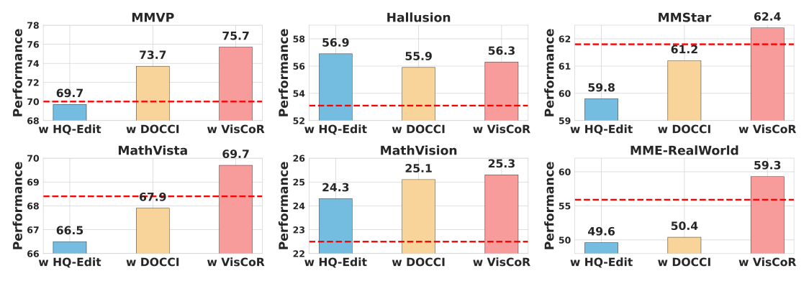

**图 6.** 与其他对比 VQA 对构造策略的性能对比。

**Does VC-STaR generalize to other base models?** We conduct experiments on Qwen2.5VL-3B and InternVL2.5-8B (Chen et al., 2025). Following the same self-improving procedure, we use VC-STaR to generate visual reasoning datasets from our VisCoR contrastive pairs, specifically for the two base models. We then finetune the Qwen2.5VL-3B and InternVL2.5-8B via the LLaMA-factory and SWIFT (Zhao et al., 2025), respectively. The results, presented in Table 2, demonstrate the model-agnostic effectiveness of our approach. These consistent and significant gains confirm that VC-STaR is a versatile and broadly applicable strategy for enhancing the visual reasoning ability.

**VC-STaR 是否对其他基模型也成立？** 在 Qwen2.5VL-3B 与 InternVL2.5-8B [Chen et al., 2025] 上重复同一自改进流程：用 VC-STaR 为各基模型从 VisCoR 对比对生成各自的推理数据，分别用 LLaMA-factory 与 SWIFT [Zhao et al., 2025] 微调。Table 2 显示其模型无关性：一致且显著的增益确认 VC-STaR 是提升视觉推理能力的通用策略。

**Table 2.** Evaluation of the effect of VC-STaR on other base models. Blue numbers in parentheses represent performance gains.

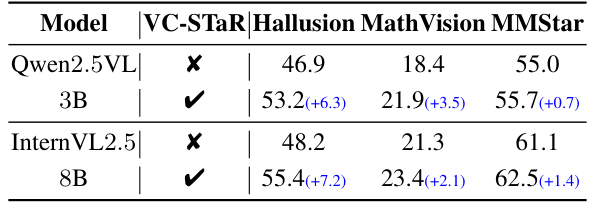

**表 2.** VC-STaR 在其他基模型上的效果。括号中蓝色数字为性能提升。

**What is the effect of easy samples on visual reasoning?** Starting with our VisCoR-55K datasets, we incrementally add easy samples of two batches with 20K each. As illustrated in Table 3, we observe that the inclusion of easy samples is harmful. Specifically, when the number of easy samples increases, performance decreases. Therefore, we do not use the easy samples to avoid the potential "overthink" for straightforward problems.

**易样本对视觉推理的影响**：从 VisCoR-55K 出发，分两批每次加 20K 易样本。Table 3 显示加入易样本反而损害性能：易样本越多、性能越降。我们因此不使用易样本，以避免对直答题的"overthink"。

**Table 3.** Effect of the easy samples adding to VisCoR-55K. Red numbers in parentheses represent performance drops.

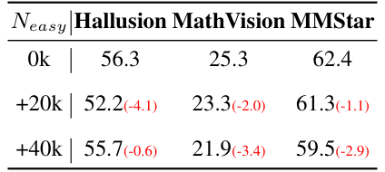

**表 3.** 向 VisCoR-55K 加入易样本的影响。括号中红色数字为下降量。

**How the contrastive VQA pairs of different types contribute?** A contrastive VQA pair can be categorized as "positive" if both samples yield the same answer, and "negative" if their answers differ. To investigate the respective contributions of these two types of counterparts to our method's performance, we conducted a controlled experiment on the GQA dataset (Hudson & Manning, 2019). The structured nature of GQA allows for the reliable curation of both positive and negative pairs via simple text matching. We applied VC-STaR to three distinct training sets: one generated from only positive contrastive pairs, one from only negative pairs, and a combined set including both. The results, detailed in Table 4, reveal a clear and significant trend. While both types of pairs are beneficial, negative counterparts are substantially more effective than positive ones, and their combination yields the optimal total gain, highlighting their complementary roles. We attribute the superior efficacy of negative counterparts to their ability to induce stronger semantic contrast. Accordingly, our approach incorporates both positive and negative pairs without restriction to achieve optimal gain.

**不同类型对比对各自的贡献**：对比对若两图答案相同记为 "positive"，不同记为 "negative"。在 GQA [Hudson & Manning, 2019] 上做受控实验：GQA 的结构化特性允许通过简单文本匹配可靠筛出正/负对。把 VC-STaR 分别施加到三个训练集：仅正、仅负、正负组合。Table 4 给出清晰趋势：两类对都有用，但**负对比对显著强于正对比对**，二者组合得到最优总增益，体现互补性。我们认为负对的优势源自更强的语义对比信号。因此最终方法不加限制地同时使用正负对。

**Table 4.** Analysis about the effect of positive and negative contrastive VQA counterparts on GQA benchmark. We adopt the Qwen2.5VL-7B as our base model.

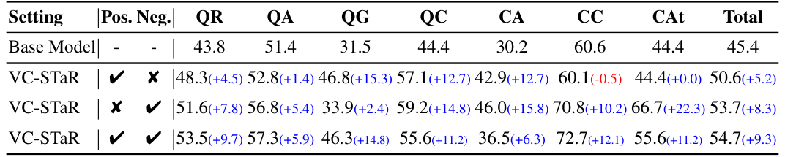

**表 4.** GQA 基准上正/负对比对的影响分析。基模型为 Qwen2.5VL-7B。

### 5. Conclusion

We demonstrate that visual hallucination can be effectively mitigated through the lens of contrast, thereby enhancing visual reasoning. Based on the insight that VLMs can see better by contrast, we propose the VC-STaR. The VC-STaR refines hallucinatory reasoning paths through analysis over curated contrastive VQA pairs, which yields our high-quality VisCoR-55K. Finetuning on VisCoR-55K delivers a consistent performance gain across six benchmarks, significantly surpassing other self-improving baselines and models trained on state-of-the-art visual reasoning datasets. Looking forward, we hope our work will offer a new perspective on visual reasoning and inspire the exploration of novel contrast-driven training and inference paradigms.

我们论证了视觉幻觉可以通过对比来有效缓解，从而增强视觉推理。基于"VLM 在对比中看得更清楚"这一洞察，我们提出 VC-STaR——通过 curated 对比 VQA 对的分析精化幻觉性推理路径，得到高质量数据集 VisCoR-55K。在 VisCoR-55K 上微调可在六个基准上一致提升，显著强于其他自改进基线与已有 SOTA 视觉推理数据集训练的模型。展望未来，我们希望这项工作能为视觉推理提供新视角，并推动对比驱动的训练与推理范式的进一步探索。

### A. Appendix

#### A.1 Rethinking VC-STaR from a Cognitive Perspective

Learning and reasoning are inherently comparative and contrastive processes. Humans rarely learn concepts in isolation. Instead, humans refine our understanding by comparing examples, identifying distinguishing features, and reasoning through analogies and differences. The prototype theory concludes this cognitive behavior as that our human beings identify new identities by comparing them with the prototype concept (Rosch, 1975). Besides, the structure-mapping theory says that analogical reasoning can recognize the relationships shared by two domains (Gentner, 1983). This mapping can be treated as a fine-grained contrasting process. In our work, the contrasting process provides an opportunity to learn visual concept from the prototype, and our rethinking strategy reinforces the structure-mapping by generating new reasoning paths via contrasting. We hope to highlight the potential of porting such human-like cognitive behaviors to the domain of reasoning.

学习与推理本质上是比较与对比的过程。人类几乎不会孤立地学概念，而是通过对比样例、识别差异性特征、借由类比与差异进行推理来精化理解。原型理论 [Rosch, 1975] 把这一认知行为概括为：人通过与原型概念的比较来识别新事物；结构映射理论 [Gentner, 1983] 指出类比推理能识别两个领域共享的关系——这一映射可视为一种细粒度对比过程。在本文工作中，对比过程为从原型学习视觉概念提供了契机，rethinking 策略则通过对比生成新的推理路径来强化结构映射。我们希望强调把这类人类认知行为迁移到推理域的潜力。

#### A.2 Details about VisCoR-55K

The construction of our VisCoR-55K dataset is a multi-stage process involving efficient pair curation, difficulty-based filtering, and quality-controlled rationale generation. The entire pipeline is designed to produce a high-quality, challenging visual reasoning dataset. Our curation process for contrastive VQA pairs begins with a dataset-by-dataset, divide-and-conquer strategy. To maintain computational tractability and avoid a costly $O(n^2)$ search complexity across the entire data pool, we implement a greedy, first-match-exit search algorithm: for each sample within a given source dataset, the search for a contrastive VQA counterpart terminates as soon as the first valid match is identified. This efficient approach allows us to scale the curation process effectively. Following this procedure, we initially curated a large pool of 240k raw contrastive VQA pairs. The distribution is visualized by the bar chart in Fig. 7, with the left y-axis indicating the number of samples.

VisCoR-55K 的构造是包含高效配对、难度过滤与质量受控的多阶段过程。对比对 curation 采用数据集逐一处理的分治策略——为避免在整个数据池上做 $O(n^2)$ 搜索，使用贪心式的 first-match-exit：对每条样本，一旦发现首个合法对比样本即终止搜索。这一高效做法使流程可扩展。最初汇得 240k 原始对比对，分布如 Fig. 7 柱状图所示（左纵轴为样本数）。

This initial pool of 240k pairs then undergoes a rigorous filtering and refinement pipeline. First, we apply the difficulty-based sampling strategy (as detailed in Sec. 3.1) to select only the median samples, which are most effective for enhancing the model's reasoning capabilities. The proportion of median samples varies significantly across datasets, and is illustrated by the line graph in Fig. 7 (plotted against the right y-axis). This critical filtering step narrows our collection down to 86k challenging contrastive pairs. Subsequently, we leverage the contrasting and rethinking pipeline to generate a high-quality rationale for each of these 86k samples. As a final quality control measure, we employ a text-matching-based post-processing step to automatically filter out any rationales containing unexpected or erroneous reasoning patterns. This process culminates in our final VisCoR-55K dataset, a collection of high-fidelity visual reasoning samples ready for finetuning. The pie charts in Fig. 7 provide a categorical overview of the data composition throughout this pipeline.

随后这 240k 对经过严格过滤：先按 §3.1 的难度采样仅留 median 样本，median 占比在各数据集差异显著（Fig. 7 折线，对应右纵轴），筛后剩 86k；接着对这 86k 样本用 contrasting + rethinking 流水线生成高质量 rationale；最后用文本匹配后处理自动剔除含错误推理模式的样本，得到最终 55K 的 VisCoR-55K。Fig. 7 饼图展示了流水线各阶段的类别构成。

**Figure 7.** Statistics of the contrastive VQA pair curation. The bar chart (left y-axis) displays the total number of contrastive VQA pairs initially curated from each source dataset. The line graph (right y-axis) shows the percentage of these pairs that pass our difficulty-based sampling filter to be classified as median samples.

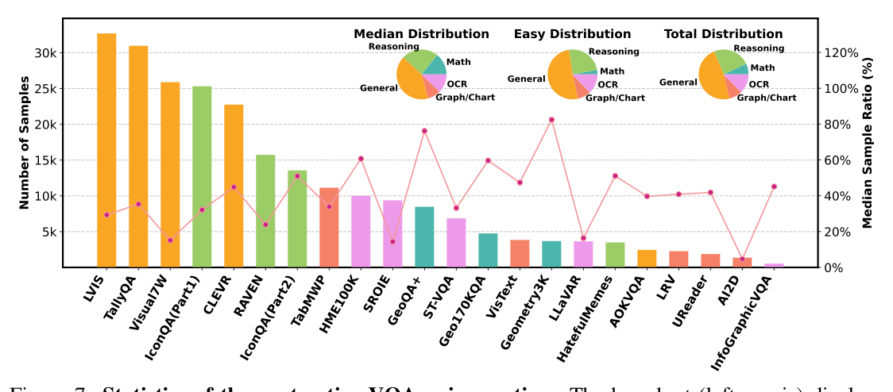

**图 7.** 对比 VQA 对 curation 的统计：柱状图（左纵轴）为各源数据集筛出的对比对总数；折线（右纵轴）为通过难度采样过滤、被分类为 median 样本的占比。

#### A.3 Prompts for Thinking, Contrasting, and Rethinking

As introduced in Sec. 3.2, 3 steps lead to the final rationales. We design 3 prompts for the thinking, contrasting, and rethinking steps. The thinking prompt is:

如 §3.2 所述，三步组成 rationale 生成。我们为 thinking / contrasting / rethinking 三步设计了三个 prompt。Thinking prompt 如下：

```
You are a helpful assistant to answer the question by thinking step by step.
### INPUT ###
- Image: The image that serves as the basis for answering the question.
- Question: The question pertains to the content of the image.
- Answer: The correct answer for the question about the image.
### INSTRUCTION ###
- You should analyze the question and decide to focus on which visual content.
- You should parse the details of visual content based on the question.
- You should conclude the visual evidence to answer the question.
### OUTPUT ###
- The returned content MUST be in the natural flow.
<Image><Question><Answer>
```

The contrasting prompt is:

Contrasting prompt 如下：

```
You are a helpful assistant to think step by step for discriminating between two
images to answer two synonymous questions.
### INPUT ###
- First Image: One image that serves as the basis for answering the question.
- Second Image: The other image that serves as the basis for answering the question.
- First Question: The question pertains to the content of the First Image.
- Second Question: The question pertains to the content of the Second Image.
- Answer: The correct answer for the question about the images.
### INSTRUCTION ###
- When the correct answers for the two images are the same, you should summarize
  the common patterns in the visual content of the two images.
- When the correct answers for the two images are different, you should identify the
  differences in visual content between two images.
- Conclude the visual evidence to answer the questions respectively.
### OUTPUT ###
- Return in the natural flow.
<FirstImage><SecondImage>
<FirstQuestion><SecondQuestion><Answer>
```

The "Answer" here is the concatenation of both samples. The rethinking prompt is:

此处 "Answer" 为两条样本答案的拼接。Rethinking prompt 如下：

```
You are a helpful assistant to rewrite the coarse rationale into a more correct and
more logical one based on a contrastive analysis.
### INPUT ###
- Question: The question to be answered based on one given target image.
- Answer: The correct answer to answer the question.
- Coarse Rationale: The naive reasoning process answering the question.
- Contrastive Analysis: The reasoning process when comparing the first image with
  the second image for synonymous questions.
### INSTRUCTION ###
- The contrastive analysis is more reliable than the coarse rationale.
- If the answers in the contrastive analysis are the same for the two images, the
  model should formulate a summary reasoning schema. This schema must summarize the
  key visual features and confirm that the provided visual evidence aligns with this
  schema to derive the conclusion.
- If the answers in the contrastive analysis are different for the two images, you
  can employ backward chaining hypothesizing the visual cues that would be present
  if the alternative answer were correct, and then highlighting the critical
  distinctions between this hypothetical scenario and the actual visual evidence.
### OUTPUT ###
- The output MUST be in the format of
  '<think>the thinking content</think><answer>the answering content</answer>'.
- The content of thinking content MUST be between the special token of '<think>'
  and '</think>'.
- The content of answering content MUST be between the special token of '<answer>'
  and '</answer>'.
<Question><Answer><CoarseRationale><ContrastiveAnalysis>
```

#### A.4 Additional Qualitative Results

Examples of rationales generated by VC-STaR in VisCoR-55K are illustrated in Fig. 8. After obtaining the model finetuned with VisCoR-55K on Qwen2.5VL-7B, we test it on some customized visual question answering cases and observe the interesting results shown in Fig. 9.

VisCoR-55K 中由 VC-STaR 生成的 rationale 示例见 Fig. 8。在 Qwen2.5VL-7B 上完成 VisCoR-55K 微调后，我们在自定义 VQA 案例上测试，得到的有趣结果见 Fig. 9。

**Figure 8.** Examples of rationales in VisCoR-55K.

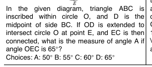

**图 8.** VisCoR-55K 中的 rationale 示例。

**Figure 9.** Additional qualitative comparison.

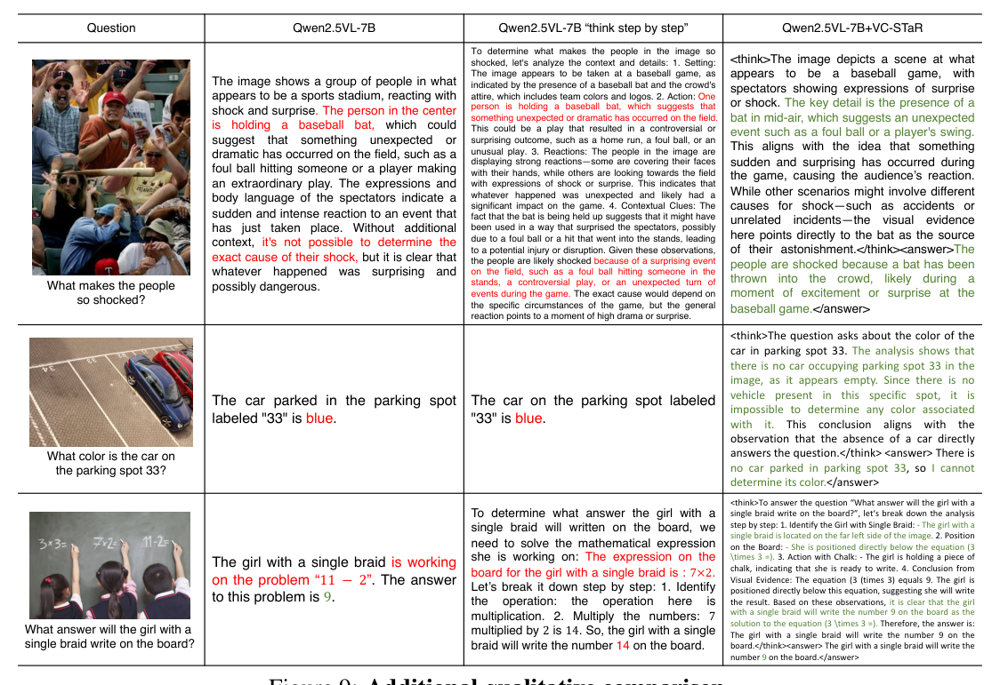

**图 9.** 补充定性对比。

---

*References omitted — see original PDF.*
