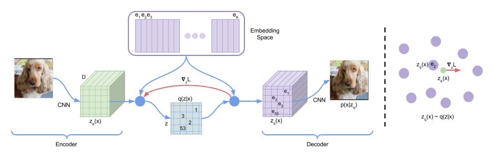
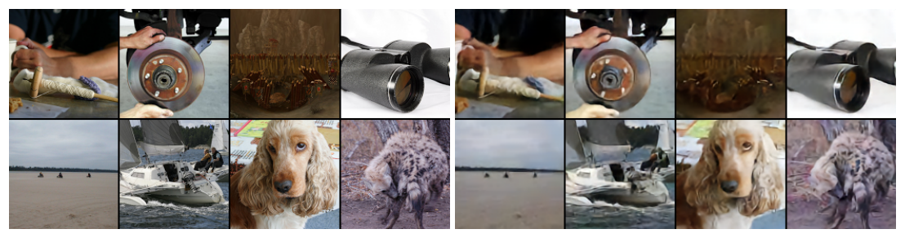
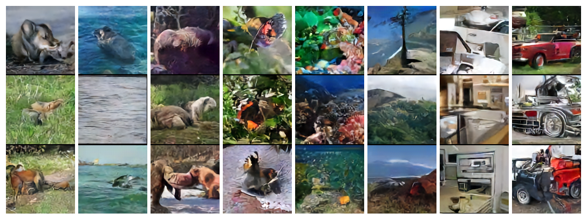
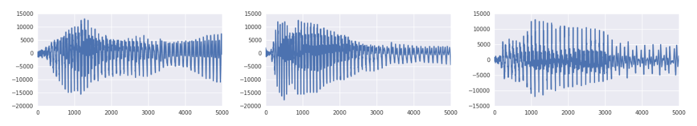
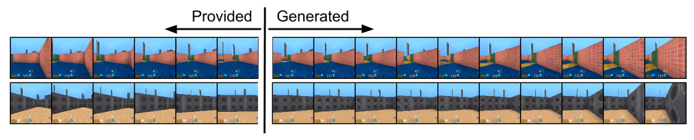

## 一页读懂 | Executive Reading

VQ-VAE 试图修复标准 VAE 的一个结构性张力：当 decoder 很强，尤其是自回归 decoder 能独立解释局部统计时，连续 latent 可能被忽略；但若完全移除 latent，模型又失去一个压缩、可复用的全局表征层。论文的选择不是继续设计更复杂的连续 posterior，而是让 encoder 输出落到一个有限 codebook 上，把潜表示直接变成离散 index。

这个离散瓶颈由四个动作共同成立。encoder 先产生连续特征 \(z_e(x)\)，再以最近邻查找选中 embedding \(e_k\)，decoder 接收量化后的 \(z_q(x)=e_k\)。最近邻操作不可导，因此反向传播时采用 straight-through estimator，把 decoder 对 \(z_q\) 的梯度原样复制给 \(z_e\)。codebook 不能从 reconstruction term 直接获得梯度，于是用 embedding loss 把 \(e_k\) 拉向停止梯度后的 encoder 输出；commitment loss 则把 encoder 输出拉回 codebook，防止其尺度无约束漂移。

论文还有一个经常被忽略的设计：表征与先验分开学习。训练 VQ-VAE 时，离散 prior 固定为 uniform，因此 KL 对 encoder 是常数；autoencoder 学到 code 后，再单独用 PixelCNN 或 WaveNet 拟合这些 index 的分布。生成质量由“压缩表征是否保留重要结构”和“自回归 prior 是否能建模 code 序列”共同决定，这使 VQ-VAE 更像一个 tokenization interface，而不只是换了 posterior family 的 VAE。

量化证据中，CIFAR-10 上连续 VAE、VQ-VAE、VIMCO 的 lower bound 分别为 4.51、4.67、5.14 bits/dim，数值越低越好。VQ-VAE 略逊于连续 VAE，但明显优于该离散 VIMCO 基线，足以支持“离散 latent 不再必须付出巨大 likelihood 代价”。跨模态证据更丰富：ImageNet 与 DMLab 展示重建和 prior samples；VCTK 中，离散 speech code 保留文本内容并支持 speaker conversion；一个简单的一对一 phoneme 映射达到 49.3% accuracy，而 majority baseline 为 7.2%。

这些实验强力支持“离散 bottleneck 可训练、可跨图像/语音/视频工作”，但对更强的因果叙事仍需克制。posterior collapse 没有用连续 VAE 的逐层 KL 或 latent usage 受控消融来系统验证；语音抽象性部分依赖 speaker-conditioned decoder；图像与视频结论主要来自定性样本。VQ-VAE 的确定性遗产是离散神经表征的优化接口，语义抽象与长程建模则是有说服力但尚未被完全隔离的结果。

---

## 论证地图 | Argument Map

| 论证环节 | 内容 | 证据 / 位置 | 阅读判断 |
|---|---|---|---|
| 问题 | 连续 VAE 配强 decoder 时 latent 可能被忽略；离散 latent 的低方差训练又困难 | §1–§2 | 问题同时指向表征利用率与梯度估计 |
| 命题 | 最近邻 codebook、straight-through 与专用 codebook/commitment loss 可以端到端学习离散 latent | §3.1–§3.2，Eq. (1)–(3) | 机制清楚，但 straight-through 是有偏启发式梯度 |
| 生成机制 | 先用 uniform prior 训练表征，再对离散 code 拟合 PixelCNN/WaveNet prior | §3.3 | 将重建学习与长程 token 建模解耦，便于模块化扩展 |
| 定量证据 | CIFAR-10 上 4.67 bits/dim，接近连续 VAE 的 4.51，并优于 VIMCO 的 5.14 | §4.1 | 支持离散 latent 的可行性；并未超过连续基线 |
| 跨模态证据 | 图像重建/采样、speech conversion、phoneme probe 与 action-conditioned video | §4.2–§4.4，Figure 2–7 | 多任务一致支持 usefulness，但大量证据为定性或弱探针 |
| 边界 | codebook 使用率、dead codes、梯度偏差、强 prior 成本与因果归因未充分评测 | §3–§5、缺失控制 | 方法成立不等于每个“高层语义”解释都已被证明 |

---

## 关键证据 | Evidence & Tensions

### 值得吸收 | What Transfers

- Figure 1 + Eq. (1)–(2)：量化不是后处理，而是 forward path 中的最近邻查找；encoder、codebook 与 decoder 从一开始就在同一表示空间中协同学习。
- Eq. (3)：三个 loss 通过 stop-gradient 精确划分更新对象，避免 reconstruction、dictionary learning 与 encoder scale 互相污染。
- §3.2：论文报告 \(\beta\in[0.1,2.0]\) 时结果变化不大，并统一采用 \(\beta=0.25\)；这说明 commitment 的存在比精细调参更重要，但仍受 reconstruction scale 影响。
- §3.3：先学 code 再学 prior，把“哪些信息进入 token”与“token 序列如何分布”拆开，是后来大规模 tokenized generation 的关键抽象。
- §4.3：在没有 phoneme label 参与训练的条件下，简单 code-to-phoneme 映射显著高于 majority baseline，为 speech code 的内容相关性提供了可量化锚点。
- Appendix A.1：EMA codebook update 把 mini-batch VQ 更新写成 online k-means，是比直接 embedding loss 更稳定的可替代实现。

### 值得推敲 | What Remains Unsettled

- §3.2：straight-through estimator 直接忽略 quantization 的真实导数，因此训练方向有偏；论文以“worked well”报告经验可用性，没有分析偏差与稳定性。
- §3.3–§4.2：sample quality 同时取决于 VQ-VAE 与强 PixelCNN/WaveNet prior，实验没有等容量连续-latent prior 对照，不能把全部收益归因于离散表示。
- §4.1：4.67 bits/dim 比连续 VAE 的 4.51 更差；正确结论是“接近”，不是“离散 latent 在 likelihood 上更优”。
- §4.2：约 42.6× 是把 8-bit RGB raw size 与 9-bit code grid 比较的名义压缩比，未计 code entropy、模型参数或熵编码，不能当作完整 codec rate。
- §4.3：speaker-conditioned decoder 主动提供 speaker identity，因此 speaker invariance 既来自 bottleneck，也来自条件化分工；缺少不提供 speaker ID 的析因对照。
- §4.4：action-conditioned video 只展示 6 帧上下文后 10 帧生成的定性序列，没有动作遵循率、几何一致性或长时误差指标。

---

## 研究者评注 | Researcher Commentary

### VQ-VAE 的贡献是“可训练的符号接口”

code index 看似只是压缩后的整数，真正重要的是它在两侧都有稳定接口：向下连接连续 encoder feature，向上连接任意离散序列模型。最近邻、straight-through、dictionary update 和 commitment 共同规定了这条接口的 forward semantics 与 backward semantics。缺任何一项，都可能出现 decoder 学不到、codebook 不动或 encoder 逃离 embedding space 的失败。

### “避免 posterior collapse”应区分结构原因与实验证据

确定性 one-hot posterior 配 uniform prior 后，训练中的 KL 对 encoder 为常数，因而没有标准 VAE 中把 posterior 拉回 prior 的逐样本压力；同时 decoder 只能看到选中的 code embedding。这确实改变了 collapse 的优化条件。可是论文没有报告 active codes、mutual information、per-position perplexity 或连续 VAE 的 KL collapse 曲线。更稳妥的说法是：VQ-VAE 的目标结构使 latent usage 更直接，实验显示强 decoder 设置下 code 仍有用；但“彻底解决 posterior collapse”没有被系统验证。

### 两阶段训练把收益和成本一起外置

把 prior 留到第二阶段，让 autoencoder 不必一边学习量化一边拟合复杂 code distribution；这提升了工程稳定性，也允许替换 PixelCNN/WaveNet。不过，最终 sampling 仍需自回归生成大量离散 token，速度与建模成本只是从 pixel space 转移到 latent space。VQ-VAE 证明压缩后的序列更值得建模，却没有证明自回归 prior 本身廉价。

### 判断表征是否“语义化”，需要可反驳的干预

phoneme probe、speaker conversion 与视觉重建共同提示 code 保留高层因素。但真正强的实验应控制 code rate 与 decoder capacity，干预单个 code 或 code 子序列，测量内容、说话人、韵律、局部纹理和动作结果分别如何变化；再与连续 bottleneck、Gumbel-Softmax 和随机 codebook 比较。只有这样，才能从“可压缩且可用”推进到“离散 code 对语义因素具有稳定可组合性”。

---

## 原文精读 | Semantic-chunk Bilingual Reading

以下按论文正文顺序覆盖 Abstract 至 Conclusion，并继续到 References 之后的 Appendix A.1；参考文献条目本身省略。

### Abstract

**Original**

Learning useful representations without supervision remains a key challenge in machine learning. We propose a simple yet powerful generative model that learns discrete representations. VQ-VAE differs from VAEs in two key ways: the encoder network outputs discrete, rather than continuous, codes; and the prior is learnt rather than static.

**译文**

无监督学习有用表征仍是机器学习的核心难题。论文提出 VQ-VAE，用一个相对简洁的生成模型学习离散表示。它与常规 VAE 有两个关键差异：encoder 输出离散而非连续 code；prior 不是固定分布，而是在表征学成后继续学习。

作者将 vector quantization 引入潜空间，希望绕过强 autoregressive decoder 搭配 VAE 时常见的 posterior collapse。再为离散表示训练 autoregressive prior 后，模型能够生成图像、视频与语音，并支持 speaker conversion 与无监督 phoneme-related 表征学习。这里的“utility”由多领域下游行为共同支持，而不是由单一 likelihood 数字定义。

> **句读**：摘要的 “circumvent issues of posterior collapse” 比“从理论上消除 posterior collapse”更弱。论文给出结构动机和成功案例，但没有完成普适证明。

### 1. Introduction

**译文**

最大似然与 reconstruction error 是 pixel-domain 无监督模型的常见目标，但所得 feature 是否有用取决于应用。若只以 log-likelihood 衡量，强 PixelCNN decoder 即使没有 latent 也可能表现最好；论文关心的是另一目标：让 latent 保留数据中的重要特征，同时仍能进行概率生成建模。

连续 feature 是既有 representation learning 的主流，而作者认为离散表示可能更契合语言、语音以及可由语言简洁描述的图像，也更适合符号式 reasoning、planning 与 predictive learning。挑战在于，离散随机变量难以通过标准 backpropagation 训练；与此同时，离散 autoregressive distribution 已有强模型可用。

VQ-VAE 把 VAE 与 vector quantization 结合，通过新的离散 posterior 参数化学习 code。论文声称其训练简单、没有高方差离散估计器的问题，并能在强 decoder 下继续使用 latent。表征学成后，再为 code 训练强 prior。在 speech 上，decoder 还可接收 speaker identity，从而让 latent 更集中编码内容，并用于 speaker conversion；在 DMLab 上则探索 action-conditioned 长程结构。

作者把贡献归纳为四点：提出 VQ-VAE；在 log-likelihood 上接近连续 VAE；配合强 prior 在 speech、image 与 video 上得到连贯样本；并展示无监督 speech code 与 phoneme 的关系及 speaker conversion 应用。

### 2. Related Work

**译文**

离散 VAE 已有 NVIL、VIMCO 等梯度估计器。NVIL 优化单样本目标并用 variance reduction；VIMCO 使用 multi-sample objective 和多个 inference-network samples 改善收敛。Concrete / Gumbel-Softmax 则以带 temperature 的连续分布逼近离散选择：训练初期梯度方差低但有偏，温度退火后更接近离散、方差却会上升。

作者认为这些方法尚未缩小与 Gaussian reparameterization 连续 VAE 的性能差距，而且此前常在 MNIST 和低维 latent 上验证。VQ-VAE 因而选用 CIFAR-10、ImageNet、DeepMind Lab 与 VCTK raw speech，强调高维结构与跨模态可用性。

论文还连接 autoregressive decoder/prior、PixelCNN 与神经图像压缩。与 soft-to-hard quantization 的差别是：作者尝试从零训练连续松弛时，decoder 会逆转这个松弛，使实际 quantization 不发生；VQ-VAE 直接在 forward pass 使用 hard nearest-neighbor assignment。

### 3. VQ-VAE

#### 3.1 Discrete latent variables

**译文**

设 embedding space \(e\in\mathbb R^{K\times D}\)，共有 \(K\) 个 \(D\) 维向量 \(e_i\)。输入 \(x\) 经 encoder 得到连续 feature \(z_e(x)\)，随后选择欧氏距离最近的 code：

\[
q(z=k\mid x)=
\begin{cases}
1,&k=\arg\min_j\|z_e(x)-e_j\|_2,\\
0,&\text{otherwise},
\end{cases}
\]

\[
z_q(x)=e_k.
\]

decoder 只接收选中的 embedding。Figure 1 展示了这一 pipeline；图像、speech 与 video 中分别使用 2-D、1-D 与 3-D latent feature field，正文用单个 \(z\) 简化记号。若以 uniform categorical 作为训练期 prior，deterministic posterior 的 KL 为常数 \(\log K\)。

**图 1.** VQ-VAE 的 forward path 与 gradient path。蓝色路径表示 encoder feature 到 codebook 最近邻再到 decoder；红色梯度绕过不可导 assignment。

#### 3.2 Learning

**Original**

There is no real gradient defined for the nearest-neighbor lookup. We approximate the gradient similar to the straight-through estimator and just copy gradients from decoder input \(z_q(x)\) to encoder output \(z_e(x)\).

**译文**

nearest-neighbor lookup 没有可用的普通导数。论文采用 straight-through 近似：forward pass 使用离散 \(z_q(x)\)，backward pass 则把 decoder input 上的梯度不加修改地传给 encoder output \(z_e(x)\)。梯度可以推动下一次 forward pass 中的 encoder output 跨越 Voronoi 边界，从而改变 code assignment。

完整 loss 含三项：

\[
\mathcal L=
-\log p(x\mid z_q(x))
+\|\operatorname{sg}[z_e(x)]-e\|_2^2
+\beta\|z_e(x)-\operatorname{sg}[e]\|_2^2.
\]

原 PDF 的 Eq. (3) 以最大化 log-likelihood 的符号写第一项；实现时通常写成需要最小化的 negative log-likelihood。stop-gradient \(\operatorname{sg}\) 在 forward 时是 identity，反向时导数为零。

reconstruction term 更新 decoder，并通过 straight-through 更新 encoder；中间的 VQ/dictionary term 只把 embedding 拉向 encoder outputs；最后的 commitment term 只更新 encoder，使其不要无界增大并持续靠近某个 embedding。作者报告 \(\beta\) 从 0.1 到 2.0 时结果变化不大，所有实验取 0.25。对由 \(N\) 个离散位置组成的 latent field，dictionary 与 commitment loss 在位置上取平均。

论文还从 marginal likelihood 角度解释 MAP code：decoder 只用 \(z_q(x)\) 训练，理想收敛后对其他 code 不应分配显著条件概率，因此 \(\log p(x)\) 可近似为 \(\log p(x\mid z_q(x))p(z_q(x))\)，该项同时也是 Jensen inequality 给出的 lower bound。这里的近似依赖 decoder 的训练与 code assignment，并非一般等式。

#### 3.3 Prior

**译文**

VQ-VAE 训练时把 \(p(z)\) 固定为 uniform categorical。autoencoder 学完后，再拟合一个依赖空间或时间上下文的 autoregressive prior：image code 用 PixelCNN，raw audio code 用 WaveNet。生成时先 ancestral sample 离散 code，再经 decoder 映射回数据空间。

作者明确把 joint training 留作未来工作。两阶段设计的优点是，PixelCNN/WaveNet 可以把容量集中于压缩后 code 的全局结构，而 decoder 负责局部统计；代价是最终系统的 likelihood 与 sample quality 不再只属于 VQ-VAE bottleneck，而是两阶段共同产物。

### 4. Experiments

#### 4.1 Comparison with continuous variables

**译文**

作者在 CIFAR-10 上用相同标准 VAE architecture 比较连续 VAE、VQ-VAE 与 VIMCO，并改变 continuous/discrete latent 数量和 \(K\)。encoder 由两层 stride-2 convolution 与两个 residual blocks 组成，decoder 对称；所有 hidden width 为 256。训练 250,000 steps，batch size 128，Adam learning rate \(2\times10^{-4}\)；VIMCO 的 multi-sample objective 使用 50 samples。

三者报告的 lower bound 为：连续 VAE 4.51 bits/dim，VQ-VAE 4.67，VIMCO 5.14，lower is better。连续 VAE 仍最佳，VQ-VAE 与其差 0.16 bits/dim，但比 VIMCO 好 0.47。这项实验支持离散 code 的竞争力，不支持 VQ-VAE 超越连续 VAE。

#### 4.2 Images

**译文**

ImageNet 实验把 \(128\times128\times3\) 的 8-bit image 压到 \(32\times32\) 个离散 code，每个 code 从 \(K=512\) 中选择，即名义上 9 bits。以 raw bits 计算，压缩比约为
\(128\times128\times3\times8/(32\times32\times9)\approx42.6\)。

Figure 2 展示原图与 reconstruction。尽管 bottleneck 大幅降维，重建主要对象与场景结构仍可辨认，但较原图略模糊；作者指出可换 perceptual/GAN loss，但未在本文验证。

随后在 \(32\times32\) code grid 上训练 PixelCNN prior，再将采样 code 送入 decoder。ImageNet samples 与 DMLab samples 展示出连贯对象和局部几何，但属于定性证据。论文还在 DMLab 上叠加第二个 VQ-VAE 与 PixelCNN decoder，把完整 image 压到仅 3 个 \(K=512\) 的全局离散变量；重建不可能完美，却仍保留粗粒度场景布局，作为强 decoder 下 latent 未被完全忽略的案例。

#### 4.3 Audio

**译文**

VCTK 含 109 位 speaker。audio VQ-VAE 使用类似 WaveNet 的 dilated convolution decoder；encoder 有 6 层 stride-2 convolution，因此 latent 时间分辨率缩小 64 倍，单通道 codebook \(K=512\)。decoder 同时接收 latent 与 speaker one-hot。

对输入语音编码后再从 decoder 重建，逐采样点 waveform 不会完全一致，prosody 也会改变，但文本内容保持。Figure 6 的 waveform 说明信号形状变化显著；作者据此判断离散 latent 更关注跨多个 waveform dimensions 的长程内容，而非低层细节。

speaker conversion 直接把一个人的 latent 与另一个 speaker ID 组合解码。样例中内容保持而声音改变，提示 code 与 speaker-specific information 有一定分离；不过 decoder 明确获得 speaker label，因此这种分工部分由条件化结构诱导。

为量化 code 内容，作者在 \(K=128\)、25 Hz 的 latent 上，把每个 code 映射到训练数据中条件概率最大的 41 类 phoneme。这个简单 one-to-one mapping 达到 49.3% accuracy，majority-phoneme baseline 为 7.2%。脚注指出 code 含义可能依赖相邻 code，bi/tri-gram mapping 可能更高；因此 49.3% 是一个保守但粗糙的内容 probe。

另一组 460-speaker 数据把时间分辨率缩小 128 倍，再对 2.56 秒、40,960 waveform steps 对应的 320 latent steps 训练 prior。作者报告无条件样本包含清晰单词和短句，并据此称模型学到 rudimentary phoneme-level language model。由于证据依赖外部 audio samples 且没有系统语言指标，这一结论应视为定性提示。

#### 4.4 Video

**译文**

最后的 DMLab 实验训练 action-conditioned generative model。Figure 7 中，模型接收前 6 帧，再在所有 action 设为 forward 或 right 的条件下生成 10 帧。整段 \(z_t\) 先在 latent space 中由 prior 生成，完成后才用 deterministic decoder 逐帧映射回 pixel space；因此 rollout 不必在每一步把 image 再送回 prior。

样例保持了局部墙面与走廊几何，并随 action 改变方向。论文还称无 action 模型得到相似结果，但因篇幅未展示。该实验说明 latent rollout 可行，却不足以估计长程累积误差或真实 control fidelity。

### 5. Conclusion

**译文**

论文总结：VQ-VAE 将 VAE 与 vector quantization 结合，学习离散 latent；压缩 code 支持 \(128\times128\) image generation、action-conditioned video、speech generation 与 speaker conversion，并在 CIFAR-10 likelihood 上接近连续 VAE。作者认为这些结果说明无监督离散 latent 捕获了重要数据特征，尤其 speech descriptor 与 phoneme 紧密相关。

从证据强度看，“模型可训练并跨模态工作”由多组实验直接支持；“捕获高层语义”“建模 very long-term dependencies”更多由 compression、样例和简单 probe 汇合支持，仍缺机制隔离与定量长程评测。

### Appendix A.1: VQ-VAE dictionary updates with EMA

**译文**

除 Eq. (3) 的 embedding loss 外，codebook 还可用 exponential moving average 更新。若当前分配给 \(e_i\) 的 encoder outputs 为 \(\{z_{i,1},\ldots,z_{i,n_i}\}\)，batch optimum 就是这些向量的均值；minibatch 训练中无法直接使用全数据均值，因此分别维护 assignment count \(N_i\) 与 vector sum \(m_i\) 的 EMA：

\[
N_i^{(t)}=\gamma N_i^{(t-1)}+(1-\gamma)n_i^{(t)},
\]

\[
m_i^{(t)}=\gamma m_i^{(t-1)}
+(1-\gamma)\sum_j z_{i,j}^{(t)},\qquad
e_i^{(t)}=\frac{m_i^{(t)}}{N_i^{(t)}}.
\]

作者报告 \(\gamma=0.99\) 在实践中有效。正文实验没有使用这个更新，因此它是可替代实现，而非主结果的实际训练配置。

*References omitted — see original PDF.*

---

## 术语与符号 | Terms & Notation

| 原文 | 译法 / 保留形式 | 本文中的具体含义 |
|---|---|---|
| VQ-VAE | 向量量化变分自编码器 | encoder 输出经 nearest-neighbor codebook 离散化的生成模型 |
| codebook / embedding space | 码本 / embedding 空间 | \(K\) 个 \(D\) 维可学习向量 \(e_i\) |
| \(z_e(x)\) | encoder output | 量化前的连续 feature |
| \(z_q(x)\) | quantized latent | 选中的 codebook embedding |
| straight-through estimator | 直通估计器 | forward 离散、backward 把 decoder gradient 复制给 encoder |
| stop-gradient | 停止梯度 | forward 为 identity，backward derivative 为 0 |
| commitment loss | 承诺损失 | 约束 encoder output 靠近所选 embedding |
| posterior collapse | 后验坍塌 | 强 decoder 忽略 latent 的退化；本文提供结构缓解与案例证据 |
