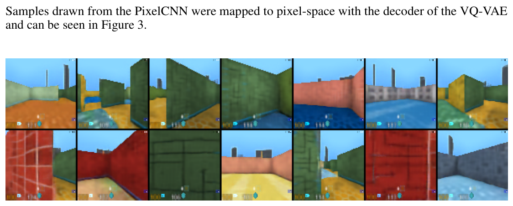
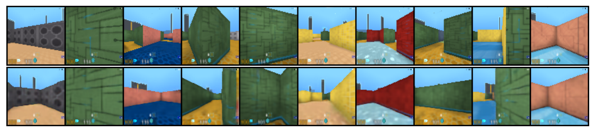

# VQ-VAE-1711

> Auto-extracted preview. 11 pages, 2-column, 7 figures.

Aaron van den Oord
DeepMind
avdnoord@google.com

# arXiv:1711.00937v2  [cs.LG]  30 May 2018

1
Introduction

Maximum likelihood and reconstruction error are two common objectives used to train unsupervised
models in the pixel domain, however their usefulness depends on the particular application the
features are used in. Our goal is to achieve a model that conserves the important features of the
data in its latent space while optimising for maximum likelihood. As the work in [7] suggests, the
best generative models (as measured by log-likelihood) will be those without latents but a powerful
decoder (such as PixelCNN). However, in this paper, we argue for learning discrete and useful latent
variables, which we demonstrate on a variety of domains.

In our work, we introduce a new family of generative models succesfully combining the variational
autoencoder (VAE) framework with discrete latent representations through a novel parameterisation
of the posterior distribution of (discrete) latents given an observation. Our model, which relies on
vector quantization (VQ), is simple to train, does not suffer from large variance, and avoids the

31st Conference on Neural Information Processing Systems (NIPS 2017), Long Beach, CA, USA.

# Neural Discrete Representation Learning

Oriol Vinyals
DeepMind
vinyals@google.com

Koray Kavukcuoglu
DeepMind
korayk@google.com

### Abstract

Learning useful representations without supervision remains a key challenge in
machine learning. In this paper, we propose a simple yet powerful generative
model that learns such discrete representations. Our model, the Vector Quantised-
Variational AutoEncoder (VQ-VAE), differs from VAEs in two key ways: the
encoder network outputs discrete, rather than continuous, codes; and the prior
is learnt rather than static. In order to learn a discrete latent representation, we
incorporate ideas from vector quantisation (VQ). Using the VQ method allows the
model to circumvent issues of “posterior collapse” -— where the latents are ignored
when they are paired with a powerful autoregressive decoder -— typically observed
in the VAE framework. Pairing these representations with an autoregressive prior,
the model can generate high quality images, videos, and speech as well as doing
high quality speaker conversion and unsupervised learning of phonemes, providing
further evidence of the utility of the learnt representations.

Recent advances in generative modelling of images [38, 12, 13, 22, 10], audio [37, 26] and videos
[20, 11] have yielded impressive samples and applications [24, 18]. At the same time, challenging
tasks such as few-shot learning [34], domain adaptation [17], or reinforcement learning [35] heavily
rely on learnt representations from raw data, but the usefulness of generic representations trained in
an unsupervised fashion is still far from being the dominant approach.

Learning representations with continuous features have been the focus of many previous work
[16, 39, 6, 9] however we concentrate on discrete representations [27, 33, 8, 28] which are potentially
a more natural fit for many of the modalities we are interested in. Language is inherently discrete,
similarly speech is typically represented as a sequence of symbols. Images can often be described
concisely by language [40]. Furthermore, discrete representations are a natural fit for complex
reasoning, planning and predictive learning (e.g., if it rains, I will use an umbrella). While using
discrete latent variables in deep learning has proven challenging, powerful autoregressive models
have been developed for modelling distributions over discrete variables [37].

“posterior collapse” issue which has been problematic with many VAE models that have a powerful
decoder, often caused by latents being ignored. Additionally, it is the first discrete latent VAE model
that get similar performance as its continuous counterparts, while offering the flexibility of discrete
distributions. We term our model the VQ-VAE.

Lastly, once a good discrete latent structure of a modality is discovered by the VQ-VAE, we train
a powerful prior over these discrete random variables, yielding interesting samples and useful
applications. For instance, when trained on speech we discover the latent structure of language
without any supervision or prior knowledge about phonemes or words. Furthermore, we can equip
our decoder with the speaker identity, which allows for speaker conversion, i.e., transferring the
voice from one speaker to another without changing the contents. We also show promising results on
learning long term structure of environments for RL.

Our contributions can thus be summarised as:

2
Related Work

There exist many alternatives for training discrete VAEs. The NVIL [27] estimator use a single-sample
objective to optimise the variational lower bound, and uses various variance-reduction techniques to
speed up training. VIMCO [28] optimises a multi-sample objective [5], which speeds up convergence
further by using multiple samples from the inference network.

Since VQ-VAE can make effective use of the latent space, it can successfully model important
features that usually span many dimensions in data space (for example objects span many pixels in
images, phonemes in speech, the message in a text fragment, etc.) as opposed to focusing or spending
capacity on noise and imperceptible details which are often local.

- • Introducing the VQ-VAE model, which is simple, uses discrete latents, does not suffer from
- “posterior collapse” and has no variance issues.
- • We show that a discrete latent model (VQ-VAE) perform as well as its continuous model
- counterparts in log-likelihood.
- • When paired with a powerful prior, our samples are coherent and high quality on a wide
- variety of applications such as speech and video generation.
- • We show evidence of learning language through raw speech, without any supervision, and
- show applications of unsupervised speaker conversion.

In this work we present a new way of training variational autoencoders [23, 32] with discrete latent
variables [27]. Using discrete variables in deep learning has proven challenging, as suggested by
the dominance of continuous latent variables in most of current work – even when the underlying
modality is inherently discrete.

Recently a few authors have suggested the use of a new continuous reparemetrisation based on the
so-called Concrete [25] or Gumbel-softmax [19] distribution, which is a continuous distribution and
has a temperature constant that can be annealed during training to converge to a discrete distribution
in the limit. In the beginning of training the variance of the gradients is low but biased, and towards
the end of training the variance becomes high but unbiased.

None of the above methods, however, close the performance gap of VAEs with continuous latent
variables where one can use the Gaussian reparameterisation trick which benefits from much lower
variance in the gradients. Furthermore, most of these techniques are typically evaluated on relatively
small datasets such as MNIST, and the dimensionality of the latent distributions is small (e.g., below
8). In our work, we use three complex image datasets (CIFAR10, ImageNet, and DeepMind Lab) and
a raw speech dataset (VCTK).

Our work also extends the line of research where autoregressive distributions are used in the decoder
of VAEs and/or in the prior [14]. This has been done for language modelling with LSTM decoders [4],
and more recently with dilated convolutional decoders [42]. PixelCNNs [29, 38] are convolutional
autoregressive models which have also been used as distribution in the decoder of VAEs [15, 7].

Finally, our approach also relates to work in image compression with neural networks. Theis et. al.
[36] use scalar quantisation to compress activations for lossy image compression before arithmetic
encoding. Other authors [1] propose a method for similar compression model with vector quantisation.

The authors propose a continuous relaxation of vector quantisation which is annealed over time
to obtain a hard clustering. In their experiments they first train an autoencoder, afterwards vector
quantisation is applied to the activations of the encoder, and finally the whole network is fine tuned
using the soft-to-hard relaxation with a small learning rate. In our experiments we were unable to
train using the soft-to-hard relaxation approach from scratch as the decoder was always able to invert
the continuous relaxation during training, so that no actual quantisation took place.

3
VQ-VAE

3.1
Discrete Latent variables

The posterior categorical distribution q(z|x) probabilities are defined as one-hot as follows:

where ze(x) is the output of the encoder network. We view this model as a VAE in which we
can bound log p(x) with the ELBO. Our proposal distribution q(z = k|x) is deterministic, and by
defining a simple uniform prior over z we obtain a KL divergence constant and equal to log K.

The representation ze(x) is passed through the discretisation bottleneck followed by mapping onto
the nearest element of embedding e as given in equations 1 and 2.

3.2
Learning

Perhaps the work most related to our approach are VAEs. VAEs consist of the following parts:
an encoder network which parameterises a posterior distribution q(z|x) of discrete latent random
variables z given the input data x, a prior distribution p(z), and a decoder with a distribution p(x|z)
over input data.

Typically, the posteriors and priors in VAEs are assumed normally distributed with diagonal covari-
ance, which allows for the Gaussian reparametrisation trick to be used [32, 23]. Extensions include
autoregressive prior and posterior models [14], normalising flows [31, 10], and inverse autoregressive
posteriors [22].

In this work we introduce the VQ-VAE where we use discrete latent variables with a new way of
training, inspired by vector quantisation (VQ). The posterior and prior distributions are categorical,
and the samples drawn from these distributions index an embedding table. These embeddings are
then used as input into the decoder network.

We define a latent embedding space e ∈RK×D where K is the size of the discrete latent space (i.e.,
a K-way categorical), and D is the dimensionality of each latent embedding vector ei. Note that
there are K embedding vectors ei ∈RD, i ∈1, 2, ..., K. As shown in Figure 1, the model takes an
input x, that is passed through an encoder producing output ze(x). The discrete latent variables z
are then calculated by a nearest neighbour look-up using the shared embedding space e as shown in
equation 1. The input to the decoder is the corresponding embedding vector ek as given in equation 2.
One can see this forward computation pipeline as a regular autoencoder with a particular non-linearity
that maps the latents to 1-of-K embedding vectors. The complete set of parameters for the model are
union of parameters of the encoder, decoder, and the embedding space e. For sake of simplicity we
use a single random variable z to represent the discrete latent variables in this Section, however for
speech, image and videos we actually extract a 1D, 2D and 3D latent feature spaces respectively.

q(z = k|x) =
1
for k = argminj∥ze(x) −ej∥2,
0
otherwise
,
(1)

zq(x) = ek,
where
k = argminj∥ze(x) −ej∥2
(2)

Note that there is no real gradient defined for equation 2, however we approximate the gradient
similar to the straight-through estimator [3] and just copy gradients from decoder input zq(x) to
encoder output ze(x). One could also use the subgradient through the quantisation operation, but this
simple estimator worked well for the initial experiments in this paper.

As seen on Figure 1 (right), the gradient can push the encoder’s output to be discretised differently in
the next forward pass, because the assignment in equation 1 will be different.

The log-likelihood of the complete model log p(x) can be evaluated as follows:

log p(x) = log
X

During forward computation the nearest embedding zq(x) (equation 2) is passed to the decoder, and
during the backwards pass the gradient ∇zL is passed unaltered to the encoder. Since the output
representation of the encoder and the input to the decoder share the same D dimensional space,
the gradients contain useful information for how the encoder has to change its output to lower the
reconstruction loss.

Equation 3 specifies the overall loss function. It is has three components that are used to train
different parts of VQ-VAE. The first term is the reconstruction loss (or the data term) which optimizes
the decoder and the encoder (through the estimator explained above). Due to the straight-through
gradient estimation of mapping from ze(x) to zq(x), the embeddings ei receive no gradients from
the reconstruction loss log p(z|zq(x)). Therefore, in order to learn the embedding space, we use one
of the simplest dictionary learning algorithms, Vector Quantisation (VQ). The VQ objective uses
the l2 error to move the embedding vectors ei towards the encoder outputs ze(x) as shown in the
second term of equation 3. Because this loss term is only used for updating the dictionary, one can
alternatively also update the dictionary items as function of moving averages of ze(x) (not used for
the experiments in this work). For more details see Appendix A.1.

Finally, since the volume of the embedding space is dimensionless, it can grow arbitrarily if the
embeddings ei do not train as fast as the encoder parameters. To make sure the encoder commits to
an embedding and its output does not grow, we add a commitment loss, the third term in equation 3.
Thus, the total training objective becomes:
L = log p(x|zq(x)) + ∥sg[ze(x)] −e∥2
2 + β∥ze(x) −sg[e]∥2
2,
(3)

where sg stands for the stopgradient operator that is defined as identity at forward computation time
and has zero partial derivatives, thus effectively constraining its operand to be a non-updated constant.
The decoder optimises the first loss term only, the encoder optimises the first and the last loss terms,
and the embeddings are optimised by the middle loss term. We found the resulting algorithm to be
quite robust to β, as the results did not vary for values of β ranging from 0.1 to 2.0. We use β = 0.25
in all our experiments, although in general this would depend on the scale of reconstruction loss.
Since we assume a uniform prior for z, the KL term that usually appears in the ELBO is constant
w.r.t. the encoder parameters and can thus be ignored for training.

In our experiments we define N discrete latents (e.g., we use a field of 32 x 32 latents for ImageNet,
or 8 x 8 x 10 for CIFAR10). The resulting loss L is identical, except that we get an average over N
terms for k-means and commitment loss – one for each latent.

k
p(x|zk)p(zk),

Because the decoder p(x|z) is trained with z = zq(x) from MAP-inference, the decoder should not
allocate any probability mass to p(x|z) for z ̸= zq(x) once it has fully converged. Thus, we can write log p(x) ≈log p(x|zq(x))p(zq(x)). We empirically evaluate this approximation in section 4. From
Jensen’s inequality, we also can write log p(x) ≥log p(x|zq(x))p(zq(x)).

3.3
Prior

4
Experiments

4.1
Comparison with continuous variables

As a first experiment we compare VQ-VAE with normal VAEs (with continuous variables), as well as
VIMCO [28] with independent Gaussian or categorical priors. We train these models using the same
standard VAE architecture on CIFAR10, while varying the latent capacity (number of continuous or
discrete latent variables, as well as the dimensionality of the discrete space K). The encoder consists
of 2 strided convolutional layers with stride 2 and window size 4 × 4, followed by two residual
3 × 3 blocks (implemented as ReLU, 3x3 conv, ReLU, 1x1 conv), all having 256 hidden units. The
decoder similarly has two residual 3 × 3 blocks, followed by two transposed convolutions with stride
2 and window size 4 × 4. We use the ADAM optimiser [21] with learning rate 2e-4 and evaluate
the performance after 250,000 steps with batch-size 128. For VIMCO we use 50 samples in the
multi-sample training objective.

4.2
Images

32×32×9
≈42.6 in bits. We model images by learning a powerful prior (PixelCNN) over z. This
allows to not only greatly speed up training and sampling, but also to use the PixelCNNs capacity to
capture the global structure instead of the low-level statistics of images.

The prior distribution over the discrete latents p(z) is a categorical distribution, and can be made
autoregressive by depending on other z in the feature map. Whilst training the VQ-VAE, the prior is
kept constant and uniform. After training, we fit an autoregressive distribution over z, p(z), so that
we can generate x via ancestral sampling. We use a PixelCNN over the discrete latents for images,
and a WaveNet for raw audio. Training the prior and the VQ-VAE jointly, which could strengthen our
results, is left as future research.

The VAE, VQ-VAE and VIMCO models obtain 4.51 bits/dim, 4.67 bits/dim and 5.14 respectively.
All reported likelihoods are lower bounds. Our numbers for the continuous VAE are comparable to
those reported for a Deep convolutional VAE: 4.54 bits/dim [13] on this dataset.

Our model is the first among those using discrete latent variables which challenges the performance
of continuous VAEs. Thus, we get very good reconstructions like regular VAEs provide, with the
compressed representation that symbolic representations provide. A few interesting characteristics,
implications and applications of the VQ-VAEs that we train is shown in the next subsections.

Images contain a lot of redundant information as most of the pixels are correlated and noisy, therefore
learning models at the pixel level could be wasteful.

In this experiment we show that we can model x = 128 × 128 × 3 images by compressing them to a
z = 32 × 32 × 1 discrete space (with K=512) via a purely deconvolutional p(x|z). So a reduction of
128×128×3×8

Next, we train a PixelCNN prior on the discretised 32x32x1 latent space. As we only have 1 channel
(not 3 as with colours), we only have to use spatial masking in the PixelCNN. The capacity of the
PixelCNN we used was similar to those used by the authors of the PixelCNN paper [38].

Samples drawn from the PixelCNN were mapped to pixel-space with the decoder of the VQ-VAE
and can be seen in Figure 3.

We also repeat the same experiment for 84x84x3 frames drawn from the DeepMind Lab environment
[2]. The reconstructions looked nearly identical to their originals. Samples drawn from the PixelCNN
prior trained on the 21x21x1 latent space and decoded to the pixel space using a deconvolutional
model decoder can be seen in Figure 4.

Reconstructions from the 32x32x1 space with discrete latents are shown in Figure 2. Even considering
that we greatly reduce the dimensionality with discrete encoding, the reconstructions look only slightly
blurrier than the originals. It would be possible to use a more perceptual loss function than MSE over
pixels here (e.g., a GAN [12]), but we leave that as future work.

Finally, we train a second VQ-VAE with a PixelCNN decoder on top of the 21x21x1 latent space
from the first VQ-VAE on DM-LAB frames. This setup typically breaks VAEs as they suffer from
"posterior collapse", i.e., the latents are ignored as the decoder is powerful enough to model x
perfectly. Our model however does not suffer from this, and the latents are meaningfully used. We use
only three latent variables (each with K=512 and their own embedding space e) at the second stage
for modelling the whole image and as such the model cannot reconstruct the image perfectly – which
is consequence of compressing the image onto 3 x 9 bits, i.e. less than a float32. Reconstructions
sampled from the discretised global code can be seen in Figure 5.

4.3
Audio

We have then analysed the unconditional samples from the model to understand its capabilities. Given
the compact and abstract latent representation extracted from the audio, we trained the prior on top of
this representation to model the long-term dependencies in the data. For this task we have used a
larger dataset of 460 speakers [30] and trained a VQ-VAE model where the resolution of discrete
space is 128 times smaller. Next we trained the prior as usual on top of this representation on chunks
of 40960 timesteps (2.56 seconds), which yields 320 latent timesteps. While samples drawn from even
the best speech models like the original WaveNet [37] sound like babbling , samples from VQ-VAE
contain clear words and part-sentences (see samples linked above). We conclude that VQ-VAE was
able to model a rudimentary phoneme-level language model in a completely unsupervised fashion
from raw audio waveforms.

In this set of experiments we evaluate the behaviour of discrete latent variables on models of raw
audio. In all our audio experiments, we train a VQ-VAE that has a dilated convolutional architecture
similar to WaveNet decoder. All samples for this section can be played from the following url:
https://avdnoord.github.io/homepage/vqvae/.

We first consider the VCTK dataset, which has speech recordings of 109 different speakers [41].
We train a VQ-VAE where the encoder has 6 strided convolutions with stride 2 and window-size 4.
This yields a latent space 64x smaller than the original waveform. The latents consist of one feature
map and the discrete space is 512-dimensional. The decoder is conditioned on both the latents and a
one-hot embedding for the speaker.

First, we ran an experiment to show that VQ-VAE can extract a latent space that only conserves
long-term relevant information. After training the model, given an audio example, we can encode
it to the discrete latent representation, and reconstruct by sampling from the decoder. Because the
dimensionality of the discrete representation is 64 times smaller, the original sample cannot be
perfectly reconstructed sample by sample. As it can be heard from the provided samples, and as
shown in Figure 7, the reconstruction has the same content (same text contents), but the waveform
is quite different and prosody in the voice is altered. This means that the VQ-VAE has, without
any form of linguistic supervision, learned a high-level abstract space that is invariant to low-level
features and only encodes the content of the speech. This experiment confirms our observations from
before that important features are often those that span many dimensions in the input data space (in
this case phoneme and other high-level content in waveform).

4.4
Video

5
Conclusion

In this work we have introduced VQ-VAE, a new family of models that combine VAEs with vector
quantisation to obtain a discrete latent representation. We have shown that VQ-VAEs are capable of
modelling very long term dependencies through their compressed discrete latent space which we have
demonstrated by generating 128 × 128 colour images, sampling action conditional video sequences
and finally using audio where even an unconditional model can generate surprisingly meaningful
chunks of speech and doing speaker conversion. All these experiments demonstrated that the discrete
latent space learnt by VQ-VAEs capture important features of the data in a completely unsupervised
manner. Moreover, VQ-VAEs achieve likelihoods that are almost as good as their continuous latent
variable counterparts on CIFAR10 data. We believe that this is the first discrete latent variable model
that can successfully model long range sequences and fully unsupervisedly learn high-level speech
descriptors that are closely related to phonemes.

Next, we attempted the speaker conversion where the latents are extracted from one speaker and then
reconstructed through the decoder using a separate speaker id. As can be heard from the samples,
the synthesised speech has the same content as the original sample, but with the voice from the
second speaker. This experiment again demonstrates that the encoded representation has factored out
speaker-specific information: the embeddings not only have the same meaning regardless of details
in the waveform, but also across different voice-characteristics.

Finally, in an attempt to better understand the content of the discrete codes we have compared the
latents one-to-one with the ground-truth phoneme-sequence (which was not used any way to train the
VQ-VAE). With a 128-dimensional discrete space that runs at 25 Hz (encoder downsampling factor
of 640), we mapped every of the 128 possible latent values to one of the 41 possible phoneme values1
(by taking the conditionally most likely phoneme). The accuracy of this 41-way classification was
49.3%, while a random latent space would result in an accuracy of 7.2% (prior most likely phoneme).
It is clear that these discrete latent codes obtained in a fully unsupervised way are high-level speech
descriptors that are closely related to phonemes.

For our final experiment we have used the DeepMind Lab [2] environment to train a generative model
conditioned on a given action sequence. In Figure 7 we show the initial 6 frames that are input to the
model followed by 10 frames that are sampled from VQ-VAE with all actions set to forward (top row)
and right (bottom row). Generation of the video sequence with the VQ-VAE model is done purely in
the latent space, zt without the need to generate the actual images themselves. Each image in the
sequence xt is then created by mapping the latents with a deterministic decoder to the pixel space
after all the latents are generated using only the prior model p(z1, . . . , zT ). Therefore, VQ-VAE can
be used to imagine long sequences purely in latent space without resorting to pixel space. It can be
seen that the model has learnt to successfully generate a sequence of frames conditioned on given
action without any degradation in the visual quality whilst keeping the local geometry correct. For
completeness, we trained a model without actions and obtained similar results, not shown due to
space constraints.

1Note that the encoder/decoder pairs could make the meaning of every discrete latent depend on previous
latents in the sequence, e.g.. bi/tri-grams (and thus achieve a higher compression) which means a more advanced
mapping to phonemes would results in higher accuracy.

## References

A
Appendix

A.1
VQ-VAE dictionary updates with Exponential Moving Averages

As mentioned in Section 3.2, one can also use exponential moving averages (EMA) to update the dictionary
items instead of the loss term from Equation 3:

Let {zi,1, zi,2, . . . , zi,ni} be the set of ni outputs from the encoder that are closest to dictionary item ei, so that
we can write the loss as:
ni
X

The optimal value for ei has a closed form solution, which is simply the average of elements in the set:

ei = 1 ni

This update is typically used in algorithms such as K-Means.

However, we cannot use this update directly when working with minibatches. Instead we can use exponential
moving averages as an online version of this update:

m(t)
i
:= m(t−1)
i
∗γ +
X with γ a value between 0 and 1. We found γ = 0.99 to work well in practice.

∥sg[ze(x)] −e∥2
2.
(4)

j
∥zi,j −ei∥2
2.
(5)

ni
X j
zi,j.

N (t)
i
:= N (t−1)
i
∗γ + n(t)
i (1 −γ)
(6)

j
z(t)
i,j (1 −γ)
(7)

e(t)
i
:= m(t)
i
N (t)
i
,
(8)

