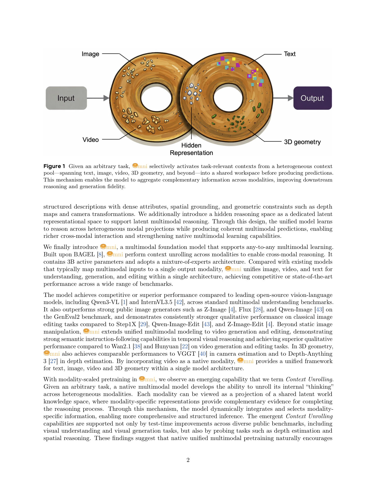
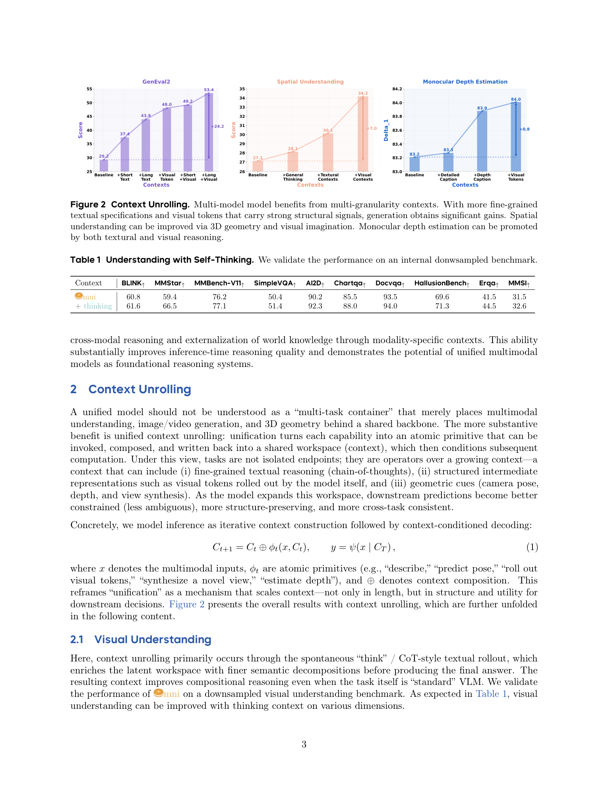
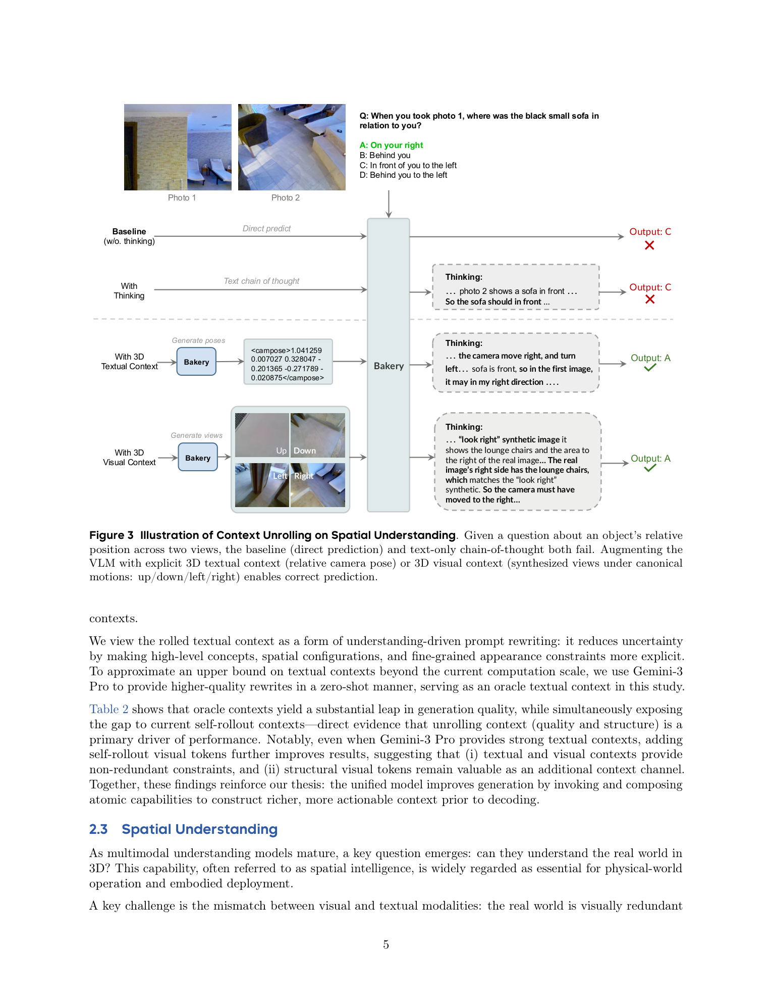
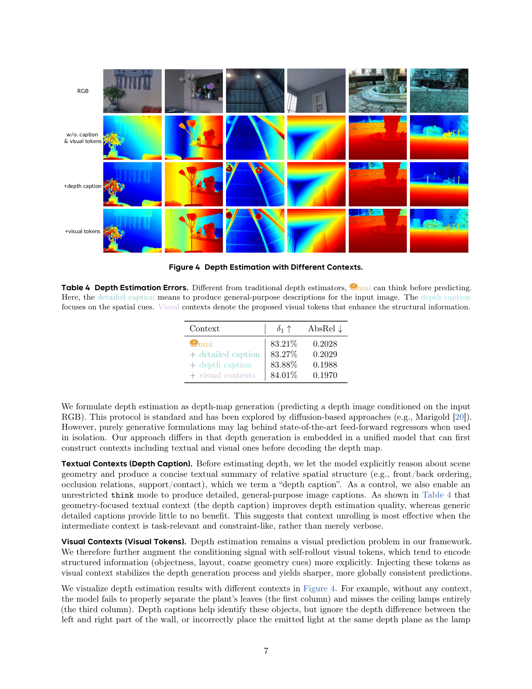

## 总结 | Summary

Omni 不是又一个统一多模态模型的「全家桶」论文，它真正想推销的是一个推理范式：把统一模型当成 **可以反复调用自己作为 context 生成器** 的系统。论文形式化为 $C_{t+1} = C_t \oplus \phi_t(x, C_t),\ y = \psi(x \mid C_T)$ ——每个原子能力 $\phi_t$（text-think、roll out visual tokens、predict camera pose、novel view synthesis、estimate depth）都把结果写回共享 workspace，最终解码以全部 context 为条件。最硬的单点证据是 GenEval2 上 Omni 54.12 vs Z-Image 41.83 / Qwen-Image 30.67，且增益的来源被作者拆成了「+short text +long text +visual tokens」的可加结构（29.25 → 37.35 → 43.94 → 49.16 → 53.44），oracle context 给到 57.21 暗示天花板还没到。

工程底盘是 BAGEL [Deng et al., 2025] 的延伸：MoE、3B 激活、Qwen3-30A3 同骨干，模态从 image-text pair 扩到 text/image/video/3D geometry/hidden representation。Context Unrolling 在四类任务上各给一个故事——视觉理解（thinking 在 BLINK/MMStar 等 9 个 benchmark 全面 +1~+7）、视觉生成（textual + visual context 互补）、空间理解（3D 文本 context +3.0、3D 视觉 context +7.0 在 MMSI-200 上）、单目深度（+depth caption +0.67 δ1，+visual token 再 +0.13）。隐含的 hero design 是「visual token rollout」：把模型自己产生的离散视觉 token 当结构提示再喂回去，论文显示其与 text-think 在 counting 和 verb prompt 上有非冗余的增益。

需要保留的 caveat 也很硬：所有「state-of-the-art」字样都附带「3B 激活 / 没有重 post-training」的脚注，video 部分仍只能产出 480×640、12s；空间理解的关键实验只在 MMSI 的 200 条采样上跑；唯一被点名的失败模式是 CO3Dv2 上的旋转误差。把这篇当作「unified-as-context」叙事的 white-paper 看是合适的，把它当成可独立复现的 SOTA 报告则不太成立。

---

## 要点提醒 | Highlights

### 值得关注 | Worth Absorbing

- §2.2 Table 2 — Self-Unrolling Context 的「+short / +long / +visual / +short&visual / +long&visual」可加分解（29.25 → 53.44）是全文最干净的因果证据，把 context unrolling 拆成可加成分而非整包效应；oracle 给到 57.21（仅领先 long&visual 3.77）暗示自 rollout 已逼近这个 6B-级生成器在该 benchmark 上的天花板。
- §2.3 Table 3 — 「3D 视觉 context（合成上/下/左/右四视图作为输入）」相对纯 thinking 在 MMSI-200 上 +7.0 的 Overall Score，远超 +3.0 的「3D 文本 context（camera pose 数字串）」；这条直接把 imagination-as-context 与 text-CoT 的相对效用量化了。
- Eq. 1：$C_{t+1} = C_t \oplus \phi_t(x, C_t)$ 把 unified model 的推理重新建模为 iterative context construction + context-conditioned decoding，是论文最值得搬到自家系统里的抽象——不假设具体能力集合，只规定「能力即上下文生成器」。
- §2.4 Table 4 — 「detailed caption +0.06 δ1 vs depth caption +0.67 δ1」的对照证伪了「verbose 即 useful」，指出 task-relevant 且 constraint-like 的中间表征才是 context unrolling 的有效形态——这是个对今后 reasoning-style training 数据构造直接有用的判断。

### 值得推敲 | Worth Questioning

- §2.3 整节的 testbed 是从 MMSI 中手挑的 200 条「与 3D 空间推理紧密相关」样本，论文未给出筛选 protocol；以 Overall Score 27.14 → 34.17 的差值看，单条变动 ±0.5（即 ±1 题）就能改变排序——值得做 full-MMSI 复跑或至少给样本随机性 bar。
- Table 5 的对手仅 Qwen3-VL-30B-A3B-Instruct 与 InternVL3.5-30B-A3B，且作者声明「无重 post-training」；但脚注没说对手是否做了相应阉割，这种「有利的同台条件」需在 §3.1 单独控变量；且 Qwen3-VL-30B 在 MMBench-V11 上的 84.8 已超过 Omni 的 75.3——这一行被淡化处理。
- §3.3 video 部分只给 VBench Total/Quality/Semantic 三栏，且分辨率 480×640、12s，比 Wan2.1 / Hunyuan 评测设定低一个量级；FiVE 上的 Table 8 列出的 12 列指标只取部分汇总，未给端到端 win-rate。
- §3.4 Table 9：CO3Dv2 上 Omni 的 AUC@30 75.21 仍不及 VGGT 86.23（相对差 12.7%），rotation error 0.0269 仅微胜 VGGT 0.0285；论文以「数据未充分覆盖 object-centric 场景」一句带过，但这恰恰是 unified-as-context 的核心反例——当 atomic primitive 本身在某 distribution 上欠强时，context 再多也救不回来。
- 整篇没有任何关于「unified 训练带来的负迁移」的消融——例如把 3D / video 模态去掉是否会让 GenEval2 涨还是跌？BAGEL 原文也没回答，Omni 默认承袭这个空白。

---

## 深度思考 | Analysis

### 真正的贡献 vs 声明的贡献
声明的贡献是「Omni 这个模型 + 多 benchmark SOTA」，真正的贡献是把 unified multimodal model 的推理重新表达为 context construction policy。Eq. 1 的形式化看起来轻飘飘，但它把社区里散落的 think-before-generate（BAGEL）、imagination-as-CoT（[Wang et al., 2024]、[Du et al., 2024] 等用图像作为 CoT 中间态的工作）、以及 multimodal RAG 全部纳入同一抽象。模型层面的工程贡献（MoE、3B 激活、模态扩展）与 BAGEL 高度同源；如果把 Omni 当成「BAGEL v2 + context-unrolling 故事化」来读，相对收益就清晰得多——它没有提出新原子能力，但把「如何编排已有原子能力」做成了可被 measure 的轴。

### 在更大图景里的位置
2025-2026 这一年，统一多模态从「能不能 native 训」转向「unified 之后怎么用」。同时期 Emu-3.5 [Cui et al., 2025] 走 native autoregressive、X-Omni [Geng et al., 2025] 用 RL 给离散生成器续命、Vision Banana [Gabeur et al., 2026] 直接把视觉任务全 cast 成 RGB 生成；Omni 的差异是把「unification 的红利」精确锁在 context unrolling 上，而不是参数共享或损失共享。这条叙事如果成立，下一篇真正有意思的工作不会是更大的统一模型，而是 RL/policy 学习「何时调用哪个 atomic primitive」——论文 §2.5 自己也点了这个方向。我认为这是 2026 下半年值得追踪的最干净的实验问题。

### 方法的 load-bearing 假设
所有结论的天花板压在两条假设上：(1) atomic primitive 各自要够强（视觉 token rollout 的结构信息要多于噪声、camera pose 估计本身要可靠），否则 context unrolling 会放大错误而非互补；CO3Dv2 旋转误差落后 VGGT 12.7% 已经显示了这条假设的脆弱性。(2) context 的可加性——表 2 的「short/long/visual/oracle」可加分解假定了不同 context 不会互相打架，但这是在 GenEval2 这种 atomicity-friendly benchmark 上观测到的；在更长的多步 agentic 任务上是否仍可加，论文没给证据。如果由我接手，唯一会做的关键实验是：在公开的同规模 MoE 骨干（Qwen3-30A3 instruct 不微调）上复现 self-unrolling 流水线，看「+short / +visual」的可加幅度是否同等可观——若幅度大幅缩水，那「unified pretraining 是 context unrolling 的必要条件」这个论点就站住了；若幅度类似，那 context unrolling 就退化为通用的 prompt-engineering 增益。

---

## 原文精读 | Bilingual Full Text

### Title & Authors

**Context Unrolling in Omni Models**

Ceyuan Yang∗,†, Zhijie Lin∗, Yang Zhao∗, Fei Xiao∗, Hao He∗, Qi Zhao∗, Chaorui Deng, Kunchang Li, Zihan Ding, Yuwei Guo, Fuyun Wang, Fangqi Zhu, Xiaonan Nie, Shenhan Zhu, Shanchuan Lin, Hongsheng Li, Weiling Huang, Guang Shi†, Haoqi Fan

ByteDance Seed. ∗Equal contribution. †Corresponding authors. Date: April 24, 2026. arXiv:2604.21921v1 [cs.CV] 23 Apr 2026. Project Page: https://omni-model.com/

**《Omni 模型中的上下文展开》**

作者：杨策远∗,†、林志杰∗、赵阳∗、肖飞∗、何浩∗、赵琦∗、邓朝瑞、李昆昌、丁子涵、郭宇威、王扶云、朱方齐、聂晓楠、朱沈翰、林闪川、李洪声、黄伟玲、施光†、范浩奇。机构：ByteDance Seed。∗ 共同贡献。† 通讯作者。日期：2026-04-24。arXiv:2604.21921v1 [cs.CV] 2026-04-23。项目主页：https://omni-model.com/

---

### Abstract

We present Omni, a unified multimodal model natively trained on diverse modalities, including text, images, videos, 3D geometry, and hidden representations. We find that such training enables Context Unrolling, where the model explicitly reasons across multiple modal representations before producing predictions. This process enables the model to aggregate complementary information across heterogeneous modalities, facilitating a more faithful approximation of the shared multimodal knowledge manifold and improving downstream reasoning fidelity. As a result, Omni achieves strong performance on both multimodal generation and understanding benchmarks, while demonstrating advanced multimodal reasoning capabilities, including in-context generation of text, image, video, and 3D geometry.

我们提出 Omni——一个原生训练于文本、图像、视频、3D 几何与隐式表征等多种模态上的统一多模态模型。这样的训练使得 **Context Unrolling**（上下文展开）成为可能：模型在产出预测之前显式地跨多个模态表征进行推理。该机制让模型可以跨异质模态汇聚互补信息，对共享的多模态知识流形给出更忠实的近似，并提升下游推理保真度。Omni 在多模态生成与理解基准上均取得强劲表现，并展示出高级的多模态推理能力——包括文本、图像、视频与 3D 几何的 in-context 生成。

---

**Figure 1.** Given an arbitrary task, Omni selectively activates task-relevant contexts from a heterogeneous context pool—spanning text, image, video, 3D geometry, and beyond—into a shared workspace before producing predictions. This mechanism enables the model to aggregate complementary information across modalities, improving downstream reasoning and generation fidelity.

**图 1.** 给定任意任务，Omni 选择性地从一个异质 context pool（涵盖文本、图像、视频、3D 几何及更多）中激活与任务相关的上下文，写入一个共享 workspace，然后再产出预测。该机制使模型能跨模态汇聚互补信息，提升下游推理与生成保真度。

---

### 1. Introduction

In the native multimodal regime, unified multimodal models [8, 11, 14, 18, 33, 35, 48] learn a world knowledge manifold by taking inputs and predicting outputs across multiple modalities. Each modality provides only a partial and biased view of this multimodal manifold, capturing complementary aspects of world knowledge. We argue that native multimodal models can explicitly benefit from Context Unrolling — reasoning across these heterogeneous modal projections to recover a more complete approximation of the shared multimodal manifold. We observe that prediction quality improves as models perform Context Unrolling across more modalities, integrating information from a broader set of modalities before producing outputs. By structuring reasoning across different modal projections, the model forms a more faithful representation of the multimodal manifold, producing outputs that are more coherent, faithful, and semantically accurate.

在原生多模态范式下，统一多模态模型 [8, 11, 14, 18, 33, 35, 48] 通过跨模态接收输入与预测输出来学习一个世界知识流形。每种模态都只是该多模态流形的局部、有偏的投影，承担互补的世界知识。我们主张：原生多模态模型可以从 **Context Unrolling** 中显式获益——跨这些异质的模态投影做推理，以恢复对共享多模态流形的更完整近似。我们观察到：当模型跨越更多模态进行 Context Unrolling、在产出输出前聚合更多模态的信息时，预测质量会随之提升。通过把推理结构化地铺开在不同模态投影上，模型得到对多模态流形更忠实的表示，产出更连贯、更忠实、语义更准确的输出。

To realize this vision, we follow the design philosophy of BAGEL [8], and expand training modalities from image–text pairs to a broader set of modalities including text, images, videos, 3D geometry, and hidden visual representations. The expanded set of modalities provides complementary projections of world knowledge, capturing information such as pixel appearance, spatial-temporal structure, camera transformations, depth, physical dynamics, semantic abstraction, and dense conversational reasoning, which are essential for learning grounded world knowledge at scale. Building upon the interleaved data paradigm introduced in BAGEL [8], we further incorporate reasoning-oriented multimodal content to encourage structured cross-modal reasoning during training. This enables generation to leverage not only short textual reasoning but also long-form structured descriptions with dense attributes, spatial grounding, and geometric constraints such as depth maps and camera transformations. We additionally introduce a hidden reasoning space as a dedicated latent representational space to support latent multimodal reasoning. Through this design, the unified model learns to reason across heterogeneous modal projections while producing coherent multimodal predictions, enabling richer cross-modal interaction and strengthening native multimodal learning capabilities.

为了实现这一愿景，我们沿用 BAGEL [8] 的设计哲学，把训练模态从 image–text pair 扩展到更广的集合，包括文本、图像、视频、3D 几何与隐式视觉表征。这个扩展后的模态集合提供了对世界知识的互补投影，覆盖像素外观、时空结构、相机变换、深度、物理动力学、语义抽象、稠密对话式推理等信息，是大规模学习 grounded 世界知识的关键。在 BAGEL [8] 引入的 interleaved 数据范式之上，我们进一步引入面向推理的多模态内容，以鼓励训练过程中的结构化跨模态推理。这使生成不仅可借力短文本推理，也可借力带稠密属性、空间 grounding 与几何约束（深度图、相机变换）的长篇结构化描述。我们另外引入一个 hidden reasoning space，作为支持隐式多模态推理的专用 latent 表征空间。通过这一设计，统一模型学会跨异质模态投影做推理，同时产出连贯的多模态预测，带来更丰富的跨模态交互并强化原生多模态学习能力。

We finally introduce Omni, a multimodal foundation model that supports any-to-any multimodal learning. Built upon BAGEL [8], Omni performs context unrolling across modalities to enable cross-modal reasoning. It contains 3B active parameters and adopts a mixture-of-experts architecture. Compared with existing models that typically map multimodal inputs to a single output modality, Omni unifies image, video, and text for understanding, generation, and editing within a single architecture, achieving competitive or state-of-the-art performance across a wide range of benchmarks.

我们最终给出 **Omni**——一个支持 any-to-any 多模态学习的多模态基础模型。Omni 构建于 BAGEL [8] 之上，跨模态做 context unrolling 以支持跨模态推理。模型含 3B 激活参数，采用 mixture-of-experts 架构。相比通常只把多模态输入映射到单一输出模态的现有模型，Omni 在同一架构内统一了图像、视频与文本的理解、生成与编辑，在众多基准上取得 competitive 或 state-of-the-art 表现。

The model achieves competitive or superior performance compared to leading open-source vision-language models, including Qwen3-VL [1] and InternVL3.5 [42], across standard multimodal understanding benchmarks. It also outperforms strong public image generators such as Z-Image [4], Flux [28], and Qwen-Image [43] on the GenEval2 benchmark, and demonstrates consistently stronger qualitative performance on classical image editing tasks compared to Step1X [29], Qwen-Image-Edit [43], and Z-Image-Edit [4]. Beyond static image manipulation, Omni extends unified multimodal modeling to video generation and editing, demonstrating strong semantic instruction-following capabilities in temporal visual reasoning and achieving superior qualitative performance compared to Wan2.1 [38] and Hunyuan [22] on video generation and editing tasks. In 3D geometry, Omni also achieves comparable performances to VGGT [40] in camera estimation and to Depth-Anything 3 [27] in depth estimation. By incorporating video as a native modality, Omni provides a unified framework for text, image, video and 3D geometry within a single model architecture.

在标准多模态理解基准上，模型相对 Qwen3-VL [1]、InternVL3.5 [42] 等开源视觉-语言模型取得 competitive 或更优的性能。在 GenEval2 基准上，它优于 Z-Image [4]、Flux [28]、Qwen-Image [43] 等强公开图像生成器；在经典图像编辑任务上，相对 Step1X [29]、Qwen-Image-Edit [43]、Z-Image-Edit [4] 也展示出稳定更强的定性表现。除静态图像操作外，Omni 把统一多模态建模扩展到视频生成与编辑，在时序视觉推理上展示出强语义指令跟随能力，在视频生成与编辑上相对 Wan2.1 [38]、Hunyuan [22] 取得更优定性表现。在 3D 几何方面，Omni 在相机估计上达到与 VGGT [40] 相当的性能，在深度估计上达到与 Depth-Anything 3 [27] 相当的性能。通过把视频作为原生模态，Omni 在单一模型架构内为文本、图像、视频与 3D 几何提供了统一框架。

With modality-scaled pretraining in Omni, we observe an emerging capability that we term Context Unrolling. Given an arbitrary task, a native multimodal model develops the ability to unroll its internal "thinking" across heterogeneous modalities. Each modality can be viewed as a projection of a shared latent world knowledge space, where modality-specific representations provide complementary evidence for completing the reasoning process. Through this mechanism, the model dynamically integrates and selects modality-specific information, enabling more comprehensive and structured inference. The emergent Context Unrolling capabilities are supported not only by test-time improvements across diverse public benchmarks, including visual understanding and visual generation tasks, but also by probing tasks such as depth estimation and spatial reasoning. These findings suggest that native unified multimodal pretraining naturally encourages cross-modal reasoning and externalization of world knowledge through modality-specific contexts. This ability substantially improves inference-time reasoning quality and demonstrates the potential of unified multimodal models as foundational reasoning systems.

在 Omni 的 modality-scaled pretraining 下，我们观察到一种 emerging 能力，并将其命名为 **Context Unrolling**。给定任意任务，原生多模态模型获得跨异质模态展开自身"thinking"的能力。每种模态都可被视为共享 latent 世界知识空间的一个投影，模态专属的表征为完成推理提供互补证据。借助该机制，模型动态地整合并选择模态专属信息，实现更全面、更结构化的推理。这种 emergent 的 Context Unrolling 能力既被诸多公开基准（视觉理解、视觉生成）的 test-time 改进所支持，也被深度估计、空间推理等 probing 任务所支持。这些发现表明：原生统一多模态预训练天然鼓励跨模态推理，并通过模态专属上下文将世界知识外化。这种能力显著提升推理时的推理质量，展示了统一多模态模型作为基础推理系统的潜力。

A unified model should not be understood as a "multi-task container" that merely places multimodal understanding, image/video generation, and 3D geometry behind a shared backbone. The more substantive benefit is unified context unrolling: unification turns each capability into an atomic primitive that can be invoked, composed, and written back into a shared workspace (context), which then conditions subsequent computation. Under this view, tasks are not isolated endpoints; they are operators over a growing context — a context that can include (i) fine-grained textual reasoning (chain-of-thoughts), (ii) structured intermediate representations such as visual tokens rolled out by the model itself, and (iii) geometric cues (camera pose, depth, and view synthesis). As the model expands this workspace, downstream predictions become better constrained (less ambiguous), more structure-preserving, and more cross-task consistent.

统一模型不应被理解为「multi-task 容器」，即仅仅把多模态理解、图像/视频生成、3D 几何放在一个共享 backbone 之后。更实质的红利是 **unified context unrolling**：统一让每个能力都变成一个 atomic primitive，可以被调用、组合，并被写回到共享 workspace（context）中，进而条件化后续计算。在这一视角下，任务并非孤立的终点；它们是在不断生长的 context 上的算子——这个 context 可以包含 (i) 细粒度的文本推理（chain-of-thoughts），(ii) 结构化的中间表示，例如模型自身展开（roll out）的视觉 token，(iii) 几何线索（相机位姿、深度、视图合成）。随着模型扩展这个 workspace，下游预测会被约束得更紧（更少歧义）、更保留结构、且跨任务更一致。

Concretely, we model inference as iterative context construction followed by context-conditioned decoding:

$$
C_{t+1} = C_t \oplus \phi_t(x, C_t),\qquad y = \psi(x \mid C_T),\tag{1}
$$

where $x$ denotes the multimodal inputs, $\phi_t$ are atomic primitives (e.g., "describe," "predict pose," "roll out visual tokens," "synthesize a novel view," "estimate depth"), and $\oplus$ denotes context composition. This reframes "unification" as a mechanism that scales context — not only in length, but in structure and utility for downstream decisions. Figure 2 presents the overall results with context unrolling, which are further unfolded in the following content.

具体地，我们把推理建模为「迭代构造 context + context-条件化解码」：

$$
C_{t+1} = C_t \oplus \phi_t(x, C_t),\qquad y = \psi(x \mid C_T),\tag{1}
$$

其中 $x$ 为多模态输入，$\phi_t$ 为原子原语（如「describe」、「predict pose」、「roll out visual tokens」、「synthesize a novel view」、「estimate depth」），$\oplus$ 为 context composition。这一重写把「unification」重新表述为一个 scale context 的机制——不仅在长度上，更在结构和对下游决策的有用性上。Figure 2 给出 context unrolling 的整体结果，后续章节将详细展开。

---

**Figure 2.** Context Unrolling. Multi-modal model benefits from multi-granularity contexts. With more fine-grained textual specifications and visual tokens that carry strong structural signals, generation obtains significant gains. Spatial understanding can be improved via 3D geometry and visual imagination. Monocular depth estimation can be promoted by both textual and visual reasoning.

**图 2.** Context Unrolling 总览。多模态模型从多粒度 context 中获益：当文本规格更细粒度、视觉 token 携带强结构信号时，生成获得显著增益；空间理解可通过 3D 几何与视觉想象（visual imagination）得到改善；单目深度估计可由文本与视觉推理共同推动。

---

### 2. Context Unrolling

#### 2.1 Visual Understanding

Here, context unrolling primarily occurs through the spontaneous "think" / CoT-style textual rollout, which enriches the latent workspace with finer semantic decompositions before producing the final answer. The resulting context improves compositional reasoning even when the task itself is "standard" VLM. We validate the performance of Omni on a downsampled visual understanding benchmark. As expected in Table 1, visual understanding can be improved with thinking context on various dimensions.

视觉理解里，context unrolling 主要通过自发的「think」/ CoT-style 文本 rollout 实现：在产出最终答案之前，把更细的语义分解写入 latent workspace。即便任务本身是「标准」VLM 问答，产出的 context 也能改善组合推理。我们在一个降采样的视觉理解基准上验证 Omni。如 Table 1 所示，引入 thinking context 后，视觉理解在多个维度上均可提升。

**Table 1.** Understanding with Self-Thinking. We validate the performance on an internal downsampled benchmark.

| Context | BLINK ↑ | MMStar ↑ | MMBench-V11 ↑ | SimpleVQA ↑ | AI2D ↑ | Chartqa ↑ | Docvqa ↑ | HallusionBench ↑ | Erqa ↑ | MMSI ↑ |
|---|---|---|---|---|---|---|---|---|---|---|
| Omni | 60.8 | 59.4 | 76.2 | 50.4 | 90.2 | 85.5 | 93.5 | 69.6 | 41.5 | 31.5 |
| + thinking | 61.6 | 66.5 | 77.1 | 51.4 | 92.3 | 88.0 | 94.0 | 71.3 | 44.5 | 32.6 |

**表 1.** Self-Thinking 下的视觉理解。在内部降采样基准上验证。

#### 2.2 Visual Generation

Visual generation particularly benefits from multi-granularity context to reduce the inherent ambiguity of mapping language to images. From the unified context unrolling perspective, image synthesis is not an isolated endpoint; instead, it is a context-conditioned decoding process where upstream atomic primitives (e.g., textual reasoning and structural token rollouts) can be invoked to construct a richer workspace before pixel synthesis.

视觉生成尤其能从多粒度 context 中获益，从而降低「语言到图像」映射的固有歧义。在 unified context unrolling 视角下，图像合成不是一个孤立的终点；它是一个 context-条件化的解码过程：在像素合成之前，可以先调用上游原子原语（例如文本推理与结构化 token rollout）来构建更丰富的 workspace。

To isolate the effect of different contexts, we focus on text-to-image (T2I) generation as an analysis pretext task, leveraging its comprehensive and standardized benchmarks. Concretely, before synthesizing an image, Omni can optionally (i) roll out more fine-grained textual specifications (attributes, counts, relations, spatial constraints) via text-think, and/or (ii) roll out visual tokens that carry strong structural information. Conditioning the generator on these intermediate contexts improves prompt following, object counting, and spatial/relational fidelity — illustrating that the unified model's gain stems from unrolling usable contexts.

为隔离不同 context 的作用，我们以 text-to-image（T2I）生成为分析 pretext task，利用其全面且标准化的基准。具体而言，在合成图像之前，Omni 可选地：(i) 通过 text-think 展开更细粒度的文本规格（属性、计数、关系、空间约束），和/或 (ii) 展开携带强结构信息的视觉 token。把生成器条件化在这些中间 context 上，可改善 prompt following、对象计数与空间/关系保真——说明统一模型的增益源自展开可用 context。

**Self-Unrolling Contexts.** Table 2 reports results on GenEval-2 and inhouse evaluation, where Soft TIFAGM measures prompt-level correctness. We also report atomicity, which evaluates robustness under increasing prompt compositionality. As highlighted by GenEval-2, T2I performance typically drops sharply as compositionality increases. Therefore, atomicity serves as a stress test for text following and compositional generalization.

**Self-Unrolling Contexts。** Table 2 给出 GenEval-2 与 inhouse 评测结果，其中 Soft TIFAGM 衡量 prompt 级正确率。我们另报告 atomicity，用于评估模型在 prompt 组合性上升时的鲁棒性。如 GenEval-2 所强调，T2I 性能通常会随组合性升高而急剧下降，atomicity 因此是 text following 与组合泛化的应力测试。

Following prior practices of unified models (e.g., BAGEL), we can ask the model to think before generation, producing fine-grained textual descriptions under different token budgets. In our setup, short thinking consumes around 100 tokens on average, while long thinking uses around 250 tokens and typically yields richer information, including coarse structural layouts.

延续既有统一模型（例如 BAGEL）的实践，我们让模型在生成之前先 think，按不同 token 预算产出细粒度文本描述。在我们的设定下，short thinking 平均消耗 ~100 个 token，long thinking 使用 ~250 个 token，通常带来更丰富的信息，包括粗略的结构性布局。

Overall, richer textual context consistently improves both the aggregate performance and the performance under higher atomicity (i.e., more compositional prompts), confirming the benefit of unrolling textual context. Moreover, using visual tokens only enhances generation across metrics, with particularly strong gains on counting- and action/verb-related prompts, consistent with the hypothesis that visual tokens inject explicit structural cues that are otherwise difficult to preserve through pure text conditioning. Importantly, as the number of atomic requirements in the prompt increases (i.e., more complex descriptions), Omni retains a moderate level of prompt-following ability, indicating improved robustness under compositional stress. Finally, textual and visual contexts are complementary: combining text-think with visual token rollout yields the most consistent improvements, supporting our central claim that unified models excel by composing multiple atomic capabilities into a stronger shared context.

总体来看，更丰富的文本 context 一致地改善了 aggregate 性能与高 atomicity（更组合性 prompt）下的性能，证实展开文本 context 的收益。其次，仅使用视觉 token 也在所有指标上提升生成质量，尤其在计数与动作/动词相关 prompt 上增益突出，这与「视觉 token 注入了纯文本条件难以保留的显式结构线索」的假设一致。值得强调的是，随 prompt 中原子需求数增加（描述更复杂），Omni 保留中等水平的 prompt-following 能力，说明在组合性压力下鲁棒性更好。最后，文本与视觉 context 是互补的：把 text-think 与 visual token rollout 组合后能得到最一致的改进，这支持我们的核心主张——统一模型的强大来自于把多个原子能力组合成一个更强的共享 context。

**Oracle Contexts.** While self-rollout contexts already bring significant improvements, the limited capacity of current models can introduce noise and hallucinated details, which may cap the benefit of context unrolling. We therefore perform oracle studies to estimate how far generation can be pushed under near-ground-truth contexts.

**Oracle Contexts。** 自展开 context 已经带来显著提升，但当前模型的能力受限，会引入噪声与幻觉细节，可能限制 context unrolling 的收益。我们因而做 oracle 研究，估计在接近 ground-truth 的 context 下生成可以被推到什么位置。

We view the rolled textual context as a form of understanding-driven prompt rewriting: it reduces uncertainty by making high-level concepts, spatial configurations, and fine-grained appearance constraints more explicit. To approximate an upper bound on textual contexts beyond the current computation scale, we use Gemini-3 Pro to provide higher-quality rewrites in a zero-shot manner, serving as an oracle textual context in this study.

我们把展开后的文本 context 视为一种「理解驱动的 prompt 改写」：通过把高层概念、空间配置、细粒度外观约束显式化，降低不确定性。为在当前算力之外近似文本 context 的上界，我们用 Gemini-3 Pro 在 zero-shot 方式下提供更高质量的改写，作为本研究中的 oracle textual context。

Table 2 shows that oracle contexts yield a substantial leap in generation quality, while simultaneously exposing the gap to current self-rollout contexts — direct evidence that unrolling context (quality and structure) is a primary driver of performance. Notably, even when Gemini-3 Pro provides strong textual contexts, adding self-rollout visual tokens further improves results, suggesting that (i) textual and visual contexts provide non-redundant constraints, and (ii) structural visual tokens remain valuable as an additional context channel. Together, these findings reinforce our thesis: the unified model improves generation by invoking and composing atomic capabilities to construct richer, more actionable context prior to decoding.

Table 2 显示：oracle context 让生成质量出现实质跃升，同时暴露出当前自展开 context 与之的差距——这是「展开 context（其质量与结构）是性能的主要驱动力」的直接证据。值得注意的是，即便 Gemini-3 Pro 已提供强文本 context，再加入自展开的视觉 token 仍可进一步提升结果，提示我们：(i) 文本与视觉 context 提供非冗余的约束；(ii) 结构性视觉 token 作为额外 context 通道仍有价值。这些发现强化了我们的核心命题：统一模型通过调用并组合原子能力，在解码之前构造出更丰富、更可执行的 context，从而提升生成质量。

**Table 2.** Text-to-Image Generation on Benchmarks. GenEval-2 (left) and inhouse evaluation (right). TIFAGM measures prompt-level correctness. Atomicity is also reported to evaluate robustness under increasing prompt compositionality. Visual contexts denote the discrete visual tokens. Short and long texts are derived from the model itself. The oracle text is produced by Gemini-3 Pro in the zero-shot manner.

| Context | TIFAGM | Object | Attribute | Count | Position | Verb |
|---|---|---|---|---|---|---|
| Omni | 29.25 | 91.64 | 90.00 | 52.03 | 77.67 | 26.25 |
| + short | 37.35 | 93.18 | 92.45 | 60.14 | 76.92 | 38.83 |
| + long | 43.94 | 91.86 | 91.13 | 67.03 | 77.03 | 38.31 |
| + visual | 48.02 | 94.42 | 92.96 | 66.92 | 79.28 | 53.96 |
| + short and visual | 49.16 | 93.13 | 92.68 | 68.36 | 76.83 | 43.34 |
| + long and visual | 53.44 | 92.34 | 92.32 | 72.98 | 80.23 | 42.81 |
| + oracle | 52.20 | 95.72 | 87.35 | 67.91 | 91.69 | 43.31 |
| + oracle and visual | 57.21 | 94.77 | 97.89 | 69.47 | 90.64 | 56.00 |

**表 2.** T2I 生成基准。GenEval-2（左）与 inhouse 评测（右）。TIFAGM 衡量 prompt 级正确率，atomicity 评估在 prompt 组合性上升下的鲁棒性。Visual context 指离散视觉 token；short / long text 由模型自身展开；oracle text 由 Gemini-3 Pro 在 zero-shot 下产出。

#### 2.3 Spatial Understanding

As multimodal understanding models mature, a key question emerges: can they understand the real world in 3D? This capability, often referred to as spatial intelligence, is widely regarded as essential for physical-world operation and embodied deployment.

随着多模态理解模型的成熟，一个关键问题浮现：它们能否在 3D 中理解现实世界？这一能力（通常称为 spatial intelligence）被广泛认为是物理世界操作与具身部署的关键。

A key challenge is the mismatch between visual and textual modalities: the real world is visually redundant and geometrically complex, while textual reasoning is compact and abstract. Reasoning purely in freeform text often struggles with geometric ambiguities such as viewpoint changes, foreshortening, and occlusions, limiting performance on questions requiring consistent 3D interpretation across multiple views. Our unified context unrolling framework addresses this gap by incorporating 3D-related capabilities — camera pose estimation, novel view synthesis, and depth estimation — as atomic primitives that can be invoked within the reasoning loop. To validate the effectiveness of context unrolling for spatial understanding, we select 200 questions from the MMSI benchmark [45] that are closely related to 3D spatial reasoning as the testbed.

一个关键挑战是视觉与文本模态的不匹配：现实世界视觉上冗余且几何上复杂，而文本推理是紧凑、抽象的。纯自由形式文本推理往往难以处理几何歧义——视角变化、透视压缩、遮挡——在需要跨多视图保持 3D 一致性的题目上性能受限。我们的 unified context unrolling 框架通过把 3D 相关能力（相机位姿估计、novel view synthesis、深度估计）纳入为可在推理回路中调用的 atomic primitive，来弥合这一鸿沟。为验证 context unrolling 对空间理解的有效性，我们从 MMSI 基准 [45] 中选择 200 道与 3D 空间推理紧密相关的问题作为 testbed。

**3D Textual Contexts: Geometry-as-Context.** Analogous to general visual understanding, Omni can enable a text-think mode before answering. For spatial questions, however, the most useful intermediate signal is often explicitly geometric. We therefore allow the model to first perform camera pose estimation from the input views before thinking and answering. The estimated camera poses serves as a 3D textual context that disambiguates spatial relations across images.

**3D Textual Contexts：Geometry-as-Context。** 类似一般视觉理解，Omni 可以在回答前启用 text-think 模式。但对空间问题，最有用的中间信号往往是显式几何。因此我们允许模型在 thinking 与回答之前，先从输入视图做 camera pose estimation。估计出的相机位姿作为 3D 文本 context，用于消歧跨图像的空间关系。

As shown in Table 3, injecting this geometry-grounded context improves MMSI accuracy and consistently outperforms baselines that rely on latent, free-form text-only reasoning, indicating that explicit 3D contexts provide actionable constraints for downstream decision making.

如 Table 3 所示，注入这种几何 grounded 的 context 可提升 MMSI 准确率，并稳定优于仅依赖 latent、自由文本推理的 baseline，说明显式 3D context 为下游决策提供了 actionable 约束。

**3D Visual Contexts: Imagination-as-Context.** Beyond textual contexts, a unified model can leverage its generative capabilities to "think with images." Before answering spatial questions, the model first synthesizes novel views around each given observation — imagining the surrounding environment from up, down, left, and right viewpoints, etc. This process enriches the visual context by completing a more comprehensive scene representation, allowing the model to reason from a near-omniscient perspective rather than being limited to the provided viewpoints. Table 3 shows that adding such NVS-derived visual contexts (+ visual contexts) yields the strongest MMSI performance. This demonstrates that generative imagination of unseen views provides more discriminative evidence for spatial reasoning than relying solely on the given observations.

**3D Visual Contexts：Imagination-as-Context。** 在文本 context 之外，统一模型可以利用其生成能力「用图像思考」。在回答空间问题之前，模型先围绕每个观测合成 novel view——从上、下、左、右等视角想象环境。这一过程通过补足更全面的场景表示来丰富视觉 context，让模型可以从近似全知视角推理，而非局限于给定视点。Table 3 显示：加入这种 NVS-derived 视觉 context（+ visual contexts）取得最强 MMSI 性能。这说明对未见视角的生成式想象，相对仅靠给定观测，能为空间推理提供更具区分力的证据。

In both settings, the critical point is that geometry estimation and generation are not auxiliary tasks evaluated in isolation. They function as context-producing primitives, textual (pose summaries) or visual (synthesized evidence), that are composed to scale the effective context for spatial reasoning. Figure 3 provides a concrete qualitative example of this mechanism: while standard text-only reasoning fails due to geometric ambiguity, our approach successfully invokes 3D primitives to construct actionable context — either by explicitly grounding reasoning in pose data or by "imagining" intermediate visual evidence — thereby correcting the reasoning path and guiding the model to the correct answer. Namely, the gains of unified models come from unified context unrolling, i.e., the ability to invoke and compose heterogeneous capabilities to construct richer, more actionable context before making a decision.

在这两种设定下，关键在于：几何估计与生成不是被独立评测的辅助任务，它们作为 context 生产原语（文本：pose 摘要；视觉：合成证据），被组合起来 scale 空间推理的有效 context。Figure 3 给出了该机制的具体定性例子：纯文本推理因几何歧义而失败，而我们的方法成功调用 3D primitive 构造 actionable context——或在 pose 数据中显式 ground 推理，或在中间「想象」视觉证据——从而纠正推理路径，引导模型得到正确答案。也即，统一模型的增益来自 unified context unrolling，即在做出决定之前，调用并组合异质能力以构造更丰富、更可执行 context 的能力。

**Table 3.** Spatial Understanding Evaluation. Textual contexts denote geometry-grounded text (e.g., camera pose estimation results). Visual contexts refer to novel-view synthesis results. Performances are reported on a downsampled MMSI-Bench.

| Context | Overall Score | MSR | Motion | Positional Relationship |
|---|---|---|---|---|
| Omni | 27.14 | 17.65 | 0.0 | 19.63 |
| + thinking | 28.15 | 17.65 | 33.33 | 30.25 |
| + textual contexts | 30.15 | 11.76 | 33.33 | 33.95 |
| + visual contexts | 34.17 | 26.47 | 33.33 | 35.80 |

**表 3.** 空间理解评测。Textual context 指 geometry-grounded 文本（例如 camera pose 估计结果）；Visual context 指 NVS 结果。结果在降采样的 MMSI-Bench 上报告。

---

**Figure 3.** Illustration of Context Unrolling on Spatial Understanding. Given a question about an object's relative position across two views, the baseline (direct prediction) and text-only chain-of-thought both fail. Augmenting the VLM with explicit 3D textual context (relative camera pose) or 3D visual context (synthesized views under canonical motions: up/down/left/right) enables correct prediction.

**图 3.** Context Unrolling 在空间理解上的示意。给定一道关于物体在两个视图间相对位置的题目，baseline（直接预测）与纯文本 CoT 都失败；为 VLM 注入显式 3D 文本 context（相对相机位姿）或 3D 视觉 context（按上/下/左/右等典型运动合成的新视图），可得到正确预测。

---

#### 2.4 3D Geometry

Recent feed-forward 3D models (e.g., VGGT [40]) highlight the value of multi-task training, where a strong visual encoder which is often learned via self-supervision provides rich priors for geometry prediction. In this section, we use the long-standing problem of monocular depth estimation to illustrate that the main gain of unification is not simply multi-task parameter sharing, but unified context unrolling, where other capabilities become atomic primitives that supply additional constraints to 3D Geometry.

近期的 feed-forward 3D 模型（例如 VGGT [40]）凸显了多任务训练的价值——一个常通过自监督学到的强视觉 encoder 为几何预测提供丰富先验。在本节，我们以长期存在的单目深度估计问题为例，说明统一带来的主要增益并非简单的多任务参数共享，而是 unified context unrolling：其他能力成为 atomic primitive，向 3D 几何提供额外约束。

We formulate depth estimation as depth-map generation (predicting a depth image conditioned on the input RGB). This protocol is standard and has been explored by diffusion-based approaches (e.g., Marigold [20]). However, purely generative formulations may lag behind state-of-the-art feed-forward regressors when used in isolation. Our approach differs in that depth generation is embedded in a unified model that can first construct contexts including textual and visual ones before decoding the depth map.

我们把深度估计表述为深度图生成（在输入 RGB 条件下预测深度图）。该 protocol 是标准做法，diffusion-based 方法（例如 Marigold [20]）也探索过。然而，纯生成式公式在孤立使用时可能落后于 SOTA feed-forward 回归器。我们的差异在于：深度生成被嵌入到一个统一模型中，该模型在解码深度图之前可以先构造文本与视觉 context。

**Textual Contexts (Depth Caption).** Before estimating depth, we let the model explicitly reason about scene geometry and produce a concise textual summary of relative spatial structure (e.g., front/back ordering, occlusion relations, support/contact), which we term a "depth caption". As a control, we also enable an unrestricted think mode to produce detailed, general-purpose image captions. As shown in Table 4 that geometry-focused textual context (the depth caption) improves depth estimation quality, whereas generic detailed captions provide little to no benefit. This suggests that context unrolling is most effective when the intermediate context is task-relevant and constraint-like, rather than merely verbose.

**Textual Contexts（Depth Caption）。** 在估计深度之前，我们让模型显式推理场景几何，并产出关于相对空间结构（前后顺序、遮挡关系、支撑/接触）的简洁文本摘要——我们称之为「depth caption」。作为控制变量，我们也允许一个无限制的 think 模式产出详尽的通用图像 caption。如 Table 4 所示，几何聚焦的文本 context（depth caption）改善深度估计质量，而通用 detailed caption 几乎没有收益。这表明：context unrolling 在中间 context 任务相关且具约束性时最有效，而非仅仅冗长。

**Visual Contexts (Visual Tokens).** Depth estimation remains a visual prediction problem in our framework. We therefore further augment the conditioning signal with self-rollout visual tokens, which tend to encode structured information (objectness, layout, coarse geometry cues) more explicitly. Injecting these tokens as visual context stabilizes the depth generation process and yields sharper, more globally consistent predictions.

**Visual Contexts（Visual Tokens）。** 深度估计在我们的框架中仍是一个视觉预测问题。我们因此用自展开的视觉 token 进一步增强条件信号——这些 token 倾向于更显式地编码结构化信息（对象性、布局、粗几何线索）。把它们作为视觉 context 注入，可稳定深度生成过程，得到更锐利、全局更一致的预测。

We visualize depth estimation results with different contexts in Figure 4. For example, without any context, the model fails to properly separate the plant's leaves (the first column) and misses the ceiling lamps entirely (the third column). Depth captions help identify these objects, but ignore the depth difference between the left and right part of the wall, or incorrectly place the emitted light at the same depth plane as the lamp fixtures. Visual token context further corrects the geometry by distinguishing the depth difference between the wall's different parts and assigning illuminated areas depths similar to the background wall.

我们在 Figure 4 中可视化不同 context 下的深度估计结果。例如：无任何 context 时，模型无法正确分离植物叶子（第 1 列）并完全丢失吸顶灯（第 3 列）；depth caption 帮助识别这些对象，但忽略墙体左右部分的深度差，或错误地把发出的光与灯具置于同一深度平面；视觉 token context 进一步纠正几何——区分墙体不同部分的深度，并把被照亮区域指派到与背景墙相近的深度。

Overall, these results suggest, in a unified model, multimodal understanding and structured visual rollouts are not auxiliary add-ons. They function as context-producing primitives that constrain and guide 3D geometry, turning depth estimation from direct regression $(I \rightarrow D)$ into context-conditioned inference $(D = \mathrm{Depth}(I \mid C_{\text{text}}, C_{\text{vis}}))$.

整体来看，这些结果表明：在统一模型里，多模态理解与结构化视觉展开并非辅助附加件，它们作为 context 生产原语，约束并引导 3D 几何，把深度估计从直接回归 $(I \rightarrow D)$ 变成 context-条件化推理 $(D = \mathrm{Depth}(I \mid C_{\text{text}}, C_{\text{vis}}))$。

**Table 4.** Depth Estimation Errors. Different from traditional depth estimators, Omni can think before predicting. Detailed caption produces general-purpose descriptions. Depth caption focuses on spatial cues. Visual contexts denote the proposed visual tokens.

| Context | δ1 ↑ | AbsRel ↓ |
|---|---|---|
| Omni | 83.21% | 0.2028 |
| + detailed caption | 83.27% | 0.2029 |
| + depth caption | 83.88% | 0.1988 |
| + visual contexts | 84.01% | 0.1970 |

**表 4.** 深度估计误差。与传统深度估计器不同，Omni 可在预测前 thinking。Detailed caption 产生通用描述；depth caption 聚焦空间线索；visual contexts 指我们提出的视觉 token。

---

**Figure 4.** Depth Estimation with Different Contexts.

**图 4.** 不同 context 下的深度估计。

---

#### 2.5 Discussion

Our results consistently support a single conclusion across understanding, generation, 3D geometry, and 3D spatial reasoning: the primary value of a unified model is not capability aggregation, but unified context unrolling. Once multiple modalities and 3D operators are trained within one model, each task becomes an atomic primitive that can be invoked to construct intermediate, task-relevant context: "text-think" for constraint extraction, "visual tokens" for structural scaffolding, "camera prediction" and "novel view synthesis" for geometry-grounded verification. The final prediction is thus better viewed as context-conditioned inference rather than a direct mapping.

在理解、生成、3D 几何与 3D 空间推理上，我们的结果一致支持一个结论：统一模型的主要价值不是能力聚合，而是 **unified context unrolling**。一旦多种模态与 3D 算子被训练在同一模型内，每个任务都变成可调用的 atomic primitive，用于构造中间的、任务相关的 context：「text-think」用于抽取约束，「visual tokens」作为结构脚手架，「camera prediction」与「novel view synthesis」用于几何 grounded 的验证。最终预测因而更应被视为 context-条件化推理，而非直接映射。

While our experiments focus on supervised/standard evaluations, unified context unrolling also suggests a plausible interaction with post-training (e.g., RL-style optimization), which we leave as future work. Intuitively, unifying more primitives enlarges the model decision space at inference time: the system could choose whether to answer directly or to first allocate compute to intermediate steps such as text-think, rolling out visual tokens, predicting camera pose, or running novel view synthesis as verification. In this view, post-training may be able to learn a policy over when and how to construct context, potentially improving robustness by adapting the context-building strategy to input difficulty and domain shift. More broadly, these considerations point to multimodal chain-of-thought / multimodal context construction as a promising research direction: instead of treating intermediate reasoning as purely textual, future systems may benefit from reasoning trajectories that interleave text, visual structure, and geometry-aware synthesis i.e., thinking with multiple modalities to build actionable context before decoding the final output.

我们的实验聚焦于 supervised / standard 评测，但 unified context unrolling 也提示一种与 post-training（例如 RL-style 优化）的合理交互——这留作 future work。直观上，统一更多 primitive 会扩大模型在推理时的决策空间：系统可以选择直接作答，或先把算力分配到中间步骤——text-think、roll out visual token、预测相机位姿、或跑 novel view synthesis 做验证。在这一视角下，post-training 也许能学到「何时、如何构造 context」的策略，通过适配输入难度与 domain shift 来提升鲁棒性。更广泛地，这些考虑指向 multimodal chain-of-thought / 多模态 context construction 作为一个研究方向：与其把中间推理仅视为纯文本，未来系统可能从交错文本、视觉结构与几何感知合成的推理 trajectory 中获益——即在解码最终输出之前，用多种模态思考以构造 actionable context。

### 3. Evaluation

In this section, we evaluate the performance of Omni on multiple benchmarks, including multimodal understanding, image generation (i.e., text-to-image generation, image editing), video generation (i.e., text-to-video generation, video editing), 3D reconstruction (i.e., camera pose estimation and depth estimation).

本节我们在多个基准上评测 Omni 的性能，涵盖多模态理解、图像生成（T2I 与图像编辑）、视频生成（T2V 与视频编辑）、3D 重建（相机位姿估计与深度估计）。

#### 3.1 Multimodal Understanding

Given that Omni is built upon an MoE architecture that usually contains more parameters yet less activations than prior unified models, we focus our comparison on VLMs at the similar scale. We therefore include Qwen3-VL-30B-A3B-Instruct [1] and InternVL3.5-30B-A3B [42] in our evaluation, as both are based on the same LLM backbone (i.e., Qwen3-30A3). That said, strict one-to-one comparisons are inherently difficult, since differences in training data, optimization recipes, compute budgets, and vision encoders can all affect final performance. We summarize the visual understanding results in Table 5 to position our unified model among these representative baselines. Without heavy post-training and distillation, Omni achieves comparable performances across general VQA, chart and graph understanding, alignment, video and spatial understanding.

由于 Omni 构建在 MoE 架构上，相对于既有统一模型通常参数更多但激活更少，我们将比较聚焦在同规模 VLM 上。我们因此在评测中纳入 Qwen3-VL-30B-A3B-Instruct [1] 与 InternVL3.5-30B-A3B [42]，两者都基于相同 LLM 骨干（Qwen3-30A3）。需指出，严格 1:1 比较本质困难——训练数据、优化配方、算力预算与视觉 encoder 的差异都会影响最终性能。我们在 Table 5 汇总视觉理解结果，将我们的统一模型置于这些代表性 baseline 之间。在没有重 post-training 与蒸馏的情况下，Omni 在通用 VQA、图表理解、对齐、视频与空间理解上达到 comparable 表现。

**Table 5.** Multimodal Understanding. Performances on standard benchmarks, compared to similar-scale MoE no-thinking baselines.

| Benchmark | Qwen3-VL-30B-A3B-Instruct [1] | InternVL3.5-30B-A3B [42] | Omni |
|---|---|---|---|
| BLINK [10] | 67.7 | 60.4 | 63.0 |
| MMStar [5] | 78.4 | 72.0 | 63.8 |
| MMBench-v11 [30] | 78.4 | 84.8 | 75.3 |
| VlmsAreBlind [34] | 67.5 | – | 76.4 |
| SimpleVQA [6] | 52.7 | – | 53.3 |
| RealWorldQA [44] | 73.7 | 72.3 | 76.0 |
| Textvqa [36] | – | 80.5 | 81.0 |
| AI2D [21] | 85.0 | 86.8 | 91.5 |
| Chartqa [31] | 86.8 | 87.4 | 86.9 |
| Docvqa [32] | 95.0 | 94.2 | 92.8 |
| HallusionBench [15] | 61.5 | 53.8 | 70.1 |
| MuirBench [39] | 73.0 | 53.1 | 64.2 |
| Erqa [37] | 51.3 | 41.5 | 45.0 |
| MMSI-Bench [45] | 30.3 | 27.5 | 31.5 |
| MVBench [24] | 72.3 | 72.1 | 68.4 |
| Video-MME w/o sub. [9] | 74.5 | 68.7 | 67.2 |

**表 5.** 多模态理解。在标准基准上与同规模、no-thinking 推理方案的 MoE baseline 对比。

#### 3.2 Image Generation

We mainly evaluate the proposed method from two perspectives: image generation with text-only prompt or image-instruction pair. Current open-source image generators usually deliver two separate models for text-to-image and editing respectively. As a unified model, Omni can naturally perform image generation and editing tasks, depending on the modality combination of input contexts. We thus report the performances on various benchmarks, comparing our proposed method with the expertise models.

我们主要从两个角度评测所提方法：以纯文本 prompt 进行图像生成，或以 image-instruction 对进行图像编辑。当前开源图像生成器通常分别提供 T2I 与编辑两个独立模型；作为统一模型，Omni 可以根据输入 context 的模态组合自然地执行图像生成与编辑任务。我们因此在多个基准上报告性能，对比我们的方法与各专科模型。

Table 6 presents the main results on both text-to-image and image editing tasks, including GenEval2 [19], DPG [16], LongText-EN [12], Inhouse evaluation, and GEdit [29]. Although prior approaches usually derive expertise models that focus on different tasks respectively, Omni benefits from the MoE architecture and task unification, achieving comparable performances with only 3B activations.

Table 6 给出 T2I 与图像编辑的主结果，涵盖 GenEval2 [19]、DPG [16]、LongText-EN [12]、Inhouse 评测与 GEdit [29]。尽管以往方法通常分别得到聚焦不同任务的专科模型，Omni 受益于 MoE 架构与任务统一，在仅 3B 激活的条件下取得 comparable 表现。

**Table 6.** Image Generation Evaluation. Text-to-image (top) and image editing (bottom).

| Models | GenEval2 ↑ | DPG ↑ | LongText-EN ↑ | LongText-CN ↑ | Inhouse ↑ |
|---|---|---|---|---|---|
| Qwen-Image [43] | 30.67 | 88.32 | 94.3 | 94.6 | 55.16 |
| Z-Image [4] | 41.83 | 88.14 | 93.5 | 93.6 | 55.19 |
| Flux [3] | 34.59 | 83.84 | 60.7 | 0.5 | 49.91 |
| Omni | 54.12 | 88.55 | 97.5 | 96.8 | 63.87 |

| Models | GEdit-Bench-EN G_SC | G_PQ | G_O |
|---|---|---|---|
| Flux-Kontext-dev [2] | 7.16 | 7.37 | 6.51 |
| Step1X-Edit-v1.1 [29] | 7.66 | 7.35 | 6.97 |
| Step1X-Edit-v1.2 [29] | 7.77 | 7.65 | 7.24 |
| Emu-3.5 [7] | 8.11 | 7.70 | 7.59 |
| Z-Image-Edit [4] | 8.11 | 7.72 | 7.57 |
| Qwen-Image-Edit [43] | 8.15 | 7.86 | 7.54 |
| Omni | 8.42 | 7.85 | 7.75 |

**表 6.** 图像生成评测。上：T2I；下：图像编辑。

#### 3.3 Video Generation

Beyond image generation, Omni can also synthesize videos with various combinations of multimodal instructions. Similarly, we report the performances on general text-to-video generation and video editing on widely used benchmarks (i.e., VBench [17] and FiVE [25]). Table 7 presents the text-to-video results on VBench where the proposed method achieves comparable performances. However, the current Omni can only produce videos with the resolution of 480 × 640 and the duration of 12 seconds, which is far behind the state-of-the-art video generation expertise models. We believe these shortcomings would be weakened as further scaling up. Meanwhile, Table 8 compares the video editing performances at the similar resolution and duration. Clearly, our method shows the significant superiority over other approaches in instruction following.

除图像生成外，Omni 还能在多模态指令的不同组合下合成视频。类似地，我们在常用基准（VBench [17] 与 FiVE [25]）上报告 T2V 与视频编辑性能。Table 7 给出 VBench 上的 T2V 结果，所提方法取得 comparable 表现。但当前 Omni 仅能生成 480×640 分辨率、12 秒的视频，远落后于 SOTA 视频生成专科模型；我们相信这些短板会随进一步 scaling 而减弱。Table 8 比较了在相近分辨率与时长下的视频编辑性能；显然，我们的方法在指令跟随上对其他方法呈显著优势。

**Table 7.** Video Generation Evaluation (VBench-1.0).

| Models | Total Score ↑ | Quality Score ↑ | Semantic Score ↑ |
|---|---|---|---|
| Wan2.1 [38] | 83.69 | 85.59 | 76.11 |
| Hunyuan Video [22] | 83.43 | 85.07 | 76.88 |
| Omni | 83.35 | 83.11 | 84.29 |

**表 7.** 视频生成评测（VBench-1.0）。

**Table 8.** Video Editing Results on FiVE Benchmark [25]. Selected metrics across Structure / Background Preservation / Text Alignment / Motion / FiVE; Omni outperforms TokenFlow, DMT, VidToMe, AnyV2V, VideoGrain, Pyramid-Edit, Wan-Edit on most aggregate columns (full table in original PDF).

**表 8.** FiVE 基准 [25] 上的视频编辑结果。横跨 Structure / Background Preservation / Text Alignment / Motion / FiVE 等指标；在大多数 aggregate 列上 Omni 优于 TokenFlow、DMT、VidToMe、AnyV2V、VideoGrain、Pyramid-Edit、Wan-Edit（完整表格见原文）。

#### 3.4 3D Geometry

As recent feedforward models (i.e., VGGT) have already demonstrated the effectiveness of unifying multiple 3D tasks, Omni also supports typical tasks in 3D vision: camera pose estimation and monocular depth estimation, which together define 3D correspondences. We therefore compare against the expertise model in the 3D field to anchor the capability of unified models.

近期 feedforward 模型（例如 VGGT）已证明统一多个 3D 任务的有效性。Omni 同样支持 3D 视觉中的典型任务——相机位姿估计与单目深度估计，二者共同刻画 3D 对应关系。我们因此与 3D 领域的专科模型对比，以锚定统一模型的能力上限。

**Camera Pose Estimation.** As shown in Table 9, we evaluate our method on camera pose estimation against Flare, Cut3r, and VGGT on the RealEstate10K and CO3Dv2 datasets. On RealEstate10K, our method achieves state-of-the-art performance, surpassing all baselines across all three metrics. On the object-centric CO3Dv2 benchmark, our approach secures the best result in translation error, although other metrics are not as competitive. We attribute this discrepancy to our data collection process, which may not have sufficiently covered object-centric scenes. Although it is challenging to make a perfectly fair comparison, these results are significant: they demonstrate that a unified model, even without explicit 3D inductive biases and using only text to represent camera parameters, can achieve strong performance with appropriate training data. Such 3D capability can be regarded as one built-in context, revealing the potential in spatial understanding.

**相机位姿估计。** 如 Table 9 所示，我们在 RealEstate10K 与 CO3Dv2 数据集上对相机位姿估计与 Flare、Cut3r、VGGT 做对比。在 RealEstate10K 上，我们的方法取得 SOTA，在三项指标上全面超越 baseline。在 object-centric 的 CO3Dv2 上，我们的方法在 translation error 上最优，但其他指标不那么有竞争力。我们将这一差异归因于数据收集——可能没有充分覆盖 object-centric 场景。尽管难以做到完全公平比较，这些结果仍意义重大：它们表明即便没有显式 3D 归纳偏置、仅用文本表示相机参数，统一模型也可以在合适训练数据下达到强性能；这种 3D 能力可被视为一种 built-in context，揭示了在空间理解上的潜力。

**Monocular Depth Estimation.** We further validate our model on the monocular depth estimation task, with results benchmarked against specialist models on five standard datasets presented in Table 10. Our method demonstrates remarkable zero-shot performances on multiple benchmarks. These comprehensive results underscore our model's strong generalization capabilities, proving it can achieve or even exceed the performance of specialized, single-task models across a wide range of domains without task-specific fine-tuning.

**单目深度估计。** 我们进一步在单目深度估计任务上验证模型，并在 Table 10 中给出五个标准数据集上对专科模型的对照结果。我们的方法在多个基准上展示出显著的 zero-shot 性能。这些综合结果突出模型的强泛化能力，证明其可以在无任务特定微调的条件下，于宽广 domain 上达到甚至超越专科单任务模型。

**Table 9.** Camera Pose Estimation on RealEstate10K and CO3Dv2.

| Method | RealEstate10K AUC@30 ↑ | RPE trans ↓ | RPE rot ↓ | CO3Dv2 AUC@30 ↑ | RPE trans ↓ | RPE rot ↓ |
|---|---|---|---|---|---|---|
| Flare [49] | 84.42 | 0.4215 | 0.0532 | 72.23 | 2.1242 | 0.0342 |
| Cut3r [41] | 85.32 | 0.4023 | 0.0424 | 75.62 | 1.5321 | 0.0331 |
| VGGT [40] | 88.23 | 0.3886 | 0.0386 | 86.23 | 1.1432 | 0.0285 |
| Omni | 88.32 | 0.3766 | 0.0289 | 75.21 | 1.5955 | 0.0269 |

**表 9.** RealEstate10K 与 CO3Dv2 上的相机位姿估计。

**Table 10.** Monocular Depth Estimation (δ1 ↑ / AbsRel ↓).

| Method | NYU | KITTI | SINTEL | ETH3D | DIODE |
|---|---|---|---|---|---|
| Marigold [20] | 92.75 / 0.0781 | 87.87 / 0.1108 | 62.24 / 0.4666 | 97.12 / 0.0564 | 81.64 / 0.2266 |
| Cut3r [41] | 91.64 / 0.0824 | 86.42 / 0.1253 | 55.64 / 0.4723 | 95.34 / 0.0632 | 75.21 / 0.3521 |
| DA3 giant [27] | 94.78 / 0.0579 | 93.96 / 0.0824 | 66.54 / 0.3821 | 98.79 / 0.0324 | 82.69 / 0.2050 |
| VGGT [40] | 96.10 / 0.0499 | 94.29 / 0.0803 | 66.11 / 0.4551 | 98.35 / 0.0326 | 82.15 / 0.2115 |
| Omni | 96.22 / 0.0542 | 96.92 / 0.0621 | 74.27 / 0.3340 | 98.91 / 0.0312 | 83.83 / 0.2034 |

**表 10.** 单目深度估计（δ1 ↑ / AbsRel ↓）。

### 4. Acknowledgment

We thank Shu Liu, Xuejiao Zeng, Xiaojie Li, Renfei Sun, Ashley Kim, Ruoqing Hu, Xi Lin, Liyang Liu, Xinyu Zhang, Liang Li, Shuangye Li, Yuhong Yang, Hongxiang Hao, Heng Zhang, Zanbo Wang, Lishu Luo, Sijin Wu, Faming Wu, Xudong Sun for their helpful contribution and discussion.

致谢 Shu Liu、Xuejiao Zeng、Xiaojie Li、Renfei Sun、Ashley Kim、Ruoqing Hu、Xi Lin、Liyang Liu、Xinyu Zhang、Liang Li、Shuangye Li、Yuhong Yang、Hongxiang Hao、Heng Zhang、Zanbo Wang、Lishu Luo、Sijin Wu、Faming Wu、Xudong Sun 在贡献与讨论上的帮助。

---

*References omitted — see original PDF.*
