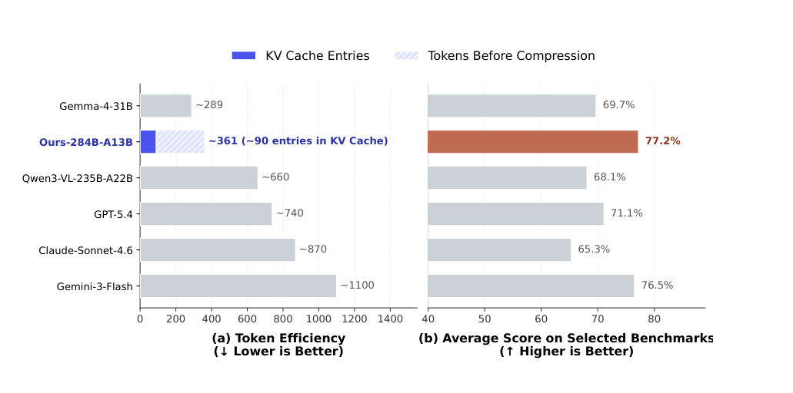
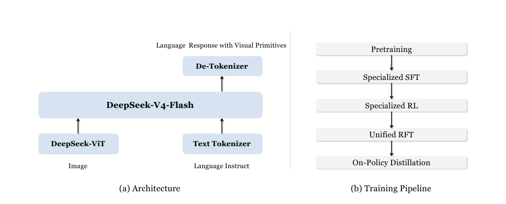
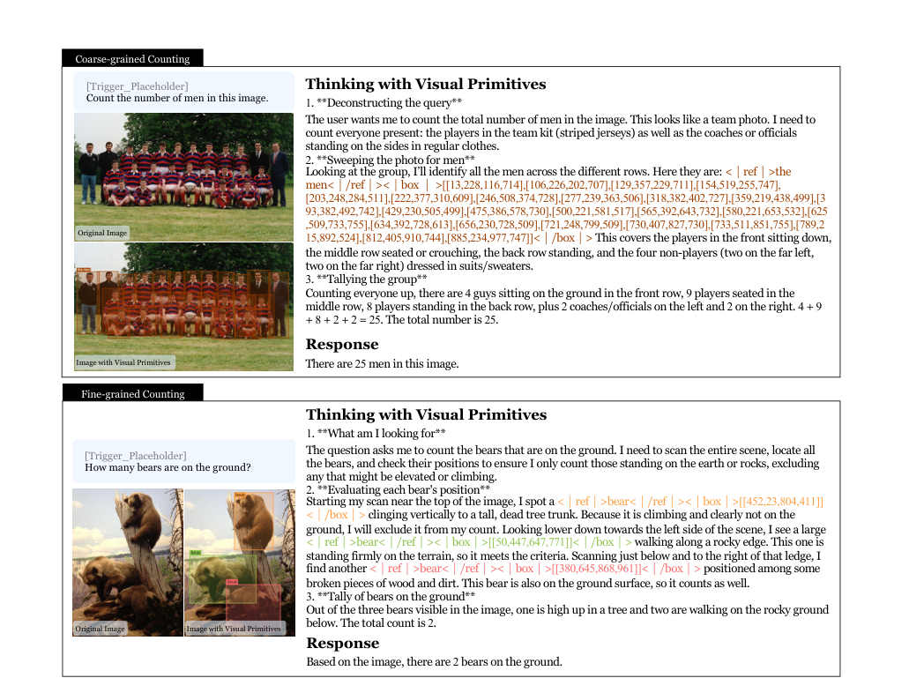
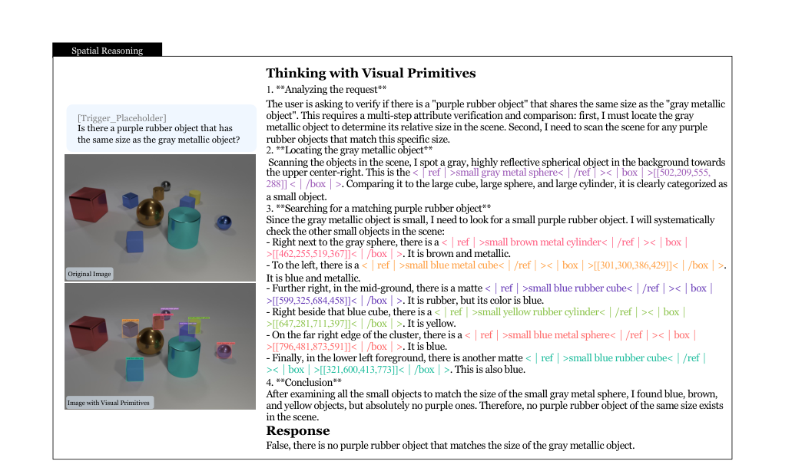
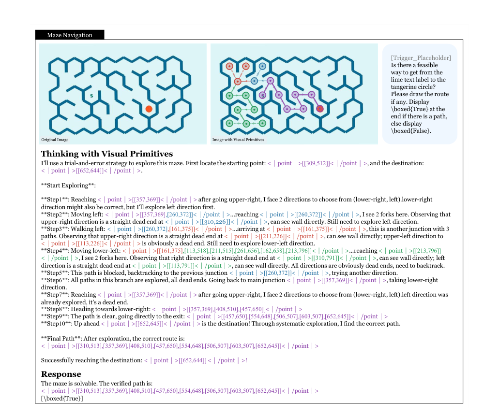
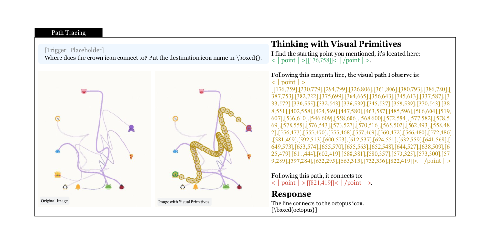
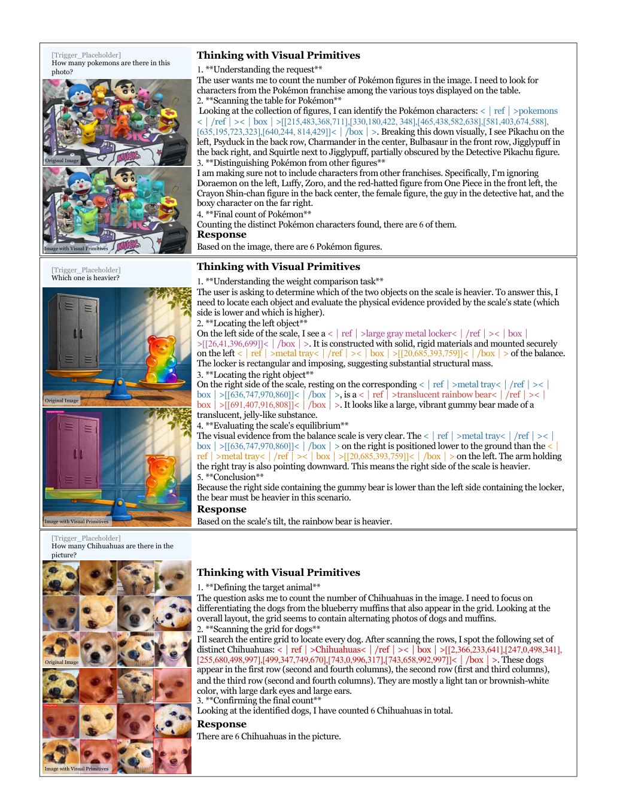
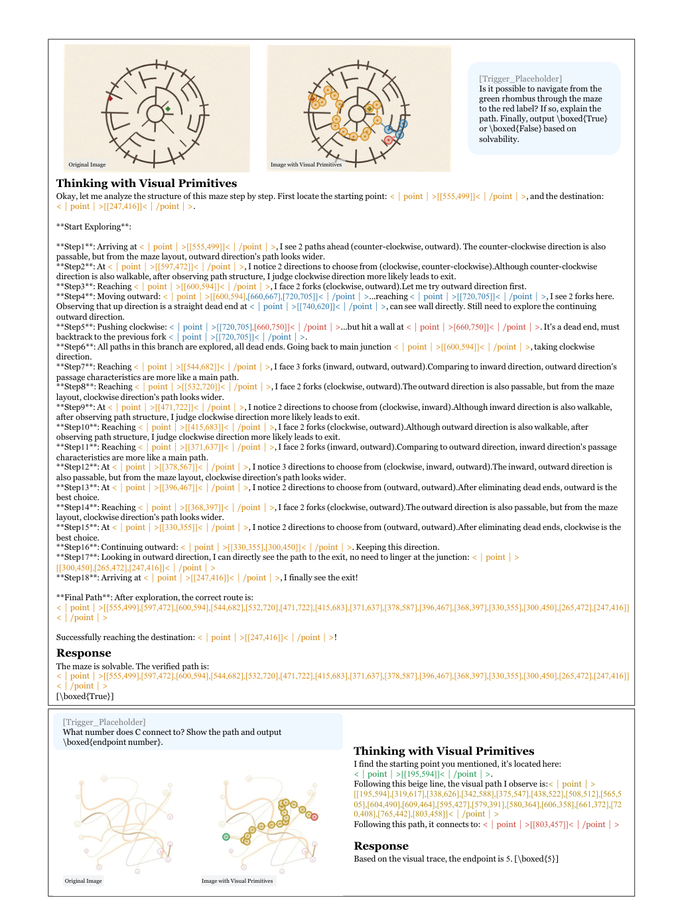

## 总结 | Summary

把照片输入改成「带特殊 token 的空间标注」并不是新事，但在 2026 年这个时间点，DeepSeek 这份技术报告把一件具体的事推到了前台：**把 `<|box|>` 与 `<|point|>` 直接交织进 CoT 的中间步骤，作为「思维原子」**。论文区分 Perception Gap 与 Reference Gap —— 前者是"看不清"，后者是"语言无法精确指向"，并把现有 high-resolution cropping 路线（Thinking with Images / DeepEyes-V2 / GRIT / VLM-R3）归为只解决前者。最硬的数字来自 Fig. 1(a)：800×800 输入下 ~90 个 KV 缓存条目，对比 GPT-5.4 ~740、Gemini-3-Flash ~1100，token 效率约 8–12 倍。

机制上，模型 = DeepSeek-ViT（14×14 patch + 3×3 token 压缩） + DeepSeek-V4-Flash（284B/13B MoE，自带 Compressed Sparse Attention 把 KV 进一步 4× 压缩），756×756 像素到 KV 条目的整体压缩比 7,056×。后训练采用「先专家、后合并」的四阶段流水线：Specialized SFT 把 box 和 point 分两路训成 FTwG / FTwP；Specialized RL 用 GRPO 配三类 reward model（format / quality / accuracy）；Unified RFT 用专家 rollout 蒸出统一模型 F；最后 On-Policy Distillation 把双专家 logit 蒸馏回 F。冷启动数据 ~10k counting + ~9k spatial + 460k maze + 125k path tracing 是这套流水线的真正燃料。

在公平 API 评测下（其他模型 thinking budget 设 low），公开 benchmark 上互有胜负 —— Pixmo-Count 89.2 vs 88.2、CV-Bench 88.4 vs 88.6（Gemini）、OmniSpatial 59.5 vs 59.6（Gemini）—— 但 DS_Maze_Navigation 66.9 vs 50.6（GPT-5.4）、DS_Path_Tracing 56.7 vs 46.5 这两个最大 gap 都是论文自建测试集，且 generator 与训练数据同源。结论的可迁移性主要取决于 **箱式输出+专家 RL** 这套配方而非 "primitives 作为思维原子" 的认知论叙事，后者在论文里没有被任何对照实验隔离出来。

---

## 要点提醒 | Highlights

### 值得关注 | Worth Absorbing

- **Reference Gap vs Perception Gap 的二分** (§1)：把"看清"和"指准"明确切开，给后续工作提供一个干净的 framing。是否成立另说，但这个划分本身就是可被引用的概念资产。
- **CSA + 3×3 patch 压缩的级联** (§2.2)：756×756 → 2916 patch token → 324 LLM 输入 token → 81 KV 条目，整体 7,056× 压缩；同时不需要动态分辨率切片。这套做法可被直接搬到任何需要长序列 KV 优化的 multimodal backbone。
- **"先专家、后合并"的四阶段后训练** (§2.5)：Specialized SFT/RL → Unified RFT → OPD，避免 box 与 point 两种输出模式在低数据量下互相干扰。OPD 用全词表 logit 蒸馏，是 R1-style 路线在 multimodal 上的一次完整工程化复现。
- **Maze RM 与 Path RM 的 reward 分解**（§2.5.2）：Maze 5 项（causal exploration、completeness、wall violation、final path validity、answer correctness），Path 4 项中明确论证了为何 forward-only 距离会被刷分（模型只输出靠近起点的安全点）、reverse-only 不惩罚虚假绕路 —— 这种"对每一项 reward 解释攻击面"的写法值得抄。
- **uniform-style path tracing 模式** (§2.4.4)：刻意把所有线条统一颜色与笔画，剥离 color shortcut，强迫模型靠 curvature continuity 解题。这是少数能真正测试"原子是否被内化"的设计。
- **不解锁动态分辨率仍能在 MIHBench / SpatialMQA 取得 SOTA**：把 ViT 输出 token 限制在 [81, 384] 区间，靠 primitive 标注而非更多像素吃下空间任务，意味着至少在这些 benchmark 上 reference 比 perception 是当前瓶颈。

### 值得推敲 | Worth Questioning

- **In-house benchmark 主导胜率叙事** (Table 1)：差距最大的三项 DS_Maze_Navigation (+16.3 vs 第二名)、DS_Path_Tracing (+10.2)、DS_Spatial_Reasoning (+1.5 vs 96.8) 都是论文自建集，且 generator (DFS/Prim/Kruskal、Bézier) 与训练数据同源。Fig. 1(b) "average across 7 benchmarks" 的 77.2% 数字必须看清子集才有意义。
- **缺最关键的消融：纯文本 CoT vs primitive-CoT 在同数据上的对比**。论文整套叙事建立在"box/point 作为思维原子"，但没有把冷启动数据中的 `<|box|>...<|/box|>` 替换成等价自然语言描述（"a person at top-left, [13,228,116,714]"）后再训一遍。当前数字无法区分增益来自结构化 reasoning 还是 special token。
- **Cold-start thinking content 的 teacher MLLM 未指明** (§2.4.1, §2.4.2)：counting 与 spatial 的思维链都由"an MLLM"生成，没有说是哪一个。如果用了与 base model 同源的 DeepSeek-VL，则相当于 self-distillation 闭环；否则可能引入 frontier 模型的 reasoning trace（自蒸馏 vs 跨模型蒸馏会带来截然不同的解读）。
- **对手 thinking budget 全部设 low** (§3.2)：作者称"为公平比较"，但 GPT-5.4 / Gemini-3-Flash 的 thinking 长度本身是其能力的核心组成部分。一个更诚实的对照是同时报 high budget 数值，否则容易低估对手。
- **Reference Gap 的存在性主要由 motivation 论证，未做诊断实验**：论文断言 dense layout 下"语言失去对视觉实体的指针"，但没有给出一个可以量化诊断 reference 失败的指标（比如把同一个 chain-of-thought 翻译成纯文字 vs 带坐标，看 logical consistency rate 的差）。
- **没有与同期 think-with-image 路线的直接对比**：[6] GRIT、[12] VLM-R3、[8] DeepEyes-V2 在 §1 被点名，但 Table 1 中完全不见。把它们按 box-only / point-only / image-zoom-only 分桶对比，本可以是论文最强证据，目前缺位。
- **OPD 阶段的算力成本未披露**：4 阶段 post-training（双 SFT + 双 RL + RFT + OPD）相对单阶段 RFT 的 token 成本与 wall-clock 倍数没有给。读者无法判断这套 pipeline 是否值得复现。

---

## 深度思考 | Analysis

### 真正的贡献是什么

声明的贡献是「把空间标记升格为思维原子」，但真正可被搬走的是另外两件事：(1) 一套完整、可以照搬的"特殊 token + rule-based RM + 双专家 SFT/RL/OPD"流水线，把 R1-style 后训练完整移植到了视觉推理；(2) 一份 DeepSeek-V4-Flash 在 vision frontend 上的工程范本 —— 把 CSA 从纯 LLM 推到 multimodal，验证 ~90 个 KV 条目就能撑起 800×800 输入。"思维原子"这条认知论叙事在没有 ablation 的情况下，目前只是 narrative，未被实证隔离。

### 在更大图景里的位置

这是 2025–2026 年 R1-style 后训练在 vision 落地的一次完整工程化复现，与同期 [6] GRIT (2025-05)、[12] VLM-R3 (2025-05)、[8] DeepEyes-V2 (2025-11) 共同把"显式输出空间标记"推上来；区别是 DeepSeek 直接在 CoT 中间步骤交织 box/point，而非把它们当作 post-hoc verification。它没开新范式，是把 LLM 侧成熟的 GRPO + rule-based reward 路径几乎逐字搬到 vision，并验证可以跑出来。在这个意义上，它和 OpenAI 的 Thinking with Images 不是替代关系而是互补关系：一边是"放大像素去看清"，一边是"输出坐标去指准"，未来工作大概率会把两者拼起来 —— 而且这种拼接已经能从论文 §4 第一条 limitation 里读到铺垫。

### 它打开了什么

打开了一类任务的攻略路径：任何"图上需要锚点的多步推理" —— 电路图分析、化学结构推断、UI element 跨步骤交互、医学影像中的器官追溯 —— 都能照搬这套 `<|box|>` / `<|point|>` + 双专家 SFT/RL + OPD 的配方。同时部分关闭了"vision-language 必须靠 high-resolution cropping 才能稳"这条假设：当 reference 而非 perception 是瓶颈时，更便宜的 KV 预算 + 显式空间输出反而比动态切片更优。真正下一篇有意思的工作应该是论文 §4 自己留下的那条：让 trigger 隐式化，让模型自己决定何时切换到 primitive-CoT，并把 box/point 与 image patch 的 attention map 在 latent 层面打通 —— 当前的特殊 token 形式仍是 surface-level injection。

### 如果由我接手

最 decisive 的单一实验：同 backbone、同冷启动数据集，把所有 `<|box|>[[x1,y1,x2,y2]]<|/box|>` 替换成等价自然语言（"a person at coordinates [13,228,116,714]"），跑同样的 SFT/RL/RFT/OPD。如果 DS_Maze 与 DS_Path 的 gap 几乎不变，本文的真正贡献是 *结构化 reasoning chain 的冷启动设计*；只有当 gap 显著缩小，"primitives as units of thought" 这条叙事才真有载荷。这一对照实验大概率会把论文的 framing 改写一遍。

---

## 原文精读 | Bilingual Full Text

### Abstract

Despite the remarkable progress in Multimodal Large Language Models (MLLMs), the prevailing Chain-of-Thought (CoT) paradigms remain predominantly confined to the linguistic space. While recent advancements have focused on bridging the Perception Gap through high-resolution cropping (e.g., Thinking with Images), they overlook a more fundamental bottleneck: the Reference Gap. The inherent ambiguity of natural language often fails to provide precise, unambiguous pointers to complex spatial layouts, leading to logical collapse in tasks requiring rigorous grounding. In this work, we introduce Thinking with Visual Primitives, a novel reasoning framework that elevates spatial markers—such as points and bounding boxes—to "minimal units of thought". By interleaving these visual primitives directly into the thinking process, our model can "point" while it "reasons", effectively grounding its cognitive trajectory in the physical coordinates of the image. Notably, our framework is built on a highly optimized architecture with extreme visual token efficiency. Despite its compact model scale and significantly lower image-token budget, our model achieves frontier-competitive performance on a focused suite of challenging visual QA tasks, matching or exceeding models such as GPT-5.4, Claude-Sonnet-4.6, and Gemini-3-Flash. This demonstrates a path toward more efficient and scalable System-2-like multimodal intelligence.

尽管多模态大模型（MLLM）已取得显著进展，主流的思维链（CoT）范式仍主要局限在语言空间内。近期工作（如 Thinking with Images）通过高分辨率裁剪致力于弥合 Perception Gap，但忽视了一个更根本的瓶颈：Reference Gap。自然语言固有的歧义性，常常无法对复杂空间布局给出精确、无歧义的指针，从而在依赖严格定位（grounding）的任务中导致逻辑崩塌。本文提出 Thinking with Visual Primitives，将点、边界框等空间标记升格为"最小思维单元"，把它们直接交织进模型的思考过程，让模型在"推理"时同时"指点"，从而把抽象的语言思路锚定到图像的物理坐标上。框架构建在一套高度优化、视觉 token 利用率极致的架构之上：在更紧凑的模型规模与显著更低的图像 token 预算下，本模型在一组聚焦型视觉 QA 任务上取得了与前沿模型可比、甚至超过 GPT-5.4、Claude-Sonnet-4.6、Gemini-3-Flash 的表现。这为更高效、更可扩展的 System-2 式多模态智能提供了一条可行路径。

### 1. Introduction

The convergence of Large Language Models (LLMs) and computer vision has ushered in an era of Multimodal Large Language Models (MLLMs) capable of sophisticated scene understanding. However, as we push these models toward complex reasoning, often conceptualized as Daniel Kahneman's "System 2" thinking [23], a fundamental limitation of the current paradigm emerges. While the internal reasoning of these models, typically manifested as Chain-of-Thought (CoT), has become increasingly robust in the linguistic domain, it remains largely disjointed from the visual domain.

LLM 与计算机视觉的融合催生了具备复杂场景理解能力的 MLLM。但当我们把它们推向复杂推理 —— 通常用 Daniel Kahneman 的 "System 2" 思维 [23] 来概念化 —— 当前范式的根本局限便显现出来：模型的内部推理（典型形态为 CoT）在语言侧已愈发稳健，但与视觉域之间存在明显割裂。

Recent efforts to enhance multimodal reasoning, such as the visual-scaling strategies seen in frontier models [8, 12, 21, 24, 26, 34], have primarily addressed the Perception Gap. By employing high-resolution cropping and dynamic patching, these models ensure they "see" the fine-grained details of an image. Yet, "seeing" is not "reasoning". Even with perfect perception, MLLMs frequently suffer from logical collapse in tasks involving complex spatial layouts or dense object interactions. We identify this failure as the Reference Gap: the inherent inability of natural language to serve as a precise, unambiguous pointer within a continuous visual space. In scenarios like dense counting or multi-step spatial deduction, the model's linguistic "thoughts" lose track of the visual entities they intend to reference, leading to cascading hallucinations.

近期增强多模态推理的努力，如前沿模型 [8, 12, 21, 24, 26, 34] 中的 visual-scaling 策略，主要瞄准的是 Perception Gap：通过高分辨率裁剪与动态切片，让模型"看清"图像的细粒度细节。然而"看见"并不等于"推理"。即便感知完美，MLLM 在涉及复杂空间布局或密集对象交互的任务中仍频繁出现逻辑崩塌。我们把这一失败归纳为 Reference Gap：自然语言天生无法在连续视觉空间中充当精确、无歧义的指针。在密集计数或多步空间推断这类场景里，模型的语言"思考"会逐步失去对所指视觉实体的追踪，进而引发级联幻觉。

While recent works [6, 27, 32] have explored integrating bounding boxes into the chain-of-thought process, they primarily treat grounding as a post-hoc verification mechanism to enhance perception-heavy tasks. These approaches are often confined to high-resolution benchmarks where the challenge is "seeing" rather than "reasoning", and their reliance on labor-intensive supervision further limits scalability. More importantly, they fail to address the Reference Gap in complex structural reasoning—such as topological navigation—where visual markers must function as the intrinsic medium of thought rather than merely verifiable evidence.

近期工作 [6, 27, 32] 也尝试把边界框纳入 CoT，但它们主要把 grounding 当作 *post-hoc 验证机制*，用于增强偏感知的任务。这些方法多数仍受限于高分辨率 benchmark —— 真正的难点是"看清"而非"推理"，并且对人工标注的高度依赖也限制了规模化。更重要的是，它们没能解决复杂结构推理（如拓扑导航）中的 Reference Gap：在那里，视觉标记必须作为思维的内在媒介，而非仅仅是事后可被核验的证据。

In this work, we propose a paradigm shift: Thinking with Visual Primitives. We move beyond treating visual grounding as a secondary task or a final output. We elevate spatial markers—points and bounding boxes—to "minimal units of thought" that are interleaved directly into the model's reasoning trajectory. This mechanism draws inspiration from human cognitive processes. When navigating a complex maze or counting a dense collection of objects, humans naturally employ deictic pointers—such as finger gestures—to reduce cognitive load and maintain logical consistency. By interleaving visual primitives into the thinking process, our model mimics this "point-to-reason" synergy, effectively anchoring abstract linguistic thoughts onto concrete spatial coordinates.

本文提出一种范式转变：Thinking with Visual Primitives。我们不再把视觉 grounding 视作附属任务或最终输出，而是把点与边界框这类空间标记升格为"最小思维单元"，直接交织进模型的推理轨迹。这一机制借鉴了人类认知：在走复杂迷宫或清点密集物体时，人会自然地使用指示性手势（finger gesture）等 deictic pointer 以降低认知负荷、保持逻辑一致。通过把视觉原子嵌入思考过程，模型也得以模拟这种"指—推"协同，把抽象的语言思路精确锚定到具体空间坐标上。

Furthermore, our framework is built upon an architecturally efficient foundation [3] designed for high-throughput, long-context multimodal interactions. Unlike traditional approaches that rely on massive visual token sequences to compensate for visual deficiencies, our model leverages Compressed Sparse Attention [3] that compress the Key-Value (KV) cache of every $m$ visual token into one entry. This design allows the model to operate with only a fraction of the visual tokens used by other frontier systems, while maintaining comparable cognitive depth.

进一步地，本框架构建于一套面向高吞吐、长上下文多模态交互的架构基座 [3] 之上。与依赖大量视觉 token 来弥补视觉缺陷的传统做法不同，我们利用 Compressed Sparse Attention [3] 将每 $m$ 个视觉 token 的 Key-Value 缓存压缩为一个条目。该设计使模型可以以远少于其他前沿系统的视觉 token 数运行，同时保持可比的认知深度。

Through extensive benchmarking, we demonstrate that Thinking with Visual Primitives delivers a significant leap in reasoning accuracy. Our model achieves competitive performance, standing on par with or surpassing the latest iterations of GPT, Claude, and Gemini across a wide spectrum of challenging spatial reasoning and visual QA tasks (seeing Fig. 1). Our findings suggest that the future of multimodal intelligence lies not just in seeing more pixels, but in developing more precise and less ambiguous referential mechanisms that bridges the gap between language and the visual world.

通过大量基准测试，我们证明 Thinking with Visual Primitives 在推理准确率上带来显著提升 —— 在覆盖空间推理与视觉 QA 的广泛任务上，本模型与 GPT、Claude、Gemini 的最新版本持平或超越（见 Fig. 1）。结论是：多模态智能的未来不只是"看到更多像素"，而是建立更精确、更少歧义的指代机制，去弥合语言与视觉世界之间的鸿沟。

**Figure 1.** (a) Token consumption across various models for an 800 × 800 resolution image. (b) Average performance across 7 benchmarks—including counting and spatial reasoning—with in-house benchmarks excluded. For an 800 × 800 input, our model retains only approximately 90 entries in the KV cache, delivering competitive performance through a highly efficient compression strategy.

**图 1.** (a) 不同模型在 800×800 分辨率图像下的 token 消耗。(b) 7 个基准（含计数与空间推理，已剔除 in-house benchmark）的平均性能。在 800×800 输入下，本模型仅保留约 90 个 KV 缓存条目，靠高效压缩策略取得有竞争力的表现。

### 2. Method

This section first introduces the model architecture. Next, we elaborate on the training pipeline, as illustrated in Fig. 2, and describe the corresponding data used across the pretraining and post-training phases.

本节首先介绍模型架构，随后详细阐述训练流水线（如 Fig. 2 所示），并描述预训练与后训练各阶段使用的数据。

**Figure 2.** Model architecture and training pipeline. Developed upon the DeepSeek-V4-Flash [3], our model acquires foundational visual primitive generation capabilities during the pretraining phase. This is followed by a post-training stage employing an expert-wise specialization and consolidation paradigm.

**图 2.** 模型架构与训练流水线。基于 DeepSeek-V4-Flash [3]，模型在预训练阶段习得基础的视觉原子生成能力，后训练阶段则采用「专家化—合并」的范式。

#### 2.2. Architecture

Our model adopts a standard architecture similar to LLaVA [18, 19]. Specifically, input images are processed by a Vision Transformer (ViT) to extract visual features, which are then concatenated with language instructions to form an interleaved sequence of vision-language tokens. This sequence is subsequently fed into the Large Language Model (LLM) to generate responses. The language backbone is instantiated with DeepSeek-V4-Flash [3], a Mixture-of-Experts (MoE) model comprising 284B total parameters and 13B active parameters during inference.

模型采用类似 LLaVA [18, 19] 的标准架构：输入图像由 Vision Transformer (ViT) 抽取视觉特征，然后与语言指令拼接，形成视觉-语言交错 token 序列，输入大模型生成响应。语言主干为 DeepSeek-V4-Flash [3]，一个 284B 总参 / 13B 激活参的 MoE 模型。

For visual encoding, we employ DeepSeek-ViT, an in-house ViT trained from scratch that supports arbitrary-resolution inputs. It first partitions the input image using a 14 × 14 patch size to generate patch tokens. Subsequently, at the ViT output, we apply a 3 × 3 spatial token compression (compressing every 9 adjacent patch tokens into a single token along the channel dimension). Furthermore, leveraging the Compressed Sparse Attention (CSA) mechanism integrated within the base LLM, the visual tokens stored in the Key-Value (KV) cache are further compressed by a factor of 4.

视觉编码使用 DeepSeek-ViT，一个支持任意分辨率输入的自研 ViT。它先以 14×14 patch 切分图像得到 patch token，再在 ViT 输出端做 3×3 空间 token 压缩（沿 channel 维把 9 个相邻 patch token 合成一个）。进一步地，借助 base LLM 内置的 Compressed Sparse Attention (CSA)，KV 缓存中的视觉 token 还会被压缩 4 倍。

To illustrate this pipeline, consider an input image of 756 × 756 resolution comprising 571,536 pixels. The patch embedding layer processes this into 2,916 image patch tokens for the ViT. Following the 3 × 3 compression, only 324 visual tokens are fed into the LLM during the prefilling stage. Ultimately, the CSA mechanism reduces this to a mere 81 visual KV entries in the KV cache. Throughout this entire process, from raw pixels to the final KV cache entries, the system achieves an overall compression ratio of 7,056×.

举例说明：输入一张 756×756 图像（571,536 像素），patch embedding 层将其转换为 2,916 个 patch token；经 3×3 压缩后，prefilling 阶段只有 324 个视觉 token 进入 LLM；CSA 机制最终把 KV 缓存中的视觉条目压缩到仅 81 个。从原始像素到最终 KV 条目，整体压缩比达到 7,056×。

#### 2.3. Pretraining

##### 2.3.1. Definition of Visual Primitives

During the pretraining phase, our objective is to equip the model with the fundamental capability to output "visual primitives". We identify two standard output formats in computer vision as primitives: bounding boxes and points. Both representations fulfill the crucial role of spatial referencing. However, they exhibit distinct functional advantages: bounding boxes are adept at capturing the exact location and scale of specific objects, while points are more appropriate for abstract visual referencing, such as tracking motion trajectories or solving topological reasoning problems.

预训练阶段的目标是让模型获得输出"视觉原子"的基础能力。我们将计算机视觉中两种标准输出格式作为原子：边界框（bounding box）与点（point）。两者都承担空间指代的关键作用，但功能上各有侧重：bounding box 善于捕捉特定对象的精确位置与尺度；point 更适合抽象的视觉指代，如轨迹追踪或拓扑推理。

##### 2.3.2. Motivation for Large-Scale Data Curation

While existing public datasets, such as COCO [17] and Pixmo-Points [4], provide relatively accurate box or point annotations, they suffer from insufficient scale and a notable lack of diversity. To ensure the generalizability of our "Thinking with Visual Primitives" paradigm, it is imperative to curate large-scale web data with rich semantics and high diversity. We prioritize the extensive scaling of bounding box data for the following reasons:

现有公开数据集（如 COCO [17]、Pixmo-Points [4]）虽提供了相对准确的框或点标注，但规模有限、多样性显著不足。为了让 "Thinking with Visual Primitives" 范式能泛化，必须 curate 一份语义丰富、多样性高的大规模 web 数据。我们优先扩展 bounding box 数据，理由如下：

- **Determinism of Annotations**: A bounding box tightly encloses an object, making its annotation relatively deterministic. Conversely, point annotations are highly ambiguous; any coordinate within the object's boundaries can serve as a valid reference, leading to the absence of a strict ground truth. In extreme scenarios involving occlusion, a point intended for a background object might fall onto a foreground occluder, resulting in significant ambiguity.
- **Task Generalizability**: A model trained to output bounding boxes can effortlessly generalize to point-based formats. Since a bounding box can be defined by two points (the top-left and bottom-right coordinates), it inherently encompasses the point representation.
- **Information Richness**: Bounding boxes support a broader range of downstream tasks compared to points. While a point merely provides spatial localization, a bounding box encapsulates detailed geometric information (e.g., width and height). This additional context enables the model to perform more complex reasoning within the "Thinking with Visual Primitives" framework.

- **标注确定性**：bounding box 紧贴对象，标注相对确定。反观 point 标注高度歧义 —— 对象边界内任意点都可作为有效指代，缺乏严格 ground truth。在涉及遮挡的极端场景下，本应指代背景对象的 point 可能落到前景遮挡物上，引入显著歧义。
- **任务泛化性**：训练出 bounding box 输出能力的模型，可平滑泛化到 point 形式 —— 因为一个 bounding box 由左上、右下两个点定义，本身就包含 point 表征。
- **信息丰富度**：相对 point 仅提供空间定位，bounding box 还封装了几何信息（如宽、高），为 "Thinking with Visual Primitives" 框架下的复杂推理提供了额外上下文。

##### 2.3.3. Large-Scale Web Data Construction

**Raw Data Acquisition.** We acquire a massive volume of internet data related to box grounding by conducting large-scale web scraping across multiple websites. Taking Huggingface as an example, we utilize its official API to filter task data tagged with "Object Detection" or "Grounding". We perform an initial screening based on popularity metrics (e.g., rankings by likes and downloads) and rigorously exclude all validation and test splits to prevent potential data contamination (i.e., data leakage) during model evaluation. Furthermore, we employ an LLM-based agent to parse the README.md files of these repositories, automatically converting the diverse dataset structures into our predefined, unified storage format. Following extensive crawling and deduplication across these websites, we ultimately curate 97,984 box-grounding-related data sources.

**原始数据采集**：在多个网站做大规模爬取以获取与 box grounding 相关的海量互联网数据。以 Huggingface 为例，使用其官方 API 过滤标签为 "Object Detection" 或 "Grounding" 的任务数据；按受众度（点赞、下载排名）做初筛，并严格剔除所有 validation / test split 以防止评测期数据污染。再用一个 LLM-based agent 解析仓库 README，将异构的数据结构自动转换为预定义的统一存储格式。多站点爬取与去重后，最终汇聚 97,984 个 box-grounding 相关的数据来源。

**Step I: Semantic-based Review.** Given that the directly crawled datasets are replete with noisy labels unsuitable for vision-language alignment training, we introduce an automated, MLLM-driven semantic review mechanism. While traditional data filtering primarily focuses on the geometric accuracy of bounding boxes, this stage aims to ensure the validity of the semantic label. Specifically, this review process focuses on eliminating three categories of fatal semantic defects:

**第一步：语义审查**。直接爬取的数据集充斥着不适合 vision-language 对齐训练的噪声标签，我们引入自动化、MLLM 驱动的语义审查。传统过滤主要关注 box 的几何准确度，本阶段则确保语义标签的有效性，重点剔除三类致命语义缺陷：

- **Meaningless Machine Codes and Gibberish**: pure numeric classes like "0" or "1" — forcing the model to learn such mappings would severely degrade its language generation capabilities, so they are discarded.
- **Ungeneralizable Private Entities**: e.g., "MyRoommate" or "ID_Card_1" — visual features of a non-public figure cannot generalize from isolated samples; widely recognized celebrities or public figures are retained.
- **Ambiguous Abbreviations and Subjective Evaluations**: domain-specific labels like "OK" / "NG" (Not Good) — a bare "OK" introduces extreme semantic ambiguity, since an "intact apple" and an "intact circuit board" share no visual correlation.

- **无意义机器码与乱码**：纯数字类别（如 "0"、"1"）缺乏自然语义，强行学习会严重损害语言生成能力，直接丢弃。
- **不可泛化的私有实体**：如 "MyRoommate"、"ID_Card_1" 等 —— MLLM 无法从孤立样本泛化非公众人物的视觉特征，故严格过滤；广为人知的名人或公众人物保留。
- **歧义缩写与主观评价**：工业检测领域常见的 "OK"、"NG" 这类标签 —— 一个 "OK" 带来极大语义歧义，"完好的苹果"与"完好的电路板"在视觉上毫无关联。

For each dataset, we sample three images and prompt the model to calculate a quality score (ranging from 0 to 10) based on the aforementioned criteria. The model then outputs a definitive "KEEP" or "DISCARD" decision, accompanied by a clear justification. This review stage retains 43,141 out of the initial 97,984 data sources, which are subsequently advanced to the next filtering phase.

每个数据集采样三张图像，由模型基于上述准则给出 0–10 的质量分，输出确定的 "KEEP" 或 "DISCARD" 判决并附理由。本阶段从 97,984 中保留 43,141 个数据源，进入下一过滤阶段。

**Step II: Visual-Geometric Quality Review.** We further evaluate the geometric quality and annotation completeness of the bounding boxes to ensure the model learns precise region-text alignments. This process specifically targets three types of structural annotation defects:

**第二步：视觉—几何质量审查**。进一步评估 bounding box 的几何质量与标注完整性，确保模型学到精确的 region-text 对齐。重点针对三类结构性标注缺陷：

- **Severe Missing Annotations (Low Recall)**: multiple instances exist for a label but only a few are annotated; if the miss rate >50% during sampling, the dataset is discarded.
- **Severe Truncation and Offset**: differential tolerance — slightly loose boxes are acceptable; severe truncations slicing through critical features (e.g., cutting off head or wheels) are unacceptable.
- **Mega Boxes Issue**: a box meaninglessly covering >90% of image area indicates classification data forcibly converted into detection data. Occasional cases are tolerated; consistent occurrences across all three samples lead to discarding.

- **严重漏标（低召回）**：标签对应多个实例但只标了少数；若采样发现漏标率 >50%，立即丢弃。
- **严重截断与偏移**：差异化容忍 —— 略微松动（含少量背景噪声）可接受；切掉关键视觉特征（如头部、车轮）的严重截断不可接受。
- **巨型框**：覆盖 >90% 图像面积的无意义大框，往往是分类数据被强行转成检测数据；偶发可容忍，三张采样图持续出现则丢弃。

This review stage further retained 31,701 out of the 43,141 remaining data sources. To achieve dataset balance, we design a category-based sampling strategy. For each category within every dataset, we randomly sample $N$ images associated with that class. Since a single image may simultaneously belong to multiple categories, we perform global deduplication after the per-category selection. In practice, we set $N = 1{,}000$, ultimately yielding over 40 million high-quality samples.

本阶段进一步从 43,141 保留 31,701 个数据源。为实现数据集平衡，我们按类别采样：每个数据集每个类别随机抽 $N$ 张关联图像（不足 $N$ 全保留）。由于一张图可能同时属于多个类别，最后做全局去重。实践中取 $N = 1{,}000$，最终得到 4 千万以上高质量样本。

##### 2.3.4. Unified Pretraining

For general multimodal data, we predominantly utilize large-scale web-crawled data rather than synthetic data generated via model distillation (e.g., synthetic image caption). The raw data undergoes careful curation, and we refrain from utilizing LLMs to rewrite the data content. Regarding the specialized data designed to equip the model with foundational capabilities to output visual primitives, in addition to the aforementioned web crawling and filtering, we also incorporate several high-quality public datasets, such as [4, 15, 17, 25, 29, 33].

通用多模态数据以大规模 web-crawled 数据为主，而非借助模型蒸馏生成的合成数据（如 synthetic image caption）。原始数据经精心 curation，不使用 LLM 重写内容。面向输出视觉原子的专用数据，除上述爬取过滤外，还纳入若干高质量公开数据集 [4, 15, 17, 25, 29, 33]。

We establish a unified formatting standard for both box grounding and point data. For box grounding tasks, we devise several prompt templates, such as "Locate TARGET in this image and report its bounding box coordinates.", where TARGET serves as a placeholder for the queried object. The corresponding response format is `<|ref|>TARGET<|/ref|><|box|>[[x1,y1,x2,y2],[x3,y3,x4,y4]...]<|/box|>`, where `<|ref|>`, `<|/ref|>`, `<|box|>`, and `<|/box|>` are special tokens within the vocabulary. Coordinates are normalized to discrete integers ranging from 0 to 999. In scenarios with multiple instances, the bounding boxes are ordered from left to right.

对 box grounding 与 point 数据，我们建立统一的格式规范。box grounding 任务设计多种 prompt 模板，例如 "Locate TARGET in this image and report its bounding box coordinates."（TARGET 为查询对象占位符）。对应响应格式为 `<|ref|>TARGET<|/ref|><|box|>[[x1,y1,x2,y2],[x3,y3,x4,y4]...]<|/box|>`，其中 `<|ref|>` / `<|/ref|>` / `<|box|>` / `<|/box|>` 是词表内特殊 token；坐标被归一化为 0–999 的离散整数。多实例时框按从左到右排序。

Similarly, for point tasks, we design prompt templates such as "Help me find TARGET. Give me the center point for each instance." The expected response format is: `<|point|>[[x1,y1],[x2,y2]...]<|/point|>`. Notably, in contrast to the box grounding format, the response paradigm for point tasks does not require outputting the object name. This design choice aims to extend point-based representations to more abstract concepts, such as utilizing a sequence of points to denote a trajectory. Ultimately, the whole pretraining phase consumes trillions of multimodal tokens.

point 任务对应的 prompt 模板如 "Help me find TARGET. Give me the center point for each instance."，响应格式为 `<|point|>[[x1,y1],[x2,y2]...]<|/point|>`。值得注意的是，与 box grounding 不同，point 响应格式不要求输出对象名称 —— 这一设计有意把 point 表征延伸到更抽象的概念，例如用一串点表示一条轨迹。整个预训练阶段消耗数万亿（trillion）级多模态 token。

#### 2.4. Task Design & Cold-Start Data

**Cold-Start Data for Post-Training.** While pretraining equips the model with general multimodal priors and basic visual primitive capabilities, post-training (Specialized SFT/RL and the subsequent unified RFT) needs a small but high-precision cold-start dataset to bootstrap instruction following and reward learning under our visual primitive output interface. Concretely, we construct cold-start data with (i) explicit supervision targets derived from annotations (e.g., boxes/points) or programmatically generated, (ii) automatic verifiers (e.g., rule-based checkers) whenever possible to reduce label noise. We selected representative tasks that benefit from visual primitive-based reasoning (via boxes or points), and designed our cold-start data across four key dimensions: counting, spatial reasoning & general visual QA, maze navigation, and path tracing.

**后训练用冷启动数据**：预训练给模型注入了通用多模态先验与基础视觉原子能力；后训练（Specialized SFT/RL 与随后的 Unified RFT）则需要一份小而高精度的冷启动数据集，用以 bootstrap 在视觉原子输出接口下的指令遵循与 reward 学习。具体地，冷启动数据满足：(i) 显式监督目标来自标注或程序化生成（如框/点）；(ii) 尽量配套自动校验器（如规则检查）以降低标签噪声。我们沿四个维度选取受益于 primitive 推理的代表性任务：计数、空间推理 & 通用视觉 QA、迷宫导航、路径追踪。

##### 2.4.1. Counting

Multimodal Large Language Models consistently struggle with accurate counting, particularly in dense scenes. Unlike humans, who typically employ a systematic scanning-and-accumulation strategy, language-based models often fail to establish precise object correspondences when the object count is high. We address this fundamental bottleneck by employing bounding boxes as visual primitives to provide explicit referential anchors.

MLLM 在密集场景下的精确计数始终是个难点。人类通常用系统化的"扫描—累加"策略，而纯语言模型在对象数量很高时往往无法建立精确的对象对应。我们用 bounding box 作为视觉原子，为模型提供显式的指代锚点。

**Task Decomposition.** We categorize counting tasks into two types: Coarse-grained Counting and Fine-grained Counting. The former focuses on counting general categories (e.g., "dogs"), while the latter requires distinguishing objects based on specific attributes or spatial constraints (e.g., "white dogs" or "the dog on the left").

**任务分解**：将计数任务分为粗粒度计数（如 "dogs"）和细粒度计数（如 "白色 dogs" 或 "左边的 dog"，需依据特定属性或空间约束区分对象）。

**Coarse-Grained Counting.** We aggregate data from multiple dense detection datasets [2, 9, 14, 22, 28, 29, 35]. Filtering criteria: avoiding excessive object density, ensuring bounding boxes are sufficiently large for clear identification, and maintaining a high recall rate for ground-truth box annotations. For the filtered samples, we prompt an MLLM to generate thinking content and concise final response based on the images and box annotations. The thinking content generation follows a structured three-step protocol: (1) Intent Analysis; (2) Batch Grounding (utilizing visual primitives to locate all candidate objects simultaneously — batch grounding is more efficient for coarse-grained tasks as it leverages the model's inherent localization strengths while preventing repetitive enumeration); and (3) Statistical Summation. To eliminate noise during cold-start training, we implement a strict verification mechanism to ensure that all box visual primitives in the thinking content strictly align with the metadata coordinates, follow the predefined syntax, and match the final numerical count.

**粗粒度计数**：聚合多份密集检测数据集 [2, 9, 14, 22, 28, 29, 35]，按三项准则过滤：避免过度密集、保证 box 足够大易于识别、保证 ground-truth box 高召回。过滤后样本由 MLLM 基于图像与 box 标注生成思考内容与简洁最终回复。思考内容遵循三步协议：(1) 意图分析；(2) 批量 grounding —— 一次性定位所有候选对象（粗粒度任务下批量 grounding 更高效，避免重复枚举）；(3) 统计求和。为消除冷启动训练噪声，我们实施严格的校验机制，确保思考内容中所有 box 原子严格对齐元数据坐标、符合预定义语法，并与最终数值一致。

**Fine-Grained Counting.** Due to the scarcity of publicly available datasets specifically for fine-grained counting, we developed a specialized data construction pipeline. (1) Question Generation: leveraging the images and scene-graph metadata from GQA [10], we prompt an MLLM to curate informative fine-grained counting questions; we record the ground-truth object IDs, the IDs of excluded negative candidates, and the underlying rationale. (2) Thinking Content Synthesis: the model is explicitly instructed to perform a sequential scan—systematically identifying and verifying each possible object in the scene against the specified fine-grained constraints. We also applied this methodology to construct negative samples where the ground-truth count is zero, thereby enhancing the model's robustness against hallucinations.

**细粒度计数**：因公开数据稀缺，我们专门设计了构造流水线。(1) 问题生成：基于 GQA [10] 的图像与 scene-graph 元数据，由 MLLM 产生有信息量的细粒度计数问题，并记录 ground-truth 对象 ID、被排除的负候选 ID 与构造原因。(2) 思考内容合成：明确指示模型做 *sequential scan* —— 逐对象按细粒度约束逐一识别与验证。该方法亦用于构造 ground-truth 计数为零的负样本，以增强模型对幻觉的鲁棒性。

In total, we have approximately 10,000 cold-start samples for counting task. Examples could be seen in Fig. 3.

计数任务的冷启动样本约 10,000 条，示例见 Fig. 3。

**Figure 3.** Illustrative examples of cold-start data for coarse-grained and fine-grained counting. The model performs intent decomposition and utilizes visual primitives to anchor all pertinent entities, followed by a systematic counting procedure grounded in the visual domain.

**图 3.** 粗粒度与细粒度计数的冷启动数据示例。模型先做意图分解，再用视觉原子锚定所有相关实体，随后在视觉域中执行系统化计数。

##### 2.4.2. Spatial Reasoning and General Visual QA

We consolidate spatial reasoning and general VQA into a unified category. This integration effectively mitigates the referential ambiguity and semantic drift inherent in purely linguistic descriptions. In constructing our cold-start data, we prioritize spatial reasoning tasks, under the hypothesis that the capability to think with visual primitives developed here will naturally generalize to broader VQA scenarios. Our data curation covers both natural and synthetic environments.

我们把空间推理与通用 VQA 合并为一个统一类别，以缓解纯语言描述中的指代歧义与语义漂移。冷启动数据优先覆盖空间推理任务，假设在此处习得的"以视觉原子思考"能力可自然泛化到更广的 VQA 场景。数据 curation 覆盖自然与合成两类环境。

**Data Construction in Natural Scenes.** Utilizing the images and scene graphs from GQA [10], we prompt an MLLM to design questions centered on spatial relations and object interactions, along with corresponding thinking content. The generated thinking content follows a structured process, including intent analysis, object grounding, and relational inference. To resolve potential ambiguities in crowded scenes, the model is instructed to select distinctive objects and apply multi-attribute constraints (e.g., combining actions and properties) to uniquely specify the target. However, due to the relatively simple relational structure in GQA, it remains challenging to generate complex, multi-hop reasoning samples at scale. To overcome this limitation and fully unlock the model's potential, we further incorporate complex synthetic data.

**自然场景数据构造**：基于 GQA [10] 的图像与 scene graph，提示 MLLM 设计围绕空间关系与对象交互的问题及对应思考内容。思考内容遵循结构化流程：意图分析、对象 grounding、关系推断。为消除拥挤场景下的潜在歧义，模型被指示挑选具区分性的对象并应用多属性约束（如动作 + 属性组合）唯一指定目标。但 GQA 关系结构相对简单，难以规模化生成复杂多跳推理样本，故进一步引入复杂合成数据。

**Data Construction in Synthetic Scenes.** We leverage the CLEVR [13] toolchain to generate multi-hop reasoning data. This framework supports controllable scene generation with varying object densities, along with question generation and programmatic execution traces that map each reasoning step to object-level references (e.g., specific object IDs). To supervise the generation of visual primitives, we project 3D object coordinates onto 2D bounding boxes based on the official toolchain. Given the rendered images, scene graphs, questions, answers, and execution traces, we prompt the MLLM to synthesize "Thinking with Visual Primitives" chains, which include intent analysis, task decomposition, and multi-hop grounded reasoning.

**合成场景数据构造**：利用 CLEVR [13] 工具链生成多跳推理数据。该框架支持可控场景生成（不同对象密度）、问题生成与程序化执行轨迹（将每一步推理映射到对象级 ID 引用）。为监督视觉原子的生成，按官方工具链将 3D 对象坐标投影至 2D bounding box。给定渲染图像、scene graph、问答与执行轨迹，提示 MLLM 合成 "Thinking with Visual Primitives" 推理链，包含意图分析、任务分解与多跳 grounded reasoning。

**Negative Sample Augmentation.** To enhance the model's reliability, we construct negative training samples where the queried objects or relationships do not exist. In such cases, the model is trained to provide a "faithful refusal" based on the visual evidence rather than generating fabricated responses.

**负样本增强**：构造询问对象或关系不存在的训练样本。在这些场景下，模型被训练为基于视觉证据做"忠实拒答"，而非编造回应。

In total, we generated 9,000 cold-start samples for the spatial reasoning and general VQA domain.

空间推理与通用 VQA 域共生成 9,000 条冷启动样本。

**Figure 4.** Illustrative cold-start data for spatial reasoning. The model performs intent decomposition and utilizes visual primitives to anchor all pertinent entities, facilitating sophisticated multi-hop logical inference.

**图 4.** 空间推理冷启动数据示例。模型做意图分解，并用视觉原子锚定所有相关实体，从而支持复杂的多跳逻辑推断。

##### 2.4.3. Maze Navigation

While MLLMs have shown proficiency in solving advanced scientific problems, a robust paradigm for topological reasoning remains elusive. Purely linguistic CoT struggles to accurately describe trajectories of irregular shapes. To address this gap, Thinking with Visual Primitives, which could employ points as cognitive units, is uniquely suited for such challenges. We first introduce a maze navigation task that requires the model to determine the solvability of a maze—a process that demands a fundamental understanding of spatial connectivity and reachability.

MLLM 在高阶科学问题上已表现出色，但稳健的拓扑推理范式仍未成形：纯语言 CoT 难以精确描述形状不规则的轨迹。Thinking with Visual Primitives 以 point 作为认知单元，恰好胜任这一挑战。我们首先引入迷宫导航任务，要求模型判断迷宫是否可解 —— 这一过程需要对空间连通性与可达性的根本理解。

**Design Methodology.** We use Depth-First Search (DFS), Prim, and Kruskal algorithms to produce solvable and non-trivial mazes. All three algorithms generate challenging mazes where only few paths exist between any two cells, ensuring solutions that cannot be trivially guessed. We design three maze topologies: rectangular grids, circular mazes composed of concentric rings with angular sectors, and hexagonal (honeycomb) lattices. To enhance model robustness, we additionally designed a series of unsolvable mazes. We first generate a solvable maze and obtain the solution paths, then deliberately place a few walls around the middle of that path—avoiding areas too close to the start or end. This breaks the connectivity in a less obvious way, making the maze appear solvable at first glance, but actually requiring a full search to confirm that no valid path exists. We apply diverse visual styles including gradient and extra-thick walls, varied background patterns, multiple marker types, and random small-angle rotations to prevent overfitting to specific visual patterns. Image resolutions are randomized, and aspect ratios are continuously sampled, with grid dimensions adjusted proportionally.

**设计方法**：使用 DFS、Prim、Kruskal 三种算法生成可解、非平凡的迷宫，三者都构造路径稀疏的硬迷宫，确保解不能被直接猜出。设计三种迷宫拓扑：矩形网格、由同心环 + 角度扇区构成的圆形迷宫、六边形（蜂窝）网格。为增强鲁棒性，另设计一组 *不可解迷宫* —— 先生成可解迷宫并获取解路径，然后刻意在路径中段（避开起点终点附近）加几堵墙，以隐蔽方式断开连通性，使迷宫"乍看可解、实需完整搜索才能确认无解"。视觉风格多样：渐变墙、加粗墙、多种背景纹理、多种标记类型、随机小角度旋转，以防对特定视觉模式过拟合。图像分辨率随机化、宽高比连续采样、网格维度按比例调整。

**Difficulty Control.** The difficulty of maze navigation largely depends on how many visual reasoning steps the model needs to chain together. We control this by changing the grid size. As the grid becomes larger, the model has to parse more cells, track connectivity over longer distances, and deal with more dead ends that require backtracking. Concretely, easy mazes require the model to chain only a handful of local connectivity checks, while nightmare-level mazes demand sustained, long-range composition of hundreds of such primitive operations without losing track of previously explored regions. We enforce minimum resolution thresholds at each difficulty level to ensure that the visual primitives remain perceptible, even in the hardest configurations. This ensures that task difficulty stems from reasoning complexity rather than visual ambiguity.

**难度控制**：迷宫难度主要取决于模型需要串接多少个视觉推理步。我们通过网格尺寸控制 —— 网格越大，模型要解析更多 cell、追踪更长距离的连通性、处理更多需回溯的死路。easy 级仅需若干次本地连通性判断；nightmare 级需要在数百次原子操作上长时程组合且不丢失已探索区域。各难度强制最小分辨率阈值，确保即使最难配置下视觉原子仍可辨识，从而让难度来源于推理复杂度而非视觉歧义。

**Thinking Content Synthesis.** We design several natural language formats and templates to produce descriptions of the DFS-based exploration process, including forward exploration and backtracking. Each exploration step is grounded to the image via pointing coordinates, explicitly converting visual primitive operations—checking wall connectivity at a cell, advancing to an adjacent cell, or retreating from a dead end—into verbalized reasoning chains. This serves as the cold start supervision for teaching the model to think with visual primitives rather than merely perceive them. The final output indicates whether the maze is solvable and, if so, provides a verified solution path.

**思考内容合成**：设计多种自然语言格式与模板，描述基于 DFS 的探索过程（含前向探索与回溯）。每一步通过 pointing 坐标 ground 到图像上，把"在某 cell 检查墙体连通性""前进到相邻 cell""从死路撤回"等原子操作显式转化为可言语化的推理链。这一冷启动监督教模型用视觉原子*思考*而非仅仅*感知*。最终输出表明迷宫是否可解，可解则给出经验证的解路径。

In total, we generate 460,000 cold-start samples with various difficulties for the task of Maze Navigation. An example is shown in Fig. 5.

迷宫导航任务共生成 460,000 条不同难度的冷启动样本，示例见 Fig. 5。

**Figure 5.** Example of cold-start data for the maze navigation task. The model first identifies the start and end points, then explores possible paths in a DFS manner.

**图 5.** 迷宫导航任务的冷启动数据示例。模型先识别起点与终点，然后以 DFS 方式探索可能路径。

##### 2.4.4. Path Tracing

In addition to the maze navigation task, we further design a path tracing task to enhance the model's ability to leverage visual primitives for reasoning across diverse scenarios. The task asks the model to follow a specified curve through a tangle of overlapping lines to identify the endpoint it reaches. We instantiate this task as line tracing through procedurally generated images of entangled curves, where each line connects a uniquely labeled start point to an endpoint.

除迷宫导航外，我们设计 *路径追踪* 任务，进一步增强模型在多场景下用视觉原子推理的能力。任务要求模型沿指定曲线穿过一团相互交错的线条，识别其终点。我们将其实例化为对程序化生成的纠缠曲线图像的线条追踪：每条线连接一个唯一标号的起点与一个终点。

**Design Methodology.** We generate images consisting of multiple Bézier curves, each connecting a labeled start point to a labeled endpoint. The central challenge lies in *intersection disambiguation*: wherever two lines cross, the model must invoke a local geometric-continuity primitive to decide which branch continues the target curve. To ensure this primitive is genuinely tested, we carefully prevent any endpoint from overlapping with or being crossed by an unrelated line, discarding and regenerating configurations that violate these constraints. We further include a uniform-style mode in which every line shares the same color and stroke width, stripping away color-based shortcuts and forcing the model to rely solely on curvature continuity at crossings—a direct test of whether the path-tracing primitive has been internalized rather than approximated by color matching. Difficulty scales naturally with the number of lines and their curvature amplitude.

**设计方法**：生成由多条 Bézier 曲线构成的图像，每条曲线连接一个标号起点与一个标号终点。核心挑战在于 *交叉点消歧*：每次两线相交，模型必须调用一个局部几何连续性原子来判定哪一分支接续目标曲线。为真正测试这一原子，我们严格避免任何终点被无关线条压盖或穿过，违反约束的配置直接丢弃重生。进一步设计 *uniform-style* 模式 —— 所有线共用相同颜色与笔画宽度，剥离颜色 shortcut，强迫模型只能依靠交叉处的曲率连续性，这是对"路径追踪原子是否被真正内化（而非用 color matching 近似）"的直接检验。难度随线条数量与曲率幅度自然变化。

**Thinking Content Synthesis.** We explicitly represent the path-tracing process as a sequence of coordinates sampled along the target curve, which reflects how the model attends to and follows the path across the image. The process starts by locating the queried start point, then follows the curve through a series of intermediate waypoints, and finally identifies the endpoint reached. Importantly, the density of these waypoints adapts to the local geometry of the curve. Straightforward segments are represented with fewer points, while highly curved regions or dense intersections are described with finer-grained coordinates, mirroring how a human would slow down and pay closer attention in visually complex regions.

**思考内容合成**：把路径追踪过程显式表达为沿目标曲线采样的一串坐标，反映模型如何在图像上注意并跟随路径。流程先定位查询起点，沿曲线经一系列中间航点，最后识别到达的终点。关键点：航点密度自适应于局部曲率 —— 平直段坐标稀疏，高曲率或密集交叉区域坐标更细，呼应人类在复杂区域会放慢并提高注意力的行为。

In total, we generate 125,000 cold-start samples across different difficulty levels for the task of Path Tracing. An example is shown in Fig. 6.

路径追踪共生成 125,000 条覆盖不同难度的冷启动样本，示例见 Fig. 6。

**Figure 6.** Example of cold-start data for the path tracing task. The model identifies the start and end points, then traces the line using visual primitives.

**图 6.** 路径追踪任务的冷启动数据示例。模型识别起点与终点，然后用视觉原子追踪线条。

#### 2.5. Post-Training Pipeline

To maximize the learning efficiency of the model for both box and point visual primitives, our post-training pipeline adopts a "train specialists—then—merge" strategy, which is detailed below.

为了让模型在 box 与 point 两类视觉原子上都获得最大学习效率，后训练流水线采用"先专家、后合并"的策略，详述如下。

##### 2.5.1. Specialized SFT

In the Specialized SFT phase, the overall training data consists of 70% general multimodal and pure-text data, and 30% specialized "thinking with visual primitives" data. We conduct SFT separately using the two types of cold-start data constructed in Section 2.3.4: box (thinking with grounding) and point (thinking with pointing). This separation prevents mode conflict when the volume of specialized data is relatively small. After this training phase, we obtain two specialized models, denoted as FTwG and FTwP.

Specialized SFT 阶段，训练数据构成为 70% 通用多模态 + 纯文本数据 + 30% "thinking with visual primitives" 专用数据。使用 §2.3.4 构造的两类冷启动数据分别 SFT：box (thinking with grounding) 与 point (thinking with pointing)。这一分离避免在专用数据量相对较小时两种模式互相冲突。本阶段后得到两个专家模型 FTwG 与 FTwP。

##### 2.5.2. Specialized RL

Subsequently, we apply Reinforcement Learning (RL) independently to both FTwG and FTwP. Following [3], we utilize the Group Relative Policy Optimization (GRPO) algorithm and follow their hyper-parameters. Given that the visual primitives (e.g., boxes and points) within the thinking content of our cold-start data have been rigorously verified, we do not explicitly supervise the visual primitives generated during the model's thinking process in the RL phase. This design enhances the scalability of the RL training data. Consequently, we only require images, questions, and final answers when collecting RL data, which significantly broadens the scope of accessible data.

随后，对 FTwG 与 FTwP 各自独立做强化学习。沿用 [3] 的 GRPO（Group Relative Policy Optimization）及其超参。鉴于冷启动数据中的视觉原子（boxes/points）已经过严格校验，RL 阶段我们 *不显式监督* 模型思考过程中产生的视觉原子，这显著扩大 RL 数据来源 —— 只需收集图像、问题与最终答案。

During training, we design several Reward Models (RMs) to provide concurrent supervision for each task from three perspectives: format constraints, quality constraints, and accuracy constraints. The first two constraints are shared across different tasks, while the final accuracy constraint requires specific designs tailored to the task type.

训练期间，我们设计若干 Reward Model（RM），从三个维度并行监督每个任务：格式约束、质量约束、准确性约束。前两项跨任务共享，最后一项按任务类型定制。

**Format RM.** This RM evaluates the output based on rules to generate a reward score ranging from 0 to 1. Specifically, it verifies whether the representation format of the visual primitives generated by the model is correct. For thinking with grounding, this RM additionally checks for redundancy in the model's output, such as generating duplicate bounding boxes; this effectively mitigates the issue of the SFT model falling into an infinite loop of box generation.

**Format RM**：基于规则给出 0–1 reward。具体校验模型输出的视觉原子格式是否正确。对 thinking with grounding 还额外检查冗余（如重复 bounding box），有效缓解 SFT 模型陷入"无限生 box"的问题。

**Quality RM.** This is an LLM-based Generative Reward Model (GRM). The Quality RM takes the thinking content and the final response generated by the model as inputs, and evaluates them from the following aspects:

- Whether there is redundancy in the model's response.
- Whether the model's thinking content is consistent with its final response.
- Whether there are self-contradictions during the "thinking with visual primitives" process.
- Whether the referred objects are meaningful entities when the model outputs visual primitives in the form of boxes.
- Whether the model exhibits "reward hacking" behaviors, such as forcefully fabricating a fake ground truth identical to its own prediction in the response to deceive the reward model.

Ultimately, the model outputs a score from three discrete tiers [0.0, 0.5, 1.0] and provides a rationale for the given score.

**Quality RM**：基于 LLM 的生成式 RM (GRM)，输入为模型的思考内容与最终回复，从以下维度评估：

- 模型回复是否冗余；
- 思考内容是否与最终回复一致；
- "thinking with visual primitives" 过程中是否自相矛盾；
- 输出 box 形式的视觉原子时所指对象是否为有意义实体；
- 是否存在 *reward hacking* 行为（如为骗过 RM 在回复中伪造与自己预测一致的假 ground truth）。

最终输出三档离散分 [0.0, 0.5, 1.0] 并给出评分理由。

**Accuracy RM for Counting.** To provide a smooth and informative learning signal, we design a rule-based counting reward model that captures the degree of deviation between the predicted and ground truth, instead of relying on binary exact-match supervision. Specifically, we apply a smooth exponential decay over the relative error, so that near-correct predictions are only lightly penalized, while larger mistakes receive significantly lower scores. The reward $R$ is given as:

$$R(\hat{y}, y) = \alpha \cdot \exp\left(-\beta \cdot \frac{|\hat{y} - y|}{|y| + 1}\right)\,,$$

where $\hat{y}$ and $y$ denote the predicted and ground-truth counts, respectively. The normalization term $|y| + 1$ makes the reward depend on relative error, allowing small deviations to be more tolerable in scenes with larger object counts. The coefficients $\alpha$ and $\beta$ control the overall reward scale and decay rate, respectively. In practice, we set $\alpha = 0.7$ and $\beta = 3$, which are empirically chosen to provide stable and smooth learning signals.

**计数任务的 Accuracy RM**：为给出平滑、有信息量的学习信号，我们设计基于规则的计数 reward —— 不依赖二元 exact-match，而对相对误差应用平滑的指数衰减：近正确预测仅轻微惩罚，大偏差得分显著更低。reward 为：

$$R(\hat{y}, y) = \alpha \cdot \exp\left(-\beta \cdot \frac{|\hat{y} - y|}{|y| + 1}\right)\,,$$

其中 $\hat{y}$ 与 $y$ 为预测计数与真值。归一化项 $|y| + 1$ 让 reward 取决于相对误差，对象数较多场景下小偏差更可容忍。系数 $\alpha$、$\beta$ 控制整体 reward 尺度与衰减率，实践中取 $\alpha = 0.7$、$\beta = 3$，经验上提供稳定平滑的学习信号。

**Accuracy RM for Spatial Reasoning and General VQA.** For these tasks, we design an LLM-based GRM. We feed the model's thinking content, its final response, the user query, and the ground-truth answer into the GRM to independently evaluate and score the thinking process and the response. The final reward is calculated as the average of the two scores.

**空间推理与通用 VQA 的 Accuracy RM**：基于 LLM 的 GRM。把模型的思考内容、最终回复、用户问题、真值答案输入 GRM，独立评估思考过程与回复并分别打分，最终 reward 为两者平均。

**Accuracy RM for Maze Navigation.** To encourage the model to explore the maze, we design a rule-based RM. The final reward is a weighted combination of the following components:

- **Causal exploration progress.** We process the model's step-by-step exploration sequentially. Upon encountering the first wall violation, we truncate all subsequent exploration. Then we calculate the shortest distance between the explored regions and the endpoint. The score is 1 minus the fraction of the distance and the length of the ground-truth path. Only applied for solvable mazes.
- **Exploration completeness.** For unsolvable mazes, the model must demonstrate that no path exists by exhaustively exploring the reachable region. The score is the fraction of explored regions over all achievable regions.
- **Wall violation penalty.** Independent of the causal truncation above, we scan the entire trace to count every wall-violating transition. Score = 1 − (#wall-violations / #legal-transitions).
- **Final path validity.** When the model claims solvable, it must output a concrete solution path; we verify that consecutive cells are legally connected and form a continuous start-to-end route. Binary score for solvable mazes.
- **Answer correctness.** A binary score for whether the solvability judgment matches ground truth.

This decomposition ensures that the reward signal is dense and informative: the model receives credit for each correctly applied visual primitive rather than only for the final binary answer.

**迷宫导航的 Accuracy RM**：基于规则，最终 reward 是以下五项的加权组合：

- **因果探索进度**：按时序顺序处理模型逐步探索，遇到第一次"穿墙"立即截断后续探索（已被因果作废）。再计算"已探索区域到终点的最短距离"。score = 1 − 该距离 / 真值路径长度。仅对可解迷宫生效。
- **探索完备性**：对不可解迷宫，模型需穷尽可达区域以证明无解。score = 已探索可达区数 / 全部可达区数。
- **穿墙惩罚**：独立于上面的因果截断，扫描整条轨迹统计每一次穿墙。score = 1 − (穿墙次数 / 合法过渡总数)。
- **最终路径有效性**：模型判可解时必须给出具体解路径；校验连续 cell 合法连通且首尾相通。可解迷宫为二元分。
- **答案正确性**：可解性判断是否匹配真值，二元分。

这一分解使 reward 信号稠密且有信息量：模型为每一次正确应用的视觉原子获得 credit，而非仅以最终二元答案结算。

**Accuracy RM for Path Tracing.** To enforce the model to follow the lines, we propose a rule-based RM to judge the generated sequences of points. The final reward is a weighted summation of the following items:

- **Trajectory accuracy.** We evaluate the alignment between the predicted trajectory and the ground-truth curve from two complementary directions. In the forward direction, for each predicted point, we compute its minimum distance to any segment of the ground-truth poly-line and average across all predicted points. In the reverse direction, for each ground-truth point, we compute its minimum distance to any segment of the predicted poly-line. The trajectory score is the average of both directions. The bidirectional trajectory evaluation is critical: forward direction alone would allow the model to output only a few safe points near the start; reverse direction alone would not penalize hallucinated detours.
- **Endpoint accuracy.** We verify that the model correctly identifies start and end locations. For each, we compute the distance between the predicted coordinate and the ground-truth bounding box center. The score decays with distance, reaching zero beyond a tolerance threshold.
- **Trajectory continuity penalty.** If the distance between the last point in the model's trajectory and its predicted endpoint exceeds a threshold, a fixed penalty is applied. This discourages outputting a partial trajectory and "jumping" to a guessed endpoint without actually tracing the full path.
- **Answer correctness.** A score for whether the endpoint label in the model's final answer matches the ground truth.

**路径追踪的 Accuracy RM**：基于规则评判生成的点序列，最终 reward 为以下各项加权之和：

- **轨迹准确性**：从两个互补方向评估预测轨迹与真值曲线的对齐。正向：对每个预测点，计算到真值折线任一段的最小距离并对所有预测点求均值；反向：对每个真值点，计算到预测折线任一段的最小距离。轨迹分为两方向均值。双向评估的必要性：仅正向会让模型只输出靠近起点的"安全点"刷分；仅反向不会惩罚虚假绕路。
- **端点准确性**：分别校验起点与终点。对每一端，计算预测坐标到真值 bounding box 中心的距离，score 随距离衰减，超过阈值归零。
- **轨迹连续性惩罚**：若模型轨迹最后一个点到其预测终点的距离超阈，施加固定惩罚 —— 阻止模型输出半截轨迹后"跳"到一个猜测终点。
- **答案正确性**：模型最终答案中端点 label 是否匹配真值。

**RL Data.** We expand the data pool during the RL phase. Prior to RL training, we use the SFT cold-start model (FTwG or FTwP) to perform rollouts over the data pool, generating $N$ rollouts for each sample. Subsequently, based on the RM scores, we count the number of correct responses among the $N$ rollouts for each sample and categorize the data pool into three difficulty levels:

- **Easy-Level**: All $N$ rollouts are correct.
- **Normal-Level**: The number of correct rollouts $k$ satisfies $1 \le k < N$.
- **Hard-Level**: All $N$ rollouts are incorrect.

We select samples from the "Normal-Level" category for RL, ensuring that the model receives valuable supervisory signals during the GRPO training process. Following the Specialized RL phase, we obtain two expert models, denoted as ETwG and ETwP.

**RL 数据**：RL 阶段扩大数据池。RL 训练前，用 SFT 冷启动模型（FTwG 或 FTwP）对数据池做 rollout，每条样本生成 $N$ 条。再按 RM 打分统计 $N$ 条 rollout 中正确数，把数据池分三档：

- **Easy-Level**：$N$ 条全对；
- **Normal-Level**：正确数 $k$ 满足 $1 \le k < N$；
- **Hard-Level**：$N$ 条全错。

只选 Normal-Level 样本入 RL，确保 GRPO 训练期信号有价值。Specialized RL 后得到两个专家模型 ETwG 与 ETwP。

##### 2.5.3. Unified RFT

Equipped with the robust expert models ETwG and ETwP obtained above, we proceed to integrate the two visual-primitive-based reasoning paradigms—thinking with grounding and thinking with pointing—into a single unified model. We employ these expert models to perform rollouts over the data pool to generate RFT data. Applying the previously introduced difficulty categorization criteria, we retain all samples classified as "Normal-Level" and randomly sub-sample 5% of the "Easy-Level" data (to prevent catastrophic forgetting in excessively simple scenarios). Leveraging this larger and more diverse RFT dataset, we initialize from the base pretrained model to train an enhanced SFT model. Our RFT training configuration remains identical to that of the SFT cold-start phase (including the training hyper-parameters and the initial checkpoint), with the only difference being the updated training data mixture. Following this procedure, we obtain the unified model F.

凭借上面得到的两个稳健专家模型 ETwG 与 ETwP，我们将"thinking with grounding"与"thinking with pointing"两种推理范式合并入一个统一模型。用这两个专家在数据池上 rollout 生成 RFT 数据，按之前的难度分档保留所有 Normal-Level 样本，并对 Easy-Level 数据随机抽 5%（防止在过简场景中灾难遗忘）。借助这份更大更多样的 RFT 数据，我们从基础预训练模型初始化，训练一个增强 SFT 模型。RFT 训练配置（含超参与初始 checkpoint）与 SFT 冷启动一致，唯一差异是数据混合更新。该过程得到统一模型 F。

##### 2.5.4. On-Policy Distillation

Although the RFT model F demonstrates substantial improvements over the cold-start models FTwG and FTwP in their respective domains, a noticeable performance gap remains when compared to the expert models ETwG and ETwP. To bridge this gap, we follow [3] and employ On-Policy Distillation (OPD) to effectively consolidate the capabilities of the expert models into a single unified model. This distillation process is achieved by enabling the student model to learn the output distribution of the teacher models based on its own generated trajectories. Formally, given a set of $N$ expert models $\{\pi_{E_1}, \pi_{E_2}, \ldots, \pi_{E_N}\}$, the OPD objective function is defined as:

$$\mathcal{L}_{\text{OPD}}(\theta) = \sum_{i=1}^{N} w_i \cdot D_{\text{KL}}\big(\pi_{\theta} \,\|\, \pi_{E_i}\big)\,,$$

where $w_i$ denotes the weight assigned to each expert model, $D_{\text{KL}}$ represents the reverse Kullback-Leibler (KL) divergence loss, and $\pi_{\theta}$ denotes the student model. We adopt full-vocabulary logit distillation for our OPD implementation. In practice, we utilize two teacher models, including ETwG and ETwP.

尽管 RFT 模型 F 在各自域显著优于冷启动 FTwG、FTwP，但相对专家 ETwG、ETwP 仍存在明显差距。为弥合此差距，我们沿用 [3] 的 On-Policy Distillation (OPD)，把多专家能力整合进单一统一模型 —— 让学生基于自己生成的轨迹学习教师的输出分布。形式化地，给定 $N$ 个专家 $\{\pi_{E_1}, \pi_{E_2}, \ldots, \pi_{E_N}\}$，OPD 目标为：

$$\mathcal{L}_{\text{OPD}}(\theta) = \sum_{i=1}^{N} w_i \cdot D_{\text{KL}}\big(\pi_{\theta} \,\|\, \pi_{E_i}\big)\,,$$

其中 $w_i$ 是各专家权重，$D_{\text{KL}}$ 为反向 KL 散度，$\pi_{\theta}$ 为学生模型。OPD 实现采用全词表 logit 蒸馏。实践中两个教师即 ETwG 与 ETwP。

### 3. Experiments

#### 3.1. Implementation Details

Our model is trained and evaluated using HAI-LLM [7], a lightweight and efficient distributed training framework built upon PyTorch. During the pre-training stage, we employ a sequence length of 64K and FP8 precision; in the post-training stage, the sequence length is extended to 256K. To maximize the performance of the domain experts, we utilize FP8 precision during the Specialized SFT and Specialized RL phases, and subsequently apply FP4 (MXFP4) quantization in the Unified RFT and OPD phases.

模型基于 HAI-LLM [7] 训练与评测，这是基于 PyTorch 的轻量高效分布式训练框架。预训练阶段序列长度 64K、FP8 精度；后训练序列长度扩展到 256K。为最大化各域专家性能，Specialized SFT 与 Specialized RL 阶段使用 FP8；Unified RFT 与 OPD 阶段切换为 FP4 (MXFP4) 量化。

#### 3.2. Evaluation Setup

Our evaluation framework integrates widely adopted public benchmarks with a curated in-house suite. While public benchmarks are vital for standardized comparisons, their constrained evaluation dimensions often fail to capture the full spectrum of a model's capabilities, e.g., thinking with visual primitives. To bridge this gap, our in-house suite introduces more diverse and challenging axes, serving as a critical complement to the public datasets.

评测框架整合广泛使用的公共基准与一份精心 curated 的 in-house 测试套件。公共基准对标准化对比至关重要，但其评测维度受限，难以涵盖模型的全部能力（如 thinking with visual primitives）。in-house 套件引入更多元、更具挑战性的维度，作为关键补充。

**Public Benchmarks.** To evaluate counting capabilities, we use CountQA [30] and Pixmo-Count [4]. To evaluate spatial reasoning and general VQA, we use SpatialMQA [20], CV-Bench [31], EmbSpatial [5], OmniSpatial [11], and MIHBench [16].

**公共基准**：计数能力评测使用 CountQA [30] 与 Pixmo-Count [4]；空间推理与通用 VQA 评测使用 SpatialMQA [20]、CV-Bench [31]、EmbSpatial [5]、OmniSpatial [11]、MIHBench [16]。

**In-House Benchmarks.** To conduct a more granular evaluation, we curate a tailored in-house benchmark suite spanning three critical dimensions:

- **Fine-grained Counting (DS_Finegrained_Counting)**: Existing fine-grained counting benchmarks such as TallyQA [1] often suffer from annotation errors and ambiguities. We prompt an MLLM to generate counting queries constrained by specific attributes or spatial locations, deliberately ensuring the presence of hard negative samples (i.e., objects sharing the same category as the query target but different attributes). Following rigorous manual verification, we retain 600 high-quality test cases.
- **Multi-hop Spatial Reasoning (DS_Spatial_Reasoning)**: We sample 1,000 true/false questions and 1,000 open-ended questions from the validation set of CLEVR [13]. We leverage an MLLM to generate plausible distractor options for the open-ended queries, converting them into a multiple-choice format.
- **Topological Reasoning (DS_Maze_Navigation, DS_Path_Tracing)**: Following methodologies in §2.4.3 and §2.4.4, we construct two evaluation sets, comprising 2,000 instances each.

**In-house 基准**：包含三个关键维度：

- **细粒度计数 (DS_Finegrained_Counting)**：TallyQA [1] 等现有细粒度计数 benchmark 存在标注错误与歧义。我们让 MLLM 生成受属性或空间位置约束的计数查询，刻意确保存在 hard negative（同类别不同属性的对象）；经严格人工核验保留 600 条高质量测例。
- **多跳空间推理 (DS_Spatial_Reasoning)**：从 CLEVR [13] 验证集采样 1,000 条 T/F 题与 1,000 条开放题，由 MLLM 为开放题生成合理干扰项转换为选择题。
- **拓扑推理 (DS_Maze_Navigation、DS_Path_Tracing)**：遵循 §2.4.3 与 §2.4.4 方法构造两个评测集，每集 2,000 条。

#### 3.3. Comparison with Frontier Models

For fair comparison, we adopt a unified evaluation protocol across all models. Given that some legacy public benchmarks contain low-resolution images, we apply a preprocessing step to ensure data quality. Specifically, any image with a total pixel count below 640,000 is upscaled to reach this pixel threshold while strictly preserving its original aspect ratio. For frontier models that support configurable reasoning or thinking budgets (e.g., GPT and Gemini-3-Flash), we uniformly set the thinking budget to low for all evaluations to ensure a fair and consistent comparison. For all other benchmarks, we follow the official evaluation protocols and metrics. Results are shown in Table 1. Benefiting from the ability to think with visual primitives, our model achieves competitive performance on these tasks with remarkable token efficiency. Notably, all frontier models exhibit suboptimal performance on topological reasoning tasks, suggesting that substantial room for improvement remains in the reasoning capabilities of multimodal large language models.

为公平比较，所有模型采用统一评测协议。对部分包含低分辨率图像的旧公共基准做预处理：总像素低于 640,000 的图像在严格保持原宽高比下上采样达到该阈值。对于支持可配置 reasoning / thinking 预算的前沿模型（如 GPT 与 Gemini-3-Flash），我们统一把 thinking budget 设为 low，以确保公平一致的对比。其他基准沿用官方评测协议与指标。结果见 Table 1。得益于"以视觉原子思考"的能力，本模型在 token 效率显著占优的同时取得有竞争力的表现。值得注意的是，所有前沿模型在拓扑推理任务上均表现欠佳 —— 这表明 MLLM 推理能力仍有很大改进空间。

**Table 1.** Comparison with frontier models. To ensure a fair comparison, we evaluated all models via their respective APIs using an identical set of prompts. Best in **bold**, second-best underlined.

| Category | Benchmark (Metric) | Gemini-3-Flash | GPT-5.4 | Claude-Sonnet-4.6 | Gemma4-31B | Qwen3-VL 235B-A22B-Thinking | **Ours 284B-A13B-Thinking** |
|---|---|---|---|---|---|---|---|
| Counting | CountQA (EM / RA@10) | **66.1 / 75.1** | 48.3 / 60.3 | 34.8 / 46.6 | 43.2 / 54.6 | 42.7 / 54.8 | <u>64.9 / 74.1</u> |
| Counting | Pixmo-Count (EM) | <u>88.2</u> | 76.6 | 68.7 | 82.9 | 77.2 | **89.2** |
| Counting | DS_Finegrained_Counting (EM) | 79.1 | <u>84.2</u> | 82.6 | 79.5 | 87.2 | **88.7** |
| Spatial | MIHBench (ACC) | 83.2 | <u>83.5</u> | 81.7 | 82.2 | 75.1 | **85.3** |
| Spatial | SpatialMQA (ACC) | <u>67.0</u> | 61.9 | 58.2 | 60.6 | 54.5 | **69.4** |
| Spatial | EmbSpatial (ACC) | 82.6 | 80.9 | 75.1 | 82.1 | **83.7** | **83.7** |
| Spatial | CV-Bench (ACC) | **88.6** | 87.5 | 85.1 | 87.5 | 88.1 | <u>88.4</u> |
| Spatial | OmniSpatial (ACC) | **59.6** | 58.8 | 53.2 | 49.4 | 55.3 | <u>59.5</u> |
| Spatial | DS_Spatial_Reasoning (ACC) | 93.2 | 81.1 | <u>97.2</u> | 77.2 | 96.8 | **98.7** |
| Topological | DS_Maze_Navigation (ACC) | 49.4 | <u>50.6</u> | 48.9 | 49.8 | 49.6 | **66.9** |
| Topological | DS_Path_Tracing (ACC) | 41.4 | <u>46.5</u> | 30.6 | 33.9 | 24.5 | **56.7** |

#### 3.4. Qualitative Results

##### 3.4.1. Boxes as Visual Primitives

As shown in Figs. 7 to 9, our model demonstrates strong performance on coarse-grained and fine-grained counting tasks through thinking with grounding, while also exhibiting emergent capability synergies. For instance, the model is able to integrate world knowledge for visual question answering, perform counterfactual reasoning, and provide actionable suggestions with spatial coordinates tailored to users' everyday needs. Although our post-training data about visual primitives does not include any Chinese corpus, the model is capable of thinking and responding in Chinese, benefiting from the multilingual capabilities inherited from the base model.

如 Fig. 7–9 所示，模型通过 thinking with grounding 在粗粒度与细粒度计数任务上表现出色，并展现出涌现的能力协同：能够整合世界知识做视觉问答、进行反事实推理、面向日常需求给出附带空间坐标的可操作建议。尽管视觉原子相关的后训练数据不含中文语料，模型仍可用中文思考与回应 —— 这受益于 base model 继承的多语言能力。

**Figure 7.** Showcases of thinking with grounding. Examples include fine-grained counting and counter-commonsense visual question answering.

**图 7.** thinking with grounding 的展示。示例覆盖细粒度计数与反常识视觉问答。

**Figure 8.** Showcases of thinking with grounding. Examples include world-knowledge-based question answering and seeking actionable suggestions.

**图 8.** thinking with grounding 的展示。示例覆盖基于世界知识的问答与可操作建议。

**Figure 9.** Showcases of thinking with grounding. Examples include humor comprehension in images, escape room game guidance, and counting.

**图 9.** thinking with grounding 的展示。示例覆盖图像幽默理解、密室逃脱指引与计数。

##### 3.4.2. Points as Visual Primitives

As shown in Fig. 10, our model shows the ability of topological reasoning via thinking with pointing, producing step-by-step exploration traces for mazes and sequential tracking trajectories for path tracing. On in-domain instances, the model has the ability to identify and follow the paths, which is enforced via mitigating the cold start data and rewarding during the specialized RL process.

如 Fig. 10 所示，模型通过 thinking with pointing 展现了拓扑推理能力 —— 为迷宫给出逐步探索轨迹、为路径追踪给出顺序追踪坐标。在 in-domain 实例上模型有能力识别并跟随路径，这得益于冷启动数据 + Specialized RL 阶段 reward 的强化。

**Figure 10.** Showcases of thinking with pointing. Examples include maze navigation and path tracing.

**图 10.** thinking with pointing 的展示。示例覆盖迷宫导航与路径追踪。

### 4. Limitations

Despite these promising results, our current work has certain limitations. First, constrained by input resolution, the model's performance in fine-grained scenarios remains sub-optimal, leading to occasionally imprecise outputs of visual primitives. This could potentially be addressed by integrating our framework with existing methods targeting the "Perception Gap" to achieve complementary benefits. Second, the current "thinking with visual primitives" capability relies on explicit trigger words for activation. In the future, we aim to enable the model to autonomously determine whether to invoke this mechanism based on the specific context. Third, utilizing points as visual primitives to solve complex topological reasoning problems remains a formidable challenge, and our current model exhibits limited cross-scenario generalization. Exploring ways to broaden the applicability and robustness of this technique constitutes an important direction for future research.

尽管成果可喜，本工作仍存若干局限。第一，受输入分辨率约束，模型在细粒度场景下的表现仍不理想，偶尔出现视觉原子输出不精确的问题 —— 这有望通过将本框架与瞄准 "Perception Gap" 的现有方法集成、以获得互补收益来解决。第二，当前 "thinking with visual primitives" 依赖显式 trigger word 激活；未来希望让模型根据上下文自主决定是否调用该机制。第三，用 point 作为视觉原子解决复杂拓扑推理仍极具挑战，当前模型跨场景泛化有限 —— 拓展该技术的适用性与鲁棒性是后续重点。

### 5. Conclusion

To address the inherent "Reference Gap" in Multimodal Large Language Models (MLLMs) during complex reasoning, we introduce "Thinking with Visual Primitives", a novel reasoning framework. Moving beyond the conventional reliance on simply increasing perceptual resolution, we elevate spatial markers—such as points and bounding boxes—to "minimal units of thought" and interleave them directly into the model's thinking process. This mechanism endows the model with the ability to "point while it reasons", precisely anchoring abstract linguistic concepts onto physical image coordinates. Furthermore, leveraging a highly efficient visual token compression architecture, our model achieves performance on par with frontier models across highly challenging tasks, including spatial reasoning, visual QA, and topological reasoning, while significantly reducing image token consumption. Our work demonstrates that the path to System-2 multimodal intelligence lies not merely in "seeing more pixels", but in constructing a precise, unambiguous referential bridge between language and vision.

为弥合 MLLM 在复杂推理中固有的 "Reference Gap"，我们提出 "Thinking with Visual Primitives" —— 一个超越"单纯提高感知分辨率"的推理框架。我们把点与边界框等空间标记升格为"最小思维单元"，直接交织进模型思考过程，赋予其"边推理边指点"的能力，将抽象语言概念精确锚定到图像物理坐标上。借助高效的视觉 token 压缩架构，模型在高难度的空间推理、视觉问答与拓扑推理任务上取得与前沿模型相当的表现，同时显著降低 image token 消耗。本工作表明：通向 System-2 多模态智能的路径，并非仅仅"看见更多像素"，而是建立一条语言与视觉之间精确、无歧义的指代桥梁。

---

*References omitted — see original PDF.*
