## 总结 | Summary

### 研究问题
主流视觉表征学习方法（CLIP、DINOv2、MAE 等）走的是判别式或自监督路线，而早期生成式视觉预训练（iGPT、LVM）效果落后；近期 Nano Banana Pro、FLUX、Sora 等图像/视频生成器虽展现出零样本视觉理解迹象（Wiedemer et al., 2025；Zuo et al., 2025），但既有方法要么不遵循指令格式无法解码出可量化输出，要么靠加专用 head + 全量微调（Marigold、Lotus、Diception）牺牲了通用性。本文要回答：能否仅靠轻量指令微调把一个图像生成器变成单一通用模型，在标准 2D/3D 视觉基准上同时击败专科模型并保留生成能力？

### 核心贡献
1. 把所有视觉任务改写为「可解码的 RGB 图像生成」：语义分割用每类一种颜色、实例分割按类逐次推理（每实例不同色）、深度用沿 RGB 立方体边缘的 Hilbert-曲线伪彩色、表面法线直接 (x,y,z)→RGB——输出空间始终就是 NBP 的训练分布。
2. 仅对 Nano Banana Pro 做低比例数据混入式指令微调，得到的 Vision Banana 在 Cityscapes mIoU 0.699（vs SAM3 0.652，+4.7）、RefCOCOg cIoU 0.738（vs SAM3 Agent 0.734）、ReasonSeg gIoU 0.793（vs SAM3 Agent 0.770）、4 数据集平均 metric depth δ1 0.929（vs Depth Anything V3 0.918）上击败专科 SOTA。
3. 提出 metric depth 的可逆色彩立方体编码：先用 Barron (2025) 的 power transform $f(d, \lambda, c) = 1 - (1 - d/\lambda c)^{\lambda+1}$（$\lambda = -3, c = 10/3$）压缩远场距离，再沿 RGB 立方体边缘做分段线性插值，使 RGB 与米尺度距离形成严格双射，无需相机内参即可零样本预测物理米。
4. 验证生成能力未被破坏：相对基模型 NBP，Vision Banana 在 GenAI-Bench 文生图人评胜率 53.5%、ImgEdit 图像编辑胜率 47.8%——支撑「图像生成预训练 ≈ LLM 预训练」的类比。

### 方法
Vision Banana = Nano Banana Pro 的指令微调版本，训练数据 = NBP 原始图像生成数据 + 少量视觉任务数据（低比例混合），输入是图像 + 指定可视化方案的自然语言提示，输出是可解码回稠密预测的 RGB 图像。语义分割：提示「按颜色映射 {cat:red, ...} 生成可视化」，按颜色聚类回反掩膜；实例分割：每次只让模型为一类生成实例分色掩膜，逐类聚合；metric depth：先做 power transform $f(d, \lambda{=}-3, c{=}10/3)$ 把 $[0,\infty)$ 压到 $[0,1)$，再沿 RGB 立方体边按 3D Hilbert 曲线第一阶迭代轨迹做分段线性插值，形成米尺度 ↔ RGB 的双射；surface normal：用相机坐标系右手系 (+x→pinkish red, +y→light green, +z→light blue)，把 (x,y,z)∈[-1,1] 直接映为 RGB 通道。无新增 head、无任务特定 loss、无相机内参输入，3D 训练数据全部来自合成渲染引擎，2D 用内部模型对网络爬图打标。

### 实验
- 数据 / 基线：分割——Cityscapes、SA-Co/Gold、RefCOCOg UMD val、ReasonSeg val，对比 SegMan、SAM 3、DINO-X、APE-D、OWLv2、X-Decoder、HyperSeg、X-SAM、SAM 3 Agent；metric depth——NYU、iBims1、ETH3D、DIODE-Indoor、KITTI、nuScenes，对比 DepthLM-7B、Depth Anything V3、Depth Pro、UniK3D、MoGe-2；surface normal——NYUv2、DIODE-indoor、ScanNet、VKitti，对比 Marigold、DSINE、StableNormal、Lotus-2-Normal。生成评测：GenAI-Bench、ImgEdit。
- 关键数字：Cityscapes mIoU 0.699 vs SAM3 0.652（+4.7）；RefCOCOg cIoU 0.738 vs SAM3 Agent 0.734；ReasonSeg gIoU 0.793 vs SAM3 Agent 0.770；6 数据集平均 metric depth δ1 0.882（vs MoGe-2 0.802、UniK3D 0.823、Depth Pro 0.715），AbsRel 0.116（vs MoGe-2 0.144）；4 数据集平均 surface normal mean angle error 15.549°（vs Lotus-2 16.558°）；GenAI-Bench 53.5% / ImgEdit 47.8% 对 NBP 胜率。
- 关键消融：⚠ 几乎没有——全文未做训练数据比例扫描、未对比不同色彩映射、未做指令微调 vs 全量微调 vs from-scratch；唯一可视为「消融」的是「不破坏生成能力」的成对人评。
- Caveat：SA-Co/Gold 仅在 500 条采样查询上评测「以省算力」，与 SAM 3 / DINO-X 在全集上的数字不严格可比；NBP 与训练 mixture 闭源，外部实验室无法复现。

### 适用范围
方案在「目标输出可被可逆 RGB 可视化」的稠密任务上立得住——深度、法线、稠密语义/实例掩膜。对需要符号化输出的任务（文本、bounding box 坐标、6-DoF 位姿）不直接适用；对需要严格像素级边界精度（输出受采样器限制）的任务存在精度天花板；实例分割按类逐次推理使推理成本随类别数线性放大，工业部署受限。

---

## 要点提醒 | Highlights

- §3.2（Metric Depth Estimation）— 通读这一节即可拿走全文唯一一个非平凡的工程构造：可逆色彩立方体 + power transform + Hilbert 轨迹。
- Tab. 3 — 看「Average δ1」列：0.882 vs MoGe-2 0.802，更要看表头里「Camera Intrinsics: Inference / Training」全部「无勾」的设定，这是相对其他 specialist 的核心区别。
- Eq. 1 — $f(d,\lambda,c) = 1 - (1 - d/\lambda c)^{\lambda+1}$，固定 $\lambda=-3$ 把「近处优先」的先验直接编码进了 RGB 映射。
- Tab. 1 — 注意 Instance segmentation 那行：Vision Banana 0.540* 输给 DINO-X 0.552，且星号代表只评了 500 条采样查询，这是被宣传话术掩盖的负面结果。
- ⚠ 全文零消融：没有数据比例扫描、没有色彩方案对比、没有不同基模型（FLUX-2 / SD3.5）的消融——任何「这是 NBP 强还是这套配方强」的问题都没法从论文里回答；加上 NBP 闭源，结果在外部不可复现。

---

## 深度思考 | Analysis

### 与 SOTA 的关系
论文本质是一个 scaling / 重新封装的故事，而非新机制。把视觉任务输出渲染成 RGB 这条思路并不新——Marigold（Ke et al., 2024）做过深度、StableNormal（Ye et al., 2024）做过法线、Diception（Zhao et al., 2025）做过通用感知——这些都被 §1、§2 一笔带过，但没有在「同一基模型、同一数据、同一训练预算」下做正面对比。新颖的底座是 Nano Banana Pro 的生成先验显著强于上述工作所用基模型（SD2/SDXL 时代），加上一个可逆色彩立方体作为深度编码。论文真正想成立的命题是「图像生成预训练 ≈ LLM 预训练那种通用学习器」，但要真证明这点，至少应当展示：在更弱的生成器（SDXL、FLUX-2、SD3.5-Large）上跑同样配方，结果是否成比例下降。这个对照实验缺失。

### 方法的 load-bearing 假设
结果几乎完全压在 NBP 预训练的质量上：可解码可视化只是「对齐 head」，不承担表征学习。论文 §2 自己也写「align the model's emergent generative representations」——意味着真正的视觉知识在 NBP 里早就有，指令微调只是把它「翻译」成可量化输出。两个隐含假设值得标注：(1) 物体绝对尺度先验内嵌在 NBP 中（深度估计在零内参条件下达到 SOTA 暗含这一点）；(2) 低比例数据混入不破坏基模型质量——文中靠 53.5% / 47.8% 配对人评验证，但这是相对自家微调过的基线、而非公开 NBP API，无法排除两边都退化的可能。

### 实验设计批判
有五处需要打回。(1) **SA-Co/Gold 只评 500 条**：脚注里提了，但读者应自己算一下 $p\approx 0.5$ 时标准差约 ±0.04——Vision Banana 0.540 与 DINO-X 0.552 的差距完全在采样噪声里。(2) **ReasonSeg 把 Gemini 2.5 Pro 推理器编进流水线**（与 SAM 3 Agent 同构），增益里有多少是 Gemini 的多步推理、多少是 Vision Banana 的分割能力，没有 ablation 不清楚。(3) **零匹配算力 baseline**：NBP-级生成器参数量与推理 FLOPs 远超 SAM 3、DSINE，「SOTA」一词在没有计算预算列时是误导性的。(4) **零数据污染检测**：NBP 训练 mixture 闭源，几乎可以肯定包含网络爬图，与 NYU、ETH3D、RefCOCOg 测试集存在重叠风险——论文未做任何泄漏检查。(5) **实例分割按类逐次推理**：成本随类别数线性放大，论文回避了端到端推理成本对比，只比 pmF1。

### 失败模式 / 下一步
工业部署的瓶颈是延迟：一次 4K 扩散采样换一个类的实例分割，比 SAM3 慢一两个数量级，论文 §4 Future Work 自己也承认。我会跑的单一关键实验：**在公开权重的同规模图像生成器（FLUX.2 dev 或 SD3.5-Large）上复现完全相同的指令微调配方**，使用同一份合成深度数据 + 公开 2D 标注（替换 NBP 内部数据），在 Cityscapes / NYU / RefCOCOg 上报数字。若开源生成器在 5 个点以内追上，那「图像生成预训练即通用视觉 foundation」的结论稳；若落后 20+ 点，结论就退化为「Google 自家 NBP 私有训练 mixture 强」。前者是科学命题，后者是产品发布。

---

## 原文精读 | Bilingual Full Text

### Authors

Valentin Gabeur★, Shangbang Long★, Songyou Peng★, Paul Voigtlaender∇, Shuyang Sun∇, Yanan Bao∇, Karen Truong∇, Zhicheng Wang∇, Wenlei Zhou∇, Jonathan T. Barron∇, Kyle Genova∇, Nithish Kannen∇, Sherry Ben∇, Yandong Li∇, Mandy Guo∇, Suhas Yogin∇, Yiming Gu†, Huizhong Chen†, Oliver Wang‡, Saining Xie‡, Howard Zhou‡, Kaiming He‡, Thomas Funkhouser‡, Jean-Baptiste Alayrac‡ and Radu Soricut‡

★ project leads and equal contributions, ∇ core contributors, † project advisors, ‡ leadership sponsors. Google. arXiv:2604.20329v1 [cs.CV] 22 Apr 2026. Project Page: vision-banana.github.io.

### Abstract

Recent works show that image and video generators exhibit zero-shot visual understanding behaviors, in a way reminiscent of how Large Language Models (LLMs) develop emergent capabilities of language understanding and reasoning from generative pretraining. While it has long been conjectured that the ability to create visual content implies an ability to understand it, there has been limited evidence that generative vision models have developed strong understanding capabilities. In this work, we demonstrate that image generation training serves a role similar to LLM pretraining, and lets models learn powerful and general visual representations that enable state-of-the-art performance on various vision tasks. We introduce Vision Banana, a generalist model built by instruction-tuning Nano Banana Pro (NBP) on a mixture of its original training data alongside a small amount of vision task data. By parameterizing the output space of vision tasks as RGB images, we seamlessly reframe perception as image generation. Our generalist model, Vision Banana, achieves state-of-the-art results on a variety of vision tasks involving both 2D and 3D understanding, beating or rivaling zero-shot domain-specialists, including Segment Anything Model 3 on segmentation tasks, and the Depth Anything series on metric depth estimation. We show that these results can be achieved with lightweight instruction-tuning without sacrificing the base model's image generation capabilities. The superior results suggest that image generation pretraining is a generalist vision learner. It also shows that image generation serves as a unified and universal interface for vision tasks, similar to text generation's role in language understanding and reasoning. We could be witnessing a major paradigm shift for computer vision, where generative vision pretraining takes a central role in building Foundational Vision Models for both generation and understanding.

近期工作（Wiedemer et al., 2025；Zuo et al., 2025）发现图像与视频生成模型展现出零样本视觉理解行为，其方式让人联想起大语言模型（LLM）通过生成式预训练涌现出语言理解与推理能力的过程。视觉创造能力蕴含理解能力这一推测由来已久，但生成式视觉模型已经发展出强理解能力的证据一直有限。我们在本文中证明：图像生成训练扮演的角色类似 LLM 预训练，使模型学到了强大且通用的视觉表征，能够在多种视觉任务上达到 state-of-the-art。我们提出 Vision Banana——一个对 Nano Banana Pro（NBP）做指令微调（instruction tuning）得到的通用模型，训练数据是 NBP 自身的原始训练数据混入少量视觉任务数据。通过把视觉任务的输出空间参数化为 RGB 图像，我们将感知任务无缝改写为图像生成。Vision Banana 这个通用模型在涉及 2D 与 3D 理解的多种视觉任务上取得 state-of-the-art，击败或追平零样本领域专科模型，包括分割任务上的 Segment Anything Model 3、以及 metric depth 估计上的 Depth Anything 系列。我们表明这些结果是通过轻量指令微调取得的，并未牺牲基模型的图像生成能力。优越的结果表明：图像生成预训练即一种通用视觉学习器；而且图像生成可以作为视觉任务的统一通用接口，正如文本生成在语言理解与推理中的角色。我们可能正在见证计算机视觉的一次重大范式转变——生成式视觉预训练正逐步成为构建可同时支持生成与理解的「Foundational Vision Models」的核心。

### 1. Introduction

In recent years, advanced image and video generation models (Black Forest Labs, 2025; ByteDance, 2026; Google, 2025a,b; Luma, 2026; OpenAI, 2026) have demonstrated unprecedented generation capabilities, synthesizing highly complex, high-fidelity visual context with precise semantic control. This remarkable capability for visual creation suggests that these models possess a deep, internalized comprehension of the visual world's underlying structures, semantics, and relationships. However, leading methods on visual representation learning in general do not belong to the family of generative modeling. Instead, they include supervised discriminative learning (Dehghani et al., 2023; Dosovitskiy et al., 2020; Krizhevsky et al., 2012), contrastive learning (Chen et al., 2020b,c; He et al., 2020; Radford et al., 2021; Tschannen et al., 2025; Zhai et al., 2023), bootstrapping (Caron et al., 2021; Grill et al., 2020), auto-encoding (Bao et al., 2021; Chen et al., 2024; He et al., 2022) among others, and their combinations (Cao et al., 2026; Oquab et al., 2023; Siméoni et al., 2025; Zhou et al., 2021). Early efforts in generative vision pretraining (Bai et al., 2024; Chen et al., 2020a) have shown promising scaling behaviors but their effectiveness has lagged behind non-generative models.

近年来，先进的图像与视频生成模型（Black Forest Labs, 2025；ByteDance, 2026；Google, 2025a,b；Luma, 2026；OpenAI, 2026）展现出前所未有的生成能力，能够以精确的语义控制合成高度复杂、高保真的视觉内容。这种视觉创造能力暗示模型已内化了对视觉世界底层结构、语义与关系的深层理解。然而，主流的视觉表征学习方法整体上并不属于生成式建模家族——它们包括有监督判别学习（Dehghani et al., 2023；Dosovitskiy et al., 2020；Krizhevsky et al., 2012）、对比学习（Chen et al., 2020b,c；He et al., 2020；Radford et al., 2021；Tschannen et al., 2025；Zhai et al., 2023）、自举式学习（Caron et al., 2021；Grill et al., 2020）、自编码（Bao et al., 2021；Chen et al., 2024；He et al., 2022）等及其组合（Cao et al., 2026；Oquab et al., 2023；Siméoni et al., 2025；Zhou et al., 2021）。早期的生成式视觉预训练尝试（Bai et al., 2024；Chen et al., 2020a）展现出良好的 scaling 行为，但其效果一直落后于非生成式模型。

In this paper, we investigate whether visual generative models are secretly generalist vision learners, i.e., whether models trained for image and video generation develop internal representations that are suitable for visual understanding tasks. To achieve this, we finetune a pretrained image generator with a small amount of computer vision data (depth estimation, surface normal estimation, segmentation, etc.). We then evaluate the resulting model on a wide variety of vision benchmarks. If the finetuned model performs at or near SOTA on these benchmarks, while retaining its image generation capabilities, then there is strong evidence that the image generator was indeed a foundation model for visual understanding – i.e., a generalist vision learner.

本文研究的问题是：视觉生成模型是否暗中也是通用视觉学习器——即专为图像/视频生成训练的模型是否会发展出适合视觉理解任务的内部表征。为此我们在一个预训练的图像生成器上用少量计算机视觉数据（深度估计、表面法线估计、分割等）做微调，再在多种视觉基准上评估所得模型。若微调后模型在这些基准上达到或接近 SOTA、同时保留生成能力，就能强有力地证明图像生成器本身就是一个视觉理解的 foundation model——即通用视觉学习器。

**Figure 1.** We demonstrate the hidden visual understanding capabilities of image generators by instruction-tuning Nano Banana Pro. The instruction-tuned model, Vision Banana, can produce visualizations in a precise format that can enable evaluation on established benchmarks.

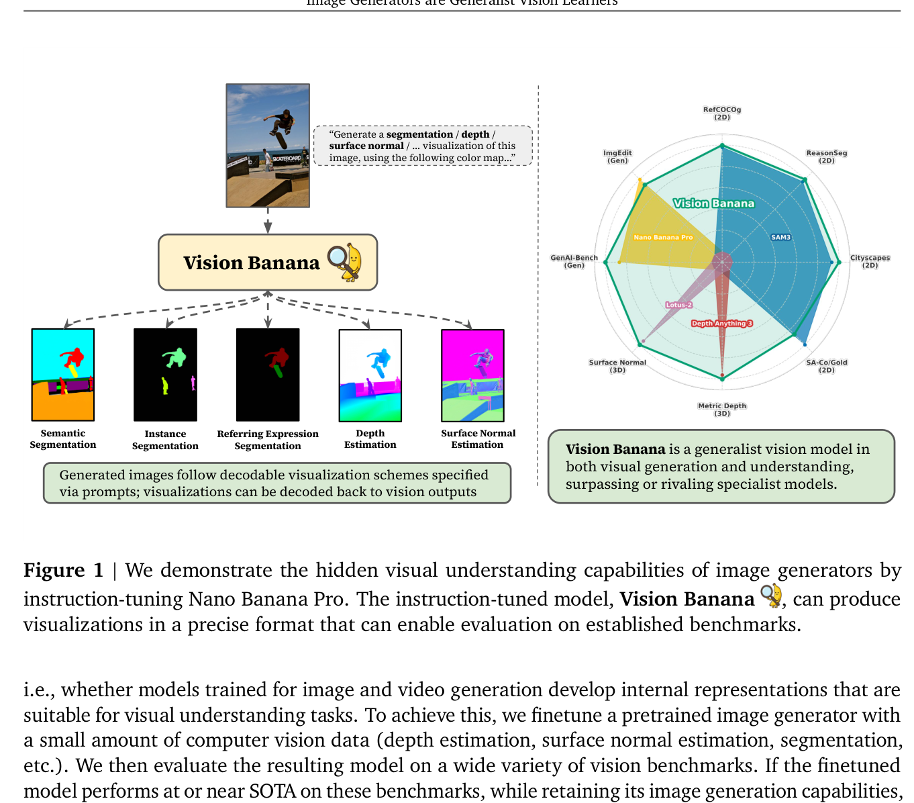

**图 1.** 我们通过对 Nano Banana Pro 做指令微调来揭示图像生成器内嵌的视觉理解能力。指令微调后的模型 Vision Banana 能以精确格式产出可视化结果，从而支持在标准基准上做定量评估。

This is not the first paper to use image and video generators as base models for visual understanding. Previous research observes that state-of-the-art image and video generators can generate visual content that look like RGB visualizations of computer vision outputs for tasks such as segmentation, depth estimation, and surface normal estimation (Wiedemer et al., 2025; Zuo et al., 2025). However, those methods do not provide state-of-the-art results on modern benchmarks. This is partially because these models don't strictly follow the prompts to produce vision outputs in the desired formats that can be decoded back to vision outputs for computing quantitative metrics. Other researchers (He et al., 2024, 2025; Ke et al., 2024; Wang et al., 2026b; Ye et al., 2024; Yu et al., 2024; Zhao et al., 2025) adapt the generation architectures by adding specialized modules and performing full-finetuning to achieve SOTA-level results on specific target tasks. Although these methods successfully leverage the understanding capabilities of the pre-trained features, they sacrifice the model's generality across other understanding and generation tasks.

本文并非首篇把图像/视频生成器当作视觉理解基模型的工作。前人观察到 SOTA 级生成器可以生成形如「分割、深度、法线」等计算机视觉输出的 RGB 可视化（Wiedemer et al., 2025；Zuo et al., 2025），但这些方法在现代基准上拿不到 SOTA——部分原因是模型不严格遵循提示，无法产出可解码回视觉输出、可用于定量评测的格式。另一些研究者（He et al., 2024, 2025；Ke et al., 2024；Wang et al., 2026b；Ye et al., 2024；Yu et al., 2024；Zhao et al., 2025）对生成架构做改造，加入任务专用模块并做全量微调，从而在特定目标任务上达到 SOTA；但这些方法虽然成功调用了预训练特征里的理解能力，却牺牲了模型在其他理解任务与生成任务上的通用性。

We take an approach motivated by recent advancements in large language models (LLMs). In natural language processing (NLP), generative pretraining (Brown et al., 2020; Chowdhery et al., 2023) is performed to produce base models, often referred to as LLMs, that are good at generating text, whereas instruction-tuning (Ouyang et al., 2022; Wei et al., 2021) guides them to follow specific tasks and produce text in requested formats and stay on the task. Analogously, we position a visual generative model as a "base" model and perform instruction-tuning to align the model to produce visual output in desired formats, in accordance with the prompts, as illustrated in Fig. 1. Specifically, the model is instructed to produce RGB images that can be decoded to computer vision outputs. Such instruction prompts and decodable visualization schemes are designed to bridge and calibrate the visual generations to formats where measurable metrics for benchmarking can be applied. For example, by prompting the model to "Segment the skateboard category in pure yellow (<255, 255, 0>)", we can easily parse the mask for skateboard by clustering pixels whose values are close to <255, 255, 0>. This strategy has three main advantages. First, it supports a wide variety of tasks with a single unified model – after instruction tuning, the weights are shared among all tasks, and only the prompt changes. Second, it requires relatively little new training data, since the instruction tuning is solely teaching the model how to format computer vision outputs as RGB. Third, it helps the model retain its original image generation capabilities, since the outputs are simply new RGB images.

我们采用一种受 LLM 最新进展启发的方法。在自然语言处理（NLP）中，生成式预训练（Brown et al., 2020；Chowdhery et al., 2023）用来产出基模型——通常称为 LLM——擅长生成文本；指令微调（Ouyang et al., 2022；Wei et al., 2021）则进一步引导它们遵循特定任务、按要求格式产出且保持在任务上。类比地，我们把视觉生成模型定位为「基」模型并做指令微调，使其按提示产出指定格式的视觉输出，如图 1 所示。具体地，模型被指令产出可解码回计算机视觉输出的 RGB 图像。这些指令提示与可解码可视化方案的设计目的，是把视觉生成对齐到能套用定量基准指标的格式。例如，给模型提示「把 skateboard 类别用纯黄 <255, 255, 0> 分割出来」，我们就能通过聚类与 <255, 255, 0> 相近的像素轻松解析出 skateboard 的掩膜。这套策略有三个主要优势。第一，单一统一模型支持多种任务——指令微调后所有任务共享权重，变化的只是提示。第二，新增训练数据需求较低，因为指令微调只在教模型如何把计算机视觉输出格式化为 RGB。第三，由于输出仍是 RGB 图像，模型能保留原生图像生成能力。

We present Vision Banana, a generalist vision model trained by performing a lightweight instruction-tuning to Nano Banana Pro on a mixture of its original image generation data and our additional vision task data. During evaluation across several benchmarks, we find that Visual Banana excels at both visual understanding and generation, as summarized in Tab. 1. On the understanding side, Vision Banana surpasses or matches state-of-the-art results on both 2D and 3D tasks. For example, it beats the highly specialized segmentation model, SAM 3 (Carion et al., 2025), on various segmentation tasks, and the 3D expert, Depth Anything 3 (Lin et al., 2025), on metric depth estimation. On the generation side, it performs on par with its base model on image generation and editing benchmarks. On GenAI-Bench (Li et al., 2024), Vision Banana scores a 53.5% win rate against its base model. On ImgEdit (Ye et al., 2025) for image editing, Vision Banana's win rate is 47.8%. Since these results are achieved with a single unified model built by a lightweight instruction-tuning on its base model, there is strong evidence that Nano Banana Pro already possessed internal representations for visual understanding, which only needed to be unlocked with instruction tuning.

我们提出 Vision Banana——通过对 Nano Banana Pro 在其原始图像生成数据与我们新增的视觉任务数据的混合上做轻量指令微调而得到的通用视觉模型。在若干基准上评测的结果（汇总于表 1）显示 Vision Banana 在视觉理解和生成两侧都表现卓越。理解侧：Vision Banana 在 2D 与 3D 任务上均超越或追平 SOTA——例如在多个分割任务上击败高度专科化的 SAM 3（Carion et al., 2025），在 metric depth 估计上击败 3D 专家 Depth Anything 3（Lin et al., 2025）。生成侧：在图像生成与编辑基准上与基模型持平。GenAI-Bench（Li et al., 2024）上对基模型胜率 53.5%；ImgEdit（Ye et al., 2025）图像编辑上胜率 47.8%。这些结果是用一个仅靠轻量指令微调构造的统一模型取得的，强烈表明 Nano Banana Pro 本就具备视觉理解所需的内部表征，指令微调只是把它「解锁」出来。

**Table 1.** The instruction-tuned Vision Banana model surpasses or rivals SOTA specialists across visual generation and understanding. For 2D visual understanding, it beats the highly specialized Segment Anything Model 3 (Carion et al., 2025) on 3 segmentation datasets, and is on par with DINO-X (Ren et al., 2024) on instance segmentation. For 3D visual understanding, it surpasses the best metric depth estimation expert, Depth Anything 3 (Lin et al., 2025), and the best surface normal estimation specialist, Lotus-2 (He et al., 2025). In visual generation, Vision Banana inherits its capabilities from Nano Banana Pro and is on par with it on text-to-image and image editing.

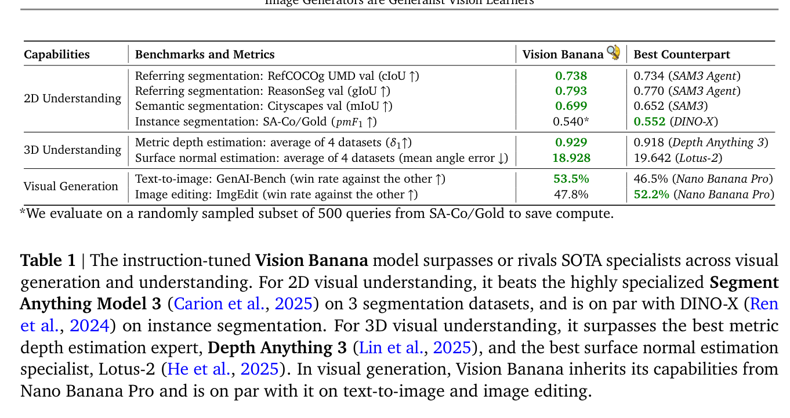

**表 1.** 指令微调后的 Vision Banana 在视觉生成与理解上同时超越或追平 SOTA 专科模型。2D 理解：在 3 个分割数据集上击败 SAM 3（Carion et al., 2025），实例分割与 DINO-X（Ren et al., 2024）打平。3D 理解：超过最强 metric depth 专家 Depth Anything 3（Lin et al., 2025）与最强 surface normal 专家 Lotus-2（He et al., 2025）。生成侧：继承自 Nano Banana Pro，在文生图与图像编辑上与其打平。

The implications of this study are two-fold. First, it suggests that image generators are indeed generalist vision learners under the hood, with generative vision pretraining playing a foundational role similar to language model pretraining. Second, it suggests that image generation can serve as a universal interface for unified visual understanding, mirroring the role of text generation in language understanding and reasoning. We could be witnessing a major paradigm shift for computer vision, where generative vision pretraining takes a central role in building Foundational Vision Models for both generation and understanding.

本研究的含义有两层。其一，图像生成器底层就是通用视觉学习器，生成式视觉预训练所扮演的基础性角色类似 LLM 预训练。其二，图像生成可作为统一视觉理解的通用接口，正如文本生成在语言理解与推理中的角色。我们可能正目睹计算机视觉的一次重大范式转变——生成式视觉预训练成为构建同时支持生成与理解的 Foundational Vision Models 的核心。

### 2. Method

**Instruction-tuning Nano Banana Pro.** Recent image and video generators have demonstrated zero-shot capabilities in generating visualizations of visual understanding tasks (Wiedemer et al., 2025; Zuo et al., 2025). To rigorously investigate and benchmark these capabilities, we need to align the models to generate visualizations that can be decoded back to visual task outputs for quantitative evaluation. For example, in metric depth estimation, a generated depth heatmap must be invertible back to physical depth values for quantitative assessment. Therefore, we create Vision Banana by instruction-tuning our base model, Nano Banana Pro, on a selection of vision tasks formatted in such invertible manners. Specifically, we mix vision task data into Nano Banana Pro's own training mixture at a very low ratio. This process allows us to align the model's emergent generative representations into measurable physical geometry and semantic labels, allowing our single generalist model to be evaluated alongside task-specific specialists.

**对 Nano Banana Pro 做指令微调。** 近期的图像/视频生成器已展示出在零样本设定下生成视觉理解任务可视化的能力（Wiedemer et al., 2025；Zuo et al., 2025）。要严格地研究并对这些能力做基准测试，需要把模型对齐到「生成的可视化可被解码回视觉任务输出」的形态，从而进行定量评测。例如 metric depth 估计中，生成的深度热图必须可逆回物理深度值才能定量评估。因此我们以「按可逆方式格式化的若干视觉任务」对基模型 Nano Banana Pro 做指令微调，得到 Vision Banana。具体做法是把视觉任务数据以非常低的比例混入 Nano Banana Pro 自身的训练 mixture。这样可把模型涌现出的生成表征对齐到可量度的物理几何与语义标签上，使我们这个单一通用模型可与任务专科模型同台评测。

Mixing the vision data at a low ratio serves as a lightweight instruction-tuning strategy, ensuring that our vision task alignment does not degrade the model's original generative priors. We validate the preservation of image generation capabilities by benchmarking Vision Banana against the base Nano Banana Pro on two tasks: text-to-image generation (GenAI-Bench (Li et al., 2024)) and image editing (ImgEdit (Ye et al., 2025)). In human evaluations, we obtain win rates of 53.5% and 47.8% respectively, indicating that Vision Banana successfully maintains the generative power of the base model. Qualitative comparisons in Fig. 9 (text-to-image generation) and Fig. 10 (image editing) further confirm that the outputs are highly similar between Vision Banana and Nano Banana Pro. These results verify that Vision Banana does not forget its generative nature.

低比例的数据混入是一种轻量指令微调策略，确保视觉任务对齐不破坏模型原有的生成先验。我们通过让 Vision Banana 与基模型 Nano Banana Pro 在两个任务上做基准比较来验证生成能力是否保留：文生图（GenAI-Bench，Li et al., 2024）与图像编辑（ImgEdit，Ye et al., 2025）。人评胜率分别为 53.5% 与 47.8%，表明 Vision Banana 成功保留了基模型的生成力。图 9（文生图）与图 10（图像编辑）的定性对比进一步确认 Vision Banana 与 Nano Banana Pro 输出高度相似。这些结果验证 Vision Banana 没有遗忘其生成本性。

**Vision Tasks and Data.** We evaluate our framework on two fundamental categories of visual understanding: 2D scene understanding and 3D structure inference. The 2D suite consists of referring expression, semantic, and instance segmentation, which collectively test the model's capability to ground natural language and segment the corresponding objects. For 3D understanding, we focus on monocular metric depth and surface normal estimation, which demand geometric reasoning and internal knowledge about object scales. To collect data for instruction tuning, we utilize in-house model annotations for web-crawled 2D images, as well as synthetic data from rendering engines for 3D tasks. Crucially, no training data from our evaluation benchmarks is included in the instruction-tuning mixture, ensuring that our results reflect true generalist capability.

**视觉任务与数据。** 我们在两大视觉理解类别上评估本框架：2D 场景理解与 3D 结构推断。2D 套件包含指代表达分割（referring expression segmentation）、语义分割与实例分割，整体上考察模型 ground 自然语言并分割对应物体的能力。3D 理解侧聚焦单目 metric depth 与表面法线估计，二者要求几何推理与对物体尺度的内部知识。指令微调数据：2D 用内部模型对网络爬取的图像做标注；3D 用渲染引擎生成的合成数据。关键地，指令微调 mixture 中不包含任何评测基准的训练集数据，确保结果反映真实的通用能力。

### 3. Vision Banana — Generalist Vision Model from Image Generator

In this section, we present qualitative and quantitative assessments compared to task-specific specialist models. Built upon an image generator, Vision Banana achieves SOTA-level results across a broad range of visual understanding tasks, without specialized architectures or custom training losses.

本节给出与任务专科模型的定性、定量对比。基于一个图像生成器，Vision Banana 在广泛的视觉理解任务上达到 SOTA 级别——无须专用架构、也无须自定义训练损失。

#### 3.1. 2D Semantic Understanding

Image segmentation stands as a cornerstone of visual understanding, traditionally requiring complex, task-specific models to parse pixels into semantic categories or object instances. Current leading methods such as the Segment Anything series (Carion et al., 2025; Kirillov et al., 2023; Ravi et al., 2024) tackle this through heavy architectural specialization and large volumes of expensive, human-annotated mask data. Vision Banana challenges this prevailing paradigm by demonstrating that SOTA segmentation can naturally emerge from an image generation model. Rather than training on vast amounts of meticulously crafted segmentation examples, we tap into the rich representations learned by the base image generation model. By instructing the model to generate multi-colored images of segmentation masks, we obtain dense segmentation maps from which individual masks can be decoded, therefore enabling segmentation through image generation. As detailed in Tab. 2, this elegant generative approach outperforms highly tuned specialist models, achieving SOTA zero-shot transfer performance on three of the four evaluated datasets.

图像分割是视觉理解的基石，传统上需要复杂的任务专用模型把像素解析为语义类别或物体实例。当前领先方法（Segment Anything 系列：Carion et al., 2025；Kirillov et al., 2023；Ravi et al., 2024）依靠厚重的架构专用化与海量高成本的人工标注掩膜数据来攻克分割问题。Vision Banana 挑战这一主流范式，证明 SOTA 分割可以自然地从图像生成模型中涌现。我们不在大量精心设计的分割样本上训练，而是直接调用基图像生成模型已学到的丰富表征：通过指令模型生成多色分割掩膜图像，得到稠密分割图，从中可解码出各个独立掩膜——从而把分割改写为图像生成。如表 2 所示，这一简洁的生成式方案在 4 个评测数据集中的 3 个上超越精心调校的专科模型，达到零样本迁移 SOTA。

**Table 2.** Vision-Banana compared with state-of-the-art methods on various segmentation datasets. We mainly compare with other methods that have not been trained on in-domain data, i.e., the training splits of these benchmarks. We denote them as "Zero-Shot Transfer" in the table. The usage of this term follows Segment Anything (Kirillov et al., 2023) and CLIP (Radford et al., 2021). Non zero-shot transfer methods are marked in gray. *: On SA-Co/Gold, we evaluate our method on 500 randomly sampled queries. On ReasonSeg, methods are paired with multimodal LLMs for reasoning. We use Gemini 2.5 Pro in our case. References of previous methods are in the main text.

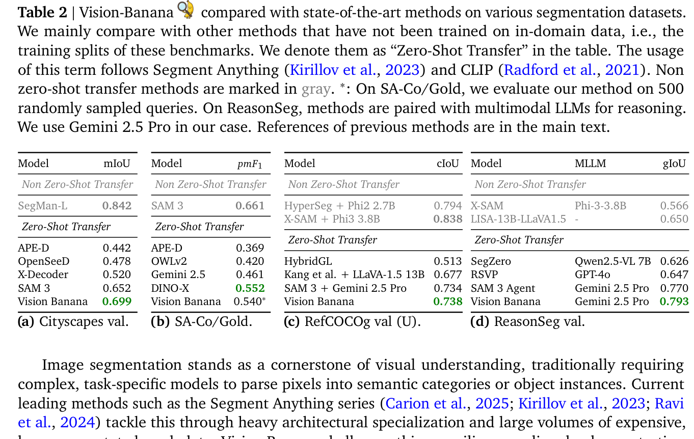

**表 2.** Vision-Banana 与多种分割数据集上 SOTA 方法的对比。我们主要与未在数据集训练 split 上训练过的方法对比——表中标作「Zero-Shot Transfer」，沿用 Segment Anything（Kirillov et al., 2023）与 CLIP（Radford et al., 2021）的用法。非零样本迁移方法用灰色标注。*：在 SA-Co/Gold 上我们仅在 500 条随机采样查询上评测。在 ReasonSeg 上，各方法都与多模态 LLM 配对做推理，本文搭配 Gemini 2.5 Pro。前人方法的引用见正文。

**Semantic Segmentation.** Historically, the task "semantic segmentation" is to classify each pixel into one of the predefined categories, without distinguishing instances of the same category. For example, Cityscapes (Cordts et al., 2016) has 19 classes, including road, person, truck, vegetation, sky, and more. It is worth noting that advanced tasks of "instance / referral expression" segmentation are also semantic. Here, we use "semantic segmentation" strictly to refer to the traditional, instance-agnostic, category-level classification task. In our case, this nature of the classical semantic segmentation task can be specified via the prompt, and we train the model to follow such instructions. We prompt the model to generate a visualization image where each pixel is colored according to its class, as shown in Fig. 2. Note that the class can be any text string, not limited to a fixed set. The color for each class is specified in the prompt. We can use natural language to describe the correspondence. We can also use a mapping notation such as JSON. The color can be represented as hex numbers or RGB value tuples. In evaluation, we assign pixels to classes by matching its color according to the prompt.

**语义分割。** 历史上「语义分割」任务是把每个像素分类到预定义类别之一，不区分同类的不同实例。例如 Cityscapes（Cordts et al., 2016）有 19 类，包括 road、person、truck、vegetation、sky 等。值得注意的是，「实例分割／指代表达分割」等更进阶任务也是语义性的；这里我们把「语义分割」严格用作传统的、不区分实例的类别级分类任务。在我们的方案里，经典语义分割任务的这一性质可通过提示指定，我们训练模型遵循这类指令——即让模型按图 2 所示生成一张「每像素按类着色」的可视化图。类别可以是任意文本字符串，不限固定集合；每类的颜色在提示中指定，可以用自然语言描述对应关系，也可以用 JSON 之类的映射记法；颜色可表示为十六进制数或 RGB 元组。评测时按提示中的颜色映射，将像素归类。

We compare Vision Banana with existing methods (Carion et al., 2025; Fu et al., 2025; Shen et al., 2024; Zhang et al., 2023; Zou et al., 2023) in Tab. 2a. On Cityscapes (Cordts et al., 2016), Vision Banana surpasses SAM 3 by 4.7 points in mIoU and is the best open vocabulary model, narrowing the gap with closed-set models such as SegMan (Fu et al., 2025).

我们在表 2a 中将 Vision Banana 与现有方法（Carion et al., 2025；Fu et al., 2025；Shen et al., 2024；Zhang et al., 2023；Zou et al., 2023）对比。在 Cityscapes（Cordts et al., 2016）上，Vision Banana 的 mIoU 比 SAM 3 高 4.7 个点，是最佳的开放词表模型，缩小了与 SegMan（Fu et al., 2025）等闭集模型的差距。

**Figure 2.** Vision Banana can perform semantic segmentation, following the instruction prompts. It handles various prompting styles. It can also segment anything specified via text prompts, from single-word nouns to phrases. It produces segmentation mask at fine-grained granularity, for example, the cats' whiskers in Example 1 (middle).

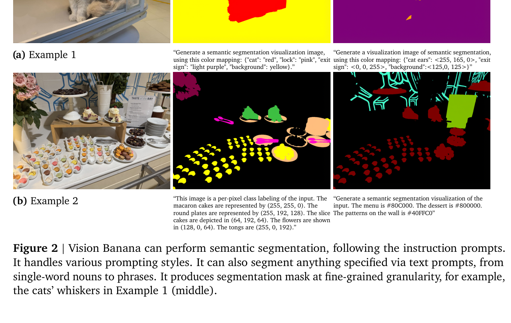

**图 2.** Vision Banana 能依照指令提示做语义分割，支持多种提示风格；可以分割任何文本提示指定的目标——从单词到短语；并能产出细粒度的分割掩膜，例如 Example 1（中间）中两只猫的胡须。

**Instance Segmentation.** Unlike semantic segmentation, instance segmentation requires the model to distinguish between individual objects that belong to the same class. For example, if an image contains five dogs, we expect the model to produce an individual mask for each distinct animal. This poses a unique challenge for Vision Banana: since the number of instances is unknown in advance, we cannot assign the colors in the prompt. To address this, we adopt a per-class inference strategy. For each inference, we instruct Vision Banana to produce segmentation masks for only one class, allowing the model to dynamically assign colors to different instances. Examples of instance segmentation are shown in Fig. 3. During evaluation, we simply cluster pixels that have similar colors by thresholding.

**实例分割。** 与语义分割不同，实例分割要求模型区分同类的不同物体——例如图中有五只狗，模型须为每只狗输出独立掩膜。这对 Vision Banana 是独特挑战：由于实例数事先未知，我们无法在提示里预先指定颜色。我们的解决方案是按类逐次推理——每次推理只让 Vision Banana 为一个类别产出分割掩膜，模型动态为不同实例分配颜色。实例分割示例见图 3。评测时只需通过阈值聚类相近颜色的像素即可。

We evaluated our model on SA-Co/Gold (Carion et al., 2025) using the $pmF_1$ metric, summarizing results in Tab. 2b. Compared with SAM 3, Vision Banana still lags behind in instance segmentation on SA-Co/Gold, highlighting some challenges in this task. Note that unlike SAM 3, we did not include SA-Co in our model's training data. Under the zero-shot transfer setting, Vision Banana surpasses many existing methods, including Gemini 2.5 (Gemini Team, 2025) ($pmF_1 = 0.461$), APE-D (Shen et al., 2024) ($pmF_1 = 0.369$), and OWLv2 (Minderer et al., 2023) ($pmF_1 = 0.420$). Vision Banana is on par with DINO-X (Ren et al., 2024) ($pmF_1$ score 0.540 v.s. 0.552).

我们在 SA-Co/Gold（Carion et al., 2025）上以 $pmF_1$ 指标评测，结果汇总于表 2b。与 SAM 3 相比，Vision Banana 在 SA-Co/Gold 上的实例分割仍有差距，说明这一任务存在挑战。注意：与 SAM 3 不同，我们的训练数据并未包含 SA-Co。在零样本迁移设定下，Vision Banana 超过许多现有方法，包括 Gemini 2.5（Gemini Team, 2025，$pmF_1 = 0.461$）、APE-D（Shen et al., 2024，$pmF_1 = 0.369$）、OWLv2（Minderer et al., 2023，$pmF_1 = 0.420$），与 DINO-X（Ren et al., 2024）打平（$pmF_1$ 0.540 vs 0.552）。

**Figure 3.** Vision Banana can perform instance segmentation, one class at a time. It renders different instances with different colors. It can understand the nuanced concept in language as well.

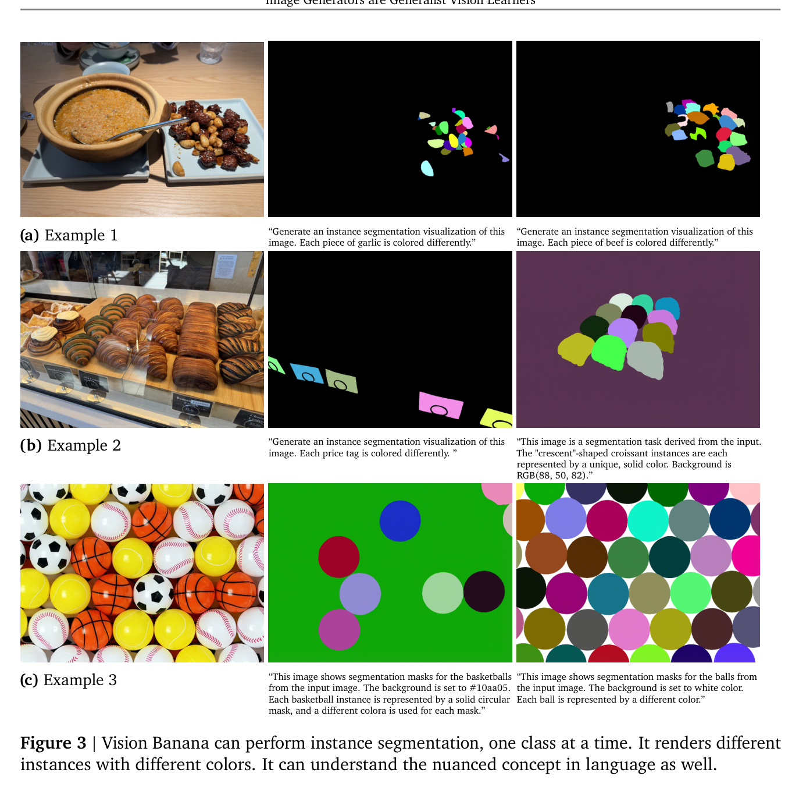

**图 3.** Vision Banana 按类逐次完成实例分割，把同类不同实例渲染为不同颜色，并能理解语言中的细微概念。

**Referring Expression Segmentation.** Unlike traditional fixed-class segmentation, referring expression segmentation is based on free-form text queries. This requires models to comprehend and reason the nuanced natural language expressions, as well as understand complex relationships among objects. Vision Banana is a natural fit for this task and establishes a new state-of-the-art. As summarized in Tab. 2c and Tab. 2d, it achieves a cIoU of 0.738 on RefCOCOg UMD (Kazemzadeh et al., 2014) and an IoU of 0.793 on ReasonSeg (Lai et al., 2024), outperforming SAM 3 Agent (Carion et al., 2025) and other previous works under the zero-shot transfer setting, including HybridGL (Liu and Li, 2025), Kang et al. (2025), SegZero (Liu et al., 2025), and RSVP (Lu et al., 2025). On RefCOCOg, there is still some gap from methods that are trained on the training split, including HyperSeg (Wei et al., 2024) and X-SAM (Wang et al., 2026a). On ReasonSeg, Vision Banana + Gemini 2.5 Pro even beats methods that are not zero-shot, such as X-SAM (Wang et al., 2026a) and LISA (Lai et al., 2024). Fig. 4 shows qualitative examples of various referring expression segmentation. This success highlights a key advantage of our approach: the multimodal intelligence inherited from generative pre-training allows Vision Banana to reason about "what" to segment more effectively than discriminative models.

**指代表达分割。** 与传统的固定类别分割不同，指代表达分割基于自由形式的文本查询，要求模型理解并推理细微的自然语言表达，以及把握物体间的复杂关系。Vision Banana 天然适合这一任务，并刷新了 SOTA。如表 2c 与表 2d 所汇总，它在 RefCOCOg UMD（Kazemzadeh et al., 2014）上达到 cIoU 0.738，在 ReasonSeg（Lai et al., 2024）上达到 IoU 0.793，在零样本迁移设定下超过 SAM 3 Agent（Carion et al., 2025）以及包括 HybridGL（Liu and Li, 2025）、Kang et al. (2025)、SegZero（Liu et al., 2025）、RSVP（Lu et al., 2025）在内的多个前人工作。在 RefCOCOg 上，相比于在训练 split 上训练的 HyperSeg（Wei et al., 2024）与 X-SAM（Wang et al., 2026a）仍有一定差距。在 ReasonSeg 上，Vision Banana + Gemini 2.5 Pro 甚至击败了非零样本的 X-SAM（Wang et al., 2026a）与 LISA（Lai et al., 2024）。图 4 展示了若干指代表达分割的定性结果。这一成功凸显了本方案的关键优势：从生成式预训练中继承的多模态智能，让 Vision Banana 比判别式模型更有效地推理「该分割什么」。

**Figure 4.** Vision Banana can understand natural language prompts and reason about them, including but not limited to: (a) description of objects' appearances ("man in pink t shirt"); (b) description of actions ("stretching" and "cleaning"); (c) objects that have uncommon usage (toaster as a game controller); (d) multilingual text content (text on the menu in Chinese and English). This requires strong and comprehensive visual understanding capability.

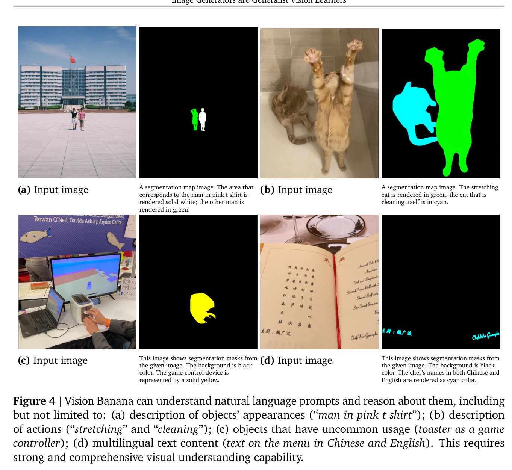

**图 4.** Vision Banana 能理解并推理自然语言提示，包括但不限于：(a) 物体外观描述（「穿粉色 T 恤的男人」）；(b) 动作描述（「stretching」与「cleaning」）；(c) 物体的非常规用途（把烤面包机当游戏手柄）；(d) 多语言文本内容（菜单上中英文混合）。这要求强而全面的视觉理解能力。

Interestingly, Vision Banana also demonstrates a similar mastery of referring expressions on semantic and instance segmentation, despite not being explicitly trained to condition these specific tasks on free-form text queries. For example, in Fig. 2b (right), the model understands what "patterns on the wall" is referring to. In Fig. 3b (right), the model successfully distinguishes crescent-shaped croissants from other variations of croissants. These observations suggest robust cross-task transfers in Vision Banana.

有意思的是，Vision Banana 在语义分割与实例分割任务上同样表现出对指代表达的精熟，尽管这两类任务并未被显式训练为以自由文本查询为条件。例如图 2b（右）中，模型理解了「patterns on the wall」指的是什么；图 3b（右）中，模型成功把月牙形可颂从其他形状的可颂中区分出来。这些观察表明 Vision Banana 具有稳健的跨任务迁移能力。

#### 3.2. 3D Understanding from Monocular Images

Vision Banana demonstrates a strong ability to infer 3D structures from 2D monocular images. We evaluate this capability on two classical tasks: monocular metric depth estimation and surface normal estimation. As summarized in Tab. 1, Vision Banana achieves SOTA performance on both tasks, surpassing specialists such as Depth Anything V3 (Lin et al., 2025) and Lotus-2 (He et al., 2025).

Vision Banana 表现出从 2D 单目图像推断 3D 结构的强能力。我们在两个经典任务上评测这一能力：单目 metric depth 估计与表面法线估计。如表 1 所汇总，Vision Banana 在两个任务上都达到 SOTA，超过 Depth Anything V3（Lin et al., 2025）与 Lotus-2（He et al., 2025）等专科模型。

**Metric Depth Estimation.** The goal of depth estimation is to produce a depth map from a monocular image, where each pixel's value represents the physical metric distance from the camera plane to the observed object (Eigen et al., 2014). This is a fundamental computer vision task that benefits a wide range of applications such as robotics, augmented/virtual reality, and autonomous driving. However, depth estimation is inherently ill-posed, as 2D projections inherently discard critical 3D geometric information. Furthermore, monocular depth estimation is particularly challenging due to the absence of parallax cues available in multi-view setups, even when camera intrinsic parameters are known.

**Metric Depth 估计。** 深度估计的目标是从单目图像产出深度图——每个像素值代表从相机平面到被观测物体的物理米尺度距离（Eigen et al., 2014）。这是一项基础的计算机视觉任务，在机器人、AR/VR、自动驾驶等领域应用广泛。然而深度估计本身是病态问题——2D 投影本身就抛弃了关键的 3D 几何信息；单目深度估计更难，因为它缺失多视角设定中可用的视差线索，即使相机内参已知亦然。

In the deep-learning era, the research community has largely framed depth estimation as a dense per-pixel supervised regression problem, employing specialized architectures and domain-specific loss functions. Most recent SOTA methods rely on camera intrinsics during training, inference, or both (Bochkovskii et al., 2024; Cai et al., 2025; He et al., 2024, 2025; Hu et al., 2024; Lin et al., 2025; Piccinelli et al., 2025a,b; Wang et al., 2025b,c; Yang et al., 2024). While using intrinsics mitigates the inherent ambiguity of depth estimation, it also necessitates specialized model designs. In contrast, our work is predicated on the hypothesis that the mode-seeking nature of generative modeling naturally resolves training target ambiguities, thereby eliminating the need for such specialized techniques. Furthermore, the broad world knowledge acquired during pretraining endows the model with stronger priors on object sizes and distances compared to narrowly targeted models. To enable Nano Banana Pro to estimate depth in metric units, we instruct the model to output a carefully constructed false-color visualization of depth values.

在深度学习时代，研究社区大多把深度估计建模为稠密逐像素有监督回归问题，使用专用架构与领域定制损失。多数近期 SOTA 方法在训练、推理或两者都依赖相机内参（Bochkovskii et al., 2024；Cai et al., 2025；He et al., 2024, 2025；Hu et al., 2024；Lin et al., 2025；Piccinelli et al., 2025a,b；Wang et al., 2025b,c；Yang et al., 2024）。使用内参确实缓解了深度估计的固有歧义，但也催生了专用模型设计。我们的工作建立在另一个假设上：生成式建模的 mode-seeking 特性天然解决训练目标的歧义，从而无须这些专用技术。此外，预训练习得的广博世界知识赋予模型更强的物体尺度与距离先验——优于狭义目标的模型。为让 Nano Banana Pro 以米尺度估计深度，我们指令模型输出一种精心构造的伪彩色深度可视化。

To visualize depth maps as RGB images, we establish a mapping between unbounded depth values in $[0, \infty)$ and bounded RGB values in $[0, 1]^3$. Because the utility of accurate metric depth for nearby image content is generally higher than that of distant content (e.g., graspable objects matter more for robotics tasks, stereo/monodepth benchmarks usually measure accuracy terms of disparity or relative/log-depth) we "curve" metric depth prior to RGB encoding. Specifically, this is achieved by first applying the power transform of Barron (2025) to warp the depth values, and then using those curved distances to produce a false-color visualization. We constrain the power transform to $\lambda < -1$ and rescale it to map metric distances $d \in [0, \infty)$ to normalized distances in $[0, 1)$:

要把深度图可视化为 RGB 图像，我们需要在无界深度 $[0, \infty)$ 与有界 RGB $[0, 1]^3$ 之间建立映射。由于近场内容的精确 metric depth 通常比远场内容更有用（例如机器人任务中可抓取物体更重要；stereo/单目深度基准通常以视差或相对/log 深度衡量精度），我们在 RGB 编码前对 metric depth 做「曲化」。具体做法是先用 Barron (2025) 的 power transform 翘曲深度值，再用这些曲化后的距离生成伪彩色可视化。我们将 power transform 约束为 $\lambda < -1$，并重新缩放使其将 metric 距离 $d \in [0, \infty)$ 映射到归一化距离 $[0, 1)$：

$$
f(d, \lambda, c) = 1 - (1 - d/\lambda c)^{\lambda+1} \quad (1)
$$

In all experiments, we set the shape parameter to $\lambda = -3$ and the scale parameter to $c = 10/3$. These curved and normalized distances $f(d, \lambda, c)$ are then used to interpolate along a piecewise-linear function that follows the edges of the RGB cube, traversing along its edges from black to white, similarly to the first iteration of a 3D Hilbert curve. A visualization of this process is provided in Fig. 5.

所有实验中我们将形状参数设为 $\lambda = -3$、尺度参数设为 $c = 10/3$。曲化并归一化后的距离 $f(d, \lambda, c)$ 用于沿 RGB 立方体边缘做分段线性插值，从黑到白沿立方体边遍历——类似 3D Hilbert 曲线的第一阶迭代。这一过程的可视化见图 5。

This mapping from normalized distance to RGB color can be inverted by simply projecting the RGB values onto the nearest line segment and then inverting the linear interpolation along the cube's edges. Because both the false-color visualization and the power transform are strictly invertible, their composition forms a bijection between metric depth in $[0, \infty]$ and RGB space in $[0, 1]^3$. During training, we apply this mapping to ground-truth metric depths to generate RGB training targets. At inference, we apply the inverse mapping to decode the model's generated RGB images back into metric depth, enabling direction evaluation on standard depth benchmarks. To enhance the model's robustness across diverse color representations, we augment our training data with alternative color maps, such as Plasma, Inferno, Viridis, and grayscale.

这一从归一化距离到 RGB 颜色的映射可以被反演：把 RGB 值投影到最近的线段，再沿立方体边缘反演线性插值即可。由于伪彩色可视化与 power transform 都是严格可逆的，其复合在 metric depth $[0, \infty]$ 与 RGB 空间 $[0, 1]^3$ 之间形成双射。训练时，我们将该映射作用于 ground-truth metric depth，生成 RGB 训练目标；推理时，我们用反映射把模型生成的 RGB 图像解码回 metric depth，从而可在标准深度基准上直接评测。为增强模型对多种颜色表达的鲁棒性，我们在训练数据中增广了 Plasma、Inferno、Viridis、灰度等替代色映射。

**Figure 5.** A visualization of our bijection between scalar metric distances $d \geq 0$ and RGB color values in $[0, 1]^3$, which is achieved by curving metric depth with a power transform, and then interpolating along the edges of the color cube according to that curved metric depth. The metric depth values (in meters) corresponding to various RGB colors are overlaid.

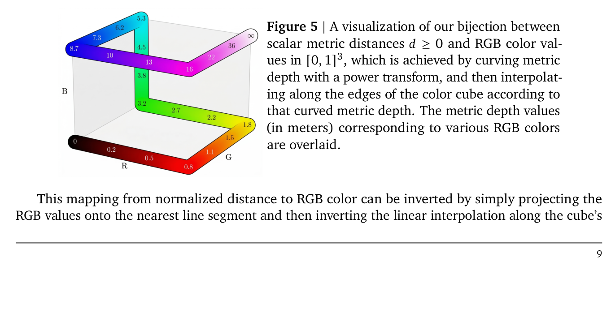

**图 5.** 标量 metric 距离 $d \geq 0$ 与 RGB 颜色值 $[0, 1]^3$ 之间双射的可视化：先用 power transform 曲化 metric depth，再沿色彩立方体边缘按曲化后的 metric depth 做插值。各 RGB 颜色对应的 metric depth 值（米）叠加在图上。

**Table 3.** Monocular metric depth estimation under the zero-shot transfer setting. Vision Banana achieves superior results on public datasets without using camera intrinsics in neither training of inference. Metrics marked with ↑ are better if higher; metrics marked with ↓ are better if lower.

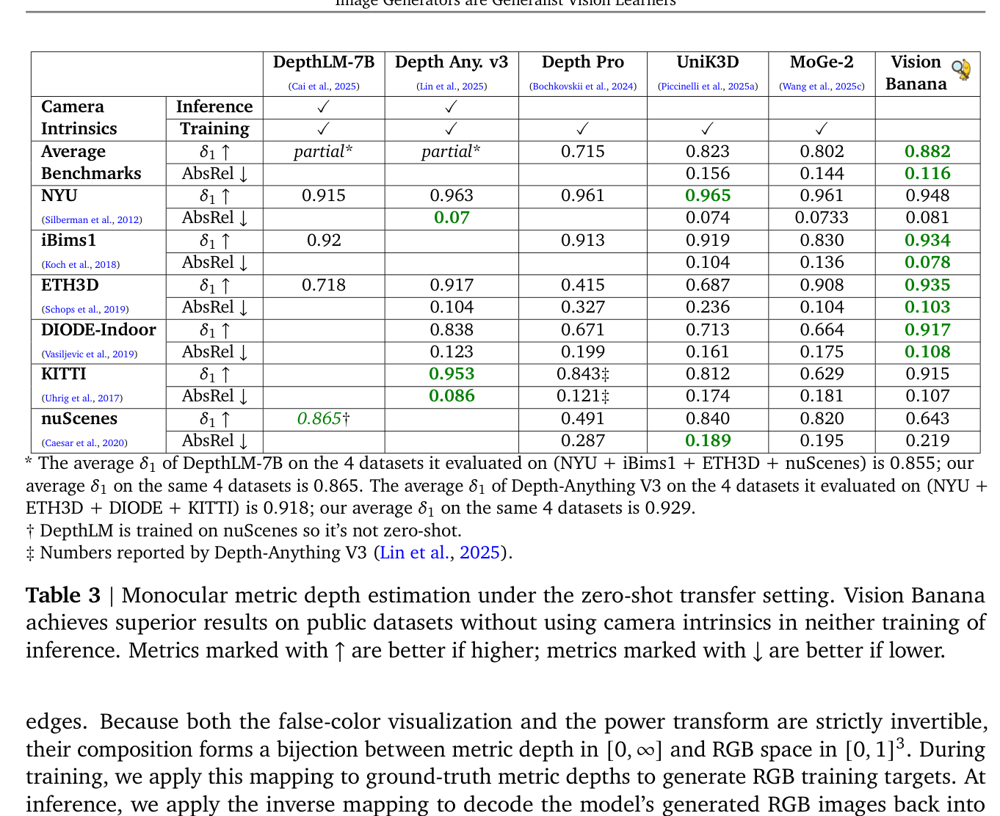

**表 3.** 零样本迁移设定下的单目 metric depth 估计。Vision Banana 在公开数据集上取得最优结果，且在训练与推理中均不使用相机内参。↑ 表示越高越好，↓ 表示越低越好。

Tab. 3 presents the empirical results of Vision Banana compared to specialist models across six major academic benchmarks. Vision Banana achieves an average $\delta_1$ accuracy of 0.882, outperforming Unik3D (Piccinelli et al., 2025a) by nearly 6 points, while achieving a 20% lower absolute relative error (AbsRel) compared to MoGe-2 (Wang et al., 2025c). Notably, Vision Banana outperforms Depth Anything V3 (Lin et al., 2025) on average across the four datasets (NYU, ETH3D, DIODE, KITTI) on which it was evaluated (0.929 v.s. 0.918), demonstrating robust performance in both near-field and distant scenes. Our model is trained entirely on synthetic depth data created from simulation engines — we use zero real-world depth data, and exclude training data from any of the depth datasets we evaluate on. Note that this result is achieved without relying on camera parameters (neither intrinsics nor extrinsics) during both training or inference. By leveraging the immense geometric priors embedded in its foundation model, Vision Banana infers absolute scale solely from visual cues and object relationships, enabling zero-shot generalization to any arbitrary input image.

表 3 给出 Vision Banana 与专科模型在六个主要学术基准上的实证对比。Vision Banana 取得平均 $\delta_1$ 精度 0.882，比 Unik3D（Piccinelli et al., 2025a）高近 6 个点；绝对相对误差（AbsRel）比 MoGe-2（Wang et al., 2025c）低 20%。值得一提的是，在 Depth Anything V3（Lin et al., 2025）评测过的四个数据集（NYU、ETH3D、DIODE、KITTI）上，Vision Banana 平均表现更优（0.929 vs 0.918），证明其在近场与远场场景中都稳健。我们的模型完全在仿真引擎生成的合成深度数据上训练——零真实世界深度数据，且排除了所评测任何深度数据集的训练数据。注意，这一结果是在训练与推理过程都不依赖相机参数（既无内参也无外参）下取得的。借助基模型内嵌的庞大几何先验，Vision Banana 仅从视觉线索与物体关系推断绝对尺度，实现对任意输入图像的零样本泛化。

Qualitative inspections further validate the model's capabilities. As illustrated in Fig. 6, Vision Banana generates highly precise depth maps that preserve crisp geometric details, even in cluttered environments like classrooms. When these 2D predictions are unprojected into 3D point clouds, they exhibit global consistency across diverse scenes, maintaining accurate planar surfaces and correct geometry. In addition to common academic benchmarks, we also conducted a "vibe test" using a casual smartphone photograph, as shown in Fig. 7. Crossed validated by depth measured on Google Maps, Vision Banana successfully produced an accurate depth estimation on this photo captured by a consumer device unseen during training.

定性检查进一步印证模型能力。如图 6 所示，Vision Banana 即便在教室等杂乱环境中也能产出精确深度图、保留清晰几何细节；将这些 2D 预测反投影为 3D 点云时，多种场景下展现出全局一致性，保持准确的平面与正确几何。除常用学术基准外，我们还做了一次「vibe test」——用一张随手拍的智能手机照片测试，如图 7。在 Google Maps 测量距离的交叉验证下，Vision Banana 在这张训练时未见过的消费级设备照片上也成功给出准确深度。

**Figure 6.** Demonstration of Vision Banana's metric depth estimation capabilities. The two columns to the left are the input images and the depth visualization image generated by Vision Banana. The depth images are then decoded back to metric depth values. Combining them with the camera intrinsics, we can reconstruct the 3D scene accurately. The two columns on the right are random views of the reconstructed scenes. Note that camera intrinsics are not needed in predicting the depth itself. Samples taken from NYU v2 (Silberman et al., 2012) and ETH 3D (Schops et al., 2019).

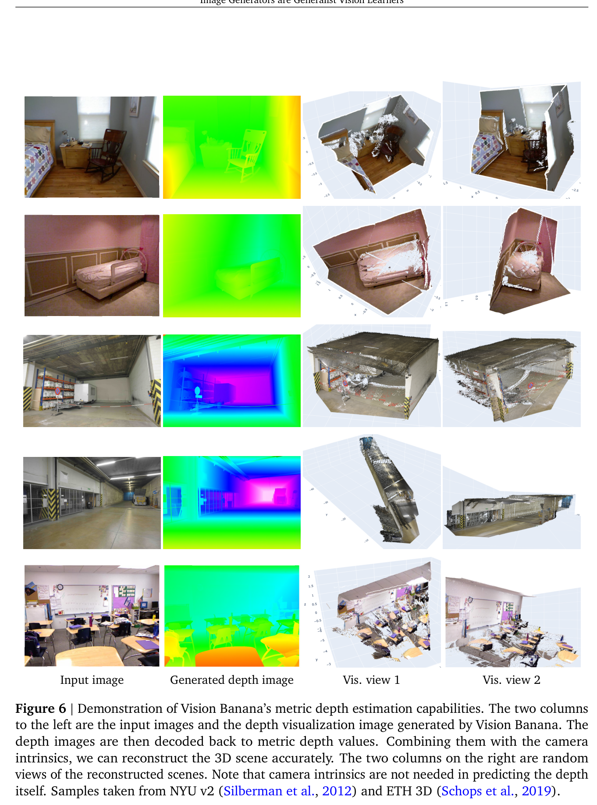

**图 6.** Vision Banana 的 metric depth 估计能力演示。左侧两列分别是输入图像与 Vision Banana 生成的深度可视化图像；深度图像可解码回 metric depth 值，结合相机内参就能精确重建 3D 场景。右侧两列是重建场景的随机视角。注意：预测深度本身不需要相机内参。样本来自 NYU v2（Silberman et al., 2012）与 ETH 3D（Schops et al., 2019）。

**Figure 7.** Vision Banana depth estimation in the wild. (a) Author of this paper takes a picture near Kinkaku-Ji with a consumer cell-phone. (b) Vision Banana generates a depth estimation image. The depth value at the position marked by a green star is decoded to be 13.71 meters. (c) Author then measures the actual distance using Google Map, which turns out to be 12.87 meters. The AbsRel error at this point is around 0.065.

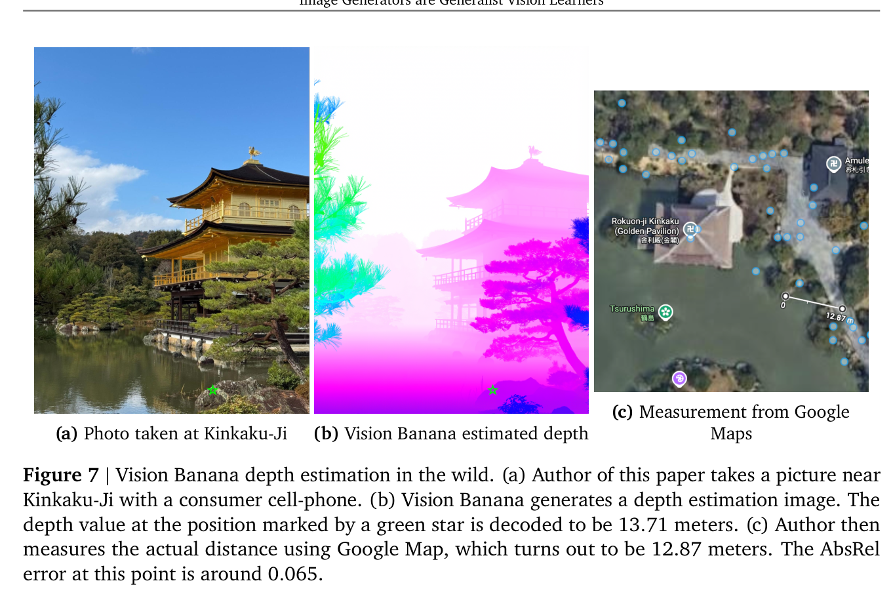

**图 7.** 野外 Vision Banana 深度估计。(a) 作者用消费级手机在金阁寺附近拍了一张照片。(b) Vision Banana 生成深度估计图像；绿色星标位置解码出的深度值为 13.71 米。(c) 作者随后用 Google Map 测出实际距离 12.87 米——该点 AbsRel 误差约 0.065。

**Surface Normal Estimation.** Surface normal estimation represents another critical vision task. Surface normals, which are unit vectors $(x, y, z)$ with values ranging from $-1.0$ to $1.0$, serve as a critical proxy for local geometry and scene structures. Unlike the complex color mapping required for metric depth, the visualization of surface normals is intrinsically aligned with the RGB color space, allowing straightforward integration into our model.

**表面法线估计。** 表面法线估计是另一关键视觉任务。法线是取值范围 $-1.0$ 到 $1.0$ 的单位向量 $(x, y, z)$，是局部几何与场景结构的关键代理。与 metric depth 所需的复杂色彩映射不同，表面法线的可视化天然与 RGB 色彩空间对齐，可直接接入我们的模型。

We specifically utilize a camera-space normal formulation using the standard right-handed coordinate system (+x right, +y up, +z pointing out of the image plane). In this representation, the directional vector components map directly to RGB channels:

我们采用相机空间的法线表示，沿用标准右手坐标系（+x 向右，+y 向上，+z 指向图像平面外）。在该表示中，方向向量分量直接映射到 RGB 通道：

- Facing Left $(-1, 0, 0)$: Encoded as Pinkish Red.
- Facing Up $(0, 1, 0)$: Encoded as Light Green.
- Facing the Camera $(0, 0, 1)$: Encoded as Light Blue/Purple.

- 朝左 $(-1, 0, 0)$：编码为粉红色。
- 朝上 $(0, 1, 0)$：编码为浅绿色。
- 正对相机 $(0, 0, 1)$：编码为浅蓝/紫色。

Table 4 compares Vision Banana against SOTA specialist methods on four public benchmarks. When averaged across the three indoor datasets, Vision Banana achieves the lowest mean and median angular errors. It also demonstrates competitive accuracy on outdoor scenes.

表 4 在四个公开基准上将 Vision Banana 与 SOTA 专科方法对比。在三个室内数据集上平均，Vision Banana 取得最低的平均与中位角误差；在户外场景上也具竞争力。

**Table 4.** Surface normal estimation results. Vision Banana achieves the lowest mean and median angle errors on the indoor datasets on average, and is on par with previous SOTA on outdoor scenes.

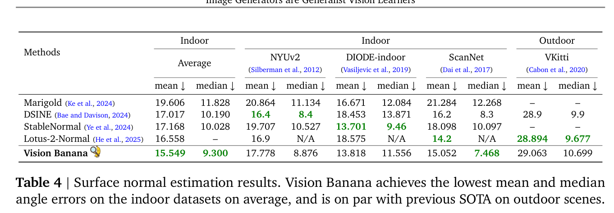

**表 4.** 表面法线估计结果。Vision Banana 在室内数据集平均上取得最低 mean 与 median 角误差，户外场景与前序 SOTA 持平。

Figure 8 visually compares the output from Vision Banana with the leading external method, Lotus-2 (He et al., 2025). Vision Banana consistently produces surface normal maps with significantly higher fidelity and finer granular details. The bottom row of Fig. 8 highlights a sample from Virtual KITTI 2 (Cabon et al., 2020). Although Vision Banana registers slightly higher quantitative errors on this benchmark compared to Lotus-2, it yields demonstrably superior visual quality. Also note that Lotus-2 is trained on Virtual KITTI 2 for surface normal estimation, whereas Vision Banana maintains a strict zero-shot transfer protocol, having never seen the training sets of any evaluated benchmarks.

图 8 将 Vision Banana 输出与领先的外部方法 Lotus-2（He et al., 2025）做可视化对比。Vision Banana 一贯产出保真度显著更高、细粒度细节更丰富的法线图。图 8 底行突出展示了 Virtual KITTI 2（Cabon et al., 2020）的一个样本：尽管该基准上 Vision Banana 的定量误差略高于 Lotus-2，但其可视质量明显更优。另外，Lotus-2 是在 Virtual KITTI 2 上训练做法线估计的，而 Vision Banana 严格遵循零样本迁移协议，从未见过任何被评测基准的训练集。

**Figure 8.** Comparison with SOTA surface normal estimation method Lotus-2 (He et al., 2025). Results of Lotus-2 are obtained using its Hugging-Face demo: https://huggingface.co/spaces/haodongli/Lotus-2_Normal. Vision Banana can produce surface normal map with much higher visual quality and better fine-grained details. Zoom-in for the details.

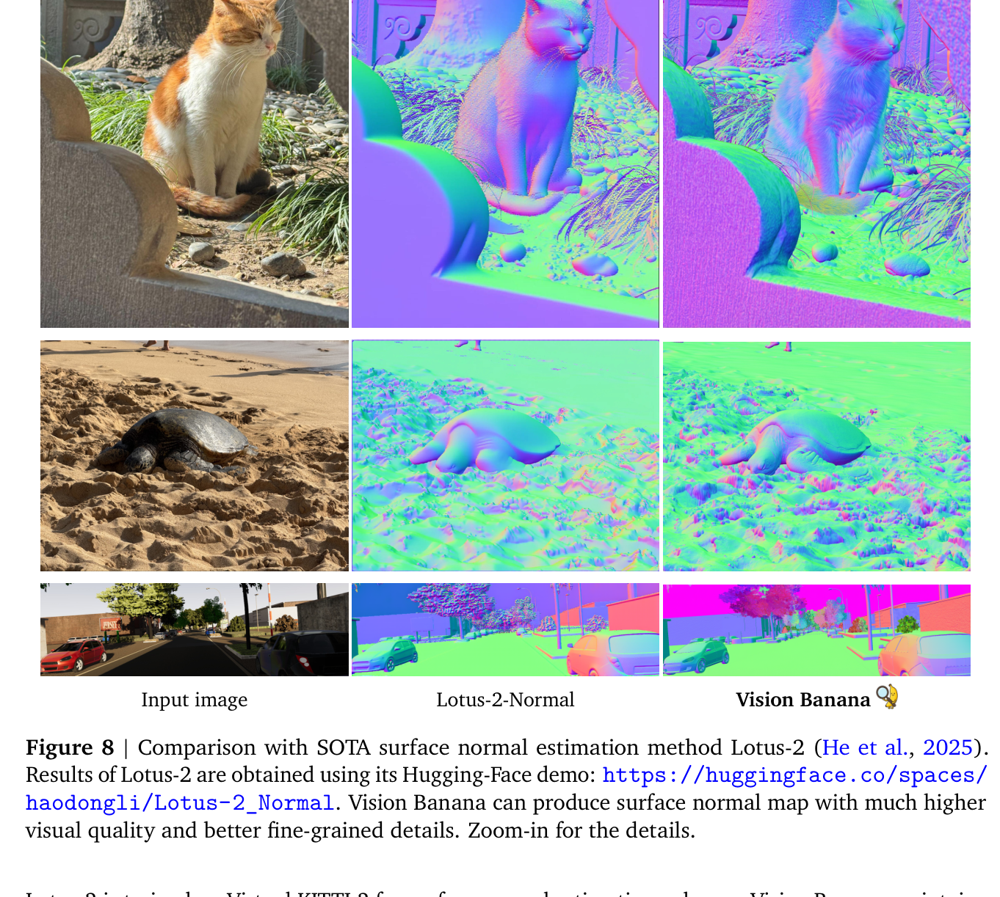

**图 8.** 与 SOTA 表面法线估计方法 Lotus-2（He et al., 2025）的对比。Lotus-2 的结果取自其 Hugging Face Demo：https://huggingface.co/spaces/haodongli/Lotus-2_Normal 。Vision Banana 能产出可视质量显著更高、细粒度细节更佳的法线图。放大查看细节。

### 4. Discussion

**Image Generators are Generalist Vision Learners.** Generative pretraining (Brown et al., 2020; Radford et al., 2018, 2019) has fundamentally transformed language understanding and reasoning. In the meantime, recent observations of emergent vision capabilities (Wiedemer et al., 2025; Zuo et al., 2025) have ignited speculation that computer vision is approaching a similar paradigm shift. By instruction-tuning a leading image generator, Nano Banana Pro, into a state-of-the-art visual generation and understanding model, we confirm that this shift is already underway. Models pretrained on large-scale image generation naturally acquire robust visual understanding capabilities. These generative priors surpass the specialized architectures and dedicated training paradigms traditionally employed by specialist vision models. We are witnessing a paradigm shift for computer vision that will be fueled by generative vision pretraining, which we believe paves the way for true Foundational Vision Models and Artificial General Intelligence from Vision (AGI-V).

**图像生成器即通用视觉学习器。** 生成式预训练（Brown et al., 2020；Radford et al., 2018, 2019）已从根本上改变了语言理解与推理。与此同时，近期观察到视觉涌现能力（Wiedemer et al., 2025；Zuo et al., 2025），引发了关于计算机视觉正接近相似范式转变的猜想。通过将领先的图像生成器 Nano Banana Pro 指令微调成 SOTA 级视觉生成与理解模型，我们确认这一转变已在进行中。在大规模图像生成上预训练的模型，天然获得稳健的视觉理解能力——这些生成先验超越了专科视觉模型传统采用的专用架构与定制训练范式。我们正在见证由生成式视觉预训练驱动的计算机视觉范式转变，我们相信它为真正的 Foundational Vision Models 与「视觉通用人工智能」（AGI-V）铺平道路。

**Image Generation as a Universal Interface.** As a byproduct of this study, we show that image generation can serve as the universal interface for computer vision, analogous to how text generation acts as the unifying interface for many tasks embedded in natural language, including language understanding, generation, reasoning, math, coding, agentic tasks, etc.. By representing vision task outputs as RGB images, we can use natural language prompts to seamlessly instruct the model. While we are not the first to encode vision outputs as RGB (Ke et al., 2024; Zhao et al., 2025), we demonstrate that when combined with powerful pretrained visual generators, this simple design is sufficient to outperform modern domain-specific specialist models.

**图像生成作为通用接口。** 作为本研究的一个副产品，我们证明图像生成可以作为计算机视觉的通用接口——类似于文本生成作为众多自然语言任务（语言理解、生成、推理、数学、编码、代理任务等）的统一接口。通过把视觉任务的输出表示为 RGB 图像，我们可以用自然语言提示无缝地指令模型。虽然将视觉输出编码为 RGB 并非我们首创（Ke et al., 2024；Zhao et al., 2025），但我们证明：与强大的预训练视觉生成器结合后，这一简单设计足以超越现代领域专用模型。

In addition to the unification of vision task outputs as RGB images, generative modeling naturally provides a workaround for the ambiguity in vision tasks where a single input can correspond to several modes of the output distribution. In order to prevent the collapse of the output to a blurry mean, expert discriminative models (Carion et al., 2025; Lin et al., 2025) usually resort to custom architectures and training losses. For example, the Segment Anything models (Carion et al., 2025; Kirillov et al., 2023; Ravi et al., 2024) return several segmentation masks but only apply the loss to a single one. Generative models, however, inherently learn the full data distribution, gracefully managing ambiguity by design. By eliminating the need for bespoke architectural designs, this formulation could lead to a truly unified "omni" multimodal model.

除了把视觉任务输出统一为 RGB 图像外，生成式建模还天然解决视觉任务中的歧义问题——同一输入可对应输出分布的多个 mode。为防止输出坍缩为模糊均值，专家判别式模型（Carion et al., 2025；Lin et al., 2025）通常诉诸定制架构与训练损失。例如 Segment Anything 系列（Carion et al., 2025；Kirillov et al., 2023；Ravi et al., 2024）返回多个分割掩膜，但只对其中一个施加损失。生成模型则本质上学习完整数据分布，通过设计本身优雅地处理歧义。免去了定制架构的需要，这一形式化或将通向真正统一的「omni」多模态模型。

**Future Work.** While Vision Banana achieves SOTA results on fundamental tasks for 2D semantic understanding and 3D understanding from monocular images, several exciting avenues remain for future exploration. First, scaling the diversity of instruction-tuned tasks may unlock further emergent cross-task generalization, similar to behaviors observed in LLMs Wei et al. (2021). Second, our current evaluation focuses on monocular image inputs. In the future, we can extend this framework to process multi-view inputs (Wang et al., 2025a) and video inputs (Zhang et al., 2025). Similarly, investigating whether video generators yield even richer, temporally-aware visual representations presents a highly promising research direction. Another important next step is exploring the synergistic integration of foundational vision models with large language models to enhance cross-modality reasoning. Finally, utilizing image generators like Nano Banana Pro currently incurs a significantly higher computational overhead than running lightweight specialist models. Developing acceleration and cost-reduction strategies will be an essential hurdle to overcome for the widespread deployment of generative vision framework.

**未来工作。** 尽管 Vision Banana 在 2D 语义理解与单目 3D 理解的基础任务上取得 SOTA，仍有多个值得探索的方向。第一，扩大指令微调任务的多样性可能解锁更进一步的跨任务泛化涌现行为——类似于 LLM 中观察到的现象（Wei et al., 2021）。第二，当前评测聚焦单目图像输入；未来可将本框架扩展至多视角输入（Wang et al., 2025a）与视频输入（Zhang et al., 2025）。同样，研究视频生成器是否能产出更丰富的、具时间感知的视觉表征也是极具前景的方向。另一重要下一步是探索 Foundational Vision Models 与大语言模型的协同整合，以增强跨模态推理。最后，使用 Nano Banana Pro 等图像生成器目前的计算开销显著高于轻量专科模型；发展加速与成本压缩策略将是生成式视觉框架大规模部署所必须跨越的工程门槛。

### Acknowledgment

We thank Xi Chen, Fei Xia, Kaushik Shivakumar, Abhishek Sinha, Phillip Lippe, Yilin Gao, Javier Rey, Sanghyun Woo, Renshen Wang, Wentao Yuan, Keran Rong, Rundi Wu, Manoj Kumar, Manli Shu, Francesco Piccinno, Ishita Dasgupta, Benigno Uria, Miki Rubinstein, Aäron van den Oord, Jon Shlens for their helpful discussions, advice, and technical guidance.

我们感谢 Xi Chen、Fei Xia、Kaushik Shivakumar、Abhishek Sinha、Phillip Lippe、Yilin Gao、Javier Rey、Sanghyun Woo、Renshen Wang、Wentao Yuan、Keran Rong、Rundi Wu、Manoj Kumar、Manli Shu、Francesco Piccinno、Ishita Dasgupta、Benigno Uria、Miki Rubinstein、Aäron van den Oord、Jon Shlens 在讨论、建议与技术指导上的帮助。

### Appendix — Additional Demonstrations

**Figure 9.** Comparing Vision Banana (left) and Nano Banana Pro (right) on text-to-image generation. Prompts sampled from GenAI-Bench (Li et al., 2024). Results verify that Vision Banana does not forget its generative features during the instruction-tuning.

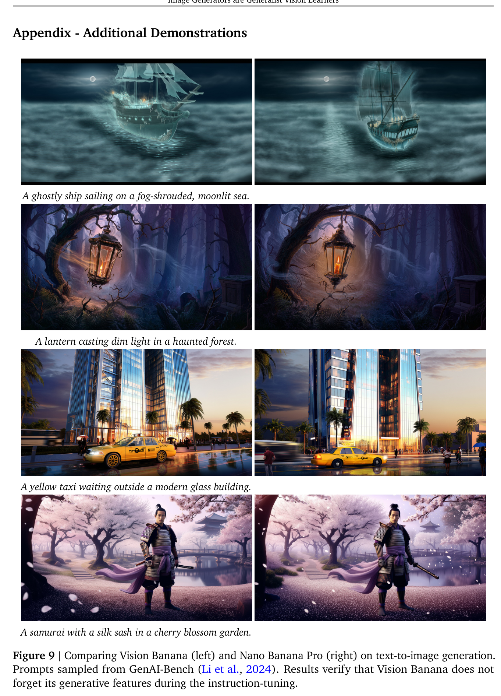

**图 9.** Vision Banana（左）与 Nano Banana Pro（右）在文生图任务上的对比，提示采样自 GenAI-Bench（Li et al., 2024）。结果验证 Vision Banana 在指令微调过程中并未遗忘其生成特性。

**Figure 10.** Comparing Vision Banana (left) and Nano Banana Pro (right) on image-editing. Prompts sampled from ImgEdit (Ye et al., 2025).

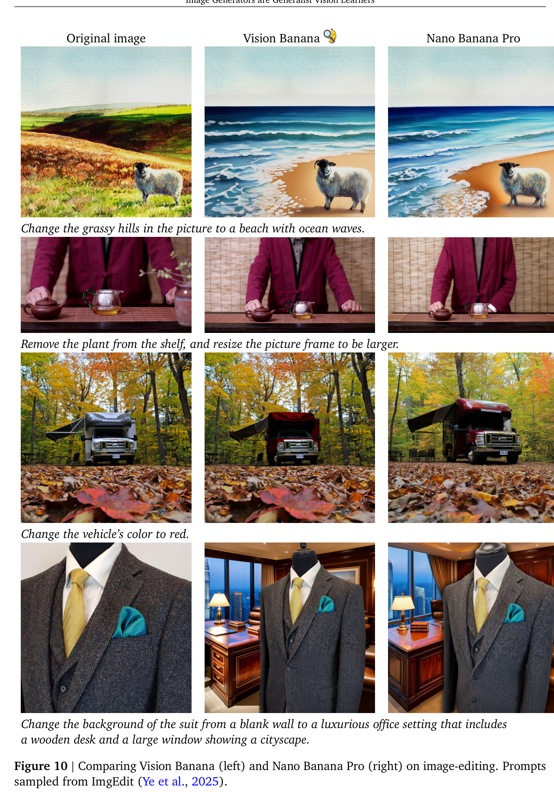

**图 10.** Vision Banana（左）与 Nano Banana Pro（右）在图像编辑任务上的对比，提示采样自 ImgEdit（Ye et al., 2025）。

---

*References omitted — see original PDF.*
